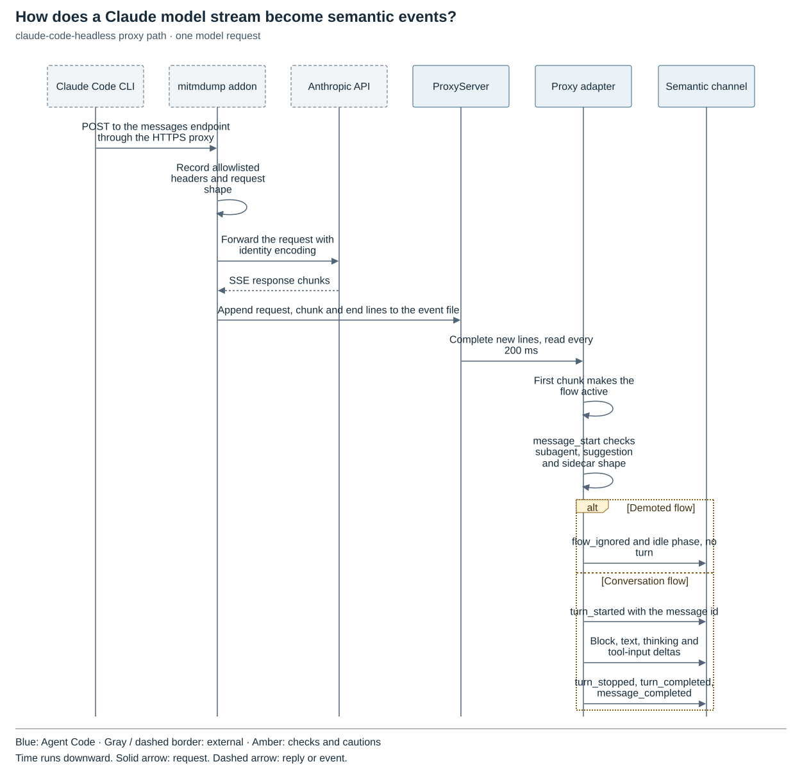
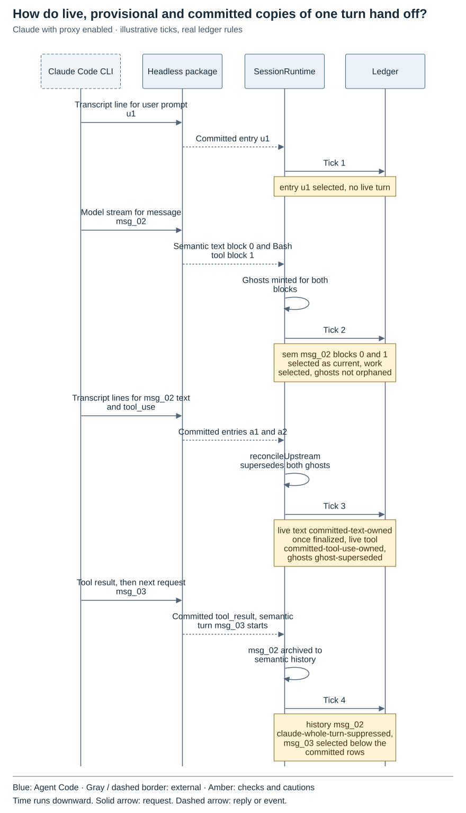
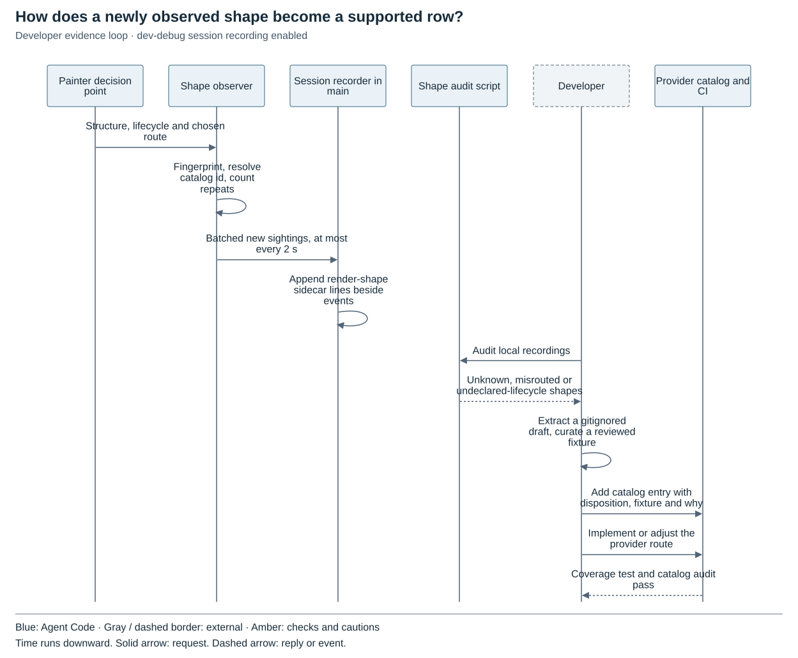

# Agent Code architecture

<!-- architecture-diagram: application-overview -->

[](docs/architecture/diagrams/application-overview.svg)

Windows share one main process. Main coordinates native agents and tools while application state, provider history and project files remain separate.

[Open the application map at full size](docs/architecture/diagrams/application-overview.svg).

<details>
<summary>Mermaid source</summary>

```text
flowchart TB
accTitle: How is Agent Code put together?
accDescr: Windows share one main process. Main coordinates native agents and tools while application state, provider history and project files remain separate.
%% scope: Application overview · responsibilities and selected dependencies
%% external: Native,Helpers,NativeData,Files
UI["Desktop windows · React<br/>Projects and panes<br/>Conversations, editor and terminals"]
    subgraph Main["Electron main"]
        Sessions["Agent sessions<br/>Start and recover agents<br/>Deliver prompts and collect progress"]
        Workspace["Workspace and files<br/>Save layouts · edit files<br/>Git and language-server access"]
        Services["Automation and support<br/>MCP and workflows · managed skills<br/>Dictation · secrets · diagnostics"]
    end
    UI -->|agent requests via preload| Sessions
    UI -->|file and layout requests via preload| Workspace
    UI -->|feature requests via preload| Services
    Native["Native agents<br/>Claude Code · Codex · OpenCode"]
    Helpers["Native tools<br/>Shell / tmux · language servers"]
    Workers["Workflow workers<br/>Approved scripts and Codex tasks"]
    Sessions -->|starts and observes| Native
    Workspace -->|starts and queries| Helpers
    Services -->|schedules| Workers
    AppData[("Application data<br/>Layouts · settings · operation journals")]
    NativeData[("Provider data<br/>Conversation history · authentication")]
    Files[("Project files<br/>Repositories and worktrees")]
    Workspace -->|saves| AppData
    Services -->|records operations in| AppData
    Native -->|maintains| NativeData
    Native -->|reads and edits| Files
    Helpers -->|operates on| Files
    Workers -->|runs tasks against| Files
classDef external fill:#f1f4f6,stroke:#526477,color:#172b3a,stroke-dasharray:5 3
classDef caution fill:#fff4d6,stroke:#886116,color:#432f10
class Native,Helpers,NativeData,Files external
```

</details>

Agent Code brings Claude Code, Codex and OpenCode into one desktop workspace. The providers' own software handles model requests, tool execution, sign-in and conversation history. Agent Code manages the workspace around them: starting agents, delivering prompts, showing their progress, and keeping editors and terminals alongside the conversation.

To follow the diagram, start with sending a prompt. The desktop window passes your request to Electron's **main process**, the shared part of the application that manages agents and accesses files. The **preload bridge** is the set of calls the window can use to reach it. Main forwards the prompt to the selected agent and sends progress back to the window that owns the session.

The lower part of the map shows where work runs and where data lives. Agents, shells and helper programs run in separate processes. Agent Code saves workspace layouts and settings; each provider keeps its own conversation history; your project files stay in their working directories. Restoring a window's layout and resuming an agent's conversation therefore involve different parts of the system.

Remote clients connect to a limited set of app features. Automated workflows use a separate execution path: they run tasks through the Codex SDK and record progress so interrupted runs can be inspected and, when safe, resumed.

The most technical part of the application is not visible in this map. Agent Code does not receive a conversation object from a provider. Claude Code and Codex run as native CLIs inside pseudo-terminals, and OpenCode runs its own server or TUI. Headless packages observe those programs from outside: the emulated terminal screen, the model stream, durable transcript files and the process. The renderer then reconciles those disagreeing observations into one sanitized conversation before anything is painted. [Section 5.3](#53-provider-integrations-and-headless-packages) describes the packages and [section 8.3](#83-conversation-reconstruction-and-rendering) the reconciliation.

Blue identifies Agent Code components and state. Gray, dashed boxes identify external tools, clients or their data. Amber marks checks and cautions. Every view includes a key; the labels carry the meaning even without color.

This reference describes the implementation at source revision `6a19e4ee`, inspected on 2026-09-11. Sections 5.2, 5.3, 8.2.1 and 8.3 were revised against source revision `115e26fc` and the package revisions listed in 5.2, inspected on 2026-09-12.

## Contents

1. [Introduction and goals](#1-introduction-and-goals)
2. [Architecture constraints](#2-architecture-constraints)
3. [Context and scope](#3-context-and-scope)
4. [Solution strategy](#4-solution-strategy)
5. [Building block view](#5-building-block-view)
6. [Runtime view](#6-runtime-view)
7. [Deployment view](#7-deployment-view)
8. [Crosscutting concepts](#8-crosscutting-concepts)
9. [Architectural decisions](#9-architectural-decisions)
10. [Quality requirements](#10-quality-requirements)
11. [Risks and technical debt](#11-risks-and-technical-debt)
12. [Glossary](#12-glossary)

[Appendix A: change map](#appendix-a-change-map) · [Appendix B: maintaining this reference](#appendix-b-maintaining-this-reference)

## 1. Introduction and goals

Agent Code provides a multi-agent desktop workspace around native coding tools. Users organize project tabs and panes, read structured conversations, work directly in native terminals, edit project files, and coordinate interactive agents or durable workflows. The application adds a common workspace without taking over the provider's model execution or native conversation format.

This document is an architecture reference for engineers working on the application. Its audience and questions are concrete:

| Reader | Questions this document should answer |
| --- | --- |
| New maintainer | Which process owns a behavior, where is the code, and what can change independently? |
| Feature implementer | Which state is authoritative, which operation admits a mutation, and how does it fail? |
| Provider integration maintainer | Which observations are trusted, how is native identity established, and what proves safe resume/input? |
| Reviewer | Which ownership or persistence guarantee must survive a proposed change? |
| Release/debug maintainer | Which artifacts ship, where is evidence stored, and what does recovery actually guarantee? |

The dominant quality goals are correctness of identity and lifecycle, preservation of user work, responsive observation under streaming load, explicit control authority, and diagnosable failures. They appear as concrete scenarios in [section 10](#10-quality-requirements). This document does not introduce availability targets or performance SLOs that the repository does not define.

The opening map is a deliberately combined orientation view. The formal zoom levels follow: the system context in section 3, containers and components in section 5, runtime scenarios in section 6, and deployment in section 7. A C4 container means an application/data-store boundary, not necessarily a Docker container.

## 2. Architecture constraints

| Constraint | Why it shapes the implementation | Evidence |
| --- | --- | --- |
| No provider API client | Provider subscription OAuth is not available to a third-party application, and an SDK integration would replace native commands, compaction, permission prompts and resume. The native CLI or service is the client, so the conversation must be reconstructed from observations | [Headless packages](#53-provider-integrations-and-headless-packages), [reconstruction](#83-conversation-reconstruction-and-rendering) |
| Native provider execution and persistence | Adapters observe and coordinate provider-specific runtimes instead of assuming a universal agent protocol | [Provider registry](src/providers/registry.main.ts) |
| Electron process boundary | Browser views need typed bridges to Node/OS capabilities; shared services belong in main | [Preload](src/preload/index.ts), [main](src/main/index.ts) |
| macOS release target | Native PTY modules, helpers, signing, notarization and architecture-specific executables need packaged verification | [Builder configuration](electron-builder.yml) |
| Multi-window shared state | Window saves and session transfers require a single main-owned persistence/ownership boundary | [WorkspaceFileStore](src/main/storage/workspaceFileStore.ts) |
| Independently pinned packages | Package code and application gitlinks evolve in separate repositories and need integration evidence | [.gitmodules](.gitmodules) |
| Native artifacts are not committed | Manifests/checksums and runtime preparation scripts are the reproducible source of shipped binaries | [Runtime manifests](third_party), [scripts](scripts/runtime-tools) |
| `vendor/` is reference-only | Upstream reference checkouts cannot become accidental production dependencies | [Repository instructions](AGENTS.md) |
| Provider observations arrive asynchronously | Process, screen, semantic and committed-history evidence cannot be flattened into one ordered truth stream | [SessionFeed contract](src/shared/sessionFeed/SessionFeed.ts) |

The declared development Node floor is 22.12, with Node 24 selected by the repository. A packaged application uses Electron's embedded runtime. These are compatibility constraints, not a requirement for an end user to install that development Node version.

## 3. Context and scope

Agent Code is an Electron desktop application with a React renderer. A window presents project tabs, agent and shell panes, conversation feeds, editors, and supporting panels. The main process owns privileged operations and resources shared across windows. A typed preload bridge exposes selected operations to each renderer.

An agent pane is not the agent process. Its layout metadata can exist while its backend is absent, failed, hibernated, or being recovered. A native provider conversation can also survive the application process. Much of the architecture exists to preserve those distinctions during reloads, provider switches, slow startup, and partial failures.

The system has several control surfaces with different authority:

| Surface | Caller | Principal responsibility |
| --- | --- | --- |
| Desktop UI | User in an application window | Workspace layout, sessions, editing, settings, diagnostics |
| Native provider CLI or service | Agent runtime | Model requests, native tool execution, provider authentication and history |
| Built-in MCP | A specifically registered managed agent session | Selected app services, scoped by session and enabled domains |
| Workflow API | Desktop or an enabled workflow MCP caller | Durable multi-step runs with source approval and tracked attempts |
| External operator MCP | Separately configured local MCP client | Catalog and invocation of externally visible application capabilities |
| Remote companion | Paired browser device | Agent observation, history, prompt input, interrupt, and supported conditions |

These are not interchangeable transports for the entire application API. For example, the remote protocol does not expose general workspace mutation or arbitrary shell creation; a prompt it delivers can still cause the native agent to execute tools under that agent's permissions.

<!-- architecture-diagram: system-context -->

[](docs/architecture/diagrams/system-context.svg)

Agent Code coordinates local coding tools and uses external services for specific features. The model providers perform the model computation.

<details>
<summary>Mermaid source</summary>

```text
flowchart TB
accTitle: What sits outside Agent Code?
accDescr: Agent Code coordinates local coding tools and uses external services for specific features. The model providers perform the model computation.
%% scope: System context · external dependencies
%% external: Person,Clients,Native,Models,Speech,GitHub,Tunnel
Person["Developer"] -->|organizes work| App["Agent Code<br/>Desktop workspace"]
    Clients["Paired browser / local MCP client"] -->|permitted app operations| App
    App -->|runs and prompts| Native["Claude Code / Codex / OpenCode<br/>Local coding tools"]
    Native -->|requests inference from| Models["Model provider services"]
    App -->|transcribes audio with| Speech["Deepgram"]
    App -->|downloads from| GitHub["GitHub"]
    App -->|optional tunnel through| Tunnel["Cloudflare"]
classDef external fill:#f1f4f6,stroke:#526477,color:#172b3a,stroke-dasharray:5 3
classDef caution fill:#fff4d6,stroke:#886116,color:#432f10
class Person,Clients,Native,Models,Speech,GitHub,Tunnel external
```

</details>

There is no application-hosted account service or central conversation database in this deployment. Optional Cloudflare tunneling, model providers, Deepgram, release downloads, and public GitHub skill acquisition are external services used for specific features. Their presence does not move local workspace ownership out of Electron main.

Implementation entry points: [main composition](src/main/index.ts), [renderer entry](src/renderer/src/app/main.tsx), [preload](src/preload/index.ts), [provider registry](src/providers/registry.main.ts).

## 4. Solution strategy

| Approach | Architectural effect |
| --- | --- |
| Main owns privileged resources and mutation admission | Windows can reload without becoming independent owners of provider processes, servers or shared files. |
| Native provider contracts remain explicit | Claude/Codex PTY observation and OpenCode HTTP/SSE use different adapters, readiness evidence and history boundaries. |
| Workspace metadata is separate from backend runtime | A failed or hibernated session remains representable; restoring layout does not automatically duplicate processes. |
| Observation channels converge through one ownership ledger | Packages keep semantic, screen and committed facts on separate channels. The renderer decides one owner per visible unit with a recorded reason, and only then orders and paints, so live output, committed records, provisional ghosts and local echoes coexist without duplicates or silent loss. |
| Evidence before rendering | Structures seen while painting are fingerprinted, catalogued per provider and backed by captured fixtures before a component claims them. |
| Mutation results retain uncertainty | Prompt delivery, control invocation and workflow retries distinguish confirmed completion from transport success or unknown effect. |
| Durable services sit behind thin transports | Recreating an MCP request or reconnecting a renderer cannot recreate workflow authority or erase operation history. |
| Reuse pure contracts across clients | The remote browser shares folds and feed rendering while retaining a deliberately narrower control surface. |
| Bound high-volume work at multiple layers | Process concurrency, IPC coalescing, retained entries, DOM mounting and diagnostics each control their own resource costs. |

These strategies recur in the component and runtime views. The decision catalog in [section 9](#9-architectural-decisions) records their important tradeoffs and implementation evidence.

## 5. Building block view

### 5.1 Containers and their responsibilities

This C4 container view shows the processes and their communication paths. Native provider executables are independently installed integrations. The following sections explain the components within main and the renderer; the repository and package tables explain source reuse. The deployment table in section 7 gives process owners and lifetimes.

<!-- architecture-diagram: container-view -->

[](docs/architecture/diagrams/container-view.svg)

Each window has its own renderer. Electron main is the shared endpoint for desktop calls, remote requests and managed native processes.

<details>
<summary>Mermaid source</summary>

```text
flowchart TB
accTitle: Which processes communicate with each other?
accDescr: Each window has its own renderer. Electron main is the shared endpoint for desktop calls, remote requests and managed native processes.
%% scope: C4 container view · communication interfaces, not every helper process
%% external: Browser,Operator,Agents,Tools
Windows["Window renderers<br/>React + preload · one per window"]
    Browser["Remote browser"]
    Operator["Local MCP client"]
    Main["Electron main<br/>Shared Node services"]
    Windows -->|calls through Electron IPC| Main
    Browser -->|HTTP and WebSocket| Main
    Operator -->|authenticated loopback HTTP| Main
    Agents["Claude / Codex / OpenCode<br/>Native agent processes"]
    Tools["Shells and language servers<br/>Native subprocesses"]
    Workflow["Workflow execution<br/>Utility-process worker<br/>Provider host + Codex SDK / CLI"]
    Main -->|PTY input or HTTP requests| Agents
    Main -->|PTY or standard-stream JSON-RPC| Tools
    Main -->|worker and provider-host messages| Workflow
    Agents -->|history and live events| Main
classDef external fill:#f1f4f6,stroke:#526477,color:#172b3a,stroke-dasharray:5 3
classDef caution fill:#fff4d6,stroke:#886116,color:#432f10
class Browser,Operator,Agents,Tools external
```

</details>

### 5.2 Repository and dependency structure

The main architectural boundaries are directories with different runtime permissions and ownership, rather than independently deployed services.

| Location | Responsibility | Dependency constraint |
| --- | --- | --- |
| `src/main/` | Electron lifecycle, OS integration, processes, files, privileged services | Can use Node and Electron main APIs |
| `src/preload/` | Context-isolated bridge and typed domain APIs | Exposes deliberate methods, not unrestricted `ipcRenderer` |
| `src/renderer/src/` | React UI, workspace actions, runtime projections, rendering | Browser environment; privileged work goes through a bridge |
| `src/shared/` | Cross-process contracts, pure reducers and utilities | Keep transport-independent code usable by desktop and remote |
| `src/providers/` | Provider-specific registration, process adapters, capabilities, mapping and rendering | Main and renderer entry points are separated |
| `src/mcp/` | Built-in MCP HTTP host, tool registration and shared domain contracts | Authority is registered per managed session |
| `src/control-sdk/` | Capability schemas, invocation, ownership and operation history | Shared contract with host and operator entry points |
| `src/remote-client/` | Independently built browser companion | Reuses selected browser-safe renderer modules through explicit aliases |
| `packages/` | Pinned Git submodules used in the application | Changes to package implementation and application gitlinks are separate changes |
| `third_party/` | Manifests and legal notices for shipped native tools | Binaries come from verified build inputs, not Git |
| `vendor/` | Local upstream source references | Never imported, built, or shipped |
| `testing/`, tests beside source | Fixtures, harnesses and regression evidence | Production bundles exclude test assets |
| `scripts/`, `build/`, `.github/` | Build, native resource preparation, packaging, CI | Part of the delivery architecture, not renderer runtime |

The seven application submodules at this revision are:

| Package | Pinned revision | Application use |
| --- | --- | --- |
| [claude-code-headless](https://github.com/Juliusolsson05/claude-code-headless/tree/dd89f3836d14f1bbc028dcf1523a544f1b9ae930) | `dd89f383` | Claude PTY observation: terminal mirror and screen conditions, exact JSONL tail, mitmproxy stream adapter ([5.3.2](#532-claude-code-headless)) |
| [codex-headless](https://github.com/Juliusolsson05/codex-headless/tree/5bfeaca988a7d83be3d1010b03bb6d0eca653edf) | `5bfeaca9` | Codex PTY observation: rollout attribution and tail, Responses proxy, prompt-input evidence, resume preparation ([5.3.3](#533-codex-headless)) |
| [opencode-headless](https://github.com/Juliusolsson05/opencode-headless/tree/4f2ef5de7c80ad7a6199dc09869ea3b728752f0e) | `4f2ef5de` | Structured OpenCode: server spawn or attach, HTTP client, SSE dispatcher, committed message assembly ([5.3.4](#534-opencode-headless-and-opencode-terminal-headless)) |
| [opencode-terminal-headless](https://github.com/Juliusolsson05/opencode-terminal-headless/tree/e85b3f53be39912fb295c45907b1fb6abd6e4a26) | `e85b3f53` | OpenCode TUI companion: read-only database reader, TUI server events, turn sequencing, conditions ([5.3.4](#534-opencode-headless-and-opencode-terminal-headless)) |
| [agent-transcript-parser](https://github.com/Juliusolsson05/agent-transcript-parser/tree/9c99db00f9cf0097c87271d04fd3e3ebf9f1e894) | `9c99db00` | Neutral conversation model for provider switch, duplicate and rewind; provisional ghost records ([5.3.5](#535-agent-transcript-parser)) |
| [agent-voice-dictation](https://github.com/Juliusolsson05/agent-voice-dictation/tree/3c6f962843532da2a7ddf2cc80f38cacd3196bb1) | `3c6f9628` | Speech transport and composer integration primitives |
| [workflow-mcp](https://github.com/Juliusolsson05/workflow-mcp/tree/b4b98f8d13f59bae0c999c927533f451b491496a) | `b4b98f8d` | Durable workflow service, store, scheduler, worker protocol and providers |

Package capability is not the same as product capability. The speech package supports more than the application's configured Deepgram path. The workflow package also has standalone deployment facilities; Agent Code uses its embedded Electron integration, not a Docker service. OpenCode package support for a native operation does not imply a saved-session picker exists in the UI.

Build aliases resolve most local packages directly from source. Workflow integration has an explicit package build/type-resolution step. The presence of a convenient alias does not make Node-based headless code browser-safe. See [Electron Vite configuration](electron.vite.config.ts), [TypeScript configurations](tsconfig.json), [.gitmodules](.gitmodules), and [package scripts](package.json).

### 5.3 Provider integrations and headless packages

Provider selection is exhaustive at several boundaries: main factories and native operations, renderer mapping/rendering capabilities, and setup requirements. Adding a string to a UI picker is insufficient. The source owners are [main registry](src/providers/registry.main.ts), [setup registry](src/providers/registry.setup.ts), [renderer capability registry](src/providers/registry.renderer.capabilities.ts), and [feature capabilities](src/providers/shared/featureCapabilities.ts).

| Property | Claude | Codex | OpenCode structured | OpenCode terminal |
| --- | --- | --- | --- | --- |
| Native execution | CLI in PTY | CLI in PTY | `opencode serve` spawned by the package | TUI in PTY with its embedded server |
| Live observations | Terminal mirror, optional mitmproxy stream | Terminal mirror, rollout events, optional Responses proxy stream | Server SSE bus | TUI server SSE: turns, phases, requests; no streaming text |
| Committed observations | Exact JSONL tail | Attributed rollout tail | Messages assembled from bus part snapshots, plus HTTP history | Read-only SQLite event log |
| Native identity | UUID selected before launch/resume | Exact rollout/thread identity, proven before tailing | `ses_...` | Pre-created `ses_...` |
| Prompt path | Readiness, absorption and durable acceptance transaction | Attested PTY delivery profile | HTTP `prompt_async`, text only | Keyboard to PTY; programmatic prompts through the TUI server with the session's agent, model and variant |
| App saved-session listing | Supported | Supported | Not implemented | Not a separate listing capability |
| Accepted upstream version | 2.1.263 | 0.149.1 | Not pinned by the package | 1.18.30 |
| Native terminal view | Available | Available | Not a PTY | Required; the pane always shows the TUI |

#### 5.3.1 Observing a process Agent Code does not control

Agent Code runs each provider's own client rather than an SDK or an API client for the user's subscription (see [8.3.1](#831-why-the-conversation-must-be-reconstructed)). A headless package turns one native runtime into typed, provider-specific observations. The application's runtime adapter turns those observations into `AgentSession` events. No package decides what the feed shows; that decision belongs to the renderer's ownership ledger.

<!-- architecture-diagram: native-observation-points -->

[](docs/architecture/diagrams/native-observation-points.svg)

Agent Code owns the PTY and launch environment, then observes the provider from outside: rendered terminal output, the model stream, durable history on disk and the process itself. Each point answers a different question.

<details>
<summary>Mermaid source</summary>

```text
flowchart TB
accTitle: Where does Agent Code observe a native provider?
accDescr: Agent Code owns the PTY and launch environment, then observes the provider from outside: rendered terminal output, the model stream, durable history on disk and the process itself. Each point answers a different question.
%% scope: Claude Code and Codex CLI sessions · OpenCode replaces the proxy and JSONL points with its own server and database
%% external: CLI,API,Files
PTY["Agent Code PTY and launch environment<br/>session id, proxy variables, MCP config"]
Mirror["Headless terminal mirror<br/>xterm parses every escape sequence"]
Proxy["Local stream proxy<br/>Claude: mitmproxy TLS interception<br/>Codex: loopback Responses base URL"]
Tail["Transcript tailer<br/>byte cursor on one proven file"]
Proc["Process watcher<br/>pid, activity, exit"]
CLI["Native provider CLI"]
API["Provider model API"]
Files["Native history files<br/>Claude JSONL · Codex rollout"]
PTY -->|keystrokes and pastes| CLI
CLI -->|rendered terminal bytes| Mirror
CLI -->|HTTPS model requests| Proxy
Proxy -->|forwards the request| API
API -->|streamed response| Proxy
CLI -->|appends durable records| Files
Files -->|polled for new bytes| Tail
CLI -->|lifetime| Proc
classDef external fill:#f1f4f6,stroke:#526477,color:#172b3a,stroke-dasharray:5 3
class CLI,API,Files external
```

</details>

| Observation point | Trusted for | Not trusted for |
| --- | --- | --- |
| Terminal mirror | Dialogs, pickers, permission prompts, composer state, spinner activity, the native terminal view | Assistant prose; turn completion |
| Stream proxy | Live text, thinking and tool input as it streams; request attribution; usage; API errors | Durable history; a stream can end without a terminal event |
| Transcript file | Committed conversation, tool results, compaction records, prompt acceptance | When live output happened |
| Process | Lifetime and exit | Whether a turn has finished |

Responsibility is split so that each layer can be tested against captured evidence without the others:

| Layer | Owns | Examples |
| --- | --- | --- |
| Headless package | Native vocabulary, channel separation, file and flow attribution, bounded parsing | Proxy flow attribution, rollout path leases, SSE part accumulation |
| Provider runtime adapter (`src/providers/<provider>/runtime`) | Spawn arguments and environment, proxy lifecycle, prompt delivery transactions, mapping to `AgentSession` events | Claude's replay quiet window, Codex's resume handoff, OpenCode session pre-creation |
| SessionManager and forwarder | Backend run fencing, routing to the owning window, IPC coalescing ([8.2](#82-event-transport-and-backpressure)) | Structural semantic events as ordering barriers |
| Renderer | Folding channels, ownership decisions, painting ([8.3](#83-conversation-reconstruction-and-rendering)) | Committed rows suppressing their live copies |

Claude and Codex packages share one channel model. Its purpose is to keep facts of different trust from sharing an emitter:

<!-- architecture-diagram: headless-channel-model -->

[](docs/architecture/diagrams/headless-channel-model.svg)

Packages split observations into semantic, screen and committed channels plus condition snapshots. Screen-derived text goes to a shadow channel the application never subscribes to, so terminal rendering cannot become conversation content.

<details>
<summary>Mermaid source</summary>

```text
flowchart LR
accTitle: Which package channel may carry which kind of fact?
accDescr: Packages split observations into semantic, screen and committed channels plus condition snapshots. Screen-derived text goes to a shadow channel the application never subscribes to, so terminal rendering cannot become conversation content.
%% scope: claude-code-headless and codex-headless channel model · what the runtime adapters subscribe to
Mirror["Terminal mirror"] --> Parsers["Screen parsers"]
Parsers -->|dialogs and pickers| Cond["Condition evaluator<br/>ordered modules, deduplicated snapshot"]
Parsers -->|frames and activity| Screen["Terminal snapshots<br/>and activity"]
Parsers -->|screen-derived prose| Shadow["Semantic shadow<br/>diagnostic only, never forwarded"]
Parsers -.->|busy phase only, when no stream owns the turn| Semantic
Stream["Stream adapter<br/>proxy flows"] -->|turns, blocks, deltas, usage, errors| Semantic["Semantic channel<br/>strict turn lifecycle"]
Tailer["Transcript tailer"] -->|every durable record| Committed["Committed channel<br/>entries and tool results"]
Tailer -.->|Codex rollout events| Semantic
Semantic --> Adapter["Provider runtime adapter"]
Committed --> Adapter
Cond --> Adapter
Screen --> Adapter
classDef caution fill:#fff4d6,stroke:#886116,color:#432f10
class Shadow caution
```

</details>

Each semantic event carries a `source` and a `confidence`. Claude sources are `proxy`, `jsonl` and `screen`; Codex sources are `proxy`, `rollout` and `screen`; OpenCode sources are `opencode-sse` and `opencode-history`. Screen-sourced content exists only on the shadow channel. Without an active proxy owner, the only screen-derived fact that reaches the semantic channel is the busy phase.

All four runtime packages share these conventions:

- The application compiles package `src/` directly through build aliases; a package's local `dist/` is never used ([Electron Vite configuration](electron.vite.config.ts)). The desktop renderer imports no package runtime code except the `agent-transcript-parser/ghost` subpath.
- Condition evaluators under `conditions/core/` are generated copies of [`src/shared/conditions-core`](src/shared/conditions-core). A condition module list is ordered, and that order is part of the deduplication key.
- `support/upstream-versions.json` records the provider version accepted after a compatibility review. Parsers of terminal output and private storage are version-sensitive, and an upstream-watch workflow reports drift.
- Tests are split into a `core` project and a serial `system` project with real filesystem or process fixtures. Tests against a real native CLI are opt-in live suites, excluded from CI.

#### 5.3.2 claude-code-headless

[claude-code-headless](https://github.com/Juliusolsson05/claude-code-headless/tree/dd89f3836d14f1bbc028dcf1523a544f1b9ae930/src) observes a Claude Code PTY that the application owns. Its orchestrator is `ClaudeCodeHeadless`.

| Module | Responsibility |
| --- | --- |
| `ClaudeCodeHeadless.ts` | Owns the terminal mirror; runs every parser on each emitted frame; owns the transcript follower, the semantic, screen, committed and shadow channels, the live-owner state and the condition evaluator |
| `terminal/` | `HeadlessTerminal` over a caller-owned PTY. Snapshots are change-gated at 100 ms; a frame whose only change is spinner chrome reuses its markdown. Composer cell attributes distinguish placeholder text from a draft |
| `parsers/` | Shape-based detectors for permission prompts, AskUserQuestion, trust, resume and compaction banners, the slash picker, composer state and activity. Screen text extractors feed only the shadow channel |
| `conditions/` | One module per condition kind in a fixed order; action drivers for trust acceptance and multi-step AskUserQuestion answers |
| `transcript/` | Exact transcript resolution including relocation, the byte-cursor `FileTailer`, project directory rules and session listing |
| `proxy/` | `ProxyServer` (mitmdump process and event-file poller), `mitmAddon.py`, SSE framing, Anthropic event parsing, `ClaudeProxyAdapter`, prompt-suggestion filter |
| `channels/` | Event types and emitters: a semantic channel with an open-turn map and cross-source lifecycle checks, a screen channel and a committed channel |

<!-- architecture-diagram: claude-headless-structure -->

[](docs/architecture/diagrams/claude-headless-structure.svg)

The application spawns the CLI and the mitmproxy process. The orchestrator mirrors the terminal, follows the exact transcript and adapts the proxy stream, publishing separate channels that the Claude runtime adapter forwards as session events.

<details>
<summary>Mermaid source</summary>

```text
flowchart TB
accTitle: How is claude-code-headless assembled around one Claude session?
accDescr: The application spawns the CLI and the mitmproxy process. The orchestrator mirrors the terminal, follows the exact transcript and adapts the proxy stream, publishing separate channels that the Claude runtime adapter forwards as session events.
%% scope: claude-code-headless at dd89f383 with the Agent Code Claude runtime adapter
%% external: CLI,Mitm,Jsonl
Launch["ClaudeSession launch plan<br/>session id or resume id,<br/>proxy environment, MCP config"]
Events["ClaudeSession events<br/>screen, jsonl-entry, semantic-event,<br/>conditions, process-state"]
CLI["claude CLI in PTY"]
Mitm["mitmdump and mitmAddon.py<br/>appends proxy-events.jsonl"]
Jsonl["Claude project transcript<br/>session-id.jsonl"]
subgraph Pkg["ClaudeCodeHeadless"]
    Term["HeadlessTerminal<br/>change-gated frames"]
    Parse["Parsers and condition modules"]
    Follow["followClaudeTranscript<br/>byte-cursor tailer"]
    PServer["ProxyServer<br/>reads new event bytes every 200 ms"]
    PAdapter["ClaudeProxyAdapter<br/>flow attribution and request filters"]
    Sem["Semantic channel"]
    Com["Committed channel"]
    Shadow["Semantic shadow"]
end
Launch -->|spawns| CLI
CLI -->|terminal bytes| Term
Term --> Parse
Parse -->|conditions and activity| Events
Parse -->|screen-derived text| Shadow
CLI -->|HTTPS through the proxy| Mitm
Mitm -->|event lines| PServer
PServer --> PAdapter
PAdapter --> Sem
CLI -->|appends| Jsonl
Jsonl -->|new bytes| Follow
Follow --> Com
Sem --> Events
Com -->|entries and bridged tool results| Events
classDef external fill:#f1f4f6,stroke:#526477,color:#172b3a,stroke-dasharray:5 3
classDef caution fill:#fff4d6,stroke:#886116,color:#432f10
class CLI,Mitm,Jsonl external
class Shadow caution
```

</details>

<!-- architecture-diagram: claude-proxy-stream -->

[](docs/architecture/diagrams/claude-proxy-stream.svg)

mitmproxy records request shape and raw SSE chunks to a file. The package reads only new bytes, activates a flow on its first chunk, demotes subagent, suggestion and sidecar flows at message start, and publishes the rest in wire order.

<details>
<summary>Mermaid source</summary>

```text
sequenceDiagram
accTitle: How does a Claude model stream become semantic events?
accDescr: mitmproxy records request shape and raw SSE chunks to a file. The package reads only new bytes, activates a flow on its first chunk, demotes subagent, suggestion and sidecar flows at message start, and publishes the rest in wire order.
%% scope: claude-code-headless proxy path · one model request
%% external: CLI,Mitm,API
participant CLI as Claude Code CLI
participant Mitm as mitmdump addon
participant API as Anthropic API
participant Srv as ProxyServer
participant Ad as Proxy adapter
participant Sem as Semantic channel
CLI->>Mitm: POST to the messages endpoint through the HTTPS proxy
Mitm->>Mitm: Record allowlisted headers and request shape
Mitm->>API: Forward the request with identity encoding
API-->>Mitm: SSE response chunks
Mitm->>Srv: Append request, chunk and end lines to the event file
Srv->>Ad: Complete new lines, read every 200 ms
Ad->>Ad: First chunk makes the flow active
Ad->>Ad: message_start checks subagent, suggestion and sidecar shape
alt Demoted flow
    Ad->>Sem: flow_ignored and idle phase, no turn
else Conversation flow
    Ad->>Sem: turn_started with the message id
    Ad->>Sem: Block, text, thinking and tool-input deltas
    Ad->>Sem: turn_stopped, turn_completed, message_completed
end
```

</details>

| Concern | Rule | Source |
| --- | --- | --- |
| Session identity | The UUID is chosen before launch (`--session-id`). The resolver follows relocation records, refuses ambiguous candidates, and raises a mismatch when an entry names another session | [SessionTranscript](https://github.com/Juliusolsson05/claude-code-headless/blob/dd89f3836d14f1bbc028dcf1523a544f1b9ae930/src/transcript/SessionTranscript.ts) |
| Transcript continuity | 100 ms polling (macOS file watchers missed rapid appends), a byte cursor with UTF-8 carry, inode identity and a 256-byte anchor. A discontinuity re-resolves the file; a 15 s stall re-arms the watcher | [JsonlTailer](https://github.com/Juliusolsson05/claude-code-headless/blob/dd89f3836d14f1bbc028dcf1523a544f1b9ae930/src/transcript/JsonlTailer.ts) |
| Replay | Resume bootstraps the last 200 lines. The application holds prompt delivery and the committed tool-result bridge until 250 ms pass without a new entry, so a replayed prompt cannot acknowledge a new identical one | [ClaudeSession](src/providers/claude/runtime/claudeSession.ts) |
| Tool results | Anthropic's stream never carries tool-result content. Committed results are bridged to the semantic channel as `tool_result` with source `jsonl` and no turn id | [ClaudeSession](src/providers/claude/runtime/claudeSession.ts) |
| Proxy scope | Host allowlist `api.anthropic.com`; request headers are allowlisted and exclude Authorization; request bodies over 2 MiB are not embedded | [mitmAddon.py](https://github.com/Juliusolsson05/claude-code-headless/blob/dd89f3836d14f1bbc028dcf1523a544f1b9ae930/src/proxy/mitmAddon.py) |
| Flow attribution | A flow becomes active on its first chunk, so a non-streaming warm-up request never claims the stream. A silent active flow is reaped after 30 s. Only one flow owns the busy phase | [ClaudeProxyAdapter](https://github.com/Juliusolsson05/claude-code-headless/blob/dd89f3836d14f1bbc028dcf1523a544f1b9ae930/src/proxy/ClaudeProxyAdapter.ts) |
| Non-conversation requests | Subagent (`cc_is_subagent`), prompt-suggestion and sidecar flows are demoted at `message_start`. Compaction synthesis is tagged rather than dropped; the renderer rejects it | [ClaudeProxyAdapter](https://github.com/Juliusolsson05/claude-code-headless/blob/dd89f3836d14f1bbc028dcf1523a544f1b9ae930/src/proxy/ClaudeProxyAdapter.ts) |
| Screen | xterm consumes escape sequences; parsers read the viewport by shape; screen prose reaches only the shadow channel; idle is debounced 2.5 s and rechecked | [ClaudeCodeHeadless](https://github.com/Juliusolsson05/claude-code-headless/blob/dd89f3836d14f1bbc028dcf1523a544f1b9ae930/src/ClaudeCodeHeadless.ts) |
| Subagents | The application, not the package, watches the transcript's `subagents/` directory every 600 ms and publishes child state keyed by parent tool-use id | [subagent watcher](src/main/subagents) |

Sources: [Claude runtime](src/providers/claude/runtime), [event specification](https://github.com/Juliusolsson05/claude-code-headless/blob/dd89f3836d14f1bbc028dcf1523a544f1b9ae930/EVENT_SPEC.md).

#### 5.3.3 codex-headless

[codex-headless](https://github.com/Juliusolsson05/codex-headless/tree/5bfeaca988a7d83be3d1010b03bb6d0eca653edf/src) observes a Codex PTY. Its hardest problem is attribution: several Codex processes can start in the same working directory, and a rollout file can appear after the process has produced output. Choosing the newest file encoded timing as identity, and sibling panes captured each other's conversations.

| Module | Responsibility |
| --- | --- |
| `CodexHeadless.ts` | Coordinator: terminal mirror, screen parsing, rollout tailing, rollout-to-semantic reducer, live-owner model, fresh and resume rollout ownership |
| `terminal/` | xterm mirror plus stable frames with paint generations and layout epochs, used to prove what the composer rendered |
| `parsers/` | Working-state, approval overlay and structurally anchored trust-dialog detection |
| `conditions/` | Trust and approval modules; approval merges per-frame screen state with rollout metadata |
| `transcript/` | Rollout types, generation-bound tailer, exact rollout locator, the process-wide ownership coordinator and registry, resume preparation, and `prompt-input/` evidence |
| `proxy/` | Loopback `ResponsesProxy`, bounded zstd decoding, `CodexResponsesAdapter` |
| `config/` | Append-only project trust entry written before launch |
| `channels/` | Strict semantic channel, screen channel, committed channel |

<!-- architecture-diagram: codex-headless-structure -->

[](docs/architecture/diagrams/codex-headless-structure.svg)

The application prepares trust, the input profile and resume ownership before spawning Codex. The coordinator proves which rollout belongs to the pane before tailing it, then turns rollout records and optional proxy streams into strict semantic events.

<details>
<summary>Mermaid source</summary>

```text
flowchart TB
accTitle: How is codex-headless assembled around one Codex session?
accDescr: The application prepares trust, the input profile and resume ownership before spawning Codex. The coordinator proves which rollout belongs to the pane before tailing it, then turns rollout records and optional proxy streams into strict semantic events.
%% scope: codex-headless at 5bfeaca9 with the Agent Code Codex runtime adapter
%% external: CLI,Rollouts,API
Prep["CodexSession before spawn<br/>project trust, resume lease,<br/>attested input profile"]
Events["CodexSession events<br/>screen, jsonl-entry, semantic-event,<br/>conditions, diagnostics"]
CLI["codex CLI in PTY"]
API["OpenAI Responses API"]
Rollouts["Codex sessions directory<br/>rollout JSONL files"]
subgraph Pkg["CodexHeadless"]
    Term["HeadlessTerminal<br/>stable frames"]
    Evidence["Prompt-input evidence<br/>submitted text from the rendered composer"]
    Owner["Ownership coordinator<br/>process-wide evidence and path leases"]
    Tail["Generation-bound tailer"]
    Reducer["Rollout-to-semantic reducer"]
    Proxy["ResponsesProxy and adapter<br/>first-chunk flow attribution"]
    Sem["Strict semantic channel"]
    Com["Committed channel"]
end
Prep -->|spawns| CLI
CLI -->|terminal bytes| Term
Term -->|composer frames| Evidence
Evidence -->|registered prompts| Owner
CLI -->|writes| Rollouts
Rollouts -->|watched candidates| Owner
Owner -->|lease exactly one file| Tail
Tail --> Com
Tail --> Reducer
Reducer -->|source rollout| Sem
CLI -->|base URL override| Proxy
Proxy -->|forwards| API
Proxy -->|source proxy| Sem
Proxy -.->|exact thread identity| Owner
Term -->|trust and approval| Events
Com --> Events
Sem --> Events
classDef external fill:#f1f4f6,stroke:#526477,color:#172b3a,stroke-dasharray:5 3
class CLI,Rollouts,API external
```

</details>

<!-- architecture-diagram: codex-rollout-attribution -->

[](docs/architecture/diagrams/codex-rollout-attribution.svg)

A pane tails a rollout only with proof. Resume starts from an exact thread and follows a fork only on lineage overlap. A fresh session needs an exact proxy thread identity or a unique causal prompt match. Ambiguity blocks the file instead of guessing.

<details>
<summary>Mermaid source</summary>

```text
flowchart TD
accTitle: When may a Codex pane tail a rollout file?
accDescr: A pane tails a rollout only with proof. Resume starts from an exact thread and follows a fork only on lineage overlap. A fresh session needs an exact proxy thread identity or a unique causal prompt match. Ambiguity blocks the file instead of guessing.
%% scope: codex-headless ownership coordinator and resume preparation
Start{"Session kind"} -->|resume thread X| Exact["Locate X: requested id equals<br/>filename UUID and session_meta id"]
Exact -->|found| LeaseX["Exact-id lease on X<br/>taken before the PTY starts"]
Exact -->|missing| Fresh
LeaseX --> TailX["Tail X and register its lineage ids"]
TailX --> Fork{"New same-cwd file sharing at least<br/>3 lineage ids within 120 s?"}
Fork -->|unique| SwitchY["Open Y, then close X"]
Fork -->|no| KeepX["Keep tailing X"]
Start -->|fresh| Fresh["Register a participant for the cwd"]
Fresh --> Proof{"Evidence"}
Proof -->|proxy request names the thread| ExactFresh["Locate the exact rollout<br/>exact-id lease"]
Proof -->|prompt written before a matching<br/>durable user message| Unique{"One candidate and<br/>one claimant?"}
Proof -->|none yet| Hold["hold · awaiting evidence"]
Unique -->|yes| LeaseFresh["Fresh lease, tail the file"]
Unique -->|no| Blocked["ambiguous · candidate blocked"]
classDef caution fill:#fff4d6,stroke:#886116,color:#432f10
class Hold,Blocked caution
```

</details>

| Concern | Rule | Source |
| --- | --- | --- |
| Attribution | Prompt, cwd, path and lineage evidence are compared as keyed HMACs. A lease requires a mutually unique edge; a contested candidate is blocked permanently, because waiting longer cannot create identity. Exact identity is strictly stronger than prompt matching | [FreshRolloutOwnershipCoordinator](https://github.com/Juliusolsson05/codex-headless/blob/5bfeaca988a7d83be3d1010b03bb6d0eca653edf/src/transcript/FreshRolloutOwnershipCoordinator.ts) |
| Leases | Exact-id, fresh and resume-lineage leases. A retired clean lease can be reopened only by exact identity; an uncertain teardown tombstones the path | [FreshRolloutOwnershipCoordinator](https://github.com/Juliusolsson05/codex-headless/blob/5bfeaca988a7d83be3d1010b03bb6d0eca653edf/src/transcript/FreshRolloutOwnershipCoordinator.ts) |
| Input evidence | Prompts are registered synchronously before the PTY write, from a stable rendered composer frame. The profile is issued only for an attested Codex 0.149.1 with verified keymap configuration. With another version no prompts register, so a fresh rollout attaches only through the proxy's exact thread identity | [CodexPromptInputProfile](https://github.com/Juliusolsson05/codex-headless/blob/5bfeaca988a7d83be3d1010b03bb6d0eca653edf/src/transcript/prompt-input/CodexPromptInputProfile.ts) |
| Transcript bytes | 100 ms polling, raw-byte partial lines, offsets bound to one inode generation, resume bootstrap of the last 200 lines from at most 512 KB | [JsonlTailer](https://github.com/Juliusolsson05/codex-headless/blob/5bfeaca988a7d83be3d1010b03bb6d0eca653edf/src/transcript/JsonlTailer.ts) |
| Rollout semantics | Task and turn starts, agent message deltas, exec and MCP tool events become `rollout` semantic events. The streaming buffer is cleared after each committed assistant message so one reply does not paint twice | [CodexHeadless](https://github.com/Juliusolsson05/codex-headless/blob/5bfeaca988a7d83be3d1010b03bb6d0eca653edf/src/CodexHeadless.ts) |
| Proxy | Loopback only, forwards `/v1/*`, answers WebSocket upgrades with HTTP 426 so Codex falls back to SSE, allowlists headers without Authorization, rejects ambiguous zstd frames, attributes flows on their first chunk, and classifies HTTP failures as `api_error` | [ResponsesProxy](https://github.com/Juliusolsson05/codex-headless/blob/5bfeaca988a7d83be3d1010b03bb6d0eca653edf/src/proxy/responsesProxy.ts), [CodexResponsesAdapter](https://github.com/Juliusolsson05/codex-headless/blob/5bfeaca988a7d83be3d1010b03bb6d0eca653edf/src/proxy/CodexResponsesAdapter.ts) |
| Semantic lifecycle | A turn start or delta for a different live turn is dropped with a named lifecycle violation. The earlier auto-heal let producers fight over the active turn and caused row flicker | [SemanticChannel](https://github.com/Juliusolsson05/codex-headless/blob/5bfeaca988a7d83be3d1010b03bb6d0eca653edf/src/channels/SemanticChannel.ts) |
| Conditions | The trust dialog is detected by an anchored structure; substring markers matched assistant prose in 14 of 52 recordings. Approval metadata persists until the command ends, so prompt delivery blocks only on screen-proven approval options | [TrustDialogParser](https://github.com/Juliusolsson05/codex-headless/blob/5bfeaca988a7d83be3d1010b03bb6d0eca653edf/src/parsers/TrustDialogParser.ts) |

Sources: [Codex runtime](src/providers/codex/runtime), [recorded rollout-ownership fixtures](https://github.com/Juliusolsson05/codex-headless/tree/5bfeaca988a7d83be3d1010b03bb6d0eca653edf/testing/fixtures/rollout-ownership).

#### 5.3.4 opencode-headless and opencode-terminal-headless

OpenCode exposes a server, so its packages observe structured events rather than terminal text. The two runtimes make different ownership choices.

| Property | Structured runtime | Terminal runtime |
| --- | --- | --- |
| Package | [opencode-headless](https://github.com/Juliusolsson05/opencode-headless/tree/4f2ef5de7c80ad7a6199dc09869ea3b728752f0e/src) | [opencode-terminal-headless](https://github.com/Juliusolsson05/opencode-terminal-headless/tree/e85b3f53be39912fb295c45907b1fb6abd6e4a26/src) |
| Process owner | The package spawns `opencode serve` and waits for its listen line | Agent Code spawns the TUI in a PTY with a loopback port and generated password; the package never spawns or kills |
| Live source | Server SSE bus through `EventDispatcher` | TUI server SSE through `LiveStateProjector` |
| Committed source | Messages assembled from buffered part snapshots when an assistant completes; initial history over HTTP | OpenCode's SQLite event log and projections, read-only, through `DurableReader` and `CommittedAssembler` |
| Semantic vocabulary | Turns, blocks, text and thinking deltas, tool input and results, usage, errors | Turn start and end, phase, API error; no streaming text |
| Ordering rule | Block completion before turn completion before idle | A turn end is held (up to 2 s) until its committed answer is emitted |
| Prompt | `prompt_async` with text only | `prompt_async` with the session's persisted agent, model and variant |
| Conditions | Permission and question events for the pane's own session | Oldest pending permission and question, including descendant sessions |

<!-- architecture-diagram: opencode-runtimes-structure -->

[](docs/architecture/diagrams/opencode-runtimes-structure.svg)

The structured runtime talks to a server the package spawns and assembles committed messages from the event bus. The terminal runtime leaves the TUI in charge and joins its live events with committed rows read from OpenCode's own database.

<details>
<summary>Mermaid source</summary>

```text
flowchart LR
accTitle: How do the two OpenCode runtimes observe a session?
accDescr: The structured runtime talks to a server the package spawns and assembles committed messages from the event bus. The terminal runtime leaves the TUI in charge and joins its live events with committed rows read from OpenCode's own database.
%% scope: opencode-headless at 4f2ef5de and opencode-terminal-headless at e85b3f53
%% external: Serve,TUI,DB
subgraph Structured["Structured runtime"]
    Serve["opencode serve"]
    Clients["SyncClient and SseClient"]
    Disp["EventDispatcher<br/>session filter, part accumulator,<br/>turn tracker, committed assembly"]
    OSess["Structured runtime adapter"]
end
Serve -->|HTTP and SSE bus| Clients
Clients --> Disp
Disp -->|semantic, screen and committed channels| OSess
subgraph Terminal["Terminal runtime"]
    TUI["OpenCode TUI in PTY<br/>embedded server"]
    DB["opencode.db"]
    Live["SseStream and LiveStateProjector<br/>turns, phases, requests"]
    Durable["DurableReader and CommittedAssembler<br/>event log to message records"]
    Seq["SessionSequencer<br/>turn end waits for its answer"]
    TSess["Terminal runtime adapter"]
end
TUI -->|SSE bus| Live
TUI -->|writes| DB
DB -->|read-only sequence cursor| Durable
Live -->|durable hint| Durable
Live --> Seq
Durable --> Seq
Seq --> TSess
classDef external fill:#f1f4f6,stroke:#526477,color:#172b3a,stroke-dasharray:5 3
class Serve,TUI,DB external
```

</details>

**Structured sanitization.** The dispatcher drops bus events that name another session and adopts a session id only once. OpenCode sends reasoning deltas with `field: "text"`, so the part kind from the preceding snapshot is the only discriminator. Snapshot and delta paths share a high-water mark per part so overlapping events never double-append. Each part accumulates at most 1 MiB, and at most 64 parts are tracked. Committed output is published once per completed assistant, fully assembled; mid-stream rendering belongs to the semantic channel.

**Terminal sanitization.** A schema gate fails closed on missing columns or unknown durable event versions. Each read is one transaction so the event cursor and projection rows describe the same moment. An assistant commits when `time.completed` is set and is held while any tool part is still running; a held assistant blocks the commits behind it. Re-sync after reconnect is fenced per entity so an older snapshot cannot reopen a closed turn. A prompt is one POST: an `unknown` outcome after dispatch is never retried, because retrying would submit the user's work twice.

**Known gaps at this revision.** The structured runtime replays history before opening SSE and does not re-sync after an SSE reconnect, so events in either window are not recovered. Its facade sets the session id for every `session.created` or `session.updated` event, bypassing the dispatcher's adopt-only rule. Child-session permission requests are dropped by the ownership filter. Structured prompts omit agent, model and variant even though the package supports them.

Sources: [OpenCode runtime adapters](src/providers/opencode/runtime), [terminal runtime design](docs/decomposition/opencode-terminal-headless.md).

#### 5.3.5 agent-transcript-parser

[agent-transcript-parser](https://github.com/Juliusolsson05/agent-transcript-parser/tree/9c99db00f9cf0097c87271d04fd3e3ebf9f1e894/src) is the neutral hub for transcript transformation. It is not on the live observation path: history loading reads native files directly, and live Claude and Codex ingest parse JSON in their packages. The desktop renderer uses only its `ghost` subpath for provisional records.

| Module | Responsibility |
| --- | --- |
| `conversation/` | `ConversationDocument`: a flat ordered list of messages, reasoning, tool calls, tool results, compaction and opaque entries, each with its source line and evidence claims |
| `jsonl/` | Lossless physical-line decode and byte-exact encode, with malformed and unterminated lines as diagnostics |
| `claude/`, `codex/`, `opencode/` | `classify` (record families, unknown shapes kept opaque with diagnostics), `conversation/decode`, `analyze` (prompt addresses, invariant diagnostics) and `project` (archive and native-resume projectors) |
| `projection/`, `translation/` | Projector contracts, tool pairing by call id, bounded archive provenance, decoder-to-projector composition free of provider names |
| `operations/` | Prompt addresses, rewind, compaction portability, context budgeting and the deterministic shrink ladder |
| `ghost.ts` | Frozen provisional-record primitive exported only as `agent-transcript-parser/ghost` |

<!-- architecture-diagram: transcript-parser-structure -->

[](docs/architecture/diagrams/transcript-parser-structure.svg)

Native records are decoded losslessly, classified by provider and decoded into one flat ConversationDocument. Operations trim or rewind that document, and a provider projector writes a native resume artifact with a report of every loss or repair.

<details>
<summary>Mermaid source</summary>

```text
flowchart TB
accTitle: How does a transcript move through the neutral conversation model?
accDescr: Native records are decoded losslessly, classified by provider and decoded into one flat ConversationDocument. Operations trim or rewind that document, and a provider projector writes a native resume artifact with a report of every loss or repair.
%% scope: agent-transcript-parser at 9c99db00 · provider switch, duplicate, rewind and native prompt listing
%% external: Native,Target
Native["Native history<br/>Claude JSONL · Codex rollout"] --> Jsonl["decodeJsonl<br/>raw lines and terminators kept"]
Export["OpenCode export object"] --> Decode
Jsonl --> Classify["Provider classify<br/>unknown records stay opaque"]
Classify --> Decode["Provider decode"]
Decode --> Doc["ConversationDocument<br/>messages, reasoning, tool calls and results,<br/>compaction, opaque"]
Doc --> Ops["Operations<br/>rewind, compaction portability,<br/>context plan, shrink ladder"]
Ops --> Project["Native resume projector<br/>target provider profile"]
Project --> Target["New native conversation<br/>and ProjectionReport"]
classDef external fill:#f1f4f6,stroke:#526477,color:#172b3a,stroke-dasharray:5 3
class Native,Export,Target external
```

</details>

Unknown records stay opaque; they are never guessed into plausible assistant text. Claude compact summaries fill the preceding compaction rather than becoming a human turn, and meta prompts stay opaque so a switch cannot replay hidden provider instructions. Codex persists user text twice, so only `response_item` messages become conversation entries. Projection writes only complete tool cycles and reports every dropped, demoted, synthesized or repaired entry with a stable code. A foreign plaintext summary is demoted to a developer handoff for Codex, because Codex loads but ignores a transplanted compaction.

The parser's fixtures are 104 redacted observed-wire records and sequences from a local corpus census, each with a manifest stating what it proves (wire shape and classification, not native resume). At this revision the application reads only projected values; it ignores classification diagnostics and `ProjectionReport` contents. The Claude decoder does not filter sidechain turns or walk parent chains; those are analysis diagnostics only.

Consumers: [transcript engine](src/main/providerSwitch/transcriptEngine.ts), [provider switch](src/main/providerSwitch/switchProvider.ts), [rewind](src/main/providerSwitch/rewindSession.ts), [renderer ghost reducer](src/renderer/src/session-runtime/ghosts.ts), [ghost journal](src/main/ghostJournal.ts).

### 5.4 Renderer state and composition

#### 5.4.1 Application composition

The renderer entry installs error reporting and heartbeat/freeze evidence early, then mounts React with a workflow client provider, session feed provider, toast infrastructure and error boundaries. `App` coordinates workspace and global feature hooks, setup/restore banners, tabs, panels and registered surfaces. Feature implementations remain in their own directories.

The Zustand application store contains settings, UI-shell state and workspace state. Its persistence middleware retains the settings subset, not the entire live runtime. Settings are coerced on merge even when the persisted schema version matches, because invalid values can enter through more than a formal version migration.

Workspace persistence uses main-process file IPC. Session runtime contains hot observations, drafts, semantic state, tool indices, readiness, history-window bookkeeping and rendering inputs. Keeping these lifetimes separate prevents a streamed token from rewriting the full workspace or making every pane rerender.

<!-- architecture-diagram: renderer-state -->

[](docs/architecture/diagrams/renderer-state.svg)

Layout changes and agent output update different stores. Only workspace metadata goes through workspace persistence.

<details>
<summary>Mermaid source</summary>

```text
flowchart TB
accTitle: Why does streaming output not save the whole workspace?
accDescr: Layout changes and agent output update different stores. Only workspace metadata goes through workspace persistence.
%% scope: Renderer data flow · persisted layout versus live session state
subgraph Layout["Workspace changes"]
        Action["Move a pane / change a tab"] -->|updates placement| Metadata["Workspace metadata"]
        Metadata -->|persists via preload| Saved[("Saved workspace")]
    end
    subgraph Live["Live agent output"]
        Event["SessionFeed event"] -->|folds into current state| Runtime["Per-session runtime"]
        Runtime -->|updates that session's view| Feed["Conversation or terminal view"]
    end
    Metadata -->|selects which session to display| Feed
classDef external fill:#f1f4f6,stroke:#526477,color:#172b3a,stroke-dasharray:5 3
classDef caution fill:#fff4d6,stroke:#886116,color:#432f10
```

</details>

The workspace root subscribes to layout-relevant state and uses current refs/imperative subscriptions where hot session changes would otherwise invalidate the whole tree. Individual leaves select their own session runtime. Stable references are a correctness tool for memoization as well as a performance convention: reducers and rendering adapters deliberately return unchanged references for no-op updates.

Sources: [App](src/renderer/src/app/App.tsx), [store](src/renderer/src/app-state/store.ts), [workspace hook](src/renderer/src/workspace/hook/index.ts), [runtime state](src/renderer/src/session-runtime/state.ts).

#### 5.4.2 Agent, terminal and hybrid surfaces

A provider runtime and a display mode are different choices. Claude and Codex can expose their real PTY while still being managed sessions. Structured OpenCode has no such PTY and is normalized to the rendered agent surface. OpenCode terminal runtime is forced to the terminal surface.

For supported PTY agents, hard Terminal mode honors the user's terminal preference even if a feature would prefer the rendered feed. Hybrid mode can temporarily select the rendered surface when a draft, image, suggestion, visible condition, queue, or explicit rendered-view lease requires it. A hidden non-empty draft is unacceptable because the user could no longer inspect what a feature inserted.

Rendered-view leases are counted per feature. Releasing one feature's lease must not remove another feature's reason to keep the feed mounted. Native terminal ownership separately selects which mounted view controls the PTY attachment and size.

Sources: [display-mode policy](src/renderer/src/workspace/agentDisplayMode.ts), [terminal ownership](src/renderer/src/workspace/terminal/AgentTerminalOwnership.tsx).

### 5.5 Commands and the control SDK

#### 5.5.1 Desktop command admission

The command catalog is context-free. The palette's registry resolves presentation against current context: mode, target, availability, visibility, effective keybinding and ranking. Execution passes through a separate gateway shared by palette, native-menu, keybinding and programmatic invocations.

Hiding a command from the palette does not disable its native-menu or keyboard capability. Conversely, a keyboard shortcut does not bypass current availability merely because it skips the picker. The gateway rechecks surface, command conditions and rendered-view policy against fresh context, then applies single-flight protection by command ID.

Successful deliberate user invocations update recent-use ranking; background programmatic calls do not. Admission answers whether an operation makes sense now. It does not replace mutation-time checks when a target can disappear after admission. See [execution gateway](src/renderer/src/features/command-palette/executeCommand.ts), [catalog](src/renderer/src/features/command-palette/catalog.ts), [picker registry](src/renderer/src/features/command-palette/registry.ts), and [keybindings](src/renderer/src/features/command-keybindings).

#### 5.5.2 Application capabilities

The control SDK is a separate typed application capability layer. Capability descriptors specify schema, execution owner, effect, visibility and completion semantics. Main and renderer register implementations. A caller resolves a catalog and invokes a capability through a scoped host port rather than gaining arbitrary object access.

Main capabilities have application-wide owners. Renderer capabilities have window/generation owners. Ownership observation can map session/project targets to windows; missing or conflicting ownership is an error, not permission to choose whichever window responds first.

Registration validates a complete set before replacing an existing generation. Navigation retires the renderer owner and settles pending operations with the appropriate uncertainty. Cleanup from an old React StrictMode registration cannot remove the newer registration. Main also checks sender/main-frame identity for renderer control messages.

#### 5.5.3 Invocation, idempotency and uncertain outcomes

The executor durably records receipt before dispatch. If receipt cannot be persisted, the operation does not run. A caller-supplied request key is scoped to that caller and the canonical capability/input/owner request. Reusing the key with a different request is a conflict.

An identical in-flight request joins its existing promise. A completed result can be replayed from history. An interrupted request with receipt but no conclusive result is `outcome_unknown`; the executor does not automatically repeat an effect after restart.

<!-- architecture-diagram: control-invocation -->

[](docs/architecture/diagrams/control-invocation.svg)

The receipt is saved before dispatch. Once dispatch begins, a missing reply cannot prove the operation had no effect.

<details>
<summary>Mermaid source</summary>

```text
sequenceDiagram
accTitle: Why can a timed-out command be unsafe to retry?
accDescr: The receipt is saved before dispatch. Once dispatch begins, a missing reply cannot prove the operation had no effect.
%% scope: Control SDK · admission, execution and retry evidence
%% external: Caller
participant Caller as Caller
    participant Exec as Control executor
    participant Store as Operation history
    participant Owner as Main / window owner
    Caller->>Exec: Invoke with a request key
    Exec->>Store: Find an existing request / result
    alt Same request already exists
        Exec-->>Caller: Join it or return its saved result
    else New validated request
        Exec->>Store: Save receipt
        Store-->>Exec: Receipt is durable
        Exec->>Owner: Execute against the current owner
        alt Conclusive reply
            Owner-->>Exec: Operation result
            Exec->>Store: Save result
            Exec-->>Caller: Return result
        else Reply missing after dispatch
            Exec-->>Caller: outcome_unknown
            Note over Exec,Owner: The operation may already have happened<br/>Do not automatically repeat it
        end
    end
```

</details>

Renderer bridge timeout is currently 30 seconds. A timeout means the caller lacks a conclusive result; it does not prove the UI mutation never happened. If result-history persistence fails after an effect, the executor preserves the effect result with a warning rather than pretending the operation was never executed.

Completion semantics are deliberately explicit. Opening a dialog is not equivalent to completing the user's eventual choice in that dialog. Pending work can return an operation that must be observed. External callers cannot invoke capabilities marked application-only, including local connection configuration and token-copy actions.

Sources: [SDK contracts](src/control-sdk/contracts.ts), [executor](src/control-sdk/core/executor.ts), [host composition](src/main/control/createControlHost.ts), [renderer bridge](src/main/control/rendererBridge.ts), [operation history](src/main/control/history/FileControlHistory.ts).

### 5.6 Built-in MCP and agent relationships

#### 5.6.1 Host and registration lifetime

The built-in host listens on `127.0.0.1` at an ephemeral port. Each managed session registration receives a fresh random bearer token and a scope containing its application session ID, working directory and enabled domains. Re-registration replaces authority; teardown revokes it.

The HTTP host is application-lived, but it constructs a fresh protocol `McpServer` for each request. This avoids allowing a long-lived MCP stream to wedge tool calls on a shared server instance. Durable services such as workflows remain singleton dependencies behind the request-scoped registrar.

<!-- architecture-diagram: builtin-mcp -->

[](docs/architecture/diagrams/builtin-mcp.svg)

A fresh token grants one managed session access to selected tools. Removing the registration revokes that token.

<details>
<summary>Mermaid source</summary>

```text
sequenceDiagram
accTitle: How is an agent given access to app tools?
accDescr: A fresh token grants one managed session access to selected tools. Removing the registration revokes that token.
%% scope: Built-in MCP · grant, use and revoke session access
%% external: Agent
participant Manager as SessionManager
    participant Host as Built-in MCP host
    participant Agent as Native agent
    participant Service as App service
    Manager->>Host: Register session and allowed tool domains
    Host-->>Manager: Endpoint and fresh token
    Manager->>Agent: Launch with private MCP configuration
    Agent->>Host: Call a tool with the token
    Host->>Host: Check current registration and scope
    Note over Host,Service: Create a protocol server for this request<br/>Reuse the existing app service
    Host->>Service: Invoke within the caller's scope
    Service-->>Host: Result
    Host-->>Agent: Tool result
    Manager->>Host: Remove registration during teardown
    Note over Host,Agent: Later calls with the old token are rejected
```

</details>

Tokens are omitted from durable workspace metadata. Launch configuration avoids putting bearer values in process arguments: Claude uses a private temporary config file retained until session disposal; Codex uses environment-backed HTTP headers; OpenCode uses process-local inline configuration with environment interpolation. Existing inline OpenCode settings are merged, with current built-in server names winning collisions.

Sources: [HTTP host](src/mcp/runtime/BuiltInMcpHttpHost.ts), [tool registrar](src/mcp/runtime/createBuiltInMcpServer.ts), [launch configuration](src/providers/shared/runtime/builtInMcpLaunch.ts).

#### 5.6.2 Domains and scope

| Domain | Tools/responsibility | Scope notes |
| --- | --- | --- |
| `ping` | Diagnostic registration probe | Not a normal configurable default capability |
| `orchestration` | Create/send/list/read/wait/close child agents and runs | Parent/root/run relationships tracked by bridge and renderer |
| `agent_management` | List/read/send/close existing agents | Current caller's project tab; not merely matching `cwd` |
| `ai_workspace` | Create collections, attach/detach/list files, open/clear/delete collections | Main registry owns actual file-reference sets |
| `agent_transcripts` | Bounded read/search/inspect of supported transcript files | Distinct file-reading contract, not management ownership |
| `workflows` | Register package workflow tools against one durable service | Caller session/cwd seeds run association |

Provider filtering is repeated at the authoritative launch boundary. Claude does not receive the workflow MCP domain because the application avoids overlapping its native workflow facility. Codex and OpenCode can receive it. User settings do not silently grant unsupported domains to a new provider. See [domain policy](src/mcp/shared/types.ts).

#### 5.6.3 Orchestration is a workspace operation

Creating a child involves both main-owned execution and renderer-owned placement. The orchestration bridge serializes requests to the appropriate renderer, tracks relationships, and uses bounded status/output caches to serve callers without repeatedly interrogating every pane. Context cloning and bootstrap delivery are explicit steps, with metadata preventing accidental repeated handoff input.

Closed child outputs can remain available through bounded tombstones: the current bridge caps count, output size and retention time. This preserves useful run results after pane closure without retaining all closed runtimes forever. It is not a replacement for provider-native transcript storage.

<!-- architecture-diagram: orchestration-relationships -->

[](docs/architecture/diagrams/orchestration-relationships.svg)

In this example, A is the run root and B is the direct parent of D. The bridge tracks both relationships while workspace actions place the agents.

<details>
<summary>Mermaid source</summary>

```text
flowchart TB
accTitle: How do root, parent and child agents relate?
accDescr: In this example, A is the run root and B is the direct parent of D. The bridge tracks both relationships while workspace actions place the agents.
%% scope: Orchestration relationships · example, not a class schema
subgraph Run["One orchestration run"]
        direction TB
        A["Agent A<br/>Run root"] -->|creates child| B["Agent B<br/>Parent of D"]
        A -->|creates child| C["Agent C"]
        B -->|creates child| D["Agent D<br/>Parent = B · root = A"]
    end
classDef external fill:#f1f4f6,stroke:#526477,color:#172b3a,stroke-dasharray:5 3
classDef caution fill:#fff4d6,stroke:#886116,color:#432f10
```

</details>

The bridge and the renderer both matter: main cannot infer the right project tab solely from filesystem paths, and the renderer cannot claim a backend exists solely because it placed metadata. Sources: [OrchestrationBridge](src/main/orchestration/OrchestrationBridge.ts), [renderer orchestration](src/renderer/src/workspace/orchestrationMcp.ts).

#### 5.6.4 Management of existing agents

Management tools operate on the exact project tab containing the caller. Two tabs can point at the same directory yet have different session membership. Read/list operations do not wake dormant sessions; sending a prompt may wake the target and then use the normal delivery transaction.

Close has explicit caller policy requiring a current user request naming the target. The tool and bridge also constrain invalid targets and self/cascade behavior. The natural-language authorization requirement is a policy contract; it is not cryptographic proof of a user's intent. Mutation handlers still validate concrete target state.

Renderer request timeouts do not establish that a mutation had no effect. Bridge admission and pending-request tracking exist to avoid accepting contradictory work while a prior mutation remains unresolved. Sources: [AgentManagementBridge](src/main/agentManagement/AgentManagementBridge.ts), [renderer management](src/renderer/src/workspace/agentManagementMcp.ts), [tool descriptions and schemas](src/mcp/runtime/createBuiltInMcpServer.ts).

### 5.7 Durable workflows

#### 5.7.1 A separate execution system

Interactive panes and workflows share provider/toolchain infrastructure but have different lifecycle and persistence requirements. `WorkflowService` owns durable runs, task/attempt state, scheduler admission and cancellation. The embedded MCP registrar is one caller of that service; reopening an MCP request does not recreate the workflow engine.

The application creates the service under Electron `userData/workflows`. It supplies a file store, source-approval store, Electron worker launcher, Codex provider integration, authentication broker and worktree preparation hooks. Startup awaits workflow bridge rehydration before windows expose the feature.

<!-- architecture-diagram: workflow-components -->

[](docs/architecture/diagrams/workflow-components.svg)

The workflow worker executes approved workflow code. Individual provider tasks run in tracked hosts; the service records their progress and results.

<details>
<summary>Mermaid source</summary>

```text
flowchart TB
accTitle: What runs a workflow and what runs an agent task?
accDescr: The workflow worker executes approved workflow code. Individual provider tasks run in tracked hosts; the service records their progress and results.
%% scope: Embedded workflow execution · script and provider-task boundaries
Client["Desktop or enabled workflow MCP"] -->|starts approved run| Service["WorkflowService<br/>Approval · scheduling · run control"]
    Service -->|launches approved script| Worker["Workflow worker<br/>Electron utility process"]
    Worker -->|requests agent tasks| Service
    Service -->|admits an attempt| Host["Provider host<br/>Codex SDK + selected CLI"]
    Service -->|persists events and results| Store[("FileWorkflowStore<br/>Run journal and artifacts")]
    Host -->|returns attempt evidence| Service
classDef external fill:#f1f4f6,stroke:#526477,color:#172b3a,stroke-dasharray:5 3
classDef caution fill:#fff4d6,stroke:#886116,color:#432f10
```

</details>

#### 5.7.2 Executable source and approval

A workflow is executable source with a constrained API including agent calls, parallel/pipeline composition, phases, logs, arguments and budget access. Source approval is tied to the exact source/version hash. Approval of one version does not silently authorize a modified workflow. The application's native approval dialog defaults to denial.

The workflow worker runs in an Electron utility process using a restricted execution environment. The launcher preserves killability and avoids relying on a system Node installation. The worker protocol normalizes cross-realm values to supported serialized data so a host object does not accidentally expose its prototype capabilities inside the source context.

Source validation, worker limits, timeouts, cancellation and provider policy are separate controls. A Node VM by itself is not an OS sandbox. The application also constrains provider execution to read-only filesystem sandboxing, no network in that sandbox, and no approval prompting. Workflow source can request agents, so the effective provider capability evidence matters as much as the JavaScript API.

Sources: [service composition](src/main/workflows/createWorkflowService.ts), [source approvals](src/main/workflows/WorkflowSourceApprovalStore.ts), [Electron launcher](src/main/workflows/ElectronWorkflowWorkerLauncher.ts), [worker implementation](https://github.com/Juliusolsson05/workflow-mcp/blob/b4b98f8d13f59bae0c999c927533f451b491496a/src/workflowWorker.ts).

#### 5.7.3 Scheduling and provider isolation

One work-conserving scheduler allocates capacity across runs. It maintains fair progress among scheduling keys and reserves a permit before resolving admission. Independent runs do not each assume they own the full concurrency allowance. Available capacity is used when runnable work exists.

Each Codex provider attempt runs through a separate host process with tracked descendants. The service distinguishes a request to terminate from confirmed termination. An uncertain surviving attempt cannot safely be replayed merely because a timer expired.

The application resolves the selected Codex executable from setup and caches executable attestation against file metadata/hash evidence. A missing/updating CLI becomes a provider failure in the durable run path, rather than throwing out of service construction and leaving no run record.

Workflow authentication uses an isolated `CODEX_HOME` under the workflow directory, prepared by a broker from the interactive authentication source before each attempt. That is separate from copying the whole interactive Codex configuration. The application does not forward a parent pane's built-in MCP connections into workflow agents, and explicitly excludes the external operator connection.

Isolation is not overstated: uninspected system/administrator configuration means inherited MCP capability is marked `unknown`. Read-only settings alone do not establish that every possible inherited tool is safe to replay. Provider evidence therefore constrains automatic retry. Model aliases such as `haiku`, `sonnet` and `opus` do not map to equivalent Claude models in this Codex-backed integration; the app resolves them through its documented fallback behavior.

Sources: [scheduler](https://github.com/Juliusolsson05/workflow-mcp/blob/b4b98f8d13f59bae0c999c927533f451b491496a/src/workConservingScheduler.ts), [Codex workflow provider](src/main/workflows/CodexWorkflowProvider.ts), [authentication broker](src/main/workflows/CodexWorkflowAuthenticationBroker.ts), [provider host entry](src/main/workflows/workflowProviderHostEntry.ts).

#### 5.7.4 Durable state and failure

`FileWorkflowStore` journals events before publishing them. Result artifacts are made available before a completion event references them. A single-writer lease/fencing discipline prevents multiple services from appending to the same run as if each were authoritative. Journal write failure stops forward progress instead of continuing an apparently successful but unrecoverable run.

<!-- architecture-diagram: workflow-lifecycle -->

[](docs/architecture/diagrams/workflow-lifecycle.svg)

Cancellation is a request until termination is established. If that cannot be proven, the run is interrupted rather than reported as cancelled.

<details>
<summary>Mermaid source</summary>

```text
stateDiagram-v2
accTitle: When is a cancelled workflow actually stopped?
accDescr: Cancellation is a request until termination is established. If that cannot be proven, the run is interrupted rather than reported as cancelled.
%% scope: Conceptual workflow states · cancellation path only
[*] --> queued
    queued --> running: Work admitted
    queued --> cancellation_requested: Cancel before start
    running --> cancellation_requested: Cancel
    cancellation_requested --> cancelled: Termination established
    cancellation_requested --> interrupted: Termination cannot be established
```

</details>

This view isolates cancellation. Normal execution can instead end in `completed`, `completed_with_errors` or `failed`; losing execution ownership can also leave a run `interrupted`. Exact transitions and attempt-level evidence belong to the package service. Recovery-required UI can reflect unresolved attempt evidence without being interchangeable with every run status. Best-effort policies can preserve explicit failed-task assignments rather than fabricate successful values.

Resume is lineage-aware. Matching source and arguments can reuse completed siblings; edited workflows are constrained by the reusable prefix/evidence. Manual retry of terminal gaps creates traceable subsequent work. It does not erase failure events from the original run.

Per-run corruption is quarantined rather than silently decoded as an empty successful journal. Journal/result size limits and bounded caches prevent unbounded in-memory mirrors, though durable storage still has its own retention/operational concerns. Sources: [WorkflowService](https://github.com/Juliusolsson05/workflow-mcp/blob/b4b98f8d13f59bae0c999c927533f451b491496a/src/workflowService.ts), [FileWorkflowStore](https://github.com/Juliusolsson05/workflow-mcp/blob/b4b98f8d13f59bae0c999c927533f451b491496a/src/fileWorkflowStore.ts).

#### 5.7.5 Renderer synchronization

The renderer does not receive every workflow event as an unsolicited full payload. `WorkflowBridge` publishes coalesced cursor hints, with one outstanding unacknowledged hint per renderer/run. The client reads bounded event pages and acknowledges progress after applying them. A durable cursor allows recovery after missed hints or window reload.

At this revision, bridge hints are coalesced on a 500 ms interval; a projected read is limited to 32 events and 512 KiB. Large provider output remains in bounded projections/artifacts rather than being broadcast to every window. The bridge also associates runs with originating sessions and rehydrates that lineage on application startup.

<!-- architecture-diagram: workflow-synchronization -->

[](docs/architecture/diagrams/workflow-synchronization.svg)

An update notification says that more saved events exist. The client reads after its last applied cursor, so the saved journal can fill the gap.

<details>
<summary>Mermaid source</summary>

```text
sequenceDiagram
accTitle: How does a workflow view catch up after a missed update?
accDescr: An update notification says that more saved events exist. The client reads after its last applied cursor, so the saved journal can fill the gap.
%% scope: Workflow synchronization · illustrative event cursors
participant Service as Workflow service
    participant Store as Saved run journal
    participant Bridge as Workflow bridge
    participant UI as Workflow view
    Service->>Store: Append event
    Store-->>Service: Saved cursor 42
    Service->>Bridge: Cursor advanced to 42
    Bridge-->>UI: More events available
    Note over Bridge,UI: Notifications can be combined or missed
    UI->>Bridge: Read after last applied cursor 39
    Bridge->>Store: Read bounded page after 39
    Store-->>Bridge: Events 40–42 and next cursor
    Bridge-->>UI: Deliver page
    UI->>UI: Apply events, then advance cursor
```

</details>

Sources: [WorkflowBridge](src/main/workflows/WorkflowBridge.ts), [renderer workflow client](src/renderer/src/features/workflows/client), [run store](src/renderer/src/features/workflows/model/workflowRunStore.ts).

### 5.8 External operator control

External operator MCP is an independently enabled, application-wide connection. It is disabled by default, uses a configurable stable loopback port (default `47653`), and persists a private token in main-owned settings. Enabling it can reconcile a managed Codex configuration/skill integration so an external Codex client can discover the operator surface.

It is not the built-in per-session MCP endpoint. Internal interactive agents and workflow provider configuration explicitly exclude the external operator server to avoid unintentionally granting general app control through inherited configuration.

The HTTP host accepts only the intended loopback `Host` value and `/mcp` POST route, rejects requests carrying an `Origin`, compares bearer credentials in constant time, bounds request bodies to 2 MiB, and enforces header/request timeouts. Disabling it closes active connections. These defenses reduce browser-origin and local HTTP confusion; possession of the token still grants the externally exposed capability set.

Connection status and invocation history omit the token. Copying connection configuration is a local clipboard action whose result reports success without returning credentials into the SDK result. The saved connection token itself is a private file value, not the same encrypted storage mechanism as the key vault.

Transport records can include request/response payloads within limits; excluding credentials does not make all operator history non-sensitive. Tool results and user input may contain project information.

Sources: [external host](src/main/externalControlMcp/host.ts), [MCP tools](src/main/externalControlMcp/tools.ts), [connection settings](src/main/settings/externalControl.ts), [internal-agent exclusion](src/providers/shared/runtime/externalControlExclusion.ts).

### 5.9 Remote companion

#### 5.9.1 Enablement and deployment modes

`RemoteController` lazily creates the server, transport and pairing state when enabled. Mode transitions are serialized so switching between LAN and tunnel does not leave two listeners with ambiguous ownership. Disable disposes live resources; paired-device state and the local signing secret survive toggles.

LAN mode binds an ephemeral port on `0.0.0.0` and advertises a suitable physical LAN IPv4 address when available. Its transport is plain HTTP/WebSocket. Device authentication does not encrypt LAN traffic.

Tunnel mode binds locally and runs bundled `cloudflared` against that loopback service, with an ephemeral `trycloudflare` HTTPS URL. This adds Cloudflare as a transport dependency. A failed tunnel startup does not silently fall back to exposing a LAN listener.

<!-- architecture-diagram: remote-transports -->

[](docs/architecture/diagrams/remote-transports.svg)

Both routes reach the same restricted remote server. LAN uses plain HTTP/WebSocket; tunnel mode adds an external HTTPS endpoint and a local tunnel process.

<details>
<summary>Mermaid source</summary>

```text
flowchart TB
accTitle: What changes between LAN and tunnel access?
accDescr: Both routes reach the same restricted remote server. LAN uses plain HTTP/WebSocket; tunnel mode adds an external HTTPS endpoint and a local tunnel process.
%% scope: Remote access · request routes; responses return along the same route
%% external: DeviceA,DeviceB,Edge,Process
subgraph LAN["LAN mode"]
        DeviceA["Paired browser"] -->|HTTP / WebSocket over LAN| ListenerA["Listener on network interfaces"]
    end
    subgraph Tunnel["Tunnel mode"]
        DeviceB["Paired browser"] -->|HTTPS / secure WebSocket| Edge["Cloudflare endpoint"]
        Edge -->|tunnel connection| Process["Local cloudflared process"]
        Process -->|loopback HTTP| ListenerB["Local-only listener"]
    end
    ListenerA -->|serves restricted session API| Server["RemoteServer<br/>Pairing and device authorization"]
    ListenerB -->|serves restricted session API| Server
classDef external fill:#f1f4f6,stroke:#526477,color:#172b3a,stroke-dasharray:5 3
classDef caution fill:#fff4d6,stroke:#886116,color:#432f10
class DeviceA,DeviceB,Edge,Process external
```

</details>

Sources: [controller](src/main/remote/RemoteController.ts), [LAN transport](src/main/remote/transport/LanTransport.ts), [tunnel transport](src/main/remote/transport/CloudflaredTunnel.ts).

#### 5.9.2 Pairing and authentication

Pairing uses an eight-character, single-use code with a five-minute lifetime. A successful exchange registers a device and returns a signed token. Token validation uses the local HMAC secret and device registry. Device revocation is explicit; the token format includes issuance time but does not implement a general automatic expiry policy.

Authentication is checked at WebSocket upgrade and on subsequent messages, so revocation can affect an already established client. Signing secrets and paired-device state are stored locally with restrictive file permissions. Pairing is a remote-control grant, not merely permission to view a screenshot.

Sources: [remote authentication](src/main/remote/auth), [server](src/main/remote/RemoteServer.ts).

#### 5.9.3 Protocol scope and recovery

The protocol supports ping, send-prompt, submit, interrupt, condition reply and history requests. It exposes agent sessions, not a general-purpose shell or every desktop IPC method. Current snapshots seed screen, conditions, readiness and process state; committed history is loaded on demand rather than retained as another full transcript cache in the server.

Outbound backlog and frame limits prevent an unresponsive device from accumulating unlimited buffered data. The current backlog cap is 4 MiB. The server terminates an over-budget connection so the client can reconnect/backfill, rather than silently dropping structural events while pretending the stream is complete.

History is capped at 500 requested entries and a separate byte budget. Oversized pages are reduced toward the cursor-relevant suffix; an individual record that cannot fit returns an explicit error. A row count alone cannot bound payload size when tool output is large.

Sources: [protocol messages](src/main/remote/protocol/messages.ts), [protocol scope](src/main/remote/protocol/scope.ts), [feed source](src/main/remote/SessionFeedSource.ts), [server](src/main/remote/RemoteServer.ts).

#### 5.9.4 Browser reuse without desktop privileges

The remote client is a separate Vite build under `src/remote-client`. It reuses the shared transcript mappers, semantic reducers, stream phase, entry-window logic, ownership ledger and feed. Explicit aliases replace desktop-only dependencies: code rendering uses a lightweight browser path instead of the full Monaco integration, settings use controlled defaults, and Electron-specific diagnostics/links have browser implementations or stubs.

Remote transcript state supplies the rendering inputs it actually owns. It does not fabricate desktop ghost history or optimistic submissions. Live and history ingestion keep separate mapper lifetimes, and native source changes reset the relevant conversation state.

Mobile dictation posts audio to the remote server's batch transcription path. At this revision that path uses `DEEPGRAM_API_KEY` from the process environment; it does not read the desktop safeStorage-backed dictation key. Audio is not persisted by the normal remote path. This distinction matters when desktop dictation works but mobile dictation reports missing configuration.

Sources: [remote Vite configuration](src/remote-client/vite.config.ts), [remote client source](src/remote-client/src), [remote controller dictation integration](src/main/remote/RemoteController.ts).

### 5.10 Files, editors, and language servers

#### 5.10.1 Editor workspace and buffers

The global editor maintains separate state per working directory. Following focus between agents can change the active editor project without discarding the previous project's tabs and buffers. AI Workspace adds a curated collection of real file references; it does not create an isolated copy of those files.

Buffer operations distinguish current text, disk observation, acknowledged save version, dirty state, deletion and conflict. A file watcher reporting a change cannot simply replace dirty local text. Open-tab paths, selection and geometry can survive restart, but **unsaved buffer text is not persisted by the global editor**. Restart reopens files from disk. Before-unload and dirty-close guards are therefore necessary, not cosmetic dialogs.

Monaco model ownership is centralized so multiple surfaces referring to the same logical editor content do not accidentally leak models or dispose a model still in use. Curated AI Workspace visibility is separate from identity, allowing it to hide without immediately discarding its live buffers.

Sources: [global editor store](src/renderer/src/features/global-editor/store.ts), [editor persistence](src/renderer/src/features/global-editor/lib/globalEditorPersistence.ts), [buffer operations](src/renderer/src/features/editor/lib/bufferOps.ts), [Monaco model registry](src/renderer/src/features/editor/lib/editorModelRegistry.ts).

#### 5.10.2 Filesystem authority

Renderer-supplied paths are not self-authorizing. `EditorFsRootRegistry` validates real paths against main-owned session working directories and grants roots to a particular renderer. Remembered grants let an editor continue using a previously authorized root after its agent exits; navigation, renderer destruction and other lifetime boundaries revoke the relevant grants.

AI Workspace uses its own main-owned registry of attached file entries. A renderer cannot authorize an arbitrary file merely by presenting a plausible workspace ID or root string. The registry and editor IPC validate the actual entry/path at the privileged boundary.

<!-- architecture-diagram: editor-file-io -->

[](docs/architecture/diagrams/editor-file-io.svg)

The editor sends the version it originally read. A mismatch rejects the save and leaves the dirty buffer available to the user.

<details>
<summary>Mermaid source</summary>

```text
sequenceDiagram
accTitle: What happens if a file changes before you save?
accDescr: The editor sends the version it originally read. A mismatch rejects the save and leaves the dirty buffer available to the user.
%% scope: Editor save · version conflict detection, not an OS-wide atomic compare-and-swap
%% external: Disk
participant Editor as Editor buffer
    participant Main as Authorized file I/O
    participant Disk as Project file
    Editor->>Main: Read an allowed file
    Main->>Disk: Open and verify file
    Disk-->>Main: Current bytes and file evidence
    Main-->>Editor: Text and version V1
    Note over Editor,Disk: The user edits locally<br/>Another program may also change the file
    Editor->>Main: Save new text, expected version V1
    Main->>Disk: Recheck current file evidence
    alt File no longer matches V1
        Main-->>Editor: Conflict, retain local edits
    else Version still matches
        Main->>Disk: Write synced temp, recheck, publish
        Main-->>Editor: New version or conflict
    end
```

</details>

Sources: [root registry](src/main/ipc/editorFsRootRegistry.ts), [editor filesystem IPC](src/main/ipc/editorFs.ts), [AI Workspace registry](src/main/aiWorkspace/AiWorkspaceRegistry.ts).

#### 5.10.3 Read/write guarantees and their limits

Shared file I/O rejects non-regular files, bounds reads before decoding, uses fatal UTF-8 decoding, and rejects binary-like content such as NUL-containing text. On POSIX, no-follow/nonblocking open flags and stat consistency checks reduce symlink and special-file races. Windows lacks the same `O_NOFOLLOW` primitive and uses the available consistency checks.

The editor version combines device/inode/size/time evidence. Save supports three meanings: a specific expected version, explicit create-only (`null`), or no version expectation. Create-only must not overwrite a file that appeared after initial preflight.

Writes use a sibling temporary file, preserve intended permission bits, sync file contents, recheck the target version, and publish. New-file publication uses a no-clobber hard link. Ordinary replacement uses rename, which is atomic publication but not a portable filesystem compare-and-swap against unrelated external writers. The in-process mutation queue closes Agent Code's own races; the narrow final external-writer race remains a documented platform limit.

Managed-skill publication can use a stronger capture path: move the expected inode aside, verify the captured file/hash, and publish without clobbering a concurrent creator. Recovery metadata records the operation's ownership. That specialized mechanism should not be assumed for every ordinary editor save. Directory syncing is best-effort where the platform does not support it.

Source: [editorFileIO](src/main/editorFileIO.ts).

#### 5.10.4 AI Workspace registry

An AI Workspace is a named, scoped collection of attached paths and metadata. Main persists the registry in `ai-workspaces.json`, loads it lazily, serializes saves, and broadcasts collection changes to windows. Opening a collection routes to an appropriate/focused editor surface.

The registry deduplicates according to workspace naming/scope rules, validates attached paths, and bounds reads (8 MiB in this registry). Git metadata uses short-lived caching and bounded concurrency so listing a collection does not spawn an unbounded wave of repository probes.

Deleting or clearing a collection changes its reference set. File-content mutation is a distinct editor/filesystem operation with its own checks. Sources: [AI Workspace registry](src/main/aiWorkspace/AiWorkspaceRegistry.ts), [AI Workspace MCP contracts](src/mcp/shared/aiWorkspaceTypes.ts), [renderer AI Workspace](src/renderer/src/features/ai-workspace).

#### 5.10.5 Language servers

`LspManager` shares a language-server process for a workspace root/server specification and reference-counts document clients. It bridges JSON-RPC over stdio, synchronizes documents, and supplies completions, hover, diagnostics, symbols, definitions, references and semantic tokens. Diagnostics are file-scoped and may need to reach several views/windows.

JavaScript/TypeScript use the packaged npm `typescript-language-server`, launched through Electron with `ELECTRON_RUN_AS_NODE`. Python (`pyright-langserver`), Rust (`rust-analyzer`) and Go (`gopls`) are optional executable discoveries. Availability is resolved again when a server is created, allowing installation during an app run.

Virtual document URIs under an application-specific workspace path support non-file editor content without claiming those URIs are ordinary saved project files. General requests and initialization have separate timeouts. Filesystem/LSP authorization shares the root authority; a renderer does not get unrestricted language-server access by inventing a root.

Sources: [LspManager](src/main/lspManager.ts), [server registry](src/main/lsp/serverRegistry.ts), [LSP IPC](src/main/ipc/lsp.ts).

### 5.11 Git, work context, and native subagents

#### 5.11.1 Repository status and worktree identity

Main runs Git status/worktree commands through a shared process queue. At this revision the global Git command limit is eight; worktree status has its own lower fan-out and a 30-second cache. Each command has a timeout. Bounded lag is preferable to hundreds of simultaneous subprocesses when several windows inspect a large worktree collection.

The Git bar distinguishes a submodule gitlink change from changes inside the submodule checkout. It can compare the parent-registered revision to the submodule's current HEAD, inspect local edits, or combine both. Treating every modified submodule as a one-line parent diff would conceal the actual work.

Git-unavailable state is tracked separately from empty output. On macOS, an installed `/usr/bin/git` shim without usable command-line tools is not evidence that the repository is clean. Some other Git errors still intentionally degrade to partial/empty data; a successful status view is not a universal proof that every probe succeeded.

Source: [Git IPC and queue](src/main/ipc/git.ts), [shared Git contracts](src/shared/types/git.ts).

#### 5.11.2 Where an agent is working

The launch `cwd` is a useful default but not a complete account of current work. A native agent may run commands or edit files in another worktree. Shared work-context extractors interpret transcript evidence, match paths to known worktrees, and track active/primary/touched context with confidence and provenance.

This is evidence-based attribution, not an OS-wide file audit. Confidence and fallback behavior remain visible in the model. The live tracker bounds its timeline and deduplication keys. Historical discovery belongs to a main service so every UI surface does not independently walk all provider history.

`WorktreeActivityIndex` serves cached summaries while refreshing in the background. Discovery is freshness-gated; a forced refresh pays the scan cost explicitly. The durable index can grow beyond its 1,000-entry in-memory LRU. Full summary operations may read the durable index transiently, so a bounded hot cache does not mean every computation touches only 1,000 records.

Sources: [work-context tracker](src/shared/work-context/tracker.ts), [matching/extraction](src/shared/work-context), [activity index](src/main/worktreeActivity/WorktreeActivityIndex.ts).

#### 5.11.3 Native provider subagents

Native provider subagents are different from agents created by Agent Code orchestration MCP. The native runtime creates them, and the application observes evidence of their existence and progress.

Claude child transcripts live beside the parent transcript in the provider's subagent layout. The watcher derives the directory from the exact parent file. Parent tool-result completion is merged through a bounded completion ledger so a child can become done/error even if its file has not grown again.

Codex children are first-class rollout sessions linked by spawn output and native source metadata. They do not share Claude's directory assumption. A dedicated tracker handles Codex attribution. Stopping the parent watcher releases its watches, trackers and completion bookkeeping.

Sources: [subagent manager](src/main/subagents/index.ts), [Claude watcher](src/main/subagents/SubAgentWatcher.ts), [Codex tracker](src/main/subagents/codexSubagentState.ts), [completion ledger](src/main/subagents/completionLedger.ts).

#### 5.11.4 Usage and keep-awake services

Usage snapshots query Claude and Codex independently and cache the result for 30 seconds. A failure in one provider does not hide the other. Normal overlapping requests share an in-flight fetch; forced refresh starts a new authoritative fetch.

Claude usage reads native credentials through the macOS Keychain path. Codex usage reads `~/.codex/auth.json` on demand. The latter is a fixed default-home path at this revision, unlike runtime paths that can honor `CODEX_HOME`; that difference can explain a usage/auth mismatch. Quota snapshots are advisory UI data, separate from live provider conditions and request failures.

Keep-awake is owned by main through `/usr/bin/caffeinate -ims`. It prevents the selected idle-sleep behaviors while enabled, releases its own process on stop, and does not promise to keep the display awake or defeat every lid-close/power-state rule.

Sources: [usage service](src/main/usage/usageService.ts), [Claude usage](src/main/usage/claudeUsage.ts), [Codex usage](src/main/usage/codexUsage.ts), [CaffeinateController](src/main/caffeinate/CaffeinateController.ts).

### 5.12 Managed skills and conventions

#### 5.12.1 Desired state and materialized copies

Agent Code manages a personal conventions skill, custom skills, and imported public GitHub skills. Main-owned desired state and revision/ownership journals live in `conventions.json`; imported immutable bytes live in content-addressed snapshots. Provider skill directories are materialized integration surfaces, not the authoritative configuration store.

Targets come from provider policy: Claude's configured/default skill root, Codex's agent skill root, and OpenCode's supported roots. Overlapping targets are deduplicated. A directory containing an application-looking marker is not by itself proof that Agent Code may overwrite or delete it.

<!-- architecture-diagram: skill-materialization -->

[](docs/architecture/diagrams/skill-materialization.svg)

An ownership record must match the file being changed. The service records pending work before publishing approved bytes, so recovery can check what happened.

<details>
<summary>Mermaid source</summary>

```text
sequenceDiagram
accTitle: What protects a skill edited outside Agent Code?
accDescr: An ownership record must match the file being changed. The service records pending work before publishing approved bytes, so recovery can check what happened.
%% scope: Managed skill update · simplified owned-file path
%% external: File
participant UI as Skill settings
    participant Service as Managed skills
    participant Journal as Ownership journal
    participant File as Provider skill file
    UI->>Service: Preview a skill update
    Service->>File: Read current bytes and identity
    alt File no longer matches managed ownership
        Service-->>UI: Conflict, do not overwrite
    else Ownership permits the update
        Service-->>UI: Preview proposed changes
        UI->>Service: Apply approved update
        Service->>Journal: Record pending operation and hashes
        Service->>File: Safely publish approved bytes
        Service->>Journal: Commit new ownership revision
    end
```

</details>

The mutation queue serializes whole-state operations. Pending writes/deletes retain previous and intended digests, paths and revision evidence. An externally edited target cannot be removed merely because a prior version was managed. Unmanaged collisions require explicit preview/adoption policy. Invalid state can produce a recovery-required condition instead of destructive automatic repair.

The pre-session audit is best-effort: a skill-materialization problem can be surfaced as health state without making every native agent launch impossible. That does not authorize the audit to overwrite unknown bytes.

Sources: [managed service entry](src/main/agentCodeConventions/AgentCodeManagedSkillsService.ts), [service implementation](src/main/agentCodeConventions/AgentCodeConventionsService.ts), [ownership policy](src/main/agentCodeConventions/ownershipPolicy.ts), [path safety](src/main/agentCodeConventions/skillPathSafety.ts).

#### 5.12.2 Public GitHub acquisition

Imported skills resolve a public repository ref to an exact commit and acquire bounded files from that commit. The implementation avoids a credentialed arbitrary clone: ref lookup uses constrained HTTPS Git behavior, then tree/raw acquisition verifies file evidence. Slash-containing branch/tag names and ambiguous references need deliberate resolution.

Manifests constrain paths, sizes and file shapes. Immutable snapshots retain the approved package bytes and hashes. Applying a skill materializes those exact bytes; it does not silently follow the repository's moving branch on every launch. An update is another reviewable desired-state change.

Content addressing proves identity of acquired bytes, not that their instructions are appropriate for every project. Managed ownership controls filesystem mutation; the native provider still interprets the installed skill instructions when it loads them.

Sources: [GitHub source resolver](src/main/agentCodeConventions/githubSkillSource.ts), [package store](src/main/agentCodeConventions/installedSkillPackageStore.ts), [materializer](src/main/agentCodeConventions/installedSkillMaterializer.ts).

### 5.13 Dictation, templates, and secrets

#### 5.13.1 Desktop dictation

The renderer captures microphone audio and manages the active composer interaction. Main owns the provider connection and credentials. Audio chunks cross IPC into a streaming session or a batch fallback; transcription events return to the appropriate UI path. The application integration uses Deepgram even though the reusable package has a broader API.

The composer path must retain the intended target across focus and mount changes. Global hotkeys route to focused/recently focused windows; renderer ownership coordinates the active recording/composer. Audio transcription is not automatically authorization to submit a prompt to a newly focused agent.

Ordinary accelerators use Electron `globalShortcut`, which provides activation rather than a physical key-up edge; that path uses toggle behavior. Fn/bare-modifier bindings require the native macOS event-tap helper and its Accessibility permission, supporting real hold/release edges. Reconfiguration drains an active recording edge before replacing the binding.

Desktop key resolution prefers `DEEPGRAM_API_KEY`, then the safeStorage-encrypted settings blob. Settings status returns configuration/source/hint, not the raw key. A corrupt encrypted blob is not treated as a reason to overwrite unrelated preferences.

Normal microphone audio stays off disk. `AGENT_CODE_DICTATION_DUMP=1` explicitly enables debug audio capture in the application temp directory. Text history and debug journals are separate persistence surfaces and can contain transcription content or provider error details. No-speech is a normal outcome, not a fabricated transcript.

Sources: [dictation IPC](src/main/ipc/dictation.ts), [controller](src/main/dictation/controller.ts), [key store](src/main/dictation/apiKeyStore.ts), [hotkey routing](src/main/dictation/hotkey.ts), [renderer dictation](src/renderer/src/features/voice-dictation), [speech package](https://github.com/Juliusolsson05/agent-voice-dictation/tree/3c6f962843532da2a7ddf2cc80f38cacd3196bb1).

#### 5.13.2 Prompt templates

Templates resolve named `{{variable}}` placeholders from explicit values or configured defaults and reject missing required values. Insertion has explicit replace/append behavior; it does not inherently execute the resulting prompt. Effective surface policy determines whether insertion targets a rendered draft or a supported terminal input path.

Template interpolation is distinct from vault reference resolution. The template placeholder grammar is intentionally narrow; `{{key:Provider/Key}}` belongs to the gated vault integration rather than an arbitrary expression evaluator. Sources: [template interpolation](src/renderer/src/features/prompt-templates/interpolate.ts), [template feature](src/renderer/src/features/prompt-templates).

#### 5.13.3 Key vault

The vault stores secret blobs encrypted with Electron safeStorage and a separate plaintext metadata index. Names, notes and masked hints are metadata; values are absent from ordinary snapshots. Very short secrets receive no suffix hint to avoid storing the entire value as a “mask.”

Encryption at rest and permission to reveal are separate. Reveal, copy and reference resolution pass through a once-per-run user-presence gate backed by the injected macOS authentication prompt. Unsupported authentication fails closed. Concurrent unlock requests share a prompt; locking increments a generation so a prompt that finishes afterward cannot re-unlock the vault.

<!-- architecture-diagram: vault-lifecycle -->

[](docs/architecture/diagrams/vault-lifecycle.svg)

Unlock succeeds only if no intervening lock has changed the generation. An older authentication prompt cannot restore access.

<details>
<summary>Mermaid source</summary>

```text
stateDiagram-v2
accTitle: Can a late authentication result unlock a locked vault?
accDescr: Unlock succeeds only if no intervening lock has changed the generation. An older authentication prompt cannot restore access.
%% scope: Vault access · conceptual states over the authentication generation
[*] --> Locked
    Locked --> Authenticating: User requests a secret
    Authenticating --> Unlocked: Authentication succeeds<br/>and generation still matches
    Authenticating --> Locked: Cancel, failure or intervening lock
    Unlocked --> Locked: User locks or application restarts
    Unlocked --> Unlocked: Reveal / copy / resolve a secret
```

</details>

CRUD operations are serialized. Secret/index write ordering avoids publishing references to nonexistent values and avoids treating a corrupt index as a new empty vault. Store IDs and file permissions constrain the on-disk layout.

Resolving a reference deliberately moves plaintext out of the vault into a caller's composer or clipboard. From that point, normal prompt/draft/transcript behavior can retain it. Vault encryption is not a promise that a submitted secret remains confined to the encrypted store.

Sources: [VaultService](src/main/keyVault/VaultService.ts), [vault store](src/main/keyVault/vaultStore.ts), [safeStorage codec](src/main/keyVault/safeStorageCodec.ts), [vault IPC](src/main/ipc/keyVault.ts).

## 6. Runtime view

These scenarios trace ownership changes and failure boundaries across components. Component-local workflow, control and remote protocols remain beside their service descriptions in section 5; this view covers the shared interactive lifecycle.

### 6.1 Startup and shutdown

Main is a composition root. Most services accept dependencies or small ports rather than looking up arbitrary global application objects. Some intentionally global facilities—window routing, diagnostic services and retention scheduling—remain shared within main.

Startup ordering prevents several observable races: environment variables must exist before modules read them, lineage must be restored before a window asks about workflow history, MCP launch configuration must be available before provider spawn, and window ownership must exist before the first session event.

Read startup in this dependency order:

1. Acquire the shared-state lock and start incident evidence.
2. Resolve tool paths and runtime resources.
3. Create the workflow service and restore its saved associations. Failure here stops startup.
4. Reconcile managed tmux references and start the built-in MCP host.
5. Construct SessionManager, inject its services, and connect event forwarding.
6. Open the workspace store, register desktop APIs, and create the restored windows.
7. Recover individual sessions through workspace actions after the windows exist.

Diagnostic setup is interleaved with these steps. The tmux format discrepancy at this source snapshot is described in section 6.6. See [main startup](src/main/index.ts).

Toolchain setup stores resolved executable paths and checks them again when necessary. A captured original `PATH` prevents repeated setup from continually prepending duplicate directories. Provider startup uses a validated absolute CLI path; a missing CLI is an explicit launch error rather than an accidental shell lookup. CLI updates coordinate with active sessions and workflow admission, especially Codex, so new work is not admitted into a binary replacement window. See [setup services](src/main/setup).

Shutdown has vetoes. An unsaved editor can refuse a window close. Workflow shutdown can fail if it cannot establish a safe terminal state. Session teardown waits for owned resources instead of assuming that requesting termination proves termination.

<!-- architecture-diagram: shutdown -->

[](docs/architecture/diagrams/shutdown.svg)

Quit proceeds through workflow, editor and process checks. A failed check keeps the application available instead of pretending shutdown completed.

<details>
<summary>Mermaid source</summary>

```text
flowchart TB
accTitle: What can stop the application from quitting?
accDescr: Quit proceeds through workflow, editor and process checks. A failed check keeps the application available instead of pretending shutdown completed.
%% scope: Application quit · required gates; auxiliary hooks may overlap
Quit["User requests quit"] -->|attempt stop| Workflow{"Workflows<br/>safely stopped?"}
    Workflow -->|yes| Editor{"Editor close<br/>allowed?"}
    Editor -->|yes| Processes{"Processes<br/>torn down?"}
    Workflow -->|no| Stay["Keep app open<br/>Report failure / preserve user work"]
    Editor -->|no, unsaved work| Stay
    Processes -->|no| Stay
    Processes -->|yes| Cleanup["Finish lifecycle cleanup<br/>Mark clean run and release lock"]
    Cleanup -->|complete| Exit["Application exits"]
    class Workflow,Editor,Processes caution
classDef external fill:#f1f4f6,stroke:#526477,color:#172b3a,stroke-dasharray:5 3
classDef caution fill:#fff4d6,stroke:#886116,color:#432f10
```

</details>

Some auxiliary shutdown hooks run earlier or concurrently with these gates. Diagnostic flushes are not all awaited with the same durability guarantee as workflow state and owned-process shutdown. “Clean exit” is a lifecycle result, not proof that every optional debug record reached disk.

### 6.2 Windows, workspace, and restoration

#### 6.2.1 Persistent envelope and window ownership

Main persists a versioned multi-window envelope. Version 2 contains `windows`, each with a window ID, bounds/display/fullscreen information, and a renderer-owned workspace value. A renderer still loads and saves its own wrapped workspace slice; it does not rewrite other windows' state.

[Workspace file decoding](src/main/storage/workspaceFile.ts) migrates the legacy single-workspace envelope. An unsupported future version or an invalid file can place the store in read-only mode rather than overwrite data with a fresh empty layout. Invalid individual window entries can be discarded during decoding; duplicate window IDs are not allowed to become competing owners.

[WorkspaceFileStore](src/main/storage/workspaceFileStore.ts) serializes reads and writes through one admission-ordered queue. Reads join the queue so they cannot observe an old value while an earlier save is waiting. Writes use unique temporary files and rename. A retired window ID cannot submit a late save that resurrects its removed slice. Main also observes persisted session membership to acknowledge replacement/handoff transactions; it otherwise leaves layout interpretation to the renderer.

Closing a window while the app continues can transfer its sessions to a surviving window. Ownership is moved before subsequent session events, the surviving renderer receives an adoption request, and the transfer is acknowledged or rolled back. This path is different from application quit, which preserves the saved multi-window arrangement instead of collapsing it into one surviving window. See [window registry](src/main/window/windowRegistry.ts) and [main window lifecycle](src/main/index.ts).

#### 6.2.2 Layout is a projection over sessions

<!-- architecture-diagram: workspace-model -->

[](docs/architecture/diagrams/workspace-model.svg)

A split contains two tiles; a leaf refers to session metadata by ID. Rearranging tiles changes placement without making the layout own a provider process.

<details>
<summary>Mermaid source</summary>

```text
classDiagram
accTitle: How does the grid refer to its sessions?
accDescr: A split contains two tiles; a leaf refers to session metadata by ID. Rearranging tiles changes placement without making the layout own a provider process.
%% scope: Grid layout · selected type relationships, not runtime class inheritance
direction LR
    class Tab
    class TileNode {
        <<union>>
    }
    class TileLeaf {
        sessionId
    }
    class TileSplit {
        direction
        ratio
    }
    class SessionMeta {
        kind
        providerRuntime
        cwd
    }
    Tab *-- TileNode : root
    TileNode <|-- TileLeaf : leaf variant
    TileNode <|-- TileSplit : split variant
    TileSplit "1" *-- "2" TileNode : children
    TileLeaf ..> SessionMeta : references sessionId
```

</details>

`TileNode` is a TypeScript discriminated union: a leaf references a session, while a split contains child tiles. The class notation here summarizes that data structure. Each split has exactly two children, either of which can be a leaf or another split. A split ratio is normalized to the allowed range; a tab's focused session must be an actual leaf.

Grid placement, Dispatch Mode lanes, pinning, detached sessions, and buried sessions describe visibility and organization. They do not by themselves terminate a backend. Dispatch lanes are a flat ordered sequence with explicit row structure; row weights and scope are normalized separately. Empty lanes remain meaningful and are not automatically populated from the session pool.

Related-session selection can display a child in a physical grid leaf owned by another session. Linked terminal parentage is a one-level association with cascading close behavior. Orchestration parent/root/run metadata is a separate relationship and should not be reused as the linked-terminal tree.

#### 6.2.3 Recovery preserves the workspace shell

Restoration first publishes durable layout and session metadata using stable application IDs. Individual visible sessions then resolve their recovery outcomes. A failed recovery leaves its pane and error available; it does not erase the leaf because a process took too long. Hibernated sessions legitimately have metadata without a live backend.

<!-- architecture-diagram: workspace-recovery -->

[](docs/architecture/diagrams/workspace-recovery.svg)

Saved placement can be restored before a backend exists. Failure remains visible so the user can inspect it and explicitly retry.

<details>
<summary>Mermaid source</summary>

```text
stateDiagram-v2
accTitle: Why does a failed recovery leave the pane visible?
accDescr: Saved placement can be restored before a backend exists. Failure remains visible so the user can inspect it and explicitly retry.
%% scope: Workspace recovery · conceptual states, not literal enum values
[*] --> SavedLayout
    SavedLayout --> VisiblePane: Restore placement
    VisiblePane --> Hibernated: Backend not requested
    VisiblePane --> Recovering: Request recovery
    Hibernated --> Recovering: Wake
    Recovering --> Live: Adopt or start backend
    Recovering --> FailedPane: Recovery fails
    Live --> FailedPane: Backend fails
    FailedPane --> Recovering: Explicit retry
    Live --> Hibernated: Hibernate
```

</details>

This is a conceptual restoration view; process, transcript and input readiness have separate actual fields. [Rehydration](src/renderer/src/workspace/hook/persistence/rehydrate.ts) and [recovery projection](src/renderer/src/workspace/hook/persistence/recoveryProjection.ts) own this separation. Terminal restart recovery has a known envelope mismatch described in [terminal recovery](#66-terminal-surfaces-and-tmux); do not infer a universal tmux recovery guarantee from the general workspace restoration model.

### 6.3 Session lifecycle

`SessionManager` is the main authority for interactive sessions. It manages live registry entries, spawning generations, recovery operations, prompt reservations, readiness revisions, last observations, PTY attachment state, and Codex replacement coordination. It is not the transcript parser or the renderer's workspace store.

The interface has optional capabilities because a structured service session cannot honestly implement all PTY behaviors. The selected adapter, runtime kind, and feature policy determine what is available. A no-op `write` method on a structured OpenCode adapter is not a supported prompt path.

#### 6.3.1 Spawn and event races

A fresh spawn validates provider/runtime choice and mints an application ID before awaited preparation. An early callback lets the caller assign window ownership before a provider emits anything. The reserved spawn generation then fences asynchronous preparation and listener callbacks.

The manager checks the working directory before committing to process resources. It resolves the selected CLI, registers built-in MCP authority, performs a best-effort managed-skill audit, constructs the provider adapter, and starts it. Listener closures verify that they still own the registry entry. A late event from a replaced process must not update a new run that happens to share a stable session ID.

<!-- architecture-diagram: session-spawn -->

[](docs/architecture/diagrams/session-spawn.svg)

An agent can emit events immediately. Its application session ID must already belong to the requesting window before those events are forwarded.

<details>
<summary>Mermaid source</summary>

```text
sequenceDiagram
accTitle: Why assign a window before starting the agent?
accDescr: An agent can emit events immediately. Its application session ID must already belong to the requesting window before those events are forwarded.
%% scope: Session creation · window ownership before first progress
participant UI as Workspace action
    participant Main as SessionManager
    participant Windows as Window registry
    participant Agent as Provider adapter
    UI->>Main: Spawn agent in a working directory
    Main-->>UI: Early sessionId callback
    UI->>Windows: Claim session for this window
    Main->>Main: Validate launch, register MCP, wire listeners
    Main->>Agent: Start native runtime
    Agent-->>Main: First progress event
    Main->>Windows: Route current session generation's event
    Main-->>UI: Spawn result or explicit failure
```

</details>

#### 6.3.2 Recovery and replacement

Recovery can retain an application `sessionId` while replacing a missing backend. It must distinguish an already live backend, an in-flight recovery, a resumable native identity, and an unusable session. Recovery tokens and generation checks prevent an obsolete request from reclaiming a newer session.

Codex adds a native-rollout ownership transaction. Two active processes must not independently own the same native conversation file. Replacement coordinates predecessor and successor, retains compensation information, and waits for workspace persistence acknowledgement before committing the application handoff. Failure before commit may restore the predecessor; persisted redirection prevents later recovery from reviving the wrong side of a completed replacement.

These mechanics live in [SessionManager](src/main/sessionManager.ts), [Codex replacement ledger](src/main/sessions/codexReplacementLedger.ts), and [session contracts](src/shared/types/session.ts). They are lifecycle authority, not a UI optimization.

#### 6.3.3 Several kinds of readiness

The backend snapshot has lifecycle and input-readiness fields. Renderer runtime state additionally tracks process status, transcript status, stream phase and user-facing session status. Examples:

- A process can have started while replay is still arriving and input is not ready.
- A transcript can remain visible after process exit.
- A live process can be blocked by a permission or question condition.
- A turn can be complete while tool-result bookkeeping or a condition still affects the view.
- A restored pane can have no backend by design.

Do not derive all of these states from a single “busy” boolean. Each answers a different question and receives evidence from a different channel.

### 6.4 Prompt delivery and conditions

#### 6.4.1 A prompt is a transaction

There are three separate states: text in Agent Code's composer, text staged in a native provider's composer, and a prompt accepted for execution. The application cannot safely equate them. Retrying after an uncertain write can run the same instruction twice.

`SessionManager.deliverPromptToAgent` reserves delivery for one session. Competing structured deliveries and conflicting raw staged submissions are rejected while that reservation is active. The delivery closure checks the same live registry entry before delayed writes, so a readiness wait cannot accidentally send to a successor process.

The result reports success evidence or a failure stage, a retry-safety decision, and whether prompt/Enter bytes may have been written. A thrown write is conservatively treated as potentially effective. The result is not flattened into “send failed, try again.”

<!-- architecture-diagram: prompt-delivery -->

[](docs/architecture/diagrams/prompt-delivery.svg)

A failure before writing is different from a failure after input may have reached the agent. The result carries that distinction back to the caller.

<details>
<summary>Mermaid source</summary>

```text
flowchart TB
accTitle: When is it safe to retry a prompt?
accDescr: A failure before writing is different from a failure after input may have reached the agent. The result carries that distinction back to the caller.
%% scope: Prompt delivery · decision summary over provider-specific evidence
Request["Submit prompt"] -->|reserve the current live session| Reserved{"Reservation<br/>granted?"}
    Reserved -->|no| Safe["Rejected before writes<br/>Retry is safe"]
    Reserved -->|yes| Submit["Check readiness and deliver<br/>with the provider-specific protocol"]
    Submit -->|inspect result| Written{"Could input<br/>have arrived?"}
    Written -->|definitely no| Safe
    Written -->|yes or uncertain| Accepted{"Acceptance<br/>proven?"}
    Accepted -->|durable or transport acceptance| Report["Return the acceptance kind<br/>The guarantees differ by provider"]
    Accepted -->|no conclusive acceptance| Unknown["Outcome uncertain<br/>Do not blindly submit again"]
    class Reserved,Written,Accepted,Unknown caution
classDef external fill:#f1f4f6,stroke:#526477,color:#172b3a,stroke-dasharray:5 3
classDef caution fill:#fff4d6,stroke:#886116,color:#432f10
```

</details>

#### 6.4.2 Provider-specific acceptance

| Provider path | Positive evidence | Failure implications |
| --- | --- | --- |
| Claude rendered composer | Durable acceptance observation armed before writing, following verified composer absorption | Rollback can make some absorption failures retry-safe; uncertain execution is not retry-safe |
| Codex rendered composer | Successful delivery through the validated PTY input profile | Transport acceptance does not prove that a rollout already contains the user record |
| Structured OpenCode | Successful structured prompt transport | An HTTP failure after submission can be uncertain; it is not automatically safe to repeat |
| Native terminal input | Bytes forwarded to a terminal | Raw keyboard/paste transport is not the structured prompt transaction |

Claude arms its acceptance cursor before any prompt bytes. It checks readiness and native-composer occupancy, captures an absorption baseline, writes the prompt, observes absorption, then sends Enter separately. Combining paste and Enter in one write was unreliable for the supported Claude input behavior. Acceptance is tied to durable user/queue evidence after the armed cursor, not merely the screen becoming blank.

The implementation uses an absolute overall deadline so nested waits cannot each consume a full independent timeout. At this revision the Claude transaction has a 28-second overall budget, with readiness, absorption and acceptance sub-budgets clipped to remaining time. On absorption failure, bounded rollback is attempted while the reservation remains held. Only evidence that the staged input has been cleared can justify the corresponding retry-safe result.

Codex readiness and atomic paste/Enter behavior follow its attested profile. OpenCode uses its structured delivery capability. Callers must inspect the returned acceptance kind rather than silently upgrading transport delivery into durable acceptance.

Sources: [Claude delivery](src/providers/claude/runtime/promptDelivery.ts), [Codex delivery](src/providers/codex/runtime/promptDelivery.ts), [OpenCode delivery](src/providers/opencode/runtime/promptDelivery.ts), [manager admission](src/main/sessionManager.ts).

#### 6.4.3 Drafts, optimistic rows and queued input

The renderer retains local drafts and images independently from native input. Features such as rewind and template insertion can intentionally prefill a draft without executing it. Optimistic submitted rows provide immediate feedback but do not become native history. The rendering ledger reconciles them with durable evidence.

Claude's native queued messages are another plane of state. A queued prompt can be accepted into a provider queue without beginning the next visible assistant turn immediately. Queue rows, local optimistic submissions, and committed user entries require explicit ownership rules to avoid displaying the same prompt several times or hiding a prompt that has not yet committed.

Wake-before-delivery combines two operations: recovering a hibernated backend and then delivering to the resulting current session. Success at waking is not success at submitting. This distinction also applies to management MCP calls that can wake an agent to send it a prompt.

#### 6.4.4 Conditions are capabilities offered by the current session

Provider conditions include permission prompts, questions, errors, and other actionable native states. They are represented separately from assistant prose and input-readiness state. A reply must address an offered action in the current condition snapshot; it is not an unrestricted write API disguised as a permission reply.

Some conditions resolve through native PTY actions, others through structured provider methods. Main validates the action and session state. Renderer dismissal affects presentation, not necessarily the native provider's blocking state. Remote replies use the same current-condition constraint, including exact offered PTY action identity/data where applicable.

Sources: [condition contracts](src/shared/types/providerConditions.ts), [main condition control](src/main/sessions/conditionControl.ts), [workspace condition UI](src/renderer/src/workspace/conditions).

### 6.5 History and transcript transformations

#### 6.5.1 Native history loading

Claude and Codex history is read from provider-native files. Exact resolution matters: directory recency is not sufficient to select a conversation. A missing selected Claude transcript is an error, not a successful empty history.

The history loader reads backward from EOF in 256 KiB chunks to obtain a suffix without parsing the entire file. The initial count of durable entries can still require a broader newline scan; “tail loading” does not mean the first request is constant-time in all file sizes.

Older pages carry byte-offset and entry-marker evidence. A supplied offset must correspond to the expected marker; duplicate markers or a changed file can invalidate a naive cursor. The loader has a fallback search rather than endlessly returning the same page. Offsets remain associated with raw records across mapping.

Transcript inspection for MCP/control is a separate bounded projection service. It supports read/inspect/search with item and character limits instead of returning arbitrarily large raw files. OpenCode uses its native API/export boundary and is not made into an arbitrary local JSONL path by its URI.

Sources: [history loader](src/main/sessions/historyLoader.ts), [transcript reader](src/main/agentTranscripts/AgentTranscriptReader.ts), [provider transcript resolution](src/providers/registry.main.ts).

#### 6.5.2 A neutral conversation model

Provider switch, duplicate and rewind share a transcript engine. Each native provider has an adapter for reading and writing its format. The parser package decodes into a neutral `ConversationDocument`, applies operations and target projection, then writes a provider-native artifact.

This avoids a separate converter for every ordered provider pair. It does not eliminate provider differences. Archive preservation can retain opaque provenance that a native resume target cannot safely execute. A successful archival round trip is weaker evidence than verified native resume compatibility.

Native projection is constrained by provider profiles and tested evidence. Unsupported or repaired content is reported. Codex encrypted compaction state cannot simply be transplanted as a portable summary. A Claude compaction boundary is not a summary until its durable summary carrier exists. Provider API failures are not rewritten as assistant speech to make a transcript appear complete.

Sources: [transcript engine](src/main/providerSwitch/transcriptEngine.ts), [parser package](https://github.com/Juliusolsson05/agent-transcript-parser/tree/9c99db00f9cf0097c87271d04fd3e3ebf9f1e894), [switch implementation](src/main/providerSwitch/switchProvider.ts).

#### 6.5.3 Provider switching

Switch planning reads and validates the source before writing a target. It resolves target model/context metadata, determines whether existing history fits, and produces a native resume projection. The default policy does not spend a source-provider turn and does not automatically compact after arrival.

Context estimation is not an exact tokenizer guarantee. The planner uses target metadata consistently for budgeting and native projection, including configured model/context information when available. If truncation is allowed, the reduction ladder favors a portable summary, removes unreadable compaction carriers, replaces oversized old tool output with explicit placeholders, shortens supported string fields while preserving structure, and finally drops whole oldest turns with reported loss. It refuses a projection when the retained history cannot meet the selected policy.

<!-- architecture-diagram: provider-switch -->

[](docs/architecture/diagrams/provider-switch.svg)

The engine decodes the source into a neutral conversation model and writes a new native identity before the workspace replaces the pane.

<details>
<summary>Mermaid source</summary>

```text
sequenceDiagram
accTitle: When does switching create the new conversation?
accDescr: The engine decodes the source into a neutral conversation model and writes a new native identity before the workspace replaces the pane.
%% scope: Provider switch · source validation and target-before-pane ordering
%% external: Source,Target
participant UI as Switch action
    participant Engine as Transcript engine
    participant Source as Source history
    participant Target as Target history
    UI->>Engine: Selected source, target and policy
    Engine->>Source: Read exact native conversation
    Source-->>Engine: History and source evidence
    Engine->>Engine: Decode ConversationDocument<br/>Plan target history and report losses
    alt Required source action is not authorized
        Engine-->>UI: Refuse or request explicit action
    else Target projection is allowed
        Engine->>Target: Write a new native conversation
        Target-->>Engine: New resume identity
        Engine-->>UI: Target identity and conversion report
        UI->>UI: Replace pane through lifecycle transaction
        Note over UI,Engine: A later UI failure does not erase<br/>the valid target conversation
    end
```

</details>

Opt-in source compaction/handoff uses an actual source-provider turn and waits for durable evidence. It is not a screen-only operation. Optional Claude compaction after arrival is a separate step on the newly created session; its failure does not retroactively invalidate an already successful provider switch.

Source operations are serialized using native/application identity locks. An empty semantic source can return an explicit source-empty result so the renderer can create a fresh target session without pretending to transfer meaningful conversation history.

#### 6.5.4 Duplicate and rewind

Duplicate projects a new native identity. It does not give two active sessions permission to write the same native conversation. Rewind addresses a particular user prompt using stable source evidence, validates the source still matches, retains the conversation before that prompt, and returns the removed prompt/images as a draft. All required validation and projection precede the new artifact write.

This is a conversation-history operation, not an automatic rollback of project files or Git state. A native agent may already have changed files after the chosen prompt. Documentation and UI must not imply those effects are undone merely because the next conversation begins from earlier context.

Sources: [provider-switch module](src/main/providerSwitch), [parser operations](https://github.com/Juliusolsson05/agent-transcript-parser/tree/9c99db00f9cf0097c87271d04fd3e3ebf9f1e894/src), [workspace actions](src/renderer/src/workspace/hook/actions).

### 6.6 Terminal surfaces and tmux

Ordinary shell terminals and agent-native terminal views share xterm-based rendering but have different backend ownership. An ordinary terminal is a workspace session backed by a direct PTY or tmux. An agent terminal view attaches to the already managed provider PTY; changing the view must not spawn a second agent.

Raw byte dispatch is centralized so mounting another UI consumer does not create competing global IPC subscriptions. Agent PTY attachments have owner/size coordination and retained capped output for attachment continuity. The visible terminal owner controls size; a hidden duplicate view must not resize the native application to its own dimensions.

#### 6.6.1 Persistence scope

The application uses its bundled tmux through a dedicated registry. It does not opportunistically attach to a user's unrelated system tmux sessions. Managed names/prefixes constrain reconciliation and cleanup. If bundled tmux is unavailable, ordinary terminals fall back to direct PTY and lose that process-persistence capability.

Reconciliation compares persisted terminal references with managed live sessions: known/live sessions are recoverable, known/dead sessions are lost, and unreferenced managed sessions are treated as orphans and killed. This policy makes the correctness of the persisted-reference reader critical.

**Current integration discrepancy:** main startup reads `parsed.workspace.sessions` to obtain tmux references, but `WorkspaceFileStore` writes the version-2 `windows[].workspace` envelope. For a normal v2 file that legacy read yields no references. With managed tmux sessions present, reconciliation can classify them as orphans. The persistence intention and the current multi-window startup behavior therefore differ; this reference does not claim reliable tmux survival across that path.

The mismatch is directly visible in [startup reconciliation](src/main/index.ts), [workspace format](src/main/storage/workspaceFile.ts), and [tmux reconciliation](src/main/tmux/tmuxRecovery.ts), and tracked in [issue #898](https://github.com/Juliusolsson05/agent-code/issues/898). No runtime change is part of this documentation work.

#### 6.6.2 xterm lifecycle and patched dependency

WebGL renderer creation and disposal follow terminal visibility/lifetime so hidden panes do not indefinitely retain GPU contexts. Renderer fallback and context-loss behavior belong in the centralized xterm renderer helper.

Wheel containment at scrollback boundaries is a shared host-level helper that every xterm host attaches right after `open()`, so xterm (scrollback, alternate-screen arrows, mouse reporting) keeps first refusal and only a wheel it left unconsumed is kept from scrolling an ancestor panel; re-check it, and have its opt-in Electron probe re-run, on every xterm bump.

At this revision, the pinned xterm core also requires a local patch to remove a resize-time queued-write flush that can replay/drop terminal writes. The patch is enforced both after installation and whenever the Electron Vite configuration loads. Version or bundle-shape mismatch aborts the build. Vite prebundling is disabled for xterm so a stale optimized copy cannot bypass the patched installed bundle during development.

Sources: [tmux registry](src/main/tmux/TmuxRegistry.ts), [terminal dispatcher](src/renderer/src/workspace/terminal/sessionDataDispatcher.ts), [WebGL lifecycle](src/renderer/src/workspace/terminal/xtermWebglRenderer.ts), [wheel boundary](src/renderer/src/workspace/terminal/terminalWheelBoundary.ts), [xterm patch](scripts/patch-xterm.mjs), [build configuration](electron.vite.config.ts).

## 7. Deployment view

### 7.1 Processes and deployment

The desktop uses one main process and one renderer per application window. Optional services create additional processes. They have different lifetimes and termination contracts.

| Process or resource | Owner | Lifetime |
| --- | --- | --- |
| Electron main | OS/application lifecycle | Application run |
| Window renderer and preload | `BrowserWindow` / window registry | Window or renderer generation |
| Claude/Codex interactive process | Provider session via `SessionManager` | One backend attempt |
| Structured OpenCode service | OpenCode headless runtime through adapter | Managed runtime/session lifetime |
| Native OpenCode terminal process | `OpencodeTerminalSession` | One PTY-backed attempt |
| Ordinary shell | Direct PTY or managed tmux session | Terminal session; tmux may outlive attachment |
| Claude mitmproxy process | Claude adapter/proxy resource owner | Optional per-session proxy lifetime |
| Codex Responses proxy | Codex runtime | Optional local server lifetime |
| Workflow worker | `WorkflowService` through Electron launcher | Workflow execution attempt |
| Workflow provider host and Codex descendants | Workflow provider launcher | One provider attempt with confirmed termination |
| Language server | `LspManager` | Shared workspace-root/server lease lifetime |
| Cloudflared | Tunnel transport | Remote tunnel enablement |
| Native dictation hotkey helper | Dictation hotkey service | Only while a binding requires it |
| `caffeinate` | `CaffeinateController` | Enabled keep-awake lifetime on macOS |

This is a macOS-first delivery system. Packaging produces separate arm64 and x64 application artifacts with a macOS 12 minimum. OS-specific behavior includes Keychain access, Touch ID/user-presence authentication, the native hotkey helper, and `caffeinate`. A portable TypeScript module or Linux compatibility test is not evidence of a shipped Windows or Linux application.

Windows use `contextIsolation: true` and `nodeIntegration: false`, but explicitly set `sandbox: false`. The security boundary is therefore the selected preload API and main-process validation, not a claim that all Electron renderers run with Chromium sandboxing enabled. External navigation is intercepted and new-window requests are denied before approved destinations are opened externally. See [window construction](src/main/window/appWindow.ts) and [packaging](electron-builder.yml).

### 7.2 Toolchain and bundles

The repository declares Node `>=22.12.0`; `.nvmrc` and the main CI lane select Node 24. The application itself runs the Node/Chromium versions supplied by its packaged Electron, not whichever `node` happens to be on the user's shell path.

The current manifest uses Electron 43, React 18, Zustand 5, Monaco 0.52, Tailwind 4, Electron Vite 5/Vite 7, native `node-pty`, and a pinned xterm beta with the patch described earlier. MCP uses the TypeScript SDK; workflow Codex execution uses the pinned Codex SDK. Exact resolved dependency versions belong to `package-lock.json`, while package submodule revisions belong to Git's gitlinks.

<!-- architecture-diagram: build-pipeline -->

[](docs/architecture/diagrams/build-pipeline.svg)

Source bundles and verified native artifacts meet at packaging. Verification must check the packaged resources as well as the application bundles.

<details>
<summary>Mermaid source</summary>

```text
flowchart TB
accTitle: What has to come together before a package can ship?
accDescr: Source bundles and verified native artifacts meet at packaging. Verification must check the packaged resources as well as the application bundles.
%% scope: macOS delivery · dependency overview, not exact hook execution order
Source["Application + pinned package source"] -->|validate and build| Bundles["Workflow package + remote client<br/>Main / preload / renderer bundles"]
    Bundles -->|supply application output| Package["Electron Builder<br/>Package each macOS architecture"]
    Native["Verified native artifacts<br/>Manifests + checksums"] -->|supply executable resources| Package
    Helpers["Native module rebuilds<br/>Hotkey helper + resource copies"] -->|supply platform-specific output| Package
    Package -->|inspect actual output| Verify{"Package checks<br/>pass?"}
    Verify -->|yes, release credentials available| Release["Signed and notarized<br/>arm64 / x64 DMG and ZIP"]
    Verify -->|no| Stop["Stop release and repair inputs"]
    class Verify,Stop caution
classDef external fill:#f1f4f6,stroke:#526477,color:#172b3a,stroke-dasharray:5 3
classDef caution fill:#fff4d6,stroke:#886116,color:#432f10
```

</details>

The main build has separate entry files for workflow workers and provider hosts because process launchers need real modules on disk. Build provenance is injected once during bundling; failure to query Git produces an unknown value rather than breaking the product build.

Some dependencies remain external to avoid bundler interop problems. For example, `ws` is resolved in Node for speech streaming, and workflow parser/schema dependencies retain their normal runtime entry points. Browser sharing is controlled by explicit aliases rather than assuming every main dependency can be tree-shaken into safe renderer code.

Sources: [package manifest](package.json), [lockfile](package-lock.json), [Electron Vite configuration](electron.vite.config.ts), [remote build](src/remote-client/vite.config.ts).

### 7.3 Native artifacts and packaging

`third_party/mitmproxy`, `third_party/tmux` and `third_party/cloudflared` contain manifests, documentation and licenses. Fetch/verify scripts select architecture-specific artifacts and validate checksums against the pinned manifests. Cache/build directories hold downloaded or prepared binaries locally; binaries are not committed.

The runtime resolver is the Electron-aware owner of packaged resource locations and lazy extraction. Reusable packages receive a resolved executable path. Extraction is serialized per version, and a real execution probe distinguishes an executable mode bit from a kernel refusal such as a `noexec` mount. Individual callers define their fallback policy; tmux's application integration does not simply inherit every generic resolver fallback.

Electron Builder packages application output in ASAR while explicitly unpacking native Node modules and executable/runtime resources. `node-pty` is rebuilt for each target architecture. Unused per-platform Codex SDK binaries are excluded because setup resolves the application's one intended Codex executable. Source, tests, vendor references, maps and build-only material are excluded according to the packaging rules.

macOS output uses separate thin arm64/x64 DMG and ZIP artifacts. Hardened runtime, entitlements, native helper compilation, signing and notarization belong to the packaging/release path. License notices are copied outside ASAR so they remain accessible in an installed application.

Sources: [runtime manifests](third_party), [fetch/verify scripts](scripts/runtime-tools), [runtime resolver](src/main/setup/runtimeTools.ts), [builder configuration](electron-builder.yml), [packaging script](scripts/package-mac.mjs), [after-pack hook](scripts/after-pack.mjs).

### 7.4 Release and upstream maintenance

The macOS release workflow is manually dispatched and distinguishes building artifacts from publishing a GitHub Release. Publishing validates release identity against `package.json` and requires signing/notarization credentials. The release workflow and normal PR CI are separate lanes; a green unit suite does not prove a signed package can launch its native helpers.

Provider CLIs and pinned headless packages evolve independently from Electron. Upstream-watch/check scripts and package CI workflows help identify compatibility changes. Updating a provider, a headless parser, a transcript projection profile or xterm requires evidence at that boundary rather than only bumping a version string.

Sources: [release workflow](.github/workflows/release.yml), [upstream watch](.github/workflows/upstream-watch.yml), [upstream check script](scripts/check-upstream.mjs), [package verification](scripts/verify-packaged-mac.mjs).

## 8. Crosscutting concepts

Identity, event transport, rendering, persistence and trust apply across several components. Their source-of-truth and failure rules are collected here so a new feature can reuse the existing contract.

### 8.1 Identity and ownership

Several strings called “session IDs” coexist. Treating them as one identifier causes stale event routing, cross-conversation history, or unsafe process replacement.

| Identity | Meaning | Does not establish |
| --- | --- | --- |
| Application `sessionId` | Stable workspace/backend association for a pane's session | A particular OS process or native transcript |
| `sessionRunId` | A particular backend run/attempt | Durable workspace placement |
| Native provider session ID | Claude UUID, Codex conversation identity, or OpenCode `ses_...` | Which window currently owns the app session |
| Transcript locator | Exact JSONL/rollout path or OpenCode URI | An authorization to resume or mutate any similarly named file |
| Window ID | Application window ownership and persistence key | A permanent renderer instance |
| Control owner generation | Registration lifetime of a control owner | Continued validity after navigation/reload |
| Agent name ID | User-visible agent identity retained across selected replacements | Native provider identity; duplicates receive a new name identity |
| Workflow run / task / attempt IDs | Durable workflow execution and retry lineage | Interactive pane process identity |
| tmux session name | Managed shell host identity | A native agent conversation |
| MCP bearer token | Authority for one host registration | A portable durable workspace identifier |

<!-- architecture-diagram: identity-ownership -->

[](docs/architecture/diagrams/identity-ownership.svg)

The application session ID can remain stable while one execution ends and another begins. A provider conversation has its own identity and resume rules.

<details>
<summary>Mermaid source</summary>

```text
flowchart TB
accTitle: What stays the same when a backend is replaced?
accDescr: The application session ID can remain stable while one execution ends and another begins. A provider conversation has its own identity and resume rules.
%% scope: Identity example · S, R1, R2 and N are illustrative IDs
%% external: Native
Pane["Workspace pane<br/>References application session S"] -->|looks up| Session["Application session S<br/>Stable workspace association"]
    Session -->|had previous execution| Old["Backend attempt R1<br/>Ended"]
    Session -->|has replacement execution| New["Backend attempt R2<br/>Current"]
    Old -.->|late events are rejected| Fence["Generation check<br/>Accept only current execution"]
    New -->|current events pass| Fence
    New -->|uses separately validated identity| Native["Provider conversation N<br/>Native history / resume identity"]
    class Fence caution
classDef external fill:#f1f4f6,stroke:#526477,color:#172b3a,stroke-dasharray:5 3
classDef caution fill:#fff4d6,stroke:#886116,color:#432f10
class Native external
```

</details>

The example separates the three identities; [Workspace types](src/renderer/src/workspace/types.ts) and [session contracts](src/shared/types/session.ts) define the actual fields.

Ownership has several independent dimensions:

- Main owns live process handles and admission to lifecycle operations.
- A window owns workspace placement and receives its session events.
- The provider owns execution and native history.
- The rendering ledger chooses which observation owns each visible content unit.
- A control registration generation owns the right to answer an invocation.
- A workflow store lease owns durable journal mutation.
- A managed-skill manifest owns only the exact files it can prove it wrote.

An ownership check is useful only at its own boundary. A session existing in renderer state does not prove its process is alive. An authenticated MCP caller does not own every project. A row with matching prose does not prove a matching tool-call identity.

### 8.2 Event transport and backpressure

#### 8.2.1 Observation channels

Each provider runtime emits `AgentSession` events ([session contract](src/shared/types/session.ts)). SessionManager adds the session id, fences every listener by backend run ownership, keeps the last screen and condition snapshots for late joiners, and re-emits. [SessionForwarder](src/main/sessions/forwarder.ts) subscribes once and sends each family on its own IPC channel:

| IPC channel | Produced by | Main-process policy | Recorded |
| --- | --- | --- | --- |
| `session:started` | Runtime adapter after start | Direct | Yes |
| `session:input-readiness` | Runtime readiness with a main-owned revision | Direct; the revision orders seeds against live updates | No |
| `session:screen` | Terminal mirror frames after the manager's chrome-only frame gate | Latest value per session, 100 ms, at most 12 sessions per flush; duplicate fields aliased on the wire | Yes |
| `session:process-state` | Activity detection | Latest value per session | Yes |
| `session:jsonl-entries` | Transcript tailers and OpenCode committed records | Lossless burst per session on `setImmediate`, after flushing that session's pending semantic updates | Yes |
| `session:jsonl-error` | Tailers and runtime adapters | Direct, after flushing JSONL | Yes |
| `session:semantic-event` | Proxy, rollout and SSE adapters | Accumulators coalesced per content identity (100 ms, 128 keys); structural events are barriers | Yes |
| `session:conditions` | Condition evaluators | Direct; legacy per-condition events are not forwarded | Yes |
| `session:sub-agents` | Claude subagent watcher | Direct when a child changes | Yes |
| `session:transcript-diagnostic` | Codex and OpenCode terminal diagnostics | Direct; Codex ownership diagnostics are consumed in main | Yes |
| `session:agent-pty-data`, `session:terminal-data` | Raw PTY bytes | Direct, only while a terminal view is attached | No |
| `session:exit` | Runtime adapter | Direct, after the removal flush | Yes |

Routing sends each event to the window that owns the session. The current fallback for a session without recorded ownership is broadcast; correct early ownership assignment therefore matters. The fallback is not evidence that cross-window session routing is intrinsically isolated in every failure case.

#### 8.2.2 Coalesce values, preserve boundaries

Semantic transports publish running accumulators wherever possible. A newer `textSoFar` for the same block can replace an older value without losing text. Events with only fragments are concatenated. The coalescing key includes session, event type and relevant turn/block/tool identities, preventing sibling streams from overwriting each other.

Structural events cannot be treated as replaceable values. Completion, start, error and other barriers flush preceding buffered work. JSONL forwarding flushes preceding semantic observations before enqueuing the committed record. Session removal drains queues before ownership is released; delayed cleanup avoids misrouting the final exit.

<!-- architecture-diagram: observation-ordering -->

[](docs/architecture/diagrams/observation-ordering.svg)

For the same content identity, a newer accumulated value replaces an older one. Saved records and lifecycle boundaries keep their order.

<details>
<summary>Mermaid source</summary>

```text
sequenceDiagram
accTitle: Which streamed updates may be combined?
accDescr: For the same content identity, a newer accumulated value replaces an older one. Saved records and lifecycle boundaries keep their order.
%% scope: Event ordering · illustrative accumulated text values
%% external: Provider
participant Provider as Provider events
    participant Queue as Main event buffers
    participant UI as Session renderer
    Provider-->>Queue: Same block: textSoFar = He
    Provider-->>Queue: Same block: textSoFar = Hello
    Note over Queue: Keep Hello, which includes the earlier text
    Provider-->>Queue: Saved transcript record
    Queue-->>UI: Flush live value Hello first
    Queue->>Queue: Queue the saved record
    Provider-->>Queue: Structural event, such as turn completion
    Queue-->>UI: Flush queued saved records
    Queue-->>UI: Then deliver the structural event
```

</details>

The actual forwarder has separate JSONL, semantic, screen and process coalescers. They reduce main-to-renderer serialization and IPC work as well as React updates. Coalescing only after arrival would still make Chromium deserialize every intermediate event.

Sources: [semantic backpressure contract](src/shared/sessionFeed/semanticEventBackpressure.ts), [main coalescers](src/main/sessions), [forwarder](src/main/sessions/forwarder.ts).

#### 8.2.3 SessionFeed is deliberately narrower than preload

The shared `SessionFeed` contract supports subscriptions and a limited set of session interactions. Desktop implements it with IPC. The remote browser implements its corresponding behavior over WebSocket. This lets both clients reuse transcript folding and feed rendering without teaching the feed about Electron.

The exact observation and input methods are defined in [SessionFeed](src/shared/sessionFeed/SessionFeed.ts): ten listeners (started, input readiness, screen, JSONL entries and errors, semantic events, conditions, process state, subagents, exit) and three commands (`sendInput`, `deliverPrompt`, `resolveCondition`). History loading is not part of the contract; desktop calls preload directly and the phone sends a history request frame. Spawn, workspace mutation, files, settings, and workflow history are not all routed through this interface. [IpcSessionFeed](src/renderer/src/features/sessionFeed/IpcSessionFeed.ts) and the [remote client](src/remote-client/src) implement their allowed subsets explicitly.

### 8.3 Conversation reconstruction and rendering

This section describes the most technical part of Agent Code. The application never receives a ready-made conversation object from a provider. It observes a native program it does not control, then reconstructs one sanitized conversation from observations that disagree about time, identity and completeness. Only after that object exists does the feed paint anything.

The chain has five layers with one-way dependencies:

| Layer | Location | Input → output | May decide |
| --- | --- | --- | --- |
| Observation | [headless packages](#53-provider-integrations-and-headless-packages), [provider runtime adapters](src/providers) | Native process, network stream, transcript files → typed session events | What an observation means for one provider; which records belong to this session |
| Transport | [SessionForwarder](src/main/sessions/forwarder.ts), [coalescers](src/main/sessions) | Session events → ordered IPC batches for the owning window | Which updates may be combined without losing boundaries (8.2) |
| Ingest | [`session-runtime/`](src/renderer/src/session-runtime) | Nine observation channels plus input readiness → one `SessionRuntime` per session | How each channel folds into its own slice |
| Decide | [`rendering/`](src/renderer/src/rendering) | `RuntimeRenderInput` → `RenderLedger { rows, decisions, unknowns }` | What is visible, who owns it, in what order, and why |
| Render | [`features/feed/`](src/renderer/src/features/feed), [provider renderers](src/providers) | Ledger rows → `FeedRenderItem[]` → provider rows | How an already-selected unit looks |

A lower layer never reaches around a higher one. The decide layer imports only the declared [`RuntimeRenderInput`](src/renderer/src/session-runtime/state.ts) contract, never the full runtime. The feed imports no specific provider renderer; [an import-boundary test](src/providers/importBoundaries.test.ts) enforces that rule.

<!-- architecture-diagram: reconstruction-pipeline -->

[](docs/architecture/diagrams/reconstruction-pipeline.svg)

Packages observe the native process through several channels. Main forwards them without losing boundaries. The renderer folds them into one runtime, decides one owner per visible unit, and only then paints rows.

<details>
<summary>Mermaid source</summary>

```text
flowchart TB
accTitle: How does a native terminal session become the conversation on screen?
accDescr: Packages observe the native process through several channels. Main forwards them without losing boundaries. The renderer folds them into one runtime, decides one owner per visible unit, and only then paints rows.
%% scope: Conversation reconstruction · Claude and Codex PTY path · OpenCode replaces screen and proxy with its SSE stream
%% external: Native,Disk
Native["Native provider CLI<br/>Claude Code or Codex in a PTY"]
Disk["Native transcript files<br/>JSONL or rollout"]
subgraph Packages["Headless packages"]
    Screen["Headless terminal<br/>screen snapshots"]
    Proxy["Stream proxy between CLI and model API<br/>live semantic events"]
    Tail["Transcript tail<br/>committed entries, Codex rollout turns"]
    Parsers["Condition and status parsers<br/>structured first, screen fallback"]
    Shadow["Semantic shadow<br/>screen-derived text, never forwarded"]
end
Native -->|terminal output bytes| Screen
Native -->|model requests| Proxy
Native -->|appends records| Disk
Disk -->|tailed by| Tail
Screen -->|parsed by| Parsers
Parsers -.->|screen prose| Shadow
Forward["SessionForwarder and coalescers<br/>keep boundaries, route to owning window"]
Screen --> Forward
Proxy --> Forward
Tail --> Forward
Parsers --> Forward
subgraph Renderer["Renderer layers"]
    Ingest["session-runtime<br/>reducers fold channels into SessionRuntime"]
    Decide["rendering<br/>collectors and ownership ledger<br/>rows · decisions · unknowns"]
    Paint["features/feed<br/>view bridge and provider row dispatch"]
end
Forward -->|typed IPC channels| Ingest
Ingest -->|RuntimeRenderInput| Decide
Decide -->|RenderLedger| Paint
classDef external fill:#f1f4f6,stroke:#526477,color:#172b3a,stroke-dasharray:5 3
classDef caution fill:#fff4d6,stroke:#886116,color:#432f10
class Native,Disk external
class Shadow caution
```

</details>

#### 8.3.1 Why the conversation must be reconstructed

Agent Code does not use a provider SDK or act as an API client for a user's subscription. Provider subscription OAuth is not available to a third-party application, and an SDK integration would also replace the native experience: slash commands, compaction, permission prompts, resume and authentication would become Agent Code reimplementations. Instead, the application runs the provider's own client and observes it. Claude Code and Codex run as CLIs inside a pseudo-terminal. Structured OpenCode runs as its native HTTP/SSE service, and OpenCode terminal mode runs its TUI in a PTY.

Observation has a price. The same assistant message can exist simultaneously as a live semantic stream, retained semantic history, one or more committed transcript records, and a provisional ghost. A user's prompt can exist as a local optimistic echo, a native queue record and a committed message. These copies arrive on different channels, at different times, with different clocks and incompatible identifiers. Codex proxy events use `resp_*` ids that never match rollout ids. Any channel can also stall or die permanently; the committed tail is sometimes the only one that does.

Before the ownership rewrite, the feed painted fixed planes (committed entries, then semantic history, then the live turn, then the work indicator), and each plane decided its own visibility. Every shipped rendering incident had one of three shapes:

| Failure shape | What the user saw | Representative incidents |
| --- | --- | --- |
| Two owners claim the same unit | Duplicated text or tool cards | #170, #172, #194 |
| One owner suppresses another before the replacement is visible | A message or tool output vanishes | #159, #191, #290 |
| A present unit is buried by plane order | A prompt "never shows" although it is in the DOM | #239, #344 |

Focused patches repeatedly fixed one reproduction and regressed a neighboring plane, because ownership was still distributed. The rewrite moved every visibility decision into one pure pass with one invariant, stated in [the ledger contract](src/renderer/src/rendering/model/types.ts):

> Every visible feed artifact has exactly one owner at a time; every ownership transfer is explicit and evidence-based; every rejected candidate keeps its rejection reason; debug output is a serialization of the same decisions React paints — never a second derivation.

The implementation followed a staged method that also explains the directory layout. **A** is the sanitized conversation object (the ledger). **B** is a recorder that captures every structure the painter encounters and how often. **C** is a reviewed per-provider shape catalog built from that evidence. **D** is rendering, implemented one catalogued shape at a time. Each stage was test-driven against captured sessions rather than expectations invented from source code. Sections 8.3.11 and 8.3.12 describe B, C and the fixture discipline.

#### 8.3.2 Which channel is trusted for which fact

Trust is assigned per fact, not per channel. A channel that is authoritative for one fact can be forbidden for another.

| Fact | Authoritative | Provisional, used until authority arrives | Never |
| --- | --- | --- | --- |
| Assistant text | Committed transcript row: Claude JSONL, Codex rollout mapped to entries, OpenCode assembled messages | Semantic blocks from `proxy`, `rollout` or `opencode-sse`; an orphaned ghost when committed truth stalls | Terminal screen text |
| Tool call and output | Committed `tool_use` / `tool_result` blocks by id | Semantic tool blocks with paired results | A tool output synthesized from anything but a real result |
| User prompt | Committed user row | Optimistic echo (Codex and OpenCode only), Claude queue records for queued prompts | Screen text; Claude local-command scaffolding rows |
| Ordering time | Committed `entry.timestamp` (producer clock) | Semantic `startedAt` / `endedAt` (renderer receipt) | IPC receipt timestamps |
| Busy state | Stream phase derived from semantic events | Process state | "Text stopped streaming" |
| Conditions (permission, question, trust, compaction) | Structured provider lifecycle where the provider exposes one | Screen parser results, marked with `source: 'screen'` | Transcript rows |

The assistant-content rule is the trust invariant documented as D9 in [the rendering system guide](docs/rendering/rendering-system.md): assistant content originates only from committed rows or live semantic sources (`proxy` for Claude, `proxy` or `rollout` for Codex, `opencode-sse` for OpenCode). It is enforced before the renderer sees anything. The Claude and Codex packages publish screen-derived text only on a shadow semantic channel that no runtime adapter subscribes to (see [5.3.1](#531-observing-a-process-agent-code-does-not-control)). Without a stream owner, the only screen-derived fact on the forwarded semantic channel is the busy phase. The screen still feeds current-state parsers for trust dialogs, slash pickers, permission prompts and spinners.

A missing timestamp is lossy evidence, not proof that an event happened last. Candidates with no trustworthy time sort after timestamped content inside their phase.

#### 8.3.3 Ingest: channels become one `SessionRuntime`

[`SessionFeed`](src/shared/sessionFeed/SessionFeed.ts) is the renderer-side channel contract. Desktop implements it over preload IPC ([IpcSessionFeed](src/renderer/src/features/sessionFeed/IpcSessionFeed.ts)); the phone implements it over WebSocket ([WebSocketSessionFeed](src/remote-client/src/WebSocketSessionFeed.ts)). Listeners subscribe once globally and dispatch by session id, avoiding one listener per pane per channel. [useIpcSubscriptions](src/renderer/src/workspace/hook/ipc/useIpcSubscriptions.ts) is the only place that turns channel callbacks into runtime updates.

| Channel | Reducer | Runtime slice | Read by the decide layer |
| --- | --- | --- | --- |
| `onSessionJsonlEntries` | Provider [`TranscriptEntryMapper`](src/shared/types/providerConfig.ts), UUID dedupe, tool-index folding, ghost `reconcileUpstream` | `entries`, `toolUseIndex` / `toolResultIndex`, `lastJsonlEntryAt`, `ghosts` | `entries`, `lastJsonlEntryAt`, `ghosts` |
| `onSessionSemanticEvent` | [`foldSemanticEvent`](src/renderer/src/session-runtime/semantic/foldEvent.ts) with the provider fold policy, [`reduceStreamPhase`](src/renderer/src/session-runtime/semantic/streamPhaseMachine.ts), ghost minting | `semantic { currentTurn, history }`, `streamPhase`, pending tool, `ghosts` | `semantic`, `streamPhase`, pending tool |
| `onSessionConditions` | Snapshot replacement | `conditions` | No; the condition outlet reads it |
| `onSessionSubAgents` | Snapshot replacement | `subAgents` | No; spawn rows join it by tool-use id |
| `onSessionScreen` | Latest-value replacement | Screen text | No |
| `onSessionProcessState`, `onSessionStarted`, `onSessionInputReadiness`, `onSessionExit`, `onSessionJsonlError` | Lifecycle reducers | Status, readiness, lifecycle | No |

Every reducer returns its previous object when nothing changed. That discipline is the foundation of identity stability (8.3.13); a reducer that clones on a no-op makes every downstream memo miss.

**Committed plane.** Raw provider records pass through the provider's mapper into neutral [`Entry`](src/shared/types/transcript.ts) rows. Claude's mapper is stateless. Codex's mapper holds a turn cursor for one ingestion stream, so history loading, previews and replay need fresh mapper instances. Tool blocks are indexed by id as they arrive; the index version increments only when a pairing actually moves, which avoids rebuilding the index for every entry at bootstrap. `lastJsonlEntryAt` records the newest producer timestamp and uses `null`, never `0`, for "not seen".

**Semantic plane.** Semantic events pass a second 100 ms backpressure queue in the renderer, flushed before any JSONL, error, process-state or exit event so that folding preserves main's boundaries. A `prompt_suggestion` event is handled as a composer hint and never enters turn state. The rule is one session, one semantic reducer. Feed, Reader Mode and debug surfaces all select from `runtime.semantic`; none opens its own stream subscription. Turns are block-level: `blocks` is a record keyed by block index with a separate `blockOrder`, because deltas arrive out of order. `tool_result` attaches to its originating block by correlation id. An event carrying an explicit, different turn id is not allowed to mutate the current turn; replacing the live turn is governed by per-provider policy. Archived turns move to a history list capped at 20 turns.

<!-- architecture-diagram: semantic-turn-replacement -->

[](docs/architecture/diagrams/semantic-turn-replacement.svg)

An ended turn is always replaceable. A live turn yields only to a trusted source through narrow hatches, so racing producers cannot thrash the single live-turn slot.

<details>
<summary>Mermaid source</summary>

```text
flowchart TD
accTitle: When may an event with another turn id replace the live turn?
accDescr: An ended turn is always replaceable. A live turn yields only to a trusted source through narrow hatches, so racing producers cannot thrash the single live-turn slot.
%% scope: foldSemanticEvent canReplaceMismatchedTurn · per-provider policy values in the table below
Start["Event names a different turn<br/>than the current live turn"] --> Ended{"Current turn ended?"}
Ended -->|yes| Replace["Archive the current turn<br/>open the new turn"]
Ended -->|no| Trusted{"Event source listed in<br/>trustedReplaceSources?"}
Trusted -->|no| Drop["Keep the live turn<br/>ignore the mismatched event"]
Trusted -->|yes| Outright{"Policy allows replacing<br/>a live turn outright?"}
Outright -->|yes| Replace
Outright -->|no| Hatch{"Proxy turn whose blocks are all terminal,<br/>or an empty non-proxy shell turn?"}
Hatch -->|yes| Replace
Hatch -->|no| Drop
classDef caution fill:#fff4d6,stroke:#886116,color:#432f10
class Drop caution
```

</details>

| Policy field | Claude | Codex | OpenCode | Why |
| --- | --- | --- | --- | --- |
| `autoReplaceOnTurnMismatch` | `true` | `false` | `false` | A new Claude assistant message legitimately mints a new message id while a cross-turn tool result pins the old turn |
| `softOpenTurnFromBlockSources` | none | `proxy` | `opencode-sse` | A lost turn opener must not drop the whole turn; Claude late blocks historically resurrected archived turns |
| `canReplaceTurnFromBlock` | `false` | `true` | `true` | Claude drops mismatched block starts, even onto ended turns |
| `trustedReplaceSources` | none | `proxy` | `opencode-sse` | Only the render-critical stream may claim a live turn |
| `allowReplaceOfLiveTurn` | `false` | `false` | `false` | Codex has two racing producers; outright replacement recreated a 0/1/0/1 row flicker |

Sources: [Claude](src/providers/claude/renderer/semanticFoldPolicy.ts), [Codex](src/providers/codex/renderer/semanticFoldPolicy.ts), [OpenCode](src/providers/opencode/renderer/semanticFoldPolicy.ts) fold policies. The OpenCode policy registers `allowReplaceOfLiveTurn: false`; comments on the policy type and in the fold reducer still describe OpenCode as replacing outright. The registered value is the behavior.

**Stream phase.** [`reduceStreamPhase`](src/renderer/src/session-runtime/semantic/streamPhaseMachine.ts) runs beside the semantic fold rather than inside it, because phase lives on `SessionRuntime`, not on semantic state. It drives the single work indicator (8.3.14).

**Ghost plane.** [`session-runtime/ghosts.ts`](src/renderer/src/session-runtime/ghosts.ts) mints provisional transcript-shaped records from semantic blocks through `agent-transcript-parser/ghost`. When the committed row lands, `reconcileUpstream` supersedes the ghost: Claude matches `message.id` to the turn id, Codex matches turn id plus block index, and both fall back to tool-use or call id. A one-second sweep marks a ghost orphaned when it finds no committed match within the orphan TTL (30 seconds), and collects superseded ghosts. Main appends ghost records to a per-session journal under `ghost-logs/`, so a crash mid-turn can recover the partial turn on resume. Most ticks, ghosts paint nothing; they are bookkeeping for the one case where committed truth stalled behind the live stream (8.3.7).

<!-- architecture-diagram: runtime-ingest -->

[](docs/architecture/diagrams/runtime-ingest.svg)

Each channel is folded by its own reducer into its own runtime slice. The decide layer can read only the four slices inside RuntimeRenderInput.

<details>
<summary>Mermaid source</summary>

```text
flowchart LR
accTitle: Which reducer owns each incoming channel?
accDescr: Each channel is folded by its own reducer into its own runtime slice. The decide layer can read only the four slices inside RuntimeRenderInput.
%% scope: Renderer ingest · useIpcSubscriptions orchestration, reducers named by module
Jsonl["jsonl-entries channel"] -->|provider mapper, UUID dedupe| Entries["entries<br/>tool indexes · lastJsonlEntryAt"]
Jsonl -->|reconcileUpstream| Ghosts["ghosts"]
Sem["semantic-event channel"] -->|foldSemanticEvent and fold policy| Semantic["semantic<br/>currentTurn · history"]
Sem -->|reduceStreamPhase| Phase["streamPhase<br/>pending tool"]
Sem -->|mint provisional records| Ghosts
Cond["conditions channel"] -->|snapshot| Conditions["conditions"]
Sub["sub-agents channel"] -->|snapshot| SubAgents["subAgents"]
Other["screen · process-state · started<br/>readiness · exit · jsonl-error"] -->|latest value| Status["screen and lifecycle state"]
subgraph Input["RuntimeRenderInput"]
    Entries
    Semantic
    Phase
    Ghosts
end
```

</details>

#### 8.3.4 The sanitized object

The ledger's output is the object the blog-level description calls "A". It is plain data: no React, no IPC, no provider types. Its contract lives in [rendering model types](src/renderer/src/rendering/model/types.ts).

| Type | Purpose |
| --- | --- |
| `RenderCandidate` | One potential visible unit, at block grain. Carries a synthetic stable `id`, `owner`, `sourcePlane`, optional live `source`, provider, session, the native identities that exist (`turnId`, `blockIndex`, `messageId`, `itemId`, `toolUseId`, `callId`), `contentKind`, `timestampMs`, `sequence`, exact and normalized text keys, mined committed tool ids, `resolved` and `toolName` |
| `OwnershipDecision` | `{ candidateId, selected, reason, suppressionOwnerId?, evidence[] }` for every candidate, selected or rejected. This is also the debug schema |
| `RenderRow` | `{ candidate, order: { sequence, timeMs, source } }`. `order.source` is a self-explanation such as `content:committed:1753027845123` |
| `RenderLedger` | `{ rows, decisions, unknowns }`; `rows` is what paints |
| `UnknownBehavior` | A structured finding for anything unrecognized, keyed by structural fingerprint, with bounded samples and a disposition |

A pass over a short Claude turn produces an object of this shape. The candidate that painted the answer is the committed row; the live copy and the ghost both keep their reasons:

```json
{
  "rows": [
    {
      "candidate": { "id": "entry:u1", "owner": "committed", "sourcePlane": "committed",
        "provider": "claude", "sessionId": "s1", "contentKind": "user-text",
        "timestampMs": 1753027845123, "sequence": 0, "normalizedTextKey": "run the test suite" },
      "order": { "sequence": 0, "timeMs": 1753027845123, "source": "content:committed:1753027845123" }
    },
    {
      "candidate": { "id": "entry:a1", "owner": "committed", "sourcePlane": "committed",
        "provider": "claude", "sessionId": "s1", "messageId": "msg_02", "turnId": "msg_02",
        "contentKind": "assistant-text", "timestampMs": 1753027852310, "sequence": 1,
        "textKey": "All 214 tests pass." },
      "order": { "sequence": 1, "timeMs": 1753027852310, "source": "content:committed:1753027852310" }
    }
  ],
  "decisions": [
    { "candidateId": "entry:u1", "selected": true, "reason": "selected", "evidence": [] },
    { "candidateId": "entry:a1", "selected": true, "reason": "selected", "evidence": [] },
    { "candidateId": "sem:msg_02:0", "selected": false, "reason": "claude-whole-turn-suppressed",
      "suppressionOwnerId": "msg_02", "evidence": ["committed message.id == turnId msg_02"] },
    { "candidateId": "ghost:g-msg_02-0", "selected": false, "reason": "ghost-superseded",
      "evidence": ["supersededBy set"] }
  ],
  "unknowns": []
}
```

**Owners** are a closed union. Adding one is an architectural change, not a convenience.

| Owner | Minted by | May paint |
| --- | --- | --- |
| `committed` | Committed collector | Durable transcript rows; visible by construction once admitted |
| `semantic-current` | Semantic collector, current turn | Live blocks of the turn still streaming |
| `semantic-history` | Semantic collector, archived turns | Completed live turns that committed truth does not own yet, or never will |
| `ghost-fallback` | Ghost collector | Recovery rows only when committed truth stalled past the live stream |
| `optimistic-submit` | Optimistic collector | A just-submitted prompt for echo providers until its committed row lands |
| `provider-notice` | Committed collector and semantic error notices | Validated provider status such as usage limits; never conversation text |
| `work` | Lifecycle collector | The single busy indicator |
| `empty` | Ledger, after decisions | The waiting placeholder when no content survived |
| `queue`, `condition`, `unknown` | Not minted at this revision | Reserved in the union; queued prompts and conditions render through their own surfaces |

**Source planes** record where evidence came from: `committed`, `semantic`, `ghost`, `local-submit`, `queue`, `process`. **Content kinds** are `provider-notice`, `user-text`, `assistant-text`, `tool-use`, `tool-result`, `thinking`, `image`, `compact-boundary`, `compact-summary`, `work`, `empty` and `unknown`.

**Candidate ids** are assigned at collection from source identities and never from visible position. Reusing an array index as a key made React retain the wrong subtree after an order shift, producing phantom duplicates.

| Id form | Plane |
| --- | --- |
| `entry:<uuid>` (fallback `entry:ingest-<index>`) | Committed row. The index fallback is safe only because the live entry window refuses to trim while any entry lacks a UUID |
| `sem:<turnId>:<blockIndex>` | Semantic block |
| `sem:<turnId>:text` | Blockless turn text |
| `ghost:<uuid>` | Ghost record |
| `optimistic:<uuid>` | Optimistic prompt (`optimistic-codex-user:` UUID prefix) |
| `work`, `empty` | Lifecycle |

**Reasons** form a closed enum. The rule written into the type is that each reason has a fixture proving when it fires, and a new reason needs its fixture first. That rule is enforced by review, not by an automated enum-coverage test.

| Stage | Reason | Fires when |
| --- | --- | --- |
| Any | `selected` | The candidate paints |
| Committed collector | `not-conversation` | A row is neither user/assistant nor a provider-admitted durable kind; the adapter also records an unknown sighting |
| Committed collector | `meta-entry` | A conversation row is marked `isMeta` |
| Committed collector | `synthetic-user-filtered` | A Claude user row has no `permissionMode` and starts with `<` (local-command scaffolding) |
| Committed collector | `sidechain-filtered` | A Claude subagent turn is interleaved into the parent transcript; it renders inside its Task card |
| Committed collector | `task-notification-joined` | A task notification whose spawn tool use is committed; the spawn row paints it |
| Semantic collector | `compaction-synthesis` | The turn is the provider's compaction request; raw summary XML never renders |
| Semantic collector | `empty-thinking` | All four reasoning payload fields are empty, as with encrypted reasoning |
| Semantic collector | `empty-write-stdin` | A Codex `write_stdin` poll carries no characters |
| Semantic collector | `duplicate-turn-in-history` | A history turn has the current turn's id |
| Live ownership | `optimistic-owned-by-committed` | A committed user row has the same normalized text |
| Live ownership | `claude-whole-turn-suppressed` | Claude policy, history turn, committed `message.id` equals the turn id |
| Live ownership | `committed-text-owned` | Finalized live text exactly or normalized-equals committed assistant text |
| Live ownership | `committed-tool-use-owned` | Committed `tool_use` id, call id or response item id matches |
| Live ownership | `committed-tool-result-owned` | Committed `tool_result` for the same id |
| Live ownership | `collapsed-running` | A Claude history churn tool never resolved and committed truth has moved past it without recording it |
| Ghost predicate | `ghost-superseded`, `ghost-not-orphaned`, `ghost-semantic-owned`, `ghost-older-than-jsonl`, `ghost-sidecar-shape` | The five rules in 8.3.7 |
| Reserved | `queue-owned`, `wrong-session-lineage`, `unknown-hidden`, `unknown-queued-for-implementation` | Declared but not emitted by any code path at this revision |

**Unknowns** are evidence, never a silent row or a silent drop. The [unknown registry](src/renderer/src/rendering/model/unknowns.ts) dedupes by plane, event type and content-independent structural fingerprint, so `Bash ls` and `Bash git status` are one finding. A finding keeps up to eight payload-hash samples, a distinct-hash counter that saturates at 64, and an 80-character preview. Unknown committed row types are recorded as `hidden_unowned`; unknown semantic block kinds still paint through the assistant-text fallback and are recorded as `rendered_fallback_dev_only`, because hiding content on an unrecognized label is the worse failure.

#### 8.3.5 Collectors: provider records become candidates

Collectors are the anti-corruption boundary. Everything after them consumes candidates, never raw provider shapes. Each collector declares a narrow structural input type, so provider-type drift surfaces there instead of as downstream misbehavior. [collectLedgerInput](src/renderer/src/rendering/adapter/collectLedgerInput.ts) is the only module that vouches for real runtime shapes; compile-time assignability checks fail `tsc` if the runtime turn or ghost type drifts away from the collector shape.

**Committed** ([committed.ts](src/renderer/src/rendering/observations/committed.ts)). The adapter first partitions optimistic rows out of `entries`. Treating a local echo as committed would give it committed-grade trust and let it suppress the live stream. For the remaining rows, the collector pre-scans committed spawn tool-use ids once, then applies these rules in order: provider durable-kind admission (compaction boundary/summary, queued prompt, provider notice), `isMeta`, provider usage-limit notices, task notifications (joined or standalone), synthetic Claude user rows, and sidechain turns. Admitted rows become entry-grain candidates. Assistant rows carry exact and normalized text keys; user rows carry only the normalized key for optimistic reconciliation. Every `tool_use` id and `tool_result` id inside an entry is mined onto the candidate, because committed rows must stay one per entry while tool ownership is block-grain. Without the mined ids, Claude tool cards painted twice.

**Semantic** ([semantic.ts](src/renderer/src/rendering/observations/semantic.ts)). History turns are ordered by when they ended; the current turn by when it started. Block kinds map to content kinds through one exported classifier that Reader Mode reuses. Only finalized or completed text becomes an ownership key; suppressing a still-growing block that currently equals committed text blanked live output in production. A turn with no blocks but accumulated turn text yields one `sem:<turnId>:text` candidate, because OpenCode and some Codex paths deliver text only there.

**Optimistic** ([local.ts](src/renderer/src/rendering/observations/local.ts)). Only echo providers (the `usesOptimisticUserEcho` capability: Codex and OpenCode) mint optimistic rows. Claude never does; its queue records are the provider-owned signal. Reconciliation is marker plus normalized text, never tail position, because a committed tool-result user row can land between the echo and the real prompt.

**Lifecycle.** `streamPhase !== 'idle'` always yields a `work` candidate, even when every content candidate was suppressed. The empty candidate is minted here but appended by the ledger only after decisions: emptiness is known only after ownership has run.

**Ghosts** ([ghosts.ts](src/renderer/src/rendering/observations/ghosts.ts)). The collector translates each ghost's lifecycle state into a paintable candidate plus predicate facts. It performs no lifecycle work itself. OpenCode yields no ghost candidates: its ghosts have no supersede identity, so every one would eventually orphan and double every turn.

#### 8.3.6 The ledger pass

[`createSessionLedger`](src/renderer/src/rendering/model/ledger.ts) runs one pass per changed input. Ownership is decided before ordering, and ordering never changes visibility.

<!-- architecture-diagram: ledger-pass -->

[](docs/architecture/diagrams/ledger-pass.svg)

Collectors reject hidden records first. Committed candidates are visible by construction, live candidates are decided against committed ownership, ghosts fill only remaining gaps, and ordering runs only on survivors.

<details>
<summary>Mermaid source</summary>

```text
flowchart TB
accTitle: In what order does one ledger pass decide visibility?
accDescr: Collectors reject hidden records first. Committed candidates are visible by construction, live candidates are decided against committed ownership, ghosts fill only remaining gaps, and ordering runs only on survivors.
%% scope: rendering/model/ledger.ts computeLedger · one pass per changed input
Slices["Runtime slices"] --> Adapter["Input adapter<br/>per-plane caches"]
Adapter --> CC["Committed collector<br/>rejects meta, scaffolding, sidechain, joined notices"]
Adapter --> SC["Semantic collector<br/>rejects synthesis, empty thinking, empty stdin, duplicate turn"]
Adapter --> OC["Optimistic collector"]
Adapter --> LC["Lifecycle and notice collectors"]
Adapter --> GC["Ghost collector<br/>none for OpenCode"]
CC --> S1["1 · Select committed candidates<br/>build ownership sets"]
S1 --> S2["2 · Decide each live candidate<br/>against committed ownership"]
SC --> S2
OC --> S2
S2 --> S3["3 · Select notices and work chip"]
LC --> S3
S3 --> S4["4 · Decide ghosts<br/>five-rule predicate"]
GC --> S4
S4 --> S5{"5 · Any content survivor?"}
S5 -->|no| Empty["Append empty candidate"]
S5 -->|yes| S6["6 · Order survivors"]
Empty --> S6
S6 --> Ledger["RenderLedger<br/>rows · decisions · unknowns"]
```

</details>

**Committed ownership sets.** Before live decisions, the committed candidates of the pass build seven sets: whole-turn owner message ids, exact assistant text, normalized assistant text, tool-use ids (including call ids), tool-result ids, Codex response item ids, and normalized user text. Matching is exact or conservatively normalized (NFKC, whitespace collapsed, trimmed). It is never prefix or fuzzy, because legitimate live text can repeat an earlier sentence.

<!-- architecture-diagram: live-ownership-decision -->

[](docs/architecture/diagrams/live-ownership-decision.svg)

A live unit is suppressed only with provable committed ownership. Otherwise it survives and is ordered. Tool output yields only to a committed result, never to the tool call alone.

<details>
<summary>Mermaid source</summary>

```text
%%{init: {"flowchart": {"wrappingWidth": 360}}}%%
flowchart TD
accTitle: Does committed truth already own this live unit?
accDescr: A live unit is suppressed only with provable committed ownership. Otherwise it survives and is ordered. Tool output yields only to a committed result, never to the tool call alone.
%% scope: rendering/model/ownership.ts decideLiveCandidate · the first matching rule wins
Start["Live candidate"] --> Q1{"Optimistic prompt with a committed<br/>user row of the same normalized text?"}
Q1 -->|yes| R1["optimistic-owned-by-committed"]
Q1 -->|no| Q2{"Claude history turn whose id<br/>equals a committed message.id?"}
Q2 -->|yes| R2["claude-whole-turn-suppressed"]
Q2 -->|no| Q3{"Finalized assistant text exactly or<br/>normalized-equal to committed text?"}
Q3 -->|yes| R3["committed-text-owned"]
Q3 -->|no| Q4{"Tool use whose tool_use, call or<br/>response item id is committed?"}
Q4 -->|yes| R4["committed-tool-use-owned"]
Q4 -->|no| Q5{"Claude history Read, Glob, Grep or Bash,<br/>unresolved, committed tail newer,<br/>no committed trace?"}
Q5 -->|yes| R5["collapsed-running"]
Q5 -->|no| Q6{"Tool result whose id has<br/>a committed tool_result?"}
Q6 -->|yes| R6["committed-tool-result-owned"]
Q6 -->|no| Keep["selected<br/>ordered chronologically"]
classDef caution fill:#fff4d6,stroke:#886116,color:#432f10
class R1,R2,R3,R4,R5,R6 caution
```

</details>

The discriminator behind every rule is **suppress when owned, reorder when not caught up**. The committed channel can be permanently dead (#159, #290), and the semantic history may be a turn's only representation. Suppressing un-owned history is data loss. When ownership cannot be proven, the candidate survives: a row that survives too long is visible and diagnosable, while a row that vanishes early is silent.

Provider asymmetry is policy, not code forks ([SUPPRESSION_POLICY](src/renderer/src/rendering/model/ownership.ts)):

| Provider | `wholeTurnByMessageId` | `hideUnresolvedHistoryTools` | Reason |
| --- | --- | --- | --- |
| Claude | `true` | `true` | A durable Claude row provably carries the semantic turn id, and Claude tool results always pair into the block or land as committed rows |
| Codex | `false` | `false` | Codex commits one response item at a time and shares broad turn ids; MCP output arrives in a later turn |
| OpenCode | `false` | `false` | Committed rows carry message ids, but id presence does not make whole-turn suppression safe; its committed channel is assembled server truth |

The collapsed-running rule shows how narrow a suppression must be. Its first version hid every unresolved history tool and six legitimate running chips (Task, Edit, AskUserQuestion, MCP) went missing. Its second version lacked the tail gate and in-flight Read/Bash fan-outs vanished mid-run, because the committed tail normally lags recent history by seconds. The shipped rule requires all of: Claude, history owner, unresolved (no paired result and no completed lookup status), a churn tool name, a committed tail newer than the candidate, and no committed trace for its ids.

#### 8.3.7 Ghosts fill only a stalled committed tail

Ghost fallback exists for exactly one situation: committed truth stalled behind the live stream, either mid-turn or across a crash and resume. Every rule in [the ghost predicate](src/renderer/src/rendering/model/ghostPredicate.ts) is the scar of a shipped regression. Four simpler designs each reintroduced a different bug: hiding all ghosts lost crash recovery; rendering all orphans piled up sidecar replies; a shape filter alone leaked longer sidecars; and hiding all again lost stuck-mid-turn recovery.

<!-- architecture-diagram: ghost-lifecycle -->

[](docs/architecture/diagrams/ghost-lifecycle.svg)

A ghost is bookkeeping by default. It paints only after it is orphaned, unsuperseded, not owned by a live turn, newer than the committed tail and not shaped like a short sidecar reply.

<details>
<summary>Mermaid source</summary>

```text
stateDiagram-v2
accTitle: When may a provisional ghost row paint?
accDescr: A ghost is bookkeeping by default. It paints only after it is orphaned, unsuperseded, not owned by a live turn, newer than the committed tail and not shaped like a short sidecar reply.
%% scope: session-runtime/ghosts.ts lifecycle and ghostPredicate.ts · Claude and Codex, OpenCode ghosts never paint
[*] --> Minted: semantic block observed
Minted --> Minted: later semantic update
Minted --> Superseded: committed row matches
Minted --> Orphaned: 30 s with no committed match
Orphaned --> Superseded: late committed match
Orphaned --> Painted: passes rules 3, 4 and 5
Orphaned --> Hidden: fails rule 3, 4 or 5
Painted --> Superseded: committed row lands
Superseded --> [*]: collected
```

</details>

| Rule | Rejection reason | Why it exists |
| --- | --- | --- |
| 1. Superseded | `ghost-superseded` | The authoritative row landed; never resurrect a provisional copy |
| 2. Not yet orphaned | `ghost-not-orphaned` | Committed still has its chance. This is the only guard in the roughly 100 ms race between turn completion and the JSONL write. A 3 s TTL failed in production because a long Read produces a quiet window |
| 3. Semantic-owned | `ghost-semantic-owned` | The turn is still represented by live semantic blocks; painting the ghost too would double it |
| 4. Older than committed tail | `ghost-older-than-jsonl` | Render only when the ghost is newer than the newest committed timestamp. The ghost clock is renderer-local while the tail is producer time, so this gate is approximate under remote skew. A `null` tail (fresh session) does not pass this gate automatically |
| 5. Sidecar shape | `ghost-sidecar-shape` | An assistant ghost with a single text block of at most 200 characters is rejected. Title generation and next-prompt prediction stream short replies that never commit; the largest observed sidecar was 41 characters and the shortest real turn 76. Tool-use ghosts are exempt. A real crashed "Done." turn is knowingly lost |

Rule 4 alone cannot reject a tail sidecar: a real commit at t=100 followed by a sidecar at t=105 is newer than the tail and still garbage. Rules 4 and 5 therefore stay together.

#### 8.3.8 The ordering law

[`orderCandidates`](src/renderer/src/rendering/model/order.ts) performs a true chronological merge of survivors. The pre-rewrite plane concatenation let a stale history row sit below a newer prompt, so the prompt existed but was not the visual tail (#239).

<!-- architecture-diagram: ordering-law -->

[](docs/architecture/diagrams/ordering-law.svg)

Rows sort by phase, then trustworthy time, then source rank, then sequence. A history turn that ended before a prompt sorts above it, and a live turn that started after the prompt sorts below it.

<details>
<summary>Mermaid source</summary>

```text
flowchart LR
accTitle: Where does each surviving row sort?
accDescr: Rows sort by phase, then trustworthy time, then source rank, then sequence. A history turn that ended before a prompt sorts above it, and a live turn that started after the prompt sorts below it.
%% scope: rendering/model/order.ts · illustrative timestamps from the buried-prompt case
subgraph Keys["Sort keys"]
    K1["1 · Phase<br/>empty, content, work"] --> K2["2 · Time<br/>missing time sorts last"]
    K2 --> K3["3 · Source rank at equal time<br/>committed and optimistic,<br/>history and ghost, current, notice"]
    K3 --> K4["4 · Sequence<br/>stable collector order"]
end
subgraph Example["Example"]
    H["History turn<br/>ended 10:00:05"] --> P["User prompt<br/>committed 10:00:07"]
    P --> C["Current turn<br/>started 10:00:08"]
    C --> W["Work indicator<br/>phase work"]
end
Keys -.->|applied to| Example
```

</details>

History candidates carry their end time and the current turn carries its start time, which is why the example orders correctly. At equal times the durable row comes first: it reads as the transcript and the bridge row as its echo. The view bridge later re-groups a turn's blocks contiguously, because two equal-time turns can interleave by block sequence (8.3.10).

#### 8.3.9 Worked example: one Claude turn

The example follows a prompt through the live stream, the committed write and the next request. Tick numbers are illustrative; the decisions are the real rules.

<!-- architecture-diagram: worked-turn-ticks -->

[](docs/architecture/diagrams/worked-turn-ticks.svg)

The live stream paints first. When committed rows land they take ownership block by block, the ghost is superseded, and the archived live turn is suppressed as a whole once Claude commits its message id.

<details>
<summary>Mermaid source</summary>

```text
sequenceDiagram
accTitle: How do live, provisional and committed copies of one turn hand off?
accDescr: The live stream paints first. When committed rows land they take ownership block by block, the ghost is superseded, and the archived live turn is suppressed as a whole once Claude commits its message id.
%% scope: Claude with proxy enabled · illustrative ticks, real ledger rules
%% external: CLI
participant CLI as Claude Code CLI
participant Pkg as Headless package
participant RT as SessionRuntime
participant L as Ledger
CLI->>Pkg: Transcript line for user prompt u1
Pkg-->>RT: Committed entry u1
RT->>L: Tick 1
Note over RT,L: entry u1 selected, no live turn
CLI->>Pkg: Model stream for message msg_02
Pkg-->>RT: Semantic text block 0 and Bash tool block 1
RT->>RT: Ghosts minted for both blocks
RT->>L: Tick 2
Note over RT,L: sem msg_02 blocks 0 and 1 selected as current, work selected, ghosts not orphaned
CLI->>Pkg: Transcript lines for msg_02 text and tool_use
Pkg-->>RT: Committed entries a1 and a2
RT->>RT: reconcileUpstream supersedes both ghosts
RT->>L: Tick 3
Note over RT,L: live text committed-text-owned once finalized, live tool committed-tool-use-owned, ghosts ghost-superseded
CLI->>Pkg: Tool result, then next request msg_03
Pkg-->>RT: Committed tool_result, semantic turn msg_03 starts
RT->>RT: msg_02 archived to semantic history
RT->>L: Tick 4
Note over RT,L: history msg_02 claude-whole-turn-suppressed, msg_03 selected below the committed rows
```

</details>

If the committed write for `msg_02` never arrives (the committed channel died), tick 3 never happens. The live blocks remain `selected`, are archived into history at tick 4, and keep painting in chronological order because nothing owns them. After 30 seconds the ghosts orphan; rule 3 still rejects them while the history turn represents the content. After a crash and resume, the journal restores the ghosts without a live turn, and rules 4 and 5 decide whether they fill the gap.

#### 8.3.10 From the sanitized object to rows

The ledger carries identities, not drawable payloads. [ledgerToFeedItems](src/renderer/src/features/feed/ledger/ledgerFeedItems.ts) is the view bridge between the decide and render layers; it lives with the painter because resolving drawable payloads is a presentation concern.

<!-- architecture-diagram: feed-dispatch -->

[](docs/architecture/diagrams/feed-dispatch.svg)

The bridge resolves each selected row to its entry or semantic block. Providers interpret their own vocabulary through capabilities, and every outcome is specialized, generic or a named absorption. A row whose payload cannot be resolved is reported, never silently omitted.

<details>
<summary>Mermaid source</summary>

```text
flowchart TB
accTitle: How does a selected ledger row reach a provider component?
accDescr: The bridge resolves each selected row to its entry or semantic block. Providers interpret their own vocabulary through capabilities, and every outcome is specialized, generic or a named absorption. A row whose payload cannot be resolved is reported, never silently omitted.
%% scope: features/feed ledger bridge and row dispatch · provider capabilities from registry.renderer.capabilities
Row["Selected RenderRow"] --> Plane{"Source plane"}
Plane -->|committed, local submit, ghost| Lookup["Resolve entry by UUID"]
Plane -->|semantic| Group["Group rows by turn id<br/>emit each turn contiguously"]
Plane -->|process| Life["work or empty item"]
Lookup -->|provider says no block paints| Absorbed["absorbed-entry item"]
Lookup -->|paints| EntryItem["entry item"]
Group --> Activity["Presentation grouping<br/>finished churn runs become one receipt"]
Activity --> BlockItem["semantic-block, collapsed activity<br/>or semantic-text item"]
Lookup -->|payload missing| Dropped["dropped list<br/>warned and checked by replay"]
Group -->|turn or block missing| Dropped
EntryItem --> EntryRow["EntryRow"]
EntryRow -->|renderDurableEntry| Durable["Provider durable row<br/>compaction, queued prompt, notification"]
EntryRow --> Block["ConversationRow and Block"]
Block -->|correlated tool pair, renderOperation| Op{"Provider operation decision"}
BlockItem --> Semantic["SemanticLiveBlockRow"]
Semantic -->|renderSemanticBlock| Op
Op -->|render| Specialized["Provider component<br/>on a shared protocol"]
Op -->|fallback| Generic["Bounded generic row<br/>JSON tool or result"]
Op -->|absorb| Named["Absorbed by a named owner"]
classDef caution fill:#fff4d6,stroke:#886116,color:#432f10
class Dropped caution
```

</details>

The bridge makes no visibility decisions, with two deliberate carve-outs that keep "counted" and "painted" identical:

- A **running** collapsed churn run emits no item. Its row paints nothing while running because the work indicator owns the busy state; emitting it would count invisible content.
- If every selected committed carrier becomes a named absorption, the bridge inserts an explicit empty item. Operation correlation is block-grain information the entry-grain ledger does not carry, so only the bridge can see this case.

[FeedRenderItem](src/renderer/src/features/feed/model/renderModel.ts) is a discriminated union: `provider-notice`, `entry`, `absorbed-entry`, `semantic-block`, `semantic-collapsed-activity`, `semantic-text`, `work` and `empty`. [Feed](src/renderer/src/features/feed/ui/Feed.tsx) maps items to rows in ledger order and performs no sorting. [useLedgerFeedItems](src/renderer/src/features/feed/ledger/useLedgerFeedItems.ts) is the seam both the desktop pane and the [phone session view](src/remote-client/src/ui/SessionView.tsx) mount, so there is one rendering pipeline, not a second phone implementation. The phone reuses the ingest reducers and the whole decide and render stack but has no ghost plane, optimistic plane or shape capture. The control API's [conversation projection](src/renderer/src/features/feed/controlRead/projectConversation.ts) runs the same adapter, ledger and bridge and fails when a row is dropped, and Reader Mode classifies prose with the same semantic block classifier.

Provider interpretation lives under `src/providers/<provider>/renderer/`: adapters decode wire vocabulary, components compose provider chrome, and dispatch modules implement the capabilities (`renderDurableEntry`, `renderOperation`, `renderSemanticBlock`). Shared code starts only after an adapter has produced a narrow protocol model under [shared renderer protocols](src/providers/shared/renderer/protocols), such as code edit, command, MCP content or structured output. A tool name alone is not enough to claim a specialized shape; adapters decline to the bounded generic rows when required content does not validate. Live rows reuse committed adapters where the wire shape is equivalent, so a streaming row and its final committed row look alike.

#### 8.3.11 Shape evidence: recorder and catalog

The ledger decides what is visible but does not enumerate what providers can emit. Claude alone emits distinct structures for shell commands, edits, notebook edits, web fetches, task tools, orchestration calls, attachments and compaction, plus streaming prefixes of each. A renderer written from the shapes that happened to be in an author's context handles the common cases and silently mishandles the rest. The evidence system makes the set of shapes observed, reviewed and testable before components are written.

<!-- architecture-diagram: shape-evidence-method -->

[](docs/architecture/diagrams/shape-evidence-method.svg)

The sanitized object feeds a recorder that fingerprints every painted structure. Reviewed catalogs turn those observations into promises with fixtures, and components are built one catalogued shape at a time. Paint receipts close the loop.

<details>
<summary>Mermaid source</summary>

```text
flowchart LR
accTitle: How are provider shapes discovered before rows are built?
accDescr: The sanitized object feeds a recorder that fingerprints every painted structure. Reviewed catalogs turn those observations into promises with fixtures, and components are built one catalogued shape at a time. Paint receipts close the loop.
%% scope: Evidence-first rendering · stages A to D and their gates
A["A · Sanitized object<br/>RenderLedger rows,<br/>decisions and unknowns"] --> B["B · Recorder<br/>fp2 structural fingerprints<br/>sighting counts per route"]
B --> C["C · Catalog<br/>one shapes.ts per provider<br/>disposition, lifecycles, fixtures, why"]
C --> D["D · Rendering<br/>one shape at a time<br/>provider adapters and components"]
D -->|paint receipts| B
C -->|catalog audit and coverage test| Gate["Merge gate<br/>no unclassified fingerprint<br/>no planned promise"]
classDef caution fill:#fff4d6,stroke:#886116,color:#432f10
class Gate caution
```

</details>

**Structural fingerprint.** [shapeFingerprint.ts](src/renderer/src/rendering/evidence/shapeFingerprint.ts) computes an `fp2-xxxxxxxx` identity from provider, plane, event type and the key/type skeleton of a payload, not its scalar content. `type`, `kind` and `subtype` are discriminators at any depth; `name` and `toolName` only at the top level, where they name the tool. Nested discriminator values must look like lowercase provider enums, so user data such as a secret in an MCP argument cannot change identity. The walk is bounded (depth 7, 512 emitted paths, 4,000 visited nodes, 1,024 keys or items per container) because fingerprinting runs on the paint path. The recipe is versioned: catalogs pin fingerprints, so any change to the algorithm is a new version with every catalog re-pinned in the same change.

**Observer and recorder.** The painter calls [the observer](src/renderer/src/features/feed/evidence/observer.ts) at its actual decision points: `Block`, `EntryRow` and `SemanticLiveBlockRow`. A sighting records plane (`committed-tool-use`, `committed-tool-result`, `semantic-tool`, `transcript-entry`, `condition`), lifecycle (`prefix`, `input-complete`, `running`, `result-complete`, `durable`), fingerprint, key paths, the catalog shape id and the paint outcome (`specialized`, `generic`, `absorbed` with its owner, `condition-surface` or `unknown`). Observation is plain module state, never React state, so capture cannot alter the render tree. It is armed only while developer session recording runs. Repeats bump a local counter; new keys are batched at most every 2 seconds, capped at 256 queued keys and 4,096 tracked keys per session, and split below main's 1 MiB boundary. Main writes them as `__render_shape` sidecar lines into the same [session recording](src/main/recording/SessionRecorder.ts) whose events hold the full payload.

**Catalog.** Each provider owns a `shapes.ts` built with [defineRenderShapeCatalog](src/renderer/src/rendering/evidence/defineRenderShape.ts). An entry names its id (prefixed by provider, checked at compile time), fingerprints, event types, planes, lifecycles, observed provenance, fixture references, disposition, optional lifecycle-specific and finite alternate routes, and a mandatory `why`.

| Disposition | Promise | Satisfied by outcome |
| --- | --- | --- |
| `specialized` | A named provider renderer (and protocol) claims the shape | The same renderer and protocol |
| `generic` | The bounded generic row is the honest representation | `generic` |
| `absorbed` | A named owner absorbs the shape with fixture proof that useful content stays visible | `absorbed` by that owner |
| `condition-surface` | A condition surface (`outlet`, `feed-inline`, `composer`, `attention-only`, or reviewed `intentional-hidden`) | That surface |
| `unsupported` | Visible through the total fallback, no specialization promised | `generic` |
| `planned` | Authoring vocabulary only | Never; shipping catalogs may not contain it |

At this revision the [Claude catalog](src/providers/claude/renderer/shapes.ts) has 61 shapes and the [Codex catalog](src/providers/codex/renderer/shapes.ts) has 50 (36 specialized, 13 generic, 1 absorbed). The [OpenCode catalog](src/providers/opencode/renderer/shapes.ts) is empty on purpose: its three corpus bundles contain no tool shapes, and a catalog entry invented from a tool list is forbidden.

**Classification and gates.** [catalogCoverage.ts](src/renderer/src/rendering/evidence/catalogCoverage.ts) classifies each sighting as `known-claimed` (the only healthy state), `known-misrouted` (a different renderer painted a catalogued shape), `known-unsupported-lifecycle` (for example, a streaming prefix nobody declared), `unknown-structure`, or `unknown-outcome` (a catalogued shape vanished or was absorbed by an undeclared owner). The comparison fails closed: an unlisted disposition/outcome pair is a mismatch. The catalog audit rejects duplicate ids or fingerprints, malformed fingerprints, specialized or absorbed routes without fixtures, lifecycle routes for undeclared lifecycles, and any `planned` route. [shapes.coverage.test.ts](src/providers/shapes.coverage.test.ts) runs that audit in CI and requires every fingerprint in the checked-in bundle corpus and curated shape fixtures to be catalogued. [audit-rendering-shapes.mts](scripts/audit-rendering-shapes.mts) applies the same classification to local recording sidecars and prints seed entries for unclassified structures; it never writes a catalog, because classification is a reviewed code change.

<!-- architecture-diagram: shape-evidence-loop -->

[](docs/architecture/diagrams/shape-evidence-loop.svg)

Recording captures the structure and route as they are painted. The audit reports what is unknown or misrouted, a developer curates a fixture and catalog entry, and CI keeps that promise from regressing.

<details>
<summary>Mermaid source</summary>

```text
sequenceDiagram
accTitle: How does a newly observed shape become a supported row?
accDescr: Recording captures the structure and route as they are painted. The audit reports what is unknown or misrouted, a developer curates a fixture and catalog entry, and CI keeps that promise from regressing.
%% scope: Developer evidence loop · dev-debug session recording enabled
%% external: Dev
participant Paint as Painter decision point
participant Obs as Shape observer
participant Rec as Session recorder in main
participant Audit as Shape audit script
participant Dev as Developer
participant Cat as Provider catalog and CI
Paint->>Obs: Structure, lifecycle and chosen route
Obs->>Obs: Fingerprint, resolve catalog id, count repeats
Obs->>Rec: Batched new sightings, at most every 2 s
Rec->>Rec: Append render-shape sidecar lines beside events
Dev->>Audit: Audit local recordings
Audit-->>Dev: Unknown, misrouted or undeclared-lifecycle shapes
Dev->>Dev: Extract a gitignored draft, curate a reviewed fixture
Dev->>Cat: Add catalog entry with disposition, fixture and why
Dev->>Cat: Implement or adjust the provider route
Cat-->>Dev: Coverage test and catalog audit pass
```

</details>

#### 8.3.12 Fixtures, replay and invariants

Tests for this pipeline must be derived from captured behavior. A suite generated from the same understanding as the implementation can be entirely green while the product is broken: it blesses what the code already does. The fixture sources and nets therefore start from captures.

| Evidence | Captured by | Stored as | Checked by |
| --- | --- | --- | --- |
| Debug bundle: runtime slices plus the rows actually painted at the moment a bug was visible | "Save debug logs" | [rendering-bundles](testing/fixtures/rendering-bundles) (48 bundles), extracted by [extract-rendering-fixtures.mjs](scripts/extract-rendering-fixtures.mjs) | [bundleCorpus.test.ts](src/renderer/src/rendering/bundleCorpus.test.ts) |
| Session recording: the recorded session channels exactly as they crossed IPC (not input readiness or raw PTY bytes), with `__note` markers | Developer session recording through the outbound IPC observer | Local `session-recordings/<id>/{meta.json,events.jsonl}`; redacted extracts in [rendering-recordings](testing/fixtures/rendering-recordings) | [recordingCorpus.test.ts](src/renderer/src/rendering/recordingCorpus.test.ts) and replay invariants |
| Shape sightings | Observer sidecar in a recording | Curated [rendering-shapes](testing/fixtures/rendering-shapes) fixtures; raw drafts are gitignored | [shapes.coverage.test.ts](src/providers/shapes.coverage.test.ts) |
| Named incident reproductions | Hand-authored minimal inputs lifted from specific bundles or recordings | `fixtures.*.test.ts` beside the ledger | Ownership, order and reason assertions |

<!-- architecture-diagram: fixture-replay -->

[](docs/architecture/diagrams/fixture-replay.svg)

Captures from the running application pass a redaction gate, then replay through production reducers, the input adapter, the ledger and the view bridge. Invariants run on every tick, and corpus suites compare against reviewed expectations instead of blessing whatever the code produces.

<details>
<summary>Mermaid source</summary>

```text
flowchart TB
accTitle: How does a captured session become a regression test?
accDescr: Captures from the running application pass a redaction gate, then replay through production reducers, the input adapter, the ledger and the view bridge. Invariants run on every tick, and corpus suites compare against reviewed expectations instead of blessing whatever the code produces.
%% scope: Rendering regression evidence · dev-debug captures to unit-project tests
subgraph Capture["Captures"]
    Bundle["Debug bundle<br/>runtime slices and painted rows"]
    Recording["Session recording<br/>channel events and notes"]
end
Bundle -->|extract bundle fixtures| Gate["Extraction and redaction<br/>refuses sensitive values"]
Recording -->|extract recording fixtures| Gate
Gate --> BundleFx["Bundle fixtures"]
Gate --> RecFx["Recording fixtures"]
Named["Named incident fixtures<br/>hand-authored minimal inputs"]
subgraph Replay["Replay"]
    Fold["Leaf reducers<br/>semantic fold, phase, ghosts, mappers"]
    Ledger["Input adapter and ledger<br/>constructed once per replay"]
    Bridge["View bridge<br/>required injection"]
end
RecFx -->|events, tick by tick| Fold
Fold --> Ledger
BundleFx -->|runtime slices| Ledger
Named -->|candidates or slices| Ledger
Ledger --> Bridge
Bridge --> Inv["Five invariants per tick<br/>single owner, no vanish, no shrink,<br/>identity stability, no dropped row"]
Bridge --> Golden["Recording golden rows"]
Ledger --> Triage["Bundle divergences from legacy paint<br/>must equal the checked-in triage"]
classDef caution fill:#fff4d6,stroke:#886116,color:#432f10
class Gate,Inv,Golden,Triage caution
```

</details>

**Recording.** [SessionRecorder](src/main/recording/SessionRecorder.ts) is installed as main's outbound IPC observer when the dev-debug capability is on, so it records exactly what the renderer received. It batches appends every 100 ms, sheds the oldest line past 2,000 pending lines, stops at a 128 MiB tombstone, and serializes in 8 ms slices so capture cannot stall IPC delivery. Recordings are local and unredacted. [extract-rendering-recordings.mjs](scripts/extract-rendering-recordings.mjs) produces check-in fixtures through a pure redaction core with a hard gate that refuses to emit a fixture still carrying a sensitive value.

**Bundle corpus.** Each bundle is replayed through the real adapter and ledger and diffed against the legacy renderer's painted rows. The suite asserts that the divergence set equals the checked-in triage exactly: `skew-ingestion-lag`, `equivalent-content`, `extraction-gap`, `legacy-bug` (the divergence is the fix) or `untriaged` debt. Any new or vanished divergence fails until a human re-blesses. Blessing without reading the failures records a regression as expected.

**Replay harness.** [replayRecording](src/renderer/src/rendering/replay/recordedSession.ts) constructs the input adapter and ledger once, so identity caches behave as in production, then feeds each recorded event through [reconstructSlices](src/renderer/src/rendering/replay/reconstructSlices.ts). That module reuses the production leaf reducers: `foldSemanticEvent`, `reduceStreamPhase`, ghost minting, `reconcileUpstream` and the provider transcript mappers. The view bridge is a required injected option, so a test cannot silently skip the dropped-row check. Sidecar lines (`__render_shape`, notes, truncation markers and transcript observations) are never fed as input.

[Replay invariants](src/renderer/src/rendering/replay/invariants.ts) run at every tick without any expected output:

| Invariant | Catches |
| --- | --- |
| Single owner | Two selected rows share an id, tool-use id, turn/block pair or exact text key |
| No vanish without replacement | A row visible at tick N is gone at N+1 with no rejection decision and no covering row |
| No unexplained shrink | The selected row count drops without explanations for every missing row |
| Identity stability | Unchanged inputs produce a different ledger object |
| No unrenderable drop | The ledger selected a row that the view bridge could not turn into an item |

**Limits at this revision.**

- Replay is reducer-faithful, not a full React fold. It omits `setRuntimes` batching, the one-second orphan sweep, provider-id burst quarantine, Claude queue-operation reconstruction and optimistic reconciliation glue. A bug that lives only in that orchestration is not caught by replay.
- The recording corpus contains two hand-built fixtures (`hand-claude-committed`, `hand-semantic-turn`). Captured recordings drive local investigation and extraction, but no redacted real recording is checked in yet. The 48 debug bundles are the checked-in corpus of real captured sessions.
- The named `fixtures.*` tests reproduce recorded incidents with hand-authored minimal inputs rather than loading the capture files.
- Replay has no orphan sweep, so a ghost never becomes orphaned during recording replay; ghost-fallback selection is covered by the ledger fixtures, not by recordings.
- The fixture-per-reason rule is review discipline. Four declared reasons have no emitting code path, and `task-notification-joined` and `empty-write-stdin` are emitted without a test that names them.
- The decision record is designed as the debug schema, but at runtime nothing outside `rendering/` reads `ledger.decisions`, collector decisions or `ledger.unknowns`; replay and tests do. Feed-debug logs the painted rows, and debug bundles build render diagnostics from runtime ownership sets.
- The phone passes `lastJsonlEntryAt: 0` to the ledger hook. A zero tail is never newer than a candidate, so the collapsed-running rule never fires on the phone.

The change workflow follows from these nets: obtain a capture, extract a failing fixture, assert order, owner and reason rather than mere existence, keep identity-stability tests green, and triage every corpus divergence with a written reason. [Rendering design principles](docs/rendering/rendering-design-principles.md) is the working guide.

#### 8.3.13 Identity stability is a correctness property

A ledger pass whose inputs did not change must return the previous object by reference. Every feed memo keys on identity, and violating the contract shipped render-churn defects twice: a double render per phase transition, and ghost maps cloned on every tick. Three tiers compose the guarantee:

1. Reducers return their previous slice on a no-op.
2. [The input adapter](src/renderer/src/rendering/adapter/collectLedgerInput.ts) caches each plane on its own runtime slice references, including the merged live array during prompt submission and a version-gated unknown list.
3. [The session ledger](src/renderer/src/rendering/model/ledger.ts) returns its previous `RenderLedger` when every input reference and scalar matches; `useLedgerFeedItems` memoizes on exact slice references rather than the whole runtime.

This is why typing in the composer does not re-parse transcript Markdown. Tests assert reference equality, and replay invariant 4 checks it over real streams.

#### 8.3.14 Stream phase is not process lifecycle

<!-- architecture-diagram: stream-phase -->

[](docs/architecture/diagrams/stream-phase.svg)

Text completion is not enough to report idle while tools are pending. A tool result may start another model request in the same turn.

<details>
<summary>Mermaid source</summary>

```text
stateDiagram-v2
accTitle: Why can an agent stay busy after text stops?
accDescr: Text completion is not enough to report idle while tools are pending. A tool result may start another model request in the same turn.
%% scope: Busy indicator · conceptual stream phases, not process lifetime
[*] --> Idle
    Idle --> Submitting: User submits
    Submitting --> Requesting: Model request begins
    Submitting --> Responding: Turn starts
    Requesting --> Responding: Response begins
    Responding --> AwaitingTools: Tool work remains
    AwaitingTools --> Requesting: Tool result starts next request
    Responding --> Idle: Complete, no pending tools
    AwaitingTools --> Idle: Complete, tools resolved
```

</details>

This conceptual phase view explains the busy/work indicator. Actual folding also handles provider phase events and partial ordering. A completion event cannot force idle while tracked tools remain pending. See [stream phase machine](src/renderer/src/session-runtime/semantic/streamPhaseMachine.ts).

#### 8.3.15 Memory and DOM are bounded separately

The live entry window targets 2,000 entries or an estimated 32 MiB, then trims toward 1,500 entries / 24 MiB. These are soft targets: current content, pairing and identity invariants take precedence. Explicitly loaded older history receives a grace period, and total durable entry count is separate from in-memory count. Trimming also has to preserve enough identity state to prevent live replay from immediately reintroducing removed entries while still allowing explicit history pagination.

The feed eagerly mounts its last 30 rows. Earlier rows mount through `IntersectionObserver` with lookahead; distant historical rows can unmount again while preserving measured height. This limits Markdown parsing, code highlighting and retained DOM independently of transcript data. Bootstrap replay temporarily suspends lazy observation to avoid mounting a large history burst while scroll position is being restored.

Neither mechanism proves a hard total renderer heap limit. Provider caches, indices, semantic state, editors and debug capture have their own lifetimes. Sources: [live entry window](src/renderer/src/session-runtime/liveEntryWindow.ts), [lazy row mounting](src/renderer/src/features/feed/ui/rows/LazyEntry.tsx).

### 8.4 Persistence and recovery guarantees

#### 8.4.1 There is more than one storage root

`STATE_DIR` resolves to `~/.config/agent-code` in the implementation, including on macOS. It is not computed from `XDG_CONFIG_HOME`. Electron `userData` remains a separate root for workflows and historical journals, while Chromium storage holds selected UI preferences. Native providers retain their own conversation and authentication stores.

| Artifact | Location / owner | Meaning and recovery behavior |
| --- | --- | --- |
| Workspace envelope | `STATE_DIR/workspace.json` | Versioned window geometry and renderer workspace slices; invalid/future format can disable saves |
| Process lock | `STATE_DIR/agent-code.process-lock.json` | Coordinates writers to shared app state; records owner identity, not a conversation lock |
| Toolchain setup | `STATE_DIR/setup.json` | Resolved tool configuration/cache; executable reality is revalidated |
| Managed skills | `STATE_DIR/conventions.json` | Desired state, revisions and materialization ownership journal |
| Imported skill bytes | `STATE_DIR/managed-skill-snapshots/` | Content-addressed package snapshots used for exact materialization |
| AI Workspace | `STATE_DIR/ai-workspaces.json` | File-reference collections, not file-content backups |
| Agent names | `STATE_DIR/agent-names.json` | Application-visible identity metadata |
| Worktree index | `STATE_DIR/worktree-activity-index.json` | Derived historical activity, with bounded in-memory caching |
| Desktop dictation key | `STATE_DIR/dictation/deepgram-api-key.bin` | safeStorage-encrypted provider key; environment can override |
| Dictation history | `STATE_DIR/dictation/history.json` | Text/history metadata separate from raw audio |
| Vault | `STATE_DIR/key-vault/index.json` and `keys/<id>.bin` | Plaintext metadata plus independently encrypted secret blobs |
| Remote state | `STATE_DIR/remote/secret` and device registry | Private signing secret and paired-device authority |
| External operator settings | `STATE_DIR/external-control.json` | Desired enablement, port and private bearer token |
| Control history | `STATE_DIR/control-history/` | Invocation receipts, results and task/history records |
| Workflow state | Electron `userData/workflows/` | Run source, manifests, events, results, approval state and isolated Codex home |
| Ghost journals | Normally Electron `userData/ghost-logs/` | Provisional rendering evidence; helper can fall back to `STATE_DIR` when userData is unavailable |
| Dictation/paste journals | Historical Electron userData debug roots | Interaction diagnostics, distinct from settings and provider history |
| Renderer settings | Chromium localStorage through Zustand persistence | Versioned/coerced settings subset |
| Global editor persistence | Chromium localStorage | Open paths and geometry, excluding unsaved file text |
| Native transcripts | Provider-owned locations | Authoritative native conversation history; OpenCode accessed through native interfaces |
| Project files | User-selected working directories/attached paths | Real source files edited by the editor and native agents |

The path catalog is anchored in [storage paths](src/main/storage/paths.ts), [main composition](src/main/index.ts), and the individual store implementations. A complete backup cannot be defined as copying `workspace.json` alone: it holds native identity hints, not all transcripts, workflow artifacts or project files.

#### 8.4.2 Atomic publication is not the same as fsync durability

The application uses several distinct write contracts. Their names and comments sometimes use “durable” broadly; the actual system calls determine the guarantee.

| Store/operation | Publication strategy | Guarantee that should be assumed |
| --- | --- | --- |
| Workspace file | Serialized read-modify-write, unique temp, rename | Readers see a complete published file; no explicit file/directory fsync in this store |
| Editor content | Same-path queue, version checks, synced temporary file, rename or no-clobber publication | Stronger content publication; external-writer and directory-sync limits described in the editor component view |
| Managed-skill operations | Write-ahead ownership state plus exact file/hash checks | Recovery must prove operation ownership before completing/undoing publication |
| Workflow events/results | Store-controlled journal/result ordering, fsync and single-writer lease | Published workflow state is tied to durable event/result evidence |
| Control invocation | Receipt before effect, result after effect | Missing post-effect result can remain uncertain instead of triggering blind replay |
| Vault/settings blobs | Private temporary file and rename | Atomic replacement and restricted access; not a blanket power-loss transaction across all files |
| Diagnostic journals | Bounded queued append/periodic flush | Best-effort evidence with completeness/loss metadata, not transaction authority |

Do not generalize one subsystem's write discipline to every JSON file. Likewise, several files written atomically one at a time do not form a single atomic cross-file transaction.

#### 8.4.3 Process lock and stale ownership

The process lock prevents two application main processes from independently mutating the same shared state tree. It combines an owner token, PID, launch identity and stale-lock handling. A PID that cannot be signaled due to permission is still considered potentially alive. PID reuse is checked with process identity evidence; liveness alone is insufficient after a crash/reboot.

The command-line check is a practical stale-owner discriminator, not a security credential. Release is token-scoped so an old process cannot casually remove a newer owner's lock. Source: [state process lock](src/main/storage/processLock.ts).

#### 8.4.4 Recovery boundaries

| Interruption | What can be recovered | What must not be assumed |
| --- | --- | --- |
| Renderer reload while main survives | Existing backend adoption, persisted layout and current main observations | A new process is required for every saved pane |
| Full application restart | Workspace metadata and native resume identities, durable workflow/control state | Identical OS process IDs or fully retained transient UI state |
| Interactive provider exit | Visible transcript and metadata, possible native resume | The next backend is automatically safe to write the same Codex rollout |
| Missing/corrupt native transcript | Explicit history/recovery failure | A successful empty conversation |
| Workflow interruption | Journal/attempt evidence and policy-controlled resume | Every incomplete task is safe to replay |
| Control owner timeout/reload | Recorded receipt, available result or explicit uncertainty | A timeout proves no mutation occurred |
| File changed by an external editor | Version conflict and retained local dirty buffer | The local buffer silently wins |
| Application crash with unsaved editor text | Reopen saved paths from disk | Unsaved buffer text was backed up |
| Remote socket overflow/disconnect | Reconnect snapshots and bounded history backfill | Every intermediate transient observation was retained |
| Diagnostic queue overflow | Counts/completeness evidence where implemented | Log absence proves event absence |

### 8.5 Diagnostics and resource limits

#### 8.5.1 Always-on incident evidence

`AppRunJournal` records a small application-run spine: identity/provenance, startup and lifecycle milestones, heartbeat, errors, termination evidence and links to larger artifacts. It is separate from optional detailed performance tracing. Electron crash reporting is configured for local capture with upload disabled; Node fatal reports and prior-run classification supply additional crash evidence.

The journal has bounded pending events and a per-run byte cap. Completeness metadata records dropped/retried/capped evidence rather than making a partial log look complete. Renderer heartbeats and early error/rejection hooks help distinguish a renderer stall from an ordinary quiet session.

<!-- architecture-diagram: diagnostics -->

[](docs/architecture/diagrams/diagnostics.svg)

Choose evidence for the symptom: run journals explain lifecycle failures, performance traces explain resource use, and session recordings support feed replay.

<details>
<summary>Mermaid source</summary>

```text
flowchart LR
accTitle: Which evidence helps investigate this failure?
accDescr: Choose evidence for the symptom: run journals explain lifecycle failures, performance traces explain resource use, and session recordings support feed replay.
%% scope: Diagnostics · investigation guide; optional captures may not exist
Crash["Crash or unexplained exit"] -->|inspect| Journal["Incident journal<br/>Crash reports and run classification"]
    Slow["Slowdown or memory pressure"] -->|inspect available captures| Perf["Optional performance trace<br/>Available heap snapshot"]
    Feed["Missing or duplicated feed content"] -->|replay a captured session| Replay["Optional session recording<br/>Rendering decisions and replay"]
    Journal -->|collect relevant artifacts| Bundle["Local investigation / debug bundle"]
    Perf -->|collect relevant artifacts| Bundle
classDef external fill:#f1f4f6,stroke:#526477,color:#172b3a,stroke-dasharray:5 3
classDef caution fill:#fff4d6,stroke:#886116,color:#432f10
```

</details>

Sources: [AppRunJournal](src/main/incident/AppRunJournal.ts), [incident subsystem](src/main/incident), [renderer entry](src/renderer/src/app/main.tsx).

#### 8.5.2 Performance tracing and heap watchdog

Detailed performance tracing is gated by `AGENT_CODE_PERF=1`. It records local spans/events and periodic resource samples through the application's performance service and OpenTelemetry integration. The presence of OpenTelemetry packages does not imply an always-on remote telemetry exporter.

The main heap watchdog compares used heap against the lower of 1.5 GiB and 70% of the actual V8 limit. It samples more frequently under pressure. A successful snapshot is single-shot per run; failed attempts are bounded and backed off to avoid an ENOSPC-triggered freeze loop.

Polling cannot catch every fast or lower-peak abort. The watchdog does not automatically restart the application, and a heap snapshot can itself pause the process and consume significant disk space. Fatal reports and prior-run classification address some cases where no pre-crash snapshot was possible.

Sources: [performance service](src/main/performance/PerformanceService.ts), [heap watchdog](src/main/performance/heapWatchdog.ts).

#### 8.5.3 Session recordings and rendering evidence

The session recorder captures rendering-pipeline observations into per-recording metadata/event files, with render-shape evidence in a sidecar. It supports deterministic reconstruction and ownership invariants without depending on screenshots alone.

Recorder availability is gated by the development-debug capability. `AGENT_CODE_SESSION_RECORD` controls automatic startup recording, not whether a manually triggered recorder can exist. The constructor path in main is authoritative; the older path comment describing both environment flags as mandatory is stale.

The recorder bounds its queue and bytes, schedules serialization in slices, and records completeness/tombstone state on truncation. Stop coordination waits for the relevant producer/renderer handshake within its policy so late observations are handled deliberately. Replay code must respect recording completeness rather than treating every capture as a full native transcript.

Sources: [SessionRecorderManager](src/main/recording/SessionRecorderManager.ts), [SessionRecorder](src/main/recording/SessionRecorder.ts), [render replay](src/renderer/src/rendering/replay), [render evidence](src/renderer/src/rendering/evidence).

#### 8.5.4 Important bounds at this revision

These values explain operational behavior; they are implementation constants, not tuning recommendations or universal hard memory guarantees.

| Component | Bound/default | What it limits |
| --- | --- | --- |
| App-run journal | 2,000 pending events; 50 MiB per-run journal | Queued/retained incident evidence |
| App-run heartbeat/flush | 5 s / 1 s | Observation and append cadence |
| Performance service | 2,000 pending records; 500 ms flush; 5 s samples | Optional instrumentation overhead |
| Session recorder | 2,000 queued events; 128 MiB event cap; 8 ms serialization slices | Recording memory/disk/main-thread work |
| Live transcript window | Trigger 2,000 entries / 32 MiB estimate; target 1,500 / 24 MiB | Soft retained-entry budget with correctness exemptions |
| Feed DOM | 30 eager tail rows; lazy historical mounting/unmounting | Expensive offscreen DOM and Markdown work |
| Worktree activity hot cache | 1,000 entries | Long-lived in-memory index subset |
| Git execution | Eight global processes | Concurrent read-only Git subprocesses |
| Remote outgoing backlog | 4 MiB | Slow-client socket buffering |
| Remote history count | At most 500 requested entries, plus byte limits | Per-request history transfer |
| Workflow renderer page | 32 events / 512 KiB projection | Per-window workflow transfer |
| External MCP body | 2 MiB | Request parsing and retention surface |
| Heap snapshot retries | Three attempts, 10-minute failure backoff | Repeated expensive failed capture |

Where a limit is a trigger followed by pruning, it can be exceeded transiently or for protected data. Where a transport disconnects on overflow, callers must recover explicitly. Calling both mechanisms “bounded” without their failure behavior would hide an important difference.

#### 8.5.5 Debug storage retention

Automatic debug retention defaults to 48 hours and a disk budget derived from 3% of filesystem capacity, clamped to 10–15 GiB before configured overrides. Pruning has a five-minute cooldown and a ten-minute recent-write grace. It considers TTL, per-bucket caps and overall budget.

Manual debug bundles are protected user captures, including recognized legacy manual bundles. Active session recordings are protected using the recorder's live ownership set, not only directory modification time. Some recent incident artifacts are also explicitly protected. These exemptions mean the nominal budget is not a promise that all debug storage can always be reduced below that number.

Provider-native histories, workflow authority and project files are not swept simply because debug storage exceeds budget. Sensitive content can exist in transcripts, proxy captures, debug bundles, operator history, dictation text and heap snapshots. A structural HTML “sanitizer” used for debug presentation removes UI noise; it is not a security sanitizer or general secret redactor.

Sources: [retention policy](src/main/storage/debugRetention.ts), [debug bundles](src/main/storage/debugBundle.ts), [debug HTML transform](src/renderer/src/lib/sanitizeHtml.ts).

### 8.6 Trust boundaries

The application runs native tools with the user's filesystem and provider privileges. Its safety model is a set of boundary-specific checks, not one global sandbox.

| Boundary | Mechanism in the application | Residual authority/limitation |
| --- | --- | --- |
| Renderer to main | Context-isolated typed preload, per-handler validation and ownership checks | Renderer has only exposed APIs, but Electron window sandbox is explicitly disabled |
| Window to another window's sessions | Main session ownership and renderer control generations | Unknown-ownership session forwarding currently has a broadcast fallback |
| Agent to built-in MCP | Fresh session bearer, selected domains, scoped service calls | Enabled tools can cause real app mutations within their contract |
| External client to app control | Separate enablement/token, strict loopback HTTP admission, capability visibility | Token holders can invoke the exposed control catalog |
| Remote device to sessions | Pairing, signed device token, revocation, restricted protocol | LAN traffic is unencrypted; prompts can cause native agent tool execution |
| Workflow source to host | Exact-source approval, restricted worker protocol, process lifetime and provider policy | VM isolation is not an OS security boundary; unknown inherited capabilities constrain replay |
| Editor to filesystem | Canonical-root/entry grants, regular-file checks, byte bounds, version-aware writes | Ordinary existing-file publication cannot atomically compare-and-swap against every external writer |
| Skill import to provider roots | Exact commit/bytes, path safety, ownership journal and conflict handling | Verified bytes can still contain instructions the provider will follow |
| Vault to composer/clipboard | OS-backed encryption plus user-presence gate and lock generation | Deliberately released plaintext follows normal clipboard/draft/transcript lifetimes |
| Native agent to project | Native provider permissions/sandbox settings | Dangerous mode can bypass native protections; app editor restrictions do not confine native tools |
| App diagnostics to disk | Local roots, bounded queues/retention, selected redaction and access modes | Logs and snapshots can contain private project/prompt content |

Credentials also have different owners. Native provider authentication stays in provider-specific stores or the explicitly prepared workflow home. The dictation settings key and vault secrets use safeStorage. Remote signing and external operator tokens use private local files. MCP session credentials use launch-scoped files/environment. “Credentials are secure” is too broad to explain any of those paths; the particular storage and exposure boundary must be named.

External links and window navigation are intercepted by the desktop window policy. Transcript content, tool results and debug HTML remain data to render/inspect, not instructions for the main process to execute. The actual privileged operation should always be reached through a validated command or service API.

Sources: [window policy](src/main/window/appWindow.ts), [preload API composition](src/preload/api/index.ts), [IPC composition](src/main/ipc/index.ts), and the service-specific sources linked above.

## 9. Architectural decisions

This catalog records decisions evident in the current implementation and its WHY comments. It is a map to existing rationale, not a set of newly approved ADRs or an invented history of alternatives.

| Decision | Rationale and tradeoff | Implementation evidence |
| --- | --- | --- |
| Preserve native interactive execution | Retains native provider tools/history and terminal access; requires provider-specific observation and input handling | [Provider adapters](src/providers) |
| Separate workspace identity from backend attempts | Preserves a pane through reload/recovery; requires generation fencing and explicit adoption | [SessionManager](src/main/sessionManager.ts), [recovery projection](src/renderer/src/workspace/hook/persistence/recoveryProjection.ts) |
| Serialize the multi-window workspace store | Prevents stale read-modify-write snapshots from overwriting sibling windows; centralizes write admission | [WorkspaceFileStore](src/main/storage/workspaceFileStore.ts) |
| Require Codex rollout ownership evidence | Avoids unrelated-history attachment and concurrent writers; ambiguity can delay or refuse adoption | [Codex headless](https://github.com/Juliusolsson05/codex-headless/tree/5bfeaca988a7d83be3d1010b03bb6d0eca653edf/src), [replacement ledger](src/main/sessions/codexReplacementLedger.ts) |
| Use an explicit rendering ownership ledger | Makes duplicate suppression and fallback explainable; adds candidate identity and reconciliation machinery | [Ledger](src/renderer/src/rendering/model/ledger.ts) |
| Keep acceptance evidence in prompt results | Prevents unsafe retries after uncertain writes; callers must handle more than success/failure | [Prompt delivery contracts](src/shared/types/providerConfig.ts) |
| Use a neutral transcript model | Shares conversion/rewind/duplicate operations; native projection still needs evidence and loss reports | [Transcript engine](src/main/providerSwitch/transcriptEngine.ts) |
| Keep MCP protocol instances request-scoped | Avoids shared stream lifetime blocking calls; durable services must be injected separately | [Built-in MCP host](src/mcp/runtime/BuiltInMcpHttpHost.ts) |
| Persist control receipt before dispatch | Supports idempotency and forensic reconstruction; post-dispatch uncertainty cannot become automatic retry | [Control executor](src/control-sdk/core/executor.ts) |
| Journal workflow results/events before publication | Enables resumable execution evidence; storage or termination uncertainty must stop safe forward progress | [Workflow store](https://github.com/Juliusolsson05/workflow-mcp/blob/b4b98f8d13f59bae0c999c927533f451b491496a/src/fileWorkflowStore.ts) |
| Require exact managed-file ownership | Avoids overwriting user modifications; updates need manifests, digests and recovery records | [Skill materializer](src/main/agentCodeConventions/installedSkillMaterializer.ts) |
| Retain native binaries outside ASAR | Executables and native modules require real filesystem paths; each target architecture needs verification | [Builder rules](electron-builder.yml) |

Future decisions that change these boundaries should record context, alternatives, consequence and source evidence at the implementation point. This catalog can link a dedicated ADR when one exists; it should not create a fictional ADR number or approval date.

## 10. Quality requirements

### 10.1 Observable architecture scenarios

These scenarios make the quality goals testable. They describe intended contracts supported by implementation/regression evidence, with known limits called out in section 11. They are not claims that every operating-system failure can be recovered or that the application has a formal latency SLA.

| Scenario / stimulus | Required response | Relevant evidence |
| --- | --- | --- |
| A renderer reloads while an agent is running | Adopt the existing backend under its stable session ID; do not spawn a duplicate provider or MCP registration | [Recovery tests](src/main/sessionManager.recover.test.ts) |
| Two windows save near the same time | Compose each save against the latest committed envelope and preserve the other window's slice | [Workspace store tests](src/main/storage/workspaceFileStore.test.ts) |
| A provider emits late events after replacement | Reject observations from the old registry generation | [SessionManager](src/main/sessionManager.ts), [replacement tests](src/main/sessionManager.codexReplacement.test.ts) |
| Prompt delivery fails after bytes may have reached the native composer | Report write evidence and retry disposition without automatically repeating the prompt | [Claude delivery tests](src/providers/claude/runtime/promptDelivery.test.ts) |
| Live assistant content later appears in durable history | Keep one justified owner for each content unit while preserving independent tool results | [Ownership-ledger tests](src/renderer/src/rendering/model/ledger.test.ts) |
| A client stops draining remote output | Bound buffering and disconnect with a recovery path instead of retaining unbounded frames | [Remote server integration tests](src/main/remote/RemoteServer.integration.test.ts) |
| A renderer control owner retires after dispatch | Return a conclusive result only when proven; otherwise retain outcome uncertainty | [Renderer bridge tests](src/main/control/rendererBridge.test.ts) |
| An external editor changes a file with local dirty edits | Preserve dirty text and report a version conflict instead of silently replacing it | [Editor I/O tests](src/main/editorFileIO.test.ts), [buffer tests](src/renderer/src/features/editor/lib/bufferOps.test.ts) |
| A skill target changes outside Agent Code | Refuse to overwrite/delete bytes not justified by the ownership record | [Managed skill system tests](src/main/agentCodeConventions/AgentCodeInstalledSkillsService.system.test.ts) |
| A vault unlock finishes after the user locks it | The older prompt must not restore access or release a secret | [Vault service tests](src/main/keyVault/VaultService.test.ts) |
| A diagnostic queue reaches capacity | Limit resource use and expose incompleteness rather than presenting a lossless record | [Journal completeness tests](src/main/incident/AppRunJournal.completeness.test.ts) |
| A packaged native executable cannot run | Fail or degrade through the feature's explicit policy with usable diagnostics | [Runtime resolver](src/main/setup/runtimeTools.ts), [packaged verifier](scripts/verify-packaged-mac.mjs) |

### 10.2 Verification strategy

| Lane | Purpose | Important distinction |
| --- | --- | --- |
| Contract checks | Enforce fixture/test classification and repository testing rules | Static discipline, not runtime coverage |
| Unit/core | Pure logic and bounded service behavior | No production provider credentials required |
| System | Main/process/transport/filesystem integration contracts | Serial execution where Electron/process tests require it |
| Renderer | React behavior in the configured DOM environment | Exercises view/state integration, not a packaged GPU/native environment |
| Rendering corpus/replay | Ownership, semantic folding, shape and regression evidence | Captured/reduced inputs need provenance and privacy review |
| Live | Explicit opt-in provider/native probes | Not part of every default test run |
| Package | Build output structure and packaged resource assumptions | Catches failures invisible to renderer/unit tests |
| Minimum Node fixture gate | Bounded compressed-fixture compatibility on Node 22.12 | A targeted compatibility check, not a full Linux desktop qualification |

Vitest projects and aliases mirror the runtime boundary intentionally. Root tests do not automatically sweep every private test suite inside a submodule. A package implementation change can require tests in its own repository plus application integration tests after updating the gitlink.

The main CI quality gate runs contract checks, retained fixture verification, type checking, live-probe type checking, core/system/renderer tests, coverage baseline and distributable-output verification. It runs on macOS with Node 24. A separate Ubuntu lane checks the minimum-Node fixture path. The aggregate `npm run check` also includes the keybinding check declared in package scripts.

Sources: [Vitest configuration](vitest.config.ts), [live configuration](vitest.live.config.ts), [CI workflow](.github/workflows/ci.yml), [test contract](scripts/check-test-contract.mjs), [build-output verification](scripts/verify-build-output.mjs).

## 11. Risks and technical debt

| Area | Current constraint | Consequence for changes |
| --- | --- | --- |
| tmux restart recovery | Startup reference extraction reads the legacy envelope | Fix v2 extraction before asserting multi-window terminal persistence; tracked in #898 |
| OpenCode | Structured and terminal runtimes have different observation/input contracts; saved-session listing is unavailable | Avoid one generic capability flag that promises all surfaces |
| Prompt acceptance | Claude durable evidence differs from Codex/OpenCode transport acceptance | Preserve acceptance kinds and retry dispositions end to end |
| Codex ownership | Native rollout attachment/replacement requires leases and compensation | Do not select by newest filename or blindly start a second writer |
| Renderer state | Live observations, durable workspace and native history have separate lifetimes | Do not persist a process handle or use layout deletion as error recovery |
| Workflow replay | Provider capability evidence can remain unknown | Read-only configuration is insufficient for unconditional replay |
| Remote | Restricted protocol with explicit overflow/reconnect behavior | New mutations need intentional authorization and recovery contracts |
| Editor | Unsaved file text is memory-only; ordinary replace has an external-writer race limit | Preserve dirty-close guards and explicit conflict semantics |
| Diagnostics | Protected/manual data and correctness exemptions can exceed nominal budgets | Treat caps according to actual drop/prune behavior |
| Platform | Release pipeline is macOS-specific | Cross-platform claims need native/package evidence |
| Rendering evidence | The fixture-per-reason rule is review discipline; four declared reasons are never emitted; runtime debug output does not read ledger decisions | Add a reason only with its fixture; do not describe bundles as serialized ledger decisions |
| Phone ledger input | The phone passes a zero committed tail, which disables the collapsed-running rule | Pass the producer tail or `null` before relying on dead-tool suppression on the phone |
| Codex version coupling | Prompt-input evidence is attested only for Codex 0.149.1 | On another version a fresh rollout attaches only through the proxy's exact thread identity |
| OpenCode structured recovery | History replay precedes SSE and there is no re-sync after reconnect | Events in those windows are not recovered by the package |
| Headless package comments | Claude runtime comments still describe screen deltas on the semantic channel; the Claude `EVENT_SPEC.md` lists removed events; Codex channel types say no proxy adapter is needed | Treat channel code and section 5.3 as current |
| Source comments/docs | Some describe superseded cutovers or envelopes | Follow current call sites and types before copying a stated invariant |

## 12. Glossary

| Term | Meaning in this application |
| --- | --- |
| Application session | Stable Agent Code identity associated with workspace metadata and, when active, a managed backend |
| Session run | One backend execution attempt, distinguished from the stable application session |
| Native session identity | Provider-owned conversation identity used to locate/resume native history |
| Pane / tile | A visible workspace placement; it is not itself a provider process |
| Project tab | A workspace membership boundary that can differ from another tab using the same directory |
| Dispatch Mode | Workspace presentation using explicitly ordered agent lanes and independent scope/focus |
| Hibernated session | Retained session metadata whose backend is intentionally absent until wake |
| Buried session | Hidden retained session placement; a live backend can continue running |
| Detached session | Session associated with the workspace/project but not placed in the ordinary grid |
| Provider runtime flavor | The execution mechanism for a provider, such as structured OpenCode versus OpenCode terminal |
| PTY | Pseudoterminal connecting the application to a native interactive process |
| tmux attachment | A PTY connection to a separately managed persistent shell session |
| Headless adapter | Provider-specific observer/runtime library that exposes structured evidence outside the native terminal UI |
| Committed observation | A record observed in native durable conversation history |
| Semantic observation | Structured live turn/block/tool evidence from a provider transport |
| Screen observation | Terminal state used for readiness, menus and conditions; not generic trusted assistant prose |
| Ghost | Semantic-derived provisional rendering evidence eligible only under explicit fallback rules |
| Ownership ledger | Renderer model that chooses and explains which candidate owns each visible content unit |
| Candidate | One potential visible unit at block grain, with a synthetic stable id, owner, source plane and native identities |
| Collector | Pure function that turns one runtime slice into candidates and records collection-time rejections |
| Rejection reason | Closed-enum value recorded on every suppressed candidate, with evidence and, when known, the winning owner |
| Semantic shadow | Package channel carrying screen-derived text for diagnostics; no runtime adapter forwards it |
| Structural fingerprint | Content-independent `fp2-*` identity of a payload's key and type skeleton plus allowlisted discriminators |
| Shape catalog | Reviewed per-provider `shapes.ts` declaring observed structures, lifecycles, fixtures and promised routes |
| Shape sighting | Recorded observation of a structure at a paint decision point, with the route actually taken |
| Replay invariant | Property checked on every replayed tick without an expected output, such as single ownership |
| Condition | A current provider state/action such as a permission prompt or question |
| Input readiness | Versioned evidence that a specific backend can accept the intended input operation |
| Durable acceptance | Evidence that a prompt was accepted into the provider's durable user/queue history |
| Transport acceptance | Evidence of successful submission transport without equivalent durable-history proof |
| Built-in MCP scope | Session-bound authority limited by the host registration and enabled domains |
| External operator | Separately configured client of the application control catalog |
| Control owner generation | Lifetime of a registered main/window capability owner; stale generations cannot answer new invocations |
| Outcome unknown | An operation may have taken effect but lacks conclusive completion evidence |
| Workflow attempt | One tracked execution of a workflow provider task, with durable result/termination evidence |
| Native subagent | A child created by the provider's own tools, distinct from Agent Code orchestration |
| AI Workspace | Main-owned curated collection of references to real local files |
| Materialization | A provider-facing copy of managed skill bytes whose ownership is tracked by Agent Code |
| C4 container | A running application or data-store responsibility in the architecture model; not necessarily Docker |
| arc42 | The documentation structure used here to separate goals, structure, runtime, deployment, concepts, decisions and quality |

## Appendix A: Change map

| Intended change / symptom | Start reading here | Evidence to preserve |
| --- | --- | --- |
| Add a provider or runtime flavor | [provider registries](src/providers), [session types](src/shared/types/session.ts) | Exhaustive capability policy, setup requirements, factory/teardown, mapper and resume contracts |
| Pane vanishes or duplicates after reload | [rehydration](src/renderer/src/workspace/hook/persistence/rehydrate.ts), [manager recovery](src/main/sessionManager.ts) | Stable IDs, one backend claim, retained failed pane, workspace save acknowledgement |
| Wrong window receives events | [window registry](src/main/window/windowRegistry.ts), [forwarder](src/main/sessions/forwarder.ts) | Early ownership, transfer rollback, terminal-event routing and generation lifetime |
| Prompt disappears or executes twice | [delivery adapters](src/providers), [manager reservation](src/main/sessionManager.ts) | Write-state uncertainty, readiness evidence, acceptance cursor and retry safety |
| Duplicate/missing live assistant text | [rendering ledger](src/renderer/src/rendering/model/ledger.ts), [ownership](src/renderer/src/rendering/model/ownership.ts) | Native identity, independent tool/result ownership, selected/suppressed evidence |
| Screen text or a sidecar reply appears as assistant output | [Claude orchestrator](https://github.com/Juliusolsson05/claude-code-headless/blob/dd89f3836d14f1bbc028dcf1523a544f1b9ae930/src/ClaudeCodeHeadless.ts), [Claude proxy adapter](https://github.com/Juliusolsson05/claude-code-headless/blob/dd89f3836d14f1bbc028dcf1523a544f1b9ae930/src/proxy/ClaudeProxyAdapter.ts), [ghost predicate](src/renderer/src/rendering/model/ghostPredicate.ts) | Screen prose only on the shadow channel, request-shape demotion, ghost sidecar rule |
| Codex pane shows another pane's conversation | [ownership coordinator](https://github.com/Juliusolsson05/codex-headless/blob/5bfeaca988a7d83be3d1010b03bb6d0eca653edf/src/transcript/FreshRolloutOwnershipCoordinator.ts), [Codex runtime](src/providers/codex/runtime/codexSession.ts) | Causal prompt evidence, exact identity, mutually unique leases, blocked ambiguity |
| Provider tool renders as raw JSON | [shape catalogs](src/providers/claude/renderer/shapes.ts), [shape audit](scripts/audit-rendering-shapes.mts), [coverage gate](src/providers/shapes.coverage.test.ts) | Observed fingerprint, captured fixture, disposition with a reason, adapter declining to the bounded fallback |
| Rendering bug needs a regression test | [replay harness](src/renderer/src/rendering/replay/recordedSession.ts), [replay invariants](src/renderer/src/rendering/replay/invariants.ts), [bundle corpus](src/renderer/src/rendering/bundleCorpus.test.ts) | Captured input, order/owner/reason assertions, triaged corpus divergences |
| Feed degrades over a long run | [entry window](src/renderer/src/session-runtime/liveEntryWindow.ts), [lazy rows](src/renderer/src/features/feed/ui/rows/LazyEntry.tsx) | Pairing/identity invariants plus memory and DOM release |
| Native resume/switch rejects history | [transcript engine](src/main/providerSwitch/transcriptEngine.ts), [parser package](https://github.com/Juliusolsson05/agent-transcript-parser/tree/9c99db00f9cf0097c87271d04fd3e3ebf9f1e894) | Source validation, projection evidence, loss reporting and new target identity |
| Command works from one surface only | [command gateway](src/renderer/src/features/command-palette/executeCommand.ts) | Admission shared across invocation sources, picker visibility separated from execution |
| External operation times out | [control executor](src/control-sdk/core/executor.ts), [renderer bridge](src/main/control/rendererBridge.ts) | Durable receipt, owner generation and outcome uncertainty |
| Built-in MCP authority is stale | [MCP host](src/mcp/runtime/BuiltInMcpHttpHost.ts), [launch config](src/providers/shared/runtime/builtInMcpLaunch.ts) | Token revocation, enabled domains and private credential transport |
| Workflow fails/resumes unexpectedly | [service composition](src/main/workflows/createWorkflowService.ts), [workflow service](https://github.com/Juliusolsson05/workflow-mcp/blob/b4b98f8d13f59bae0c999c927533f451b491496a/src/workflowService.ts) | Source approval, journal order, attempt termination and replay evidence |
| Phone feed diverges from desktop | [remote source](src/main/remote/SessionFeedSource.ts), [remote client](src/remote-client/src) | Shared folds/ledger, mapper lifetime, snapshot/history/backpressure contract |
| Save overwrites external changes | [editor I/O](src/main/editorFileIO.ts), [buffer operations](src/renderer/src/features/editor/lib/bufferOps.ts) | Expected versions, create-only semantics and retained dirty text |
| Skill install overwrites user files | [ownership policies](src/main/agentCodeConventions), [materializer](src/main/agentCodeConventions/installedSkillMaterializer.ts) | Exact-byte ownership proof, write-ahead operation state and no-clobber publication |
| Packaged app fails while dev works | [builder rules](electron-builder.yml), [runtime resolver](src/main/setup/runtimeTools.ts), [package verifier](scripts/verify-packaged-mac.mjs) | Target architecture, ASAR unpacking, actual executable probes and copied resources |
| Crash has incomplete evidence | [run journal](src/main/incident/AppRunJournal.ts), [recorder](src/main/recording/SessionRecorder.ts), [retention](src/main/storage/debugRetention.ts) | Completeness counters, protected active artifacts and bounded diagnostic overhead |

## Appendix B: Maintaining this reference

The document follows the [arc42 architecture documentation structure](https://arc42.org/overview/). Its [C4 views](https://c4model.com/diagrams) show the system's surroundings, its applications and data stores, and the components within them. The opening map combines these levels to give a first overview. The sections that follow examine them separately.

UML class diagrams show selected code relationships; sequence diagrams show how an operation passes between components; state diagrams show how a session or operation changes over time. Diagrams marked *conceptual* combine implementation details to explain a behavior. Component and deployment diagrams use Mermaid flowcharts because Mermaid does not support those UML diagram types. Each diagram has a committed SVG preview and editable Mermaid source below it. The SVGs avoid GitHub's runtime rendering failures on this long document.

Source links lead to the code responsible for each behavior. Application links are relative to this file; package links point to the inspected submodule commits.

A diagram earns its place by answering a reader question. Use relationships, ordering or state transitions when those are easier to see than to read; prefer a table for an inventory of fields, files or capabilities. This follows the [C4 guidance on choosing useful views](https://c4model.com/diagrams) and its caution about [class-level detail in long-lived documentation](https://c4model.com/diagrams/code).

Give each source an `accTitle` question, an `accDescr` takeaway, and a `%% scope:` comment. The renderer uses these to make an accessible, standalone figure. Label arrows with what happens in their direction, keep each view at a clear level of detail, and explain its notation. These conventions follow the [C4 diagram review checklist](https://c4model.com/diagrams/checklist).

Keep the palette consistent: blue for Agent Code, gray with dashed borders for external tools/clients/data, and amber for checks or cautions. Group related elements with space and boundaries; shorten labels before shrinking type. The [NN/g visual-design principles](https://www.nngroup.com/articles/principles-visual-design/) explain how grouping, scale and contrast guide attention. Color must supplement labels and shapes, following [W3C use-of-color guidance](https://www.w3.org/WAI/WCAG22/Understanding/use-of-color.html). Check normal text against the [4.5:1 text-contrast target](https://www.w3.org/WAI/WCAG22/Understanding/contrast-minimum.html) and meaningful lines against the [3:1 graphical-contrast target](https://www.w3.org/WAI/WCAG22/Understanding/non-text-contrast.html).

Review the exported figure at a 960-pixel reading width and in grayscale. Check that the question, boxes, arrows and key are readable, that labels do not collide, and that every visible relationship contributes to the stated question. A successful Mermaid parse is only a syntax check. When removing a diagram, remove its preview too; the renderer rejects obsolete SVGs.

Update this file when a boundary, ownership rule, durable format, execution path or supported provider capability changes. Routine symbol moves can update source links; tuning a constant can update its cited table. A behavioral change should update the corresponding prose and diagram together.

Keep local WHY comments at the decision point. This document provides the cross-subsystem map that those comments cannot provide individually; it should not replace a precise explanation of an inode race, generation fence or provider quirk next to the code that handles it.

When verifying a diagram, parse and render the entire Mermaid block, not just a hand-copied fragment. Sequence labels must avoid unescaped statement separators such as semicolons. Diagrams simplify relationships, so any combined state or conceptual field must remain labeled as such. The implementation sources and focused regression evidence remain the authority when a diagram and code disagree.

The Mermaid source inside each disclosure is the editable input. [The rendering script](scripts/render-architecture-diagrams.mjs) builds standalone SVGs into `docs/architecture/diagrams/`; generated files should not be edited by hand. It validates every source and checks for nonempty SVG output without HTML/script dependencies. `--check` renders again and fails if any committed preview differs.

Install the pinned documentation tools in a temporary directory, then generate and verify previews. This keeps browser-rendering dependencies out of the application dependency graph. The example uses the standard macOS Chrome location; supply the installed Chrome executable on another machine.

```sh
diagram_tools=$(mktemp -d)
npm install --prefix "$diagram_tools" --ignore-scripts --no-audit --no-fund mermaid@11.4.1 puppeteer-core@24.2.1
node scripts/render-architecture-diagrams.mjs --tooling-dir "$diagram_tools" --browser "/Applications/Google Chrome.app/Contents/MacOS/Google Chrome"
node scripts/render-architecture-diagrams.mjs --tooling-dir "$diagram_tools" --browser "/Applications/Google Chrome.app/Contents/MacOS/Google Chrome" --check
```

Review the opening map at normal reading size and inspect the detailed diagrams for clipped labels or confusing edges. Validate local source links and anchors after reorganizing sections. Package links intentionally point into their separate repositories at the inspected gitlink revisions, because GitHub cannot treat a nested submodule source path as a normal file in this repository.
