# Agent Code architecture

<!-- architecture-diagram: application-overview -->

[](docs/architecture/diagrams/application-overview.svg)

[Open the full-size application map](docs/architecture/diagrams/application-overview.svg)

<details>
<summary>Mermaid source</summary>

```text
%%{init: {"flowchart": {"nodeSpacing": 24, "rankSpacing": 45, "padding": 12, "htmlLabels": false}, "themeVariables": {"fontSize": "18px"}}}%%
flowchart TB
    Desktop["AGENT CODE DESKTOP<br/>React + Electron windows<br/>Projects, tabs, grid / Dispatch<br/>Conversations · editor · terminals"]
    Bridge["TYPED PRELOAD IPC<br/>Requests and observations"]
    Desktop <--> Bridge

    subgraph Main["ELECTRON MAIN"]
        Sessions["SESSIONS + OBSERVATIONS<br/>SessionManager · provider adapters<br/>Lifecycle · prompt delivery<br/>History · live events · conditions"]
        Workspace["WORKSPACE + FILES<br/>Windows · saved layouts<br/>Editor I/O · AI Workspace · LSP<br/>Git · worktrees · activity"]
        Automation["CONTROL + WORKFLOWS<br/>Control SDK · scoped MCP<br/>Orchestration · agent management<br/>Workflow approval and scheduling"]
        Support["SUPPORTING SERVICES<br/>Skills · dictation · key vault<br/>Toolchain setup · keep-awake<br/>Diagnostics · incident journals"]
    end
    Bridge <--> Sessions
    Bridge <--> Workspace
    Bridge <--> Automation
    Bridge <--> Support
    Clients["OTHER CLIENTS<br/>Paired remote browser<br/>External local MCP operator"] <-->|remote / control hosts| Automation

    subgraph Execution["NATIVE EXECUTION"]
        Providers["INTERACTIVE AGENTS<br/>Claude + Codex: CLI PTYs<br/>OpenCode: HTTP/SSE service<br/>or native terminal runtime"]
        Workers["WORKFLOW ATTEMPTS<br/>Electron utility-process worker<br/>Provider host · Codex SDK / CLI"]
        Tools["SHELLS + HELPERS<br/>PTY / tmux · language servers<br/>Proxies · hotkey helper<br/>Optional cloudflared tunnel"]
    end
    Sessions --> Providers
    Sessions --> Tools
    Workspace --> Tools
    Automation --> Workers

    subgraph Data["LOCAL STORAGE"]
        AppState["APPLICATION STATE<br/>Workspace · settings · skills<br/>Workflow / control journals<br/>Encrypted secrets · diagnostics"]
        NativeState["PROVIDER STATE<br/>Conversations · authentication<br/>JSONL / rollouts / native interfaces"]
        Project["USER PROJECT FILES<br/>Repositories · worktrees<br/>Shared by agents and editors"]
    end
    Workspace --> AppState
    Automation --> AppState
    Support --> AppState
    Providers --> NativeState
    Providers --> Project
    Workers --> Project
    Tools --> Project

    Network["EXTERNAL SERVICES<br/>Provider APIs · Deepgram<br/>GitHub · optional Cloudflare"]
    Providers --> Network
    Workers --> Network
    Support --> Network

    classDef appView fill:#e7f0ff,stroke:#3266a8,color:#102c50
    classDef service fill:#e6f4ec,stroke:#367754,color:#173e29
    classDef runtime fill:#eee9fb,stroke:#7954a1,color:#392052
    classDef data fill:#fff2d4,stroke:#a77c24,color:#513b12
    classDef external fill:#fbe9e5,stroke:#ae6554,color:#582b20
    class Desktop,Bridge,Clients appView
    class Sessions,Workspace,Automation,Support service
    class Providers,Workers,Tools runtime
    class AppState,NativeState,Project data
    class Network external
```

</details>

Read from the desktop through the typed preload bridge into main-owned services, native execution and storage. Blue boxes are interfaces, green boxes are main services, purple boxes execute native work, gold boxes hold local data, and coral boxes are external services. Main owns the shared services and routes observations to the appropriate windows. Storage areas have independent owners and recovery guarantees. This orientation map combines several levels of detail; the C4 and UML views below separate system boundaries and interaction sequences. Build and release infrastructure is covered in section 7.

This reference follows the [arc42 architecture documentation structure](https://arc42.org/overview/), using the [C4 model](https://c4model.com/diagrams) to distinguish system, container and component views. UML sequence, state and class diagrams describe behavior and selected code relationships.

It describes the implemented system: how Agent Code starts, owns processes, moves observations into a conversation view, persists state, and exposes control to agents and other clients. It describes the application at source revision `6a19e4ee`, inspected on 2026-09-11. It is not a proposal for a future architecture or a promise that every provider supports the same behavior.

The central architectural decision is to keep interactive agents inside their native provider runtimes. Agent Code owns the surrounding desktop workspace, process lifecycle, observation, input delivery, and presentation. Native providers own model execution, their authentication, tools, and native conversation history. The workflow subsystem is a separate execution path: it runs durable workflow jobs through the Codex SDK and isolated worker processes.

Application source links are relative to this file; package source links use the inspected submodule revisions. They point to implementation owners, not necessarily to a public API. UML class diagrams show selected relationships, not every field. Sequence diagrams show important admission and failure boundaries. State diagrams marked *conceptual* combine several actual state fields for explanation. Component and deployment views use Mermaid flowcharts because Mermaid does not implement UML component or deployment notation. Each diagram has a versioned SVG preview and its editable Mermaid source in a disclosure below it. The previews avoid GitHub's runtime rendering failures on this long document; the source remains readable in this file.

## Contents

1. [Introduction and goals](#1-introduction-and-goals)
2. [Architecture constraints](#2-architecture-constraints)
3. [Context and scope](#3-context-and-scope)
4. [Solution strategy](#4-solution-strategy)
5. [Building block view](#5-building-block-view)
6. [Runtime view](#6-runtime-view)
7. [Deployment view](#7-deployment-view)
8. [Crosscutting concepts](#8-crosscutting-concepts)
9. [Architectural decisions](#9-architectural-decisions)
10. [Quality requirements](#10-quality-requirements)
11. [Risks and technical debt](#11-risks-and-technical-debt)
12. [Glossary](#12-glossary)

[Appendix A: change map](#appendix-a-change-map) · [Appendix B: maintaining this reference](#appendix-b-maintaining-this-reference)

## 1. Introduction and goals

Agent Code provides a multi-agent desktop workspace around native coding tools. Users organize project tabs and panes, read structured conversations, work directly in native terminals, edit project files, and coordinate interactive agents or durable workflows. The application adds a common workspace without taking over the provider's model execution or native conversation format.

This document is an architecture reference for engineers working on the application. Its audience and questions are concrete:

| Reader | Questions this document should answer |
| --- | --- |
| New maintainer | Which process owns a behavior, where is the code, and what can change independently? |
| Feature implementer | Which state is authoritative, which operation admits a mutation, and how does it fail? |
| Provider integration maintainer | Which observations are trusted, how is native identity established, and what proves safe resume/input? |
| Reviewer | Which ownership or persistence guarantee must survive a proposed change? |
| Release/debug maintainer | Which artifacts ship, where is evidence stored, and what does recovery actually guarantee? |

The dominant quality goals are correctness of identity and lifecycle, preservation of user work, responsive observation under streaming load, explicit control authority, and diagnosable failures. They appear as concrete scenarios in [section 10](#10-quality-requirements). This document does not introduce availability targets or performance SLOs that the repository does not define.

The opening map is a deliberately combined orientation view. The formal zoom levels follow: the system context in section 3, containers and components in section 5, runtime scenarios in section 6, and deployment in section 7. A C4 container means an application/data-store boundary, not necessarily a Docker container.

## 2. Architecture constraints

| Constraint | Why it shapes the implementation | Evidence |
| --- | --- | --- |
| Native provider execution and persistence | Adapters observe and coordinate provider-specific runtimes instead of assuming a universal agent protocol | [Provider registry](src/providers/registry.main.ts) |
| Electron process boundary | Browser views need typed bridges to Node/OS capabilities; shared services belong in main | [Preload](src/preload/index.ts), [main](src/main/index.ts) |
| macOS release target | Native PTY modules, helpers, signing, notarization and architecture-specific executables need packaged verification | [Builder configuration](electron-builder.yml) |
| Multi-window shared state | Window saves and session transfers require a single main-owned persistence/ownership boundary | [WorkspaceFileStore](src/main/storage/workspaceFileStore.ts) |
| Independently pinned packages | Package code and application gitlinks evolve in separate repositories and need integration evidence | [.gitmodules](.gitmodules) |
| Native artifacts are not committed | Manifests/checksums and runtime preparation scripts are the reproducible source of shipped binaries | [Runtime manifests](third_party), [scripts](scripts/runtime-tools) |
| `vendor/` is reference-only | Upstream reference checkouts cannot become accidental production dependencies | [Repository instructions](AGENTS.md) |
| Provider observations arrive asynchronously | Process, screen, semantic and committed-history evidence cannot be flattened into one ordered truth stream | [SessionFeed contract](src/shared/sessionFeed/SessionFeed.ts) |

The declared development Node floor is 22.12, with Node 24 selected by the repository. A packaged application uses Electron's embedded runtime. These are compatibility constraints, not a requirement for an end user to install that development Node version.

## 3. Context and scope

Agent Code is an Electron desktop application with a React renderer. A window presents project tabs, agent and shell panes, conversation feeds, editors, and supporting panels. The main process owns privileged operations and resources shared across windows. A typed preload bridge exposes selected operations to each renderer.

An agent pane is not the agent process. Its layout metadata can exist while its backend is absent, failed, hibernated, or being recovered. A native provider conversation can also survive the application process. Much of the architecture exists to preserve those distinctions during reloads, provider switches, slow startup, and partial failures.

The system has several control surfaces with different authority:

| Surface | Caller | Principal responsibility |
| --- | --- | --- |
| Desktop UI | User in an application window | Workspace layout, sessions, editing, settings, diagnostics |
| Native provider CLI or service | Agent runtime | Model requests, native tool execution, provider authentication and history |
| Built-in MCP | A specifically registered managed agent session | Selected app services, scoped by session and enabled domains |
| Workflow API | Desktop or an enabled workflow MCP caller | Durable multi-step runs with source approval and tracked attempts |
| External operator MCP | Separately configured local MCP client | Catalog and invocation of externally visible application capabilities |
| Remote companion | Paired browser device | Agent observation, history, prompt input, interrupt, and supported conditions |

These are not interchangeable transports for the entire application API. For example, the remote protocol does not expose general workspace mutation or arbitrary shell creation; a prompt it delivers can still cause the native agent to execute tools under that agent's permissions.

<!-- architecture-diagram: system-context -->

[](docs/architecture/diagrams/system-context.svg)

<details>
<summary>Mermaid source</summary>

```text
flowchart LR
    User["Developer<br/>Person"] -->|organizes and controls work| App["Agent Code<br/>Desktop software system"]
    Phone["Paired remote browser<br/>External client"] <-->|restricted session protocol| App
    Operator["External MCP operator<br/>External client"] -->|loopback capability calls| App
    App <-->|launch, input and observations| Native["Native coding providers<br/>Claude / Codex / OpenCode"]
    Native -->|model requests| Models["Model provider services<br/>External systems"]
    Native -->|read and modify| Project["User repositories and worktrees<br/>Local files"]
    App -->|authorized editing and Git inspection| Project
    App -->|dictation audio| STT["Deepgram<br/>External transcription service"]
    App -->|optional remote tunnel| Cloud["Cloudflare<br/>External transport service"]
    App -->|skill acquisition and releases| GitHub["GitHub<br/>External source/artifact service"]
```

</details>

There is no application-hosted account service or central conversation database in this deployment. Optional Cloudflare tunneling, model providers, Deepgram, release downloads, and public GitHub skill acquisition are external services used for specific features. Their presence does not move local workspace ownership out of Electron main.

Implementation entry points: [main composition](src/main/index.ts), [renderer entry](src/renderer/src/app/main.tsx), [preload](src/preload/index.ts), [provider registry](src/providers/registry.main.ts).

## 4. Solution strategy

| Approach | Architectural effect |
| --- | --- |
| Main owns privileged resources and mutation admission | Windows can reload without becoming independent owners of provider processes, servers or shared files. |
| Native provider contracts remain explicit | Claude/Codex PTY observation and OpenCode HTTP/SSE use different adapters, readiness evidence and history boundaries. |
| Workspace metadata is separate from backend runtime | A failed or hibernated session remains representable; restoring layout does not automatically duplicate processes. |
| Observation planes converge through ownership rules | Live semantic output, committed records and local input feedback can coexist without each becoming an independent visible copy. |
| Mutation results retain uncertainty | Prompt delivery, control invocation and workflow retries distinguish confirmed completion from transport success or unknown effect. |
| Durable services sit behind thin transports | Recreating an MCP request or reconnecting a renderer cannot recreate workflow authority or erase operation history. |
| Reuse pure contracts across clients | The remote browser shares folds and feed rendering while retaining a deliberately narrower control surface. |
| Bound high-volume work at multiple layers | Process concurrency, IPC coalescing, retained entries, DOM mounting and diagnostics each control their own resource costs. |

These strategies recur in the component and runtime views. The decision catalog in [section 9](#9-architectural-decisions) records their important tradeoffs and implementation evidence.

## 5. Building block view

### 5.1 Containers and their responsibilities

This C4 container view separates executable and data-store responsibilities within the Agent Code system. Native provider executables are independently installed integrations. The component sections below refine Electron main and the renderer; the package dependency graph describes source reuse rather than additional deployed services.

<!-- architecture-diagram: container-view -->

[](docs/architecture/diagrams/container-view.svg)

<details>
<summary>Mermaid source</summary>

```text
flowchart LR
    User["Desktop user<br/>Person"] --> Renderer
    Phone["Paired browser<br/>Browser JavaScript client"] <-->|HTTP / WebSocket| Main
    Operator["External MCP client"] -->|authenticated loopback HTTP| Main
    subgraph App["Agent Code system"]
        Renderer["Desktop renderer<br/>Electron + React + Zustand<br/>workspace, feed, editor and terminal UI"]
        Main["Main process<br/>Electron + TypeScript / Node<br/>resource ownership and privileged services"]
        Worker["Workflow worker<br/>Electron utility process<br/>approved workflow source"]
        Host["Workflow provider host<br/>Node process + Codex SDK<br/>one tracked provider attempt"]
        State["Application state store<br/>JSON / JSONL / encrypted blobs<br/>workspace, durable operations and diagnostics"]
        BrowserState["Renderer preferences<br/>Chromium localStorage<br/>settings and editor path/geometry state"]
        Renderer <-->|typed preload IPC| Main
        Renderer --> BrowserState
        Main <-->|worker protocol| Worker
        Main -->|attempt lifecycle| Host
        Main --> State
    end
    Main <-->|PTY or HTTP / SSE| Native["Native interactive runtimes<br/>Claude / Codex / OpenCode"]
    Main <-->|stdio JSON-RPC| LSP["Language servers"]
    Main <-->|PTY attachment| Shell["Shell / tmux"]
    Native --> ProviderState["Native history and authentication<br/>Provider-owned storage"]
    Host --> Codex["Selected native Codex executable"]
```

</details>

### 5.2 Repository and dependency structure

The main architectural boundaries are directories with different runtime permissions and ownership, rather than independently deployed services.

| Location | Responsibility | Dependency constraint |
| --- | --- | --- |
| `src/main/` | Electron lifecycle, OS integration, processes, files, privileged services | Can use Node and Electron main APIs |
| `src/preload/` | Context-isolated bridge and typed domain APIs | Exposes deliberate methods, not unrestricted `ipcRenderer` |
| `src/renderer/src/` | React UI, workspace actions, runtime projections, rendering | Browser environment; privileged work goes through a bridge |
| `src/shared/` | Cross-process contracts, pure reducers and utilities | Keep transport-independent code usable by desktop and remote |
| `src/providers/` | Provider-specific registration, process adapters, capabilities, mapping and rendering | Main and renderer entry points are separated |
| `src/mcp/` | Built-in MCP HTTP host, tool registration and shared domain contracts | Authority is registered per managed session |
| `src/control-sdk/` | Capability schemas, invocation, ownership and operation history | Shared contract with host and operator entry points |
| `src/remote-client/` | Independently built browser companion | Reuses selected browser-safe renderer modules through explicit aliases |
| `packages/` | Pinned Git submodules used in the application | Changes to package implementation and application gitlinks are separate changes |
| `third_party/` | Manifests and legal notices for shipped native tools | Binaries come from verified build inputs, not Git |
| `vendor/` | Local upstream source references | Never imported, built, or shipped |
| `testing/`, tests beside source | Fixtures, harnesses and regression evidence | Production bundles exclude test assets |
| `scripts/`, `build/`, `.github/` | Build, native resource preparation, packaging, CI | Part of the delivery architecture, not renderer runtime |

The six application submodules at this revision are:

| Package | Pinned revision | Application use |
| --- | --- | --- |
| [claude-code-headless](https://github.com/Juliusolsson05/claude-code-headless/tree/dd89f3836d14f1bbc028dcf1523a544f1b9ae930) | `dd89f383` | Observe a Claude PTY, transcript and optional proxy stream |
| [codex-headless](https://github.com/Juliusolsson05/codex-headless/tree/96c5c146a40649e62150c6db013085a5732eed35) | `96c5c146` | Codex PTY observations, rollout ownership, native resume preparation and proxy support |
| [opencode-headless](https://github.com/Juliusolsson05/opencode-headless/tree/4f2ef5de7c80ad7a6199dc09869ea3b728752f0e) | `4f2ef5de` | OpenCode HTTP/SSE session lifecycle and native export/import helpers |
| [agent-transcript-parser](https://github.com/Juliusolsson05/agent-transcript-parser/tree/9c99db00f9cf0097c87271d04fd3e3ebf9f1e894) | `9c99db00` | Provider-neutral conversation model, decode, projection and native artifacts |
| [agent-voice-dictation](https://github.com/Juliusolsson05/agent-voice-dictation/tree/3c6f962843532da2a7ddf2cc80f38cacd3196bb1) | `3c6f9628` | Speech transport and composer integration primitives |
| [workflow-mcp](https://github.com/Juliusolsson05/workflow-mcp/tree/b4b98f8d13f59bae0c999c927533f451b491496a) | `b4b98f8d` | Durable workflow service, store, scheduler, worker protocol and providers |

Package capability is not the same as product capability. The speech package supports more than the application's configured Deepgram path. The workflow package also has standalone deployment facilities; Agent Code uses its embedded Electron integration, not a Docker service. OpenCode package support for a native operation does not imply a saved-session picker exists in the UI.

<!-- architecture-diagram: source-dependencies -->

[](docs/architecture/diagrams/source-dependencies.svg)

<details>
<summary>Mermaid source</summary>

```text
flowchart LR
    Renderer[Renderer features and workspace] --> Shared[Shared types and pure logic]
    Renderer --> PR[Provider renderer capabilities]
    Preload[Preload domain APIs] --> Shared
    Main[Main services] --> Shared
    Main --> PM[Provider main registry and adapters]
    PM --> CH[claude-code-headless]
    PM --> CX[codex-headless]
    PM --> OC[opencode-headless]
    Main --> TP[agent-transcript-parser]
    Main --> Voice[agent-voice-dictation]
    Main --> Workflow[workflow-mcp]
    Main --> Control[Control SDK host]
    Renderer --> Contract[Control SDK contracts]
    Remote[Remote browser] --> Shared
    Remote --> Feed[Selected renderer feed modules]
    Build[Build scripts] --> Artifacts[third_party manifests and runtime artifacts]
    Reference[vendor source references]
```

</details>

Build aliases resolve most local packages directly from source. Workflow integration has an explicit package build/type-resolution step. The presence of a convenient alias does not make Node-based headless code browser-safe. See [Electron Vite configuration](electron.vite.config.ts), [TypeScript configurations](tsconfig.json), [.gitmodules](.gitmodules), and [package scripts](package.json).

### 5.3 Provider integrations

Provider selection is exhaustive at several boundaries: main factories and native operations, renderer mapping/rendering capabilities, and setup requirements. Adding a string to a UI picker is insufficient. The source owners are [main registry](src/providers/registry.main.ts), [setup registry](src/providers/registry.setup.ts), [renderer capability registry](src/providers/registry.renderer.capabilities.ts), and [feature capabilities](src/providers/shared/featureCapabilities.ts).

| Property | Claude | Codex | OpenCode structured | OpenCode terminal |
| --- | --- | --- | --- | --- |
| Native execution | CLI in PTY | CLI in PTY | Managed HTTP/SSE service | CLI in PTY |
| Structured observations | JSONL plus optional proxy and headless status | Rollout plus optional Responses proxy and headless status | HTTP replay and SSE | No structured live feed from this adapter |
| Native identity | UUID selected before launch/resume | Exact rollout/conversation identity | `ses_...` | Pre-created `ses_...` |
| Prompt path | Readiness, absorption and durable acceptance transaction | Attested PTY delivery profile | HTTP prompt capability | Terminal input |
| App saved-session listing | Supported | Supported | Not implemented | Not a separate listing capability |
| History storage boundary | Provider JSONL files | Provider rollout files | Supported native API/export/import | Known native identity for supported operations |
| Native terminal view | Available | Available | Not a PTY | Required |

#### 5.3.1 Claude

The application owns the PTY; `claude-code-headless` observes that PTY, mirrors terminal state, tails the exact native JSONL, and optionally consumes a proxy adapter. A fresh native UUID is allocated before launch using `--session-id`; resume uses the selected native identity. The adapter configures launch environment and built-in MCP connections.

Screen observations are useful for readiness, menus, status and conditions. They are not trusted assistant prose for the semantic rendering fold. Committed JSONL remains useful without the optional proxy. The proxy supplies live semantic observations when enabled.

The Claude proxy uses a managed mitmproxy process and launch-scoped certificate/proxy environment. Its resource ownership and process tagging matter at teardown: a failed session cannot leave an unowned interception process behind. Proxy event artifacts live under the application's diagnostic tree, not in the native conversation store.

Replay settling is part of readiness. The headless adapter waits for a quiet period in committed replay before input can be treated as safely ready. A visible prompt alone is insufficient when a resumed session is still reconstructing state.

Sources: [Claude runtime](src/providers/claude/runtime), [Claude headless package](https://github.com/Juliusolsson05/claude-code-headless/tree/dd89f3836d14f1bbc028dcf1523a544f1b9ae930/src).

#### 5.3.2 Codex

Codex also runs in a PTY observed by a headless adapter. Its durable semantic evidence comes from native rollout records, with an optional local Responses proxy providing additional streaming observations. The proxy changes the upstream base URL for the launched process; it is a different mechanism from Claude's TLS-interception path.

Fresh-session rollout discovery has to solve attribution. Several Codex processes can start under the same working directory, and files can appear after the process emits output. Choosing the newest file is not an ownership rule. The package uses coordinated participants, prompt evidence, exact native identities where known, and exclusive path leases. Ambiguity is retained rather than resolved by attaching an unrelated conversation.

Resume preparation returns a controlled ownership resource before the PTY starts. Uncertain teardown can leave a tombstoned lease instead of making a potentially active rollout available to another writer. These constraints also explain the application's Codex replacement ledger.

Prompt input is tied to a validated native input profile. The implementation has a version-specific Codex profile; it does not assume that every installed CLI accepts the same byte sequence with the same semantics. The application also ensures Codex project trust before launch. Dangerous mode passes the native bypass flag, including the native sandbox bypass; Agent Code's own editor path checks do not sandbox the agent process.

Sources: [Codex runtime](src/providers/codex/runtime), [Codex headless package](https://github.com/Juliusolsson05/codex-headless/tree/96c5c146a40649e62150c6db013085a5732eed35/src).

#### 5.3.3 OpenCode

The normal OpenCode adapter is structured. `opencode-headless` starts or attaches to the native service, loads history through supported endpoints, and consumes SSE through a dispatcher with part accumulation and turn tracking. The application installs listeners before startup/replay to avoid losing the initial state.

The adapter translates observations into shared session events and maintains actionable condition state. Prompt delivery calls a structured method. PTY `write` and `resize` are not its execution channel. A source string such as `opencode://session/<id>` identifies a native conversation; it is not a readable local JSONL path.

OpenCode terminal runtime is a separate application adapter. It creates a native empty session through a supported import path, then launches the CLI against that identity. A first-output delay establishes a limited terminal readiness signal. It does not prove durable prompt acceptance and does not produce the structured feed available from the HTTP adapter.

Saved-session listing remains unavailable in the application registry. Known native IDs can still participate in supported resume and transcript transformation operations. Native export/import is the persistence boundary; the application does not inspect OpenCode's SQLite database directly.

Sources: [OpenCode runtime adapters](src/providers/opencode/runtime), [OpenCode headless package](https://github.com/Juliusolsson05/opencode-headless/tree/4f2ef5de7c80ad7a6199dc09869ea3b728752f0e/src).

### 5.4 Renderer state and composition

#### 5.4.1 Application composition

The renderer entry installs error reporting and heartbeat/freeze evidence early, then mounts React with a workflow client provider, session feed provider, toast infrastructure and error boundaries. `App` coordinates workspace and global feature hooks, setup/restore banners, tabs, panels and registered surfaces. Feature implementations remain in their own directories.

The Zustand application store contains settings, UI-shell state and workspace state. Its persistence middleware retains the settings subset, not the entire live runtime. Settings are coerced on merge even when the persisted schema version matches, because invalid values can enter through more than a formal version migration.

Workspace persistence uses main-process file IPC. Session runtime contains hot observations, drafts, semantic state, tool indices, readiness, history-window bookkeeping and rendering inputs. Keeping these lifetimes separate prevents a streamed token from rewriting the full workspace or making every pane rerender.

<!-- architecture-diagram: renderer-state -->

[](docs/architecture/diagrams/renderer-state.svg)

<details>
<summary>Mermaid source</summary>

```text
flowchart TB
    Entry[React entry and providers] --> App[App composition]
    App --> Layout[Workspace hooks and layout selectors]
    App --> Surfaces[Feature surfaces and overlays]
    Settings[Persisted settings slice] --> Layout
    Layout <--> Workspace[Workspace metadata]
    Workspace --> Save[Preload workspace save]
    Events[SessionFeed observations] --> Reducers[Session runtime ingestion and folds]
    Reducers --> Runtime[Per-session runtime state]
    Runtime --> Selectors[Per-session selectors]
    Selectors --> Tiles[Agent and terminal leaves]
    Tiles --> Ledger[Rendering ledger and feed]
```

</details>

The workspace root subscribes to layout-relevant state and uses current refs/imperative subscriptions where hot session changes would otherwise invalidate the whole tree. Individual leaves select their own session runtime. Stable references are a correctness tool for memoization as well as a performance convention: reducers and rendering adapters deliberately return unchanged references for no-op updates.

Sources: [App](src/renderer/src/app/App.tsx), [store](src/renderer/src/app-state/store.ts), [workspace hook](src/renderer/src/workspace/hook/index.ts), [runtime state](src/renderer/src/session-runtime/state.ts).

#### 5.4.2 Agent, terminal and hybrid surfaces

A provider runtime and a display mode are different choices. Claude and Codex can expose their real PTY while still being managed sessions. Structured OpenCode has no such PTY and is normalized to the rendered agent surface. OpenCode terminal runtime is forced to the terminal surface.

For supported PTY agents, hard Terminal mode honors the user's terminal preference even if a feature would prefer the rendered feed. Hybrid mode can temporarily select the rendered surface when a draft, image, suggestion, visible condition, queue, or explicit rendered-view lease requires it. A hidden non-empty draft is unacceptable because the user could no longer inspect what a feature inserted.

Rendered-view leases are counted per feature. Releasing one feature's lease must not remove another feature's reason to keep the feed mounted. Native terminal ownership separately selects which mounted view controls the PTY attachment and size.

Sources: [display-mode policy](src/renderer/src/workspace/agentDisplayMode.ts), [terminal ownership](src/renderer/src/workspace/terminal/AgentTerminalOwnership.tsx).

### 5.5 Commands and the control SDK

#### 5.5.1 Desktop command admission

The command catalog is context-free. The palette's registry resolves presentation against current context: mode, target, availability, visibility, effective keybinding and ranking. Execution passes through a separate gateway shared by palette, native-menu, keybinding and programmatic invocations.

Hiding a command from the palette does not disable its native-menu or keyboard capability. Conversely, a keyboard shortcut does not bypass current availability merely because it skips the picker. The gateway rechecks surface, command conditions and rendered-view policy against fresh context, then applies single-flight protection by command ID.

<!-- architecture-diagram: command-admission -->

[](docs/architecture/diagrams/command-admission.svg)

<details>
<summary>Mermaid source</summary>

```text
flowchart TB
    Palette[Palette selection] --> Dispatch[dispatchCommand]
    Menu[Native menu] --> Dispatch
    Key[Keybinding] --> Dispatch
    Code[Programmatic invocation] --> Dispatch
    Catalog[Full command catalog] --> Dispatch
    State[Fresh command context] --> Admission[Availability and surface policy]
    Dispatch --> Admission
    Admission --> Guard[Command-ID single flight]
    Guard --> Run[Command implementation]
    Run --> Outcome[Explicit ran / unavailable / failed / in-flight outcome]
    Outcome --> Recent[Record successful deliberate user use]
    Visibility[Picker visibility preference] --> Palette
```

</details>

Successful deliberate user invocations update recent-use ranking; background programmatic calls do not. Admission answers whether an operation makes sense now. It does not replace mutation-time checks when a target can disappear after admission. See [execution gateway](src/renderer/src/features/command-palette/executeCommand.ts), [catalog](src/renderer/src/features/command-palette/catalog.ts), [picker registry](src/renderer/src/features/command-palette/registry.ts), and [keybindings](src/renderer/src/features/command-keybindings).

#### 5.5.2 Application capabilities

The control SDK is a separate typed application capability layer. Capability descriptors specify schema, execution owner, effect, visibility and completion semantics. Main and renderer register implementations. A caller resolves a catalog and invokes a capability through a scoped host port rather than gaining arbitrary object access.

Main capabilities have application-wide owners. Renderer capabilities have window/generation owners. Ownership observation can map session/project targets to windows; missing or conflicting ownership is an error, not permission to choose whichever window responds first.

<!-- architecture-diagram: control-capabilities -->

[](docs/architecture/diagrams/control-capabilities.svg)

<details>
<summary>Mermaid source</summary>

```text
classDiagram
    class CapabilityDescriptor {
        id
        inputSchema
        outputSchema
        execution
        effect
        visibility
    }
    class CapabilityOwner {
        kind
        windowId
        generation
    }
    class ControlHost {
        registry
        executor
        forCaller()
    }
    class RendererBridge {
        invoke()
        retireGeneration()
    }
    class FileControlHistory {
        received
        result
    }
    ControlHost o-- CapabilityDescriptor
    CapabilityDescriptor --> CapabilityOwner
    ControlHost --> RendererBridge
    ControlHost --> FileControlHistory
```

</details>

Registration validates a complete set before replacing an existing generation. Navigation retires the renderer owner and settles pending operations with the appropriate uncertainty. Cleanup from an old React StrictMode registration cannot remove the newer registration. Main also checks sender/main-frame identity for renderer control messages.

#### 5.5.3 Invocation, idempotency and uncertain outcomes

The executor durably records receipt before dispatch. If receipt cannot be persisted, the operation does not run. A caller-supplied request key is scoped to that caller and the canonical capability/input/owner request. Reusing the key with a different request is a conflict.

An identical in-flight request joins its existing promise. A completed result can be replayed from history. An interrupted request with receipt but no conclusive result is `outcome_unknown`; the executor does not automatically repeat an effect after restart.

<!-- architecture-diagram: control-invocation -->

[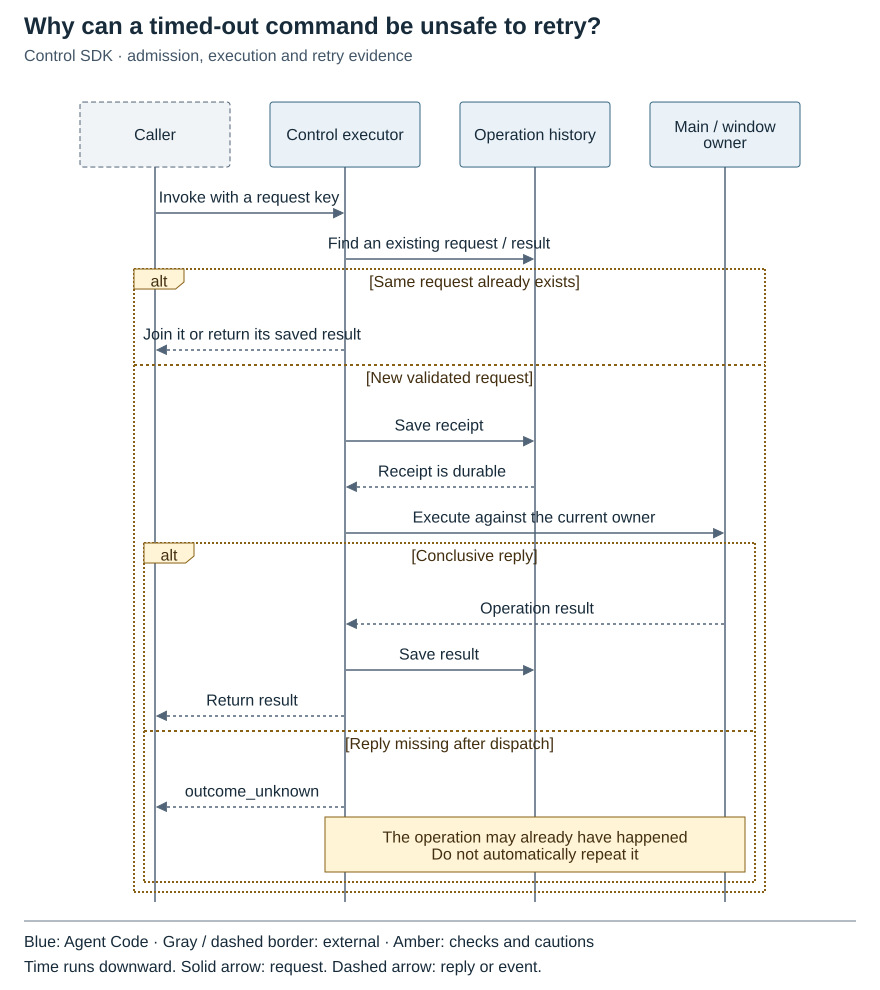](docs/architecture/diagrams/control-invocation.svg)

<details>
<summary>Mermaid source</summary>

```text
sequenceDiagram
    participant Caller
    participant Executor
    participant History
    participant Owner as Main or renderer owner
    Caller->>Executor: Invoke capability with optional requestKey
    Executor->>Executor: Validate schema, visibility and owner
    Executor->>History: Look up canonical request identity
    alt Existing in-flight or completed request
        Executor-->>Caller: Join or return recorded result
    else New admitted request
        Executor->>History: Persist received record
        History-->>Executor: Receipt durable
        Executor->>Owner: Execute against resolved owner generation
        alt Owner returns conclusive result
            Owner-->>Executor: Completed / pending / UI opened / blocked
            Executor->>History: Persist result
            Executor-->>Caller: Operation result
        else Timeout, restart or owner retirement after dispatch
            Executor->>History: Record uncertainty where possible
            Executor-->>Caller: outcome_unknown, no blind replay
        end
    end
```

</details>

Renderer bridge timeout is currently 30 seconds. A timeout means the caller lacks a conclusive result; it does not prove the UI mutation never happened. If result-history persistence fails after an effect, the executor preserves the effect result with a warning rather than pretending the operation was never executed.

Completion semantics are deliberately explicit. Opening a dialog is not equivalent to completing the user's eventual choice in that dialog. Pending work can return an operation that must be observed. External callers cannot invoke capabilities marked application-only, including local connection configuration and token-copy actions.

Sources: [SDK contracts](src/control-sdk/contracts.ts), [executor](src/control-sdk/core/executor.ts), [host composition](src/main/control/createControlHost.ts), [renderer bridge](src/main/control/rendererBridge.ts), [operation history](src/main/control/history/FileControlHistory.ts).

### 5.6 Built-in MCP and agent relationships

#### 5.6.1 Host and registration lifetime

The built-in host listens on `127.0.0.1` at an ephemeral port. Each managed session registration receives a fresh random bearer token and a scope containing its application session ID, working directory and enabled domains. Re-registration replaces authority; teardown revokes it.

The HTTP host is application-lived, but it constructs a fresh protocol `McpServer` for each request. This avoids allowing a long-lived MCP stream to wedge tool calls on a shared server instance. Durable services such as workflows remain singleton dependencies behind the request-scoped registrar.

<!-- architecture-diagram: builtin-mcp -->

[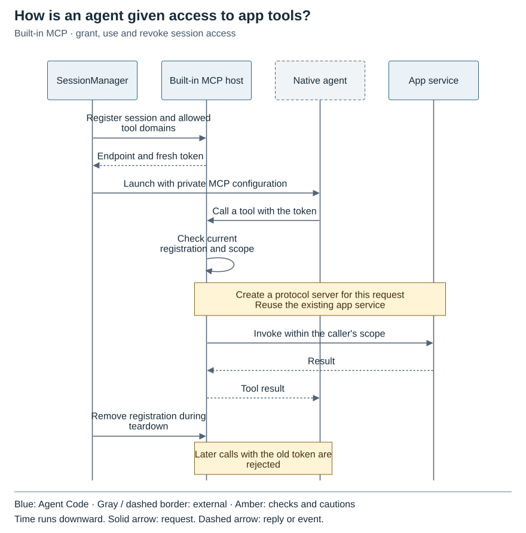](docs/architecture/diagrams/builtin-mcp.svg)

<details>
<summary>Mermaid source</summary>

```text
sequenceDiagram
    participant SM as SessionManager
    participant Host as BuiltInMcpHttpHost
    participant Native as Native provider
    participant Server as Request-scoped McpServer
    participant Service as App-owned service
    SM->>Host: Register session and permitted domains
    Host-->>SM: Endpoint and fresh bearer token
    SM->>Native: Launch with private MCP configuration
    Native->>Host: Authenticated MCP request
    Host->>Host: Resolve current session scope
    Host->>Server: Create server with only enabled tools
    Server->>Service: Invoke with scoped caller identity
    Service-->>Native: Structured result through request server
    SM->>Host: Unregister on session teardown
    Note over Native,Host: Old token no longer authorizes calls
```

</details>

Tokens are omitted from durable workspace metadata. Launch configuration avoids putting bearer values in process arguments: Claude uses a private temporary config file retained until session disposal; Codex uses environment-backed HTTP headers; OpenCode uses process-local inline configuration with environment interpolation. Existing inline OpenCode settings are merged, with current built-in server names winning collisions.

Sources: [HTTP host](src/mcp/runtime/BuiltInMcpHttpHost.ts), [tool registrar](src/mcp/runtime/createBuiltInMcpServer.ts), [launch configuration](src/providers/shared/runtime/builtInMcpLaunch.ts).

#### 5.6.2 Domains and scope

| Domain | Tools/responsibility | Scope notes |
| --- | --- | --- |
| `ping` | Diagnostic registration probe | Not a normal configurable default capability |
| `orchestration` | Create/send/list/read/wait/close child agents and runs | Parent/root/run relationships tracked by bridge and renderer |
| `agent_management` | List/read/send/close existing agents | Current caller's project tab; not merely matching `cwd` |
| `ai_workspace` | Create collections, attach/detach/list files, open/clear/delete collections | Main registry owns actual file-reference sets |
| `agent_transcripts` | Bounded read/search/inspect of supported transcript files | Distinct file-reading contract, not management ownership |
| `workflows` | Register package workflow tools against one durable service | Caller session/cwd seeds run association |

Provider filtering is repeated at the authoritative launch boundary. Claude does not receive the workflow MCP domain because the application avoids overlapping its native workflow facility. Codex and OpenCode can receive it. User settings do not silently grant unsupported domains to a new provider. See [domain policy](src/mcp/shared/types.ts).

#### 5.6.3 Orchestration is a workspace operation

Creating a child involves both main-owned execution and renderer-owned placement. The orchestration bridge serializes requests to the appropriate renderer, tracks relationships, and uses bounded status/output caches to serve callers without repeatedly interrogating every pane. Context cloning and bootstrap delivery are explicit steps, with metadata preventing accidental repeated handoff input.

Closed child outputs can remain available through bounded tombstones: the current bridge caps count, output size and retention time. This preserves useful run results after pane closure without retaining all closed runtimes forever. It is not a replacement for provider-native transcript storage.

<!-- architecture-diagram: orchestration-relationships -->

[](docs/architecture/diagrams/orchestration-relationships.svg)

<details>
<summary>Mermaid source</summary>

```text
classDiagram
    class OrchestrationRun {
        rootSessionId
        runId
    }
    class ManagedAgent {
        sessionId
        parentSessionId
        role
        bootstrapDeliveryState
    }
    class OrchestrationBridge {
        queuedRendererRequests
        relationshipIndex
        closedOutputTombstones
    }
    class WorkspaceActions {
        createChild()
        placeSession()
        closeChild()
    }
    OrchestrationRun "1" o-- "many" ManagedAgent
    ManagedAgent --> ManagedAgent : parent relationship
    OrchestrationBridge --> WorkspaceActions : serialized request
    OrchestrationBridge --> ManagedAgent : tracks lineage
```

</details>

The bridge and the renderer both matter: main cannot infer the right project tab solely from filesystem paths, and the renderer cannot claim a backend exists solely because it placed metadata. Sources: [OrchestrationBridge](src/main/orchestration/OrchestrationBridge.ts), [renderer orchestration](src/renderer/src/workspace/orchestrationMcp.ts).

#### 5.6.4 Management of existing agents

Management tools operate on the exact project tab containing the caller. Two tabs can point at the same directory yet have different session membership. Read/list operations do not wake dormant sessions; sending a prompt may wake the target and then use the normal delivery transaction.

Close has explicit caller policy requiring a current user request naming the target. The tool and bridge also constrain invalid targets and self/cascade behavior. The natural-language authorization requirement is a policy contract; it is not cryptographic proof of a user's intent. Mutation handlers still validate concrete target state.

Renderer request timeouts do not establish that a mutation had no effect. Bridge admission and pending-request tracking exist to avoid accepting contradictory work while a prior mutation remains unresolved. Sources: [AgentManagementBridge](src/main/agentManagement/AgentManagementBridge.ts), [renderer management](src/renderer/src/workspace/agentManagementMcp.ts), [tool descriptions and schemas](src/mcp/runtime/createBuiltInMcpServer.ts).

### 5.7 Durable workflows

#### 5.7.1 A separate execution system

Interactive panes and workflows share provider/toolchain infrastructure but have different lifecycle and persistence requirements. `WorkflowService` owns durable runs, task/attempt state, scheduler admission and cancellation. The embedded MCP registrar is one caller of that service; reopening an MCP request does not recreate the workflow engine.

The application creates the service under Electron `userData/workflows`. It supplies a file store, source-approval store, Electron worker launcher, Codex provider integration, authentication broker and worktree preparation hooks. Startup awaits workflow bridge rehydration before windows expose the feature.

<!-- architecture-diagram: workflow-components -->

[](docs/architecture/diagrams/workflow-components.svg)

<details>
<summary>Mermaid source</summary>

```text
flowchart TB
    UI[Desktop workflow client] --> Bridge[WorkflowBridge]
    MCP[Built-in workflow MCP] --> Service[WorkflowService]
    Bridge --> Service
    Service --> Approval[Exact-source approval store]
    Service --> Store[FileWorkflowStore]
    Service --> Scheduler[Shared work-conserving scheduler]
    Service --> Worker[Workflow utility process]
    Worker -->|agent requests| Service
    Scheduler --> Provider[Codex workflow provider]
    Provider --> Broker[Authentication broker]
    Provider --> Host[Per-attempt provider host]
    Host --> SDK[Codex SDK and selected CLI]
    Store --> Files[Run manifests, journals, source and results]
    Service --> Bridge
```

</details>

#### 5.7.2 Executable source and approval

A workflow is executable source with a constrained API including agent calls, parallel/pipeline composition, phases, logs, arguments and budget access. Source approval is tied to the exact source/version hash. Approval of one version does not silently authorize a modified workflow. The application's native approval dialog defaults to denial.

The workflow worker runs in an Electron utility process using a restricted execution environment. The launcher preserves killability and avoids relying on a system Node installation. The worker protocol normalizes cross-realm values to supported serialized data so a host object does not accidentally expose its prototype capabilities inside the source context.

Source validation, worker limits, timeouts, cancellation and provider policy are separate controls. A Node VM by itself is not an OS sandbox. The application also constrains provider execution to read-only filesystem sandboxing, no network in that sandbox, and no approval prompting. Workflow source can request agents, so the effective provider capability evidence matters as much as the JavaScript API.

Sources: [service composition](src/main/workflows/createWorkflowService.ts), [source approvals](src/main/workflows/WorkflowSourceApprovalStore.ts), [Electron launcher](src/main/workflows/ElectronWorkflowWorkerLauncher.ts), [worker implementation](https://github.com/Juliusolsson05/workflow-mcp/blob/b4b98f8d13f59bae0c999c927533f451b491496a/src/workflowWorker.ts).

#### 5.7.3 Scheduling and provider isolation

One work-conserving scheduler allocates capacity across runs. It maintains fair progress among scheduling keys and reserves a permit before resolving admission. Independent runs do not each assume they own the full concurrency allowance. Available capacity is used when runnable work exists.

Each Codex provider attempt runs through a separate host process with tracked descendants. The service distinguishes a request to terminate from confirmed termination. An uncertain surviving attempt cannot safely be replayed merely because a timer expired.

The application resolves the selected Codex executable from setup and caches executable attestation against file metadata/hash evidence. A missing/updating CLI becomes a provider failure in the durable run path, rather than throwing out of service construction and leaving no run record.

Workflow authentication uses an isolated `CODEX_HOME` under the workflow directory, prepared by a broker from the interactive authentication source before each attempt. That is separate from copying the whole interactive Codex configuration. The application does not forward a parent pane's built-in MCP connections into workflow agents, and explicitly excludes the external operator connection.

Isolation is not overstated: uninspected system/administrator configuration means inherited MCP capability is marked `unknown`. Read-only settings alone do not establish that every possible inherited tool is safe to replay. Provider evidence therefore constrains automatic retry. Model aliases such as `haiku`, `sonnet` and `opus` do not map to equivalent Claude models in this Codex-backed integration; the app resolves them through its documented fallback behavior.

Sources: [scheduler](https://github.com/Juliusolsson05/workflow-mcp/blob/b4b98f8d13f59bae0c999c927533f451b491496a/src/workConservingScheduler.ts), [Codex workflow provider](src/main/workflows/CodexWorkflowProvider.ts), [authentication broker](src/main/workflows/CodexWorkflowAuthenticationBroker.ts), [provider host entry](src/main/workflows/workflowProviderHostEntry.ts).

#### 5.7.4 Durable state and failure

`FileWorkflowStore` journals events before publishing them. Result artifacts are made available before a completion event references them. A single-writer lease/fencing discipline prevents multiple services from appending to the same run as if each were authoritative. Journal write failure stops forward progress instead of continuing an apparently successful but unrecoverable run.

<!-- architecture-diagram: workflow-lifecycle -->

[](docs/architecture/diagrams/workflow-lifecycle.svg)

<details>
<summary>Mermaid source</summary>

```text
stateDiagram-v2
    [*] --> queued
    queued --> running: Admitted
    queued --> cancellation_requested: Cancel
    running --> cancellation_requested: Cancel
    running --> completed: All required work succeeds
    running --> completed_with_errors: Policy accepts terminal task gaps
    running --> failed: Run failure
    running --> interrupted: Execution ownership interrupted
    cancellation_requested --> cancelled: Termination established
    cancellation_requested --> interrupted: Cannot establish clean completion
    completed --> [*]
    completed_with_errors --> [*]
    failed --> [*]
    cancelled --> [*]
    interrupted --> [*]
```

</details>

This is the principal conceptual run-state view; exact transitions and attempt-level evidence belong to the package service. Recovery-required UI can reflect unresolved attempt evidence without being interchangeable with every run status. Best-effort policies can preserve explicit failed-task assignments rather than fabricate successful values.

Resume is lineage-aware. Matching source and arguments can reuse completed siblings; edited workflows are constrained by the reusable prefix/evidence. Manual retry of terminal gaps creates traceable subsequent work. It does not erase failure events from the original run.

Per-run corruption is quarantined rather than silently decoded as an empty successful journal. Journal/result size limits and bounded caches prevent unbounded in-memory mirrors, though durable storage still has its own retention/operational concerns. Sources: [WorkflowService](https://github.com/Juliusolsson05/workflow-mcp/blob/b4b98f8d13f59bae0c999c927533f451b491496a/src/workflowService.ts), [FileWorkflowStore](https://github.com/Juliusolsson05/workflow-mcp/blob/b4b98f8d13f59bae0c999c927533f451b491496a/src/fileWorkflowStore.ts).

#### 5.7.5 Renderer synchronization

The renderer does not receive every workflow event as an unsolicited full payload. `WorkflowBridge` publishes coalesced cursor hints, with one outstanding unacknowledged hint per renderer/run. The client reads bounded event pages and acknowledges progress after applying them. A durable cursor allows recovery after missed hints or window reload.

At this revision, bridge hints are coalesced on a 500 ms interval; a projected read is limited to 32 events and 512 KiB. Large provider output remains in bounded projections/artifacts rather than being broadcast to every window. The bridge also associates runs with originating sessions and rehydrates that lineage on application startup.

<!-- architecture-diagram: workflow-synchronization -->

[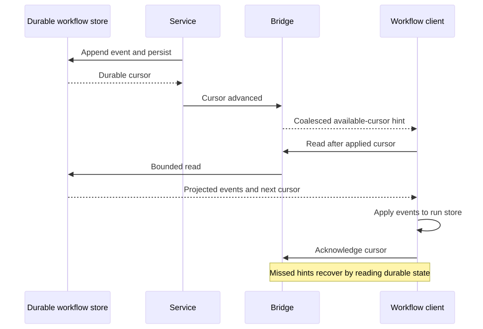](docs/architecture/diagrams/workflow-synchronization.svg)

<details>
<summary>Mermaid source</summary>

```text
sequenceDiagram
    participant Store as Durable workflow store
    participant Service
    participant Bridge
    participant UI as Workflow client
    Service->>Store: Append event and persist
    Store-->>Service: Durable cursor
    Service->>Bridge: Cursor advanced
    Bridge-->>UI: Coalesced available-cursor hint
    UI->>Bridge: Read after applied cursor
    Bridge->>Store: Bounded read
    Store-->>UI: Projected events and next cursor
    UI->>UI: Apply events to run store
    UI->>Bridge: Acknowledge cursor
    Note over Bridge,UI: Missed hints recover by reading durable state
```

</details>

Sources: [WorkflowBridge](src/main/workflows/WorkflowBridge.ts), [renderer workflow client](src/renderer/src/features/workflows/client), [run store](src/renderer/src/features/workflows/model/workflowRunStore.ts).

### 5.8 External operator control

External operator MCP is an independently enabled, application-wide connection. It is disabled by default, uses a configurable stable loopback port (default `47653`), and persists a private token in main-owned settings. Enabling it can reconcile a managed Codex configuration/skill integration so an external Codex client can discover the operator surface.

It is not the built-in per-session MCP endpoint. Internal interactive agents and workflow provider configuration explicitly exclude the external operator server to avoid unintentionally granting general app control through inherited configuration.

<!-- architecture-diagram: external-operator -->

[](docs/architecture/diagrams/external-operator.svg)

<details>
<summary>Mermaid source</summary>

```text
flowchart TB
    Local[Local settings UI] --> Settings[External control settings]
    Settings --> Host[Loopback MCP host]
    Settings --> Integration[Managed external Codex integration]
    Client[External operator client] -->|Bearer-authenticated POST /mcp| Host
    Host --> Tools[Catalog / invoke / operation tools]
    Tools --> Port[ControlHost.forCaller]
    Port --> Main[Main capabilities]
    Port --> Windows[Generation-owned renderer capabilities]
    Port --> History[Durable control history]
```

</details>

The HTTP host accepts only the intended loopback `Host` value and `/mcp` POST route, rejects requests carrying an `Origin`, compares bearer credentials in constant time, bounds request bodies to 2 MiB, and enforces header/request timeouts. Disabling it closes active connections. These defenses reduce browser-origin and local HTTP confusion; possession of the token still grants the externally exposed capability set.

Connection status and invocation history omit the token. Copying connection configuration is a local clipboard action whose result reports success without returning credentials into the SDK result. The saved connection token itself is a private file value, not the same encrypted storage mechanism as the key vault.

Transport records can include request/response payloads within limits; excluding credentials does not make all operator history non-sensitive. Tool results and user input may contain project information.

Sources: [external host](src/main/externalControlMcp/host.ts), [MCP tools](src/main/externalControlMcp/tools.ts), [connection settings](src/main/settings/externalControl.ts), [internal-agent exclusion](src/providers/shared/runtime/externalControlExclusion.ts).

### 5.9 Remote companion

#### 5.9.1 Enablement and deployment modes

`RemoteController` lazily creates the server, transport and pairing state when enabled. Mode transitions are serialized so switching between LAN and tunnel does not leave two listeners with ambiguous ownership. Disable disposes live resources; paired-device state and the local signing secret survive toggles.

LAN mode binds an ephemeral port on `0.0.0.0` and advertises a suitable physical LAN IPv4 address when available. Its transport is plain HTTP/WebSocket. Device authentication does not encrypt LAN traffic.

Tunnel mode binds locally and runs bundled `cloudflared` against that loopback service, with an ephemeral `trycloudflare` HTTPS URL. This adds Cloudflare as a transport dependency. A failed tunnel startup does not silently fall back to exposing a LAN listener.

<!-- architecture-diagram: remote-transports -->

[](docs/architecture/diagrams/remote-transports.svg)

<details>
<summary>Mermaid source</summary>

```text
flowchart TB
    subgraph LAN[LAN mode]
        PhoneA[Paired browser] <-->|HTTP / WS| ListenerA[All-interface remote listener]
    end
    subgraph Tunnel[Tunnel mode]
        PhoneB[Paired browser] <-->|HTTPS / WSS| Edge[Cloudflare tunnel endpoint]
        Edge <--> Cloudflared[Bundled cloudflared process]
        Cloudflared <-->|Loopback HTTP| ListenerB[Local remote listener]
    end
    ListenerA --> Server[RemoteServer]
    ListenerB --> Server
    Server --> Source[SessionFeedSource]
    Source --> Manager[SessionManager]
```

</details>

Sources: [controller](src/main/remote/RemoteController.ts), [LAN transport](src/main/remote/transport/LanTransport.ts), [tunnel transport](src/main/remote/transport/CloudflaredTunnel.ts).

#### 5.9.2 Pairing and authentication

Pairing uses an eight-character, single-use code with a five-minute lifetime. A successful exchange registers a device and returns a signed token. Token validation uses the local HMAC secret and device registry. Device revocation is explicit; the token format includes issuance time but does not implement a general automatic expiry policy.

Authentication is checked at WebSocket upgrade and on subsequent messages, so revocation can affect an already established client. Signing secrets and paired-device state are stored locally with restrictive file permissions. Pairing is a remote-control grant, not merely permission to view a screenshot.

Sources: [remote authentication](src/main/remote/auth), [server](src/main/remote/RemoteServer.ts).

#### 5.9.3 Protocol scope and recovery

The protocol supports ping, send-prompt, submit, interrupt, condition reply and history requests. It exposes agent sessions, not a general-purpose shell or every desktop IPC method. Current snapshots seed screen, conditions, readiness and process state; committed history is loaded on demand rather than retained as another full transcript cache in the server.

<!-- architecture-diagram: remote-session-protocol -->

[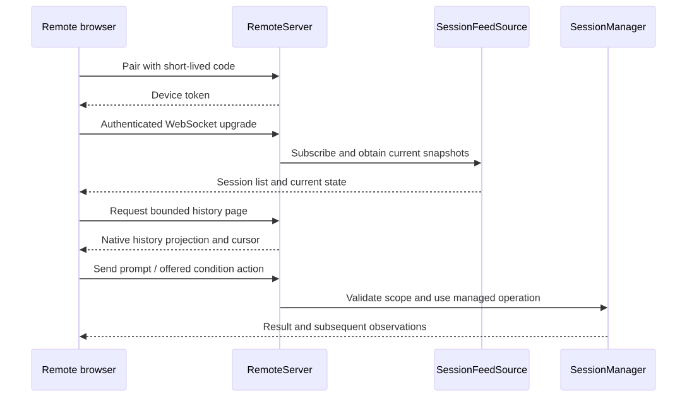](docs/architecture/diagrams/remote-session-protocol.svg)

<details>
<summary>Mermaid source</summary>

```text
sequenceDiagram
    participant Device as Remote browser
    participant Server as RemoteServer
    participant Source as SessionFeedSource
    participant Manager as SessionManager
    Device->>Server: Pair with short-lived code
    Server-->>Device: Device token
    Device->>Server: Authenticated WebSocket upgrade
    Server->>Source: Subscribe and obtain current snapshots
    Source-->>Device: Session list and current state
    Device->>Server: Request bounded history page
    Server-->>Device: Native history projection and cursor
    Device->>Server: Send prompt / offered condition action
    Server->>Manager: Validate scope and use managed operation
    Manager-->>Device: Result and subsequent observations
```

</details>

Outbound backlog and frame limits prevent an unresponsive device from accumulating unlimited buffered data. The current backlog cap is 4 MiB. The server terminates an over-budget connection so the client can reconnect/backfill, rather than silently dropping structural events while pretending the stream is complete.

History is capped at 500 requested entries and a separate byte budget. Oversized pages are reduced toward the cursor-relevant suffix; an individual record that cannot fit returns an explicit error. A row count alone cannot bound payload size when tool output is large.

Sources: [protocol messages](src/main/remote/protocol/messages.ts), [protocol scope](src/main/remote/protocol/scope.ts), [feed source](src/main/remote/SessionFeedSource.ts), [server](src/main/remote/RemoteServer.ts).

#### 5.9.4 Browser reuse without desktop privileges

The remote client is a separate Vite build under `src/remote-client`. It reuses the shared transcript mappers, semantic reducers, stream phase, entry-window logic, ownership ledger and feed. Explicit aliases replace desktop-only dependencies: code rendering uses a lightweight browser path instead of the full Monaco integration, settings use controlled defaults, and Electron-specific diagnostics/links have browser implementations or stubs.

Remote transcript state supplies the rendering inputs it actually owns. It does not fabricate desktop ghost history or optimistic submissions. Live and history ingestion keep separate mapper lifetimes, and native source changes reset the relevant conversation state.

Mobile dictation posts audio to the remote server's batch transcription path. At this revision that path uses `DEEPGRAM_API_KEY` from the process environment; it does not read the desktop safeStorage-backed dictation key. Audio is not persisted by the normal remote path. This distinction matters when desktop dictation works but mobile dictation reports missing configuration.

Sources: [remote Vite configuration](src/remote-client/vite.config.ts), [remote client source](src/remote-client/src), [remote controller dictation integration](src/main/remote/RemoteController.ts).

### 5.10 Files, editors, and language servers

#### 5.10.1 Editor workspace and buffers

The global editor maintains separate state per working directory. Following focus between agents can change the active editor project without discarding the previous project's tabs and buffers. AI Workspace adds a curated collection of real file references; it does not create an isolated copy of those files.

Buffer operations distinguish current text, disk observation, acknowledged save version, dirty state, deletion and conflict. A file watcher reporting a change cannot simply replace dirty local text. Open-tab paths, selection and geometry can survive restart, but **unsaved buffer text is not persisted by the global editor**. Restart reopens files from disk. Before-unload and dirty-close guards are therefore necessary, not cosmetic dialogs.

Monaco model ownership is centralized so multiple surfaces referring to the same logical editor content do not accidentally leak models or dispose a model still in use. Curated AI Workspace visibility is separate from identity, allowing it to hide without immediately discarding its live buffers.

Sources: [global editor store](src/renderer/src/features/global-editor/store.ts), [editor persistence](src/renderer/src/features/global-editor/lib/globalEditorPersistence.ts), [buffer operations](src/renderer/src/features/editor/lib/bufferOps.ts), [Monaco model registry](src/renderer/src/features/editor/lib/editorModelRegistry.ts).

#### 5.10.2 Filesystem authority

Renderer-supplied paths are not self-authorizing. `EditorFsRootRegistry` validates real paths against main-owned session working directories and grants roots to a particular renderer. Remembered grants let an editor continue using a previously authorized root after its agent exits; navigation, renderer destruction and other lifetime boundaries revoke the relevant grants.

AI Workspace uses its own main-owned registry of attached file entries. A renderer cannot authorize an arbitrary file merely by presenting a plausible workspace ID or root string. The registry and editor IPC validate the actual entry/path at the privileged boundary.

<!-- architecture-diagram: editor-file-io -->

[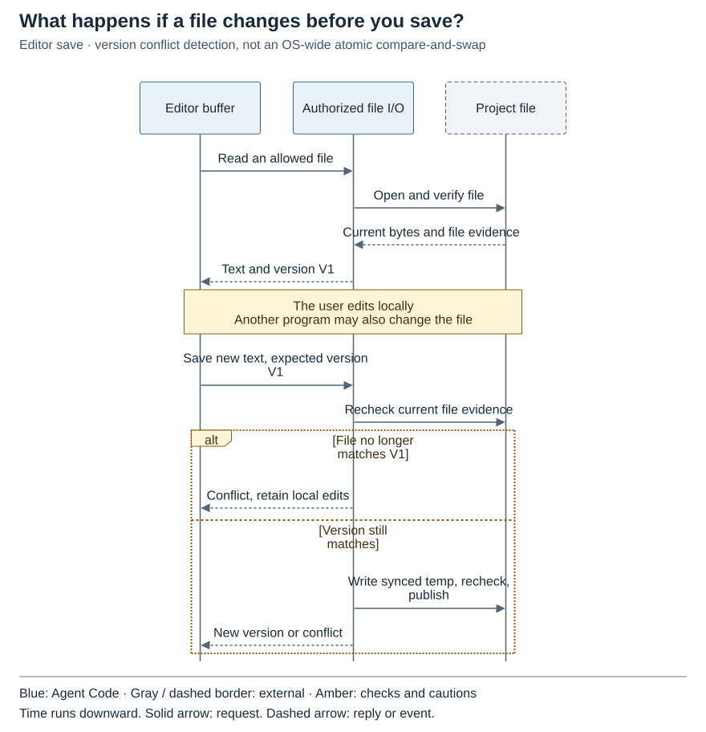](docs/architecture/diagrams/editor-file-io.svg)

<details>
<summary>Mermaid source</summary>

```text
sequenceDiagram
    participant Editor as Renderer editor
    participant IPC as Editor filesystem IPC
    participant Roots as Root or AI Workspace authority
    participant IO as Bounded file I/O
    participant Disk
    Editor->>IPC: Read path within requested workspace
    IPC->>Roots: Authorize renderer and canonical target
    Roots-->>IPC: Authorized root/entry or refusal
    IPC->>IO: Read regular file within byte limit
    IO->>Disk: Open and verify file identity
    Disk-->>Editor: Text and opaque version through IPC
    Editor->>IPC: Save text with expected version
    IPC->>Roots: Revalidate authority
    IPC->>IO: Serialize same-path mutation
    IO->>Disk: Write sibling temp, sync, recheck, publish
    IO-->>Editor: New version or conflict
```

</details>

Sources: [root registry](src/main/ipc/editorFsRootRegistry.ts), [editor filesystem IPC](src/main/ipc/editorFs.ts), [AI Workspace registry](src/main/aiWorkspace/AiWorkspaceRegistry.ts).

#### 5.10.3 Read/write guarantees and their limits

Shared file I/O rejects non-regular files, bounds reads before decoding, uses fatal UTF-8 decoding, and rejects binary-like content such as NUL-containing text. On POSIX, no-follow/nonblocking open flags and stat consistency checks reduce symlink and special-file races. Windows lacks the same `O_NOFOLLOW` primitive and uses the available consistency checks.

The editor version combines device/inode/size/time evidence. Save supports three meanings: a specific expected version, explicit create-only (`null`), or no version expectation. Create-only must not overwrite a file that appeared after initial preflight.

Writes use a sibling temporary file, preserve intended permission bits, sync file contents, recheck the target version, and publish. New-file publication uses a no-clobber hard link. Ordinary replacement uses rename, which is atomic publication but not a portable filesystem compare-and-swap against unrelated external writers. The in-process mutation queue closes Agent Code's own races; the narrow final external-writer race remains a documented platform limit.

Managed-skill publication can use a stronger capture path: move the expected inode aside, verify the captured file/hash, and publish without clobbering a concurrent creator. Recovery metadata records the operation's ownership. That specialized mechanism should not be assumed for every ordinary editor save. Directory syncing is best-effort where the platform does not support it.

Source: [editorFileIO](src/main/editorFileIO.ts).

#### 5.10.4 AI Workspace registry

An AI Workspace is a named, scoped collection of attached paths and metadata. Main persists the registry in `ai-workspaces.json`, loads it lazily, serializes saves, and broadcasts collection changes to windows. Opening a collection routes to an appropriate/focused editor surface.

The registry deduplicates according to workspace naming/scope rules, validates attached paths, and bounds reads (8 MiB in this registry). Git metadata uses short-lived caching and bounded concurrency so listing a collection does not spawn an unbounded wave of repository probes.

Deleting or clearing a collection changes its reference set. File-content mutation is a distinct editor/filesystem operation with its own checks. Sources: [AI Workspace registry](src/main/aiWorkspace/AiWorkspaceRegistry.ts), [AI Workspace MCP contracts](src/mcp/shared/aiWorkspaceTypes.ts), [renderer AI Workspace](src/renderer/src/features/ai-workspace).

#### 5.10.5 Language servers

`LspManager` shares a language-server process for a workspace root/server specification and reference-counts document clients. It bridges JSON-RPC over stdio, synchronizes documents, and supplies completions, hover, diagnostics, symbols, definitions, references and semantic tokens. Diagnostics are file-scoped and may need to reach several views/windows.

<!-- architecture-diagram: language-servers -->

[](docs/architecture/diagrams/language-servers.svg)

<details>
<summary>Mermaid source</summary>

```text
classDiagram
    class MonacoClient {
        documentUri
        clientId
    }
    class LspManager {
        serversByWorkspaceAndSpec
        documentReferences
        requestTimeouts
    }
    class LspServerSpec {
        id
        languages
        resolveCommand()
    }
    class LanguageServerProcess {
        stdinJsonRpc
        stdoutJsonRpc
    }
    MonacoClient --> LspManager : authorized document operations
    LspManager --> LspServerSpec : resolve supported server
    LspManager "1" o-- "many" LanguageServerProcess
    LspManager --> MonacoClient : diagnostics and results
```

</details>

JavaScript/TypeScript use the packaged npm `typescript-language-server`, launched through Electron with `ELECTRON_RUN_AS_NODE`. Python (`pyright-langserver`), Rust (`rust-analyzer`) and Go (`gopls`) are optional executable discoveries. Availability is resolved again when a server is created, allowing installation during an app run.

Virtual document URIs under an application-specific workspace path support non-file editor content without claiming those URIs are ordinary saved project files. General requests and initialization have separate timeouts. Filesystem/LSP authorization shares the root authority; a renderer does not get unrestricted language-server access by inventing a root.

Sources: [LspManager](src/main/lspManager.ts), [server registry](src/main/lsp/serverRegistry.ts), [LSP IPC](src/main/ipc/lsp.ts).

### 5.11 Git, work context, and native subagents

#### 5.11.1 Repository status and worktree identity

Main runs Git status/worktree commands through a shared process queue. At this revision the global Git command limit is eight; worktree status has its own lower fan-out and a 30-second cache. Each command has a timeout. Bounded lag is preferable to hundreds of simultaneous subprocesses when several windows inspect a large worktree collection.

The Git bar distinguishes a submodule gitlink change from changes inside the submodule checkout. It can compare the parent-registered revision to the submodule's current HEAD, inspect local edits, or combine both. Treating every modified submodule as a one-line parent diff would conceal the actual work.

Git-unavailable state is tracked separately from empty output. On macOS, an installed `/usr/bin/git` shim without usable command-line tools is not evidence that the repository is clean. Some other Git errors still intentionally degrade to partial/empty data; a successful status view is not a universal proof that every probe succeeded.

Source: [Git IPC and queue](src/main/ipc/git.ts), [shared Git contracts](src/shared/types/git.ts).

#### 5.11.2 Where an agent is working

The launch `cwd` is a useful default but not a complete account of current work. A native agent may run commands or edit files in another worktree. Shared work-context extractors interpret transcript evidence, match paths to known worktrees, and track active/primary/touched context with confidence and provenance.

<!-- architecture-diagram: worktree-attribution -->

[](docs/architecture/diagrams/worktree-attribution.svg)

<details>
<summary>Mermaid source</summary>

```text
flowchart TB
    Native[Provider transcript event] --> Extract[Work-context extractors]
    Git[Known worktree identities] --> Match[Canonical path matching]
    Extract --> Match
    Match --> State[Active / primary / touched context]
    State --> UI[Agent and worktree UI]
    Files[Historical native transcripts] --> Index[WorktreeActivityIndex]
    Index --> Summaries[Cached historical activity summaries]
    Summaries --> UI
```

</details>

This is evidence-based attribution, not an OS-wide file audit. Confidence and fallback behavior remain visible in the model. The live tracker bounds its timeline and deduplication keys. Historical discovery belongs to a main service so every UI surface does not independently walk all provider history.

`WorktreeActivityIndex` serves cached summaries while refreshing in the background. Discovery is freshness-gated; a forced refresh pays the scan cost explicitly. The durable index can grow beyond its 1,000-entry in-memory LRU. Full summary operations may read the durable index transiently, so a bounded hot cache does not mean every computation touches only 1,000 records.

Sources: [work-context tracker](src/shared/work-context/tracker.ts), [matching/extraction](src/shared/work-context), [activity index](src/main/worktreeActivity/WorktreeActivityIndex.ts).

#### 5.11.3 Native provider subagents

Native provider subagents are different from agents created by Agent Code orchestration MCP. The native runtime creates them, and the application observes evidence of their existence and progress.

Claude child transcripts live beside the parent transcript in the provider's subagent layout. The watcher derives the directory from the exact parent file. Parent tool-result completion is merged through a bounded completion ledger so a child can become done/error even if its file has not grown again.

Codex children are first-class rollout sessions linked by spawn output and native source metadata. They do not share Claude's directory assumption. A dedicated tracker handles Codex attribution. Stopping the parent watcher releases its watches, trackers and completion bookkeeping.

Sources: [subagent manager](src/main/subagents/index.ts), [Claude watcher](src/main/subagents/SubAgentWatcher.ts), [Codex tracker](src/main/subagents/codexSubagentState.ts), [completion ledger](src/main/subagents/completionLedger.ts).

#### 5.11.4 Usage and keep-awake services

Usage snapshots query Claude and Codex independently and cache the result for 30 seconds. A failure in one provider does not hide the other. Normal overlapping requests share an in-flight fetch; forced refresh starts a new authoritative fetch.

Claude usage reads native credentials through the macOS Keychain path. Codex usage reads `~/.codex/auth.json` on demand. The latter is a fixed default-home path at this revision, unlike runtime paths that can honor `CODEX_HOME`; that difference can explain a usage/auth mismatch. Quota snapshots are advisory UI data, separate from live provider conditions and request failures.

Keep-awake is owned by main through `/usr/bin/caffeinate -ims`. It prevents the selected idle-sleep behaviors while enabled, releases its own process on stop, and does not promise to keep the display awake or defeat every lid-close/power-state rule.

Sources: [usage service](src/main/usage/usageService.ts), [Claude usage](src/main/usage/claudeUsage.ts), [Codex usage](src/main/usage/codexUsage.ts), [CaffeinateController](src/main/caffeinate/CaffeinateController.ts).

### 5.12 Managed skills and conventions

#### 5.12.1 Desired state and materialized copies

Agent Code manages a personal conventions skill, custom skills, and imported public GitHub skills. Main-owned desired state and revision/ownership journals live in `conventions.json`; imported immutable bytes live in content-addressed snapshots. Provider skill directories are materialized integration surfaces, not the authoritative configuration store.

Targets come from provider policy: Claude's configured/default skill root, Codex's agent skill root, and OpenCode's supported roots. Overlapping targets are deduplicated. A directory containing an application-looking marker is not by itself proof that Agent Code may overwrite or delete it.

<!-- architecture-diagram: skill-materialization -->

[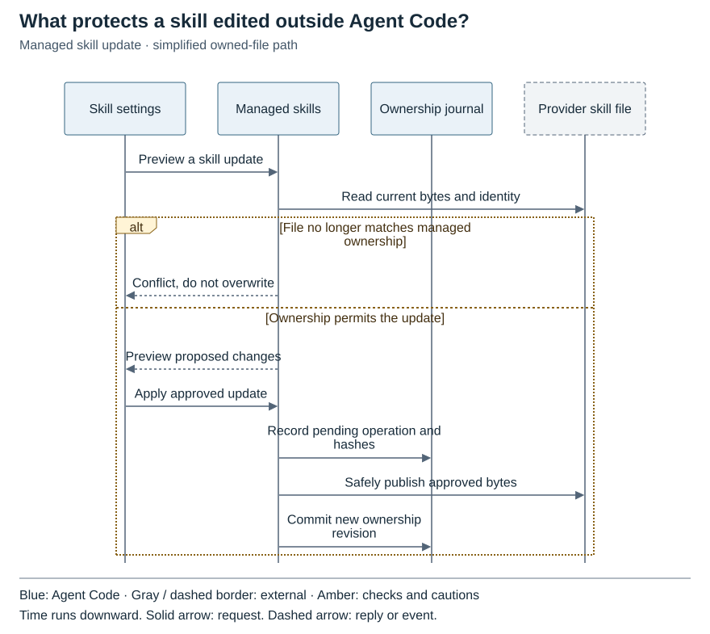](docs/architecture/diagrams/skill-materialization.svg)

<details>
<summary>Mermaid source</summary>

```text
sequenceDiagram
    participant UI as Skill settings
    participant Service as Managed skills service
    participant State as Desired state and ownership journal
    participant Target as Provider skill files
    UI->>Service: Preview/import/edit desired skill
    Service->>Target: Inspect existing paths, versions and digests
    Service-->>UI: Conflicts and proposed materialization
    UI->>Service: Apply selected change
    Service->>State: Record pending operation and ownership evidence
    Service->>Target: Publish exact approved bytes safely
    Service->>State: Commit materialization revision
    Note over State,Target: Recovery reconciles pending operations against exact file evidence
```

</details>

The mutation queue serializes whole-state operations. Pending writes/deletes retain previous and intended digests, paths and revision evidence. An externally edited target cannot be removed merely because a prior version was managed. Unmanaged collisions require explicit preview/adoption policy. Invalid state can produce a recovery-required condition instead of destructive automatic repair.

The pre-session audit is best-effort: a skill-materialization problem can be surfaced as health state without making every native agent launch impossible. That does not authorize the audit to overwrite unknown bytes.

Sources: [managed service entry](src/main/agentCodeConventions/AgentCodeManagedSkillsService.ts), [service implementation](src/main/agentCodeConventions/AgentCodeConventionsService.ts), [ownership policy](src/main/agentCodeConventions/ownershipPolicy.ts), [path safety](src/main/agentCodeConventions/skillPathSafety.ts).

#### 5.12.2 Public GitHub acquisition

Imported skills resolve a public repository ref to an exact commit and acquire bounded files from that commit. The implementation avoids a credentialed arbitrary clone: ref lookup uses constrained HTTPS Git behavior, then tree/raw acquisition verifies file evidence. Slash-containing branch/tag names and ambiguous references need deliberate resolution.

Manifests constrain paths, sizes and file shapes. Immutable snapshots retain the approved package bytes and hashes. Applying a skill materializes those exact bytes; it does not silently follow the repository's moving branch on every launch. An update is another reviewable desired-state change.

Content addressing proves identity of acquired bytes, not that their instructions are appropriate for every project. Managed ownership controls filesystem mutation; the native provider still interprets the installed skill instructions when it loads them.

Sources: [GitHub source resolver](src/main/agentCodeConventions/githubSkillSource.ts), [package store](src/main/agentCodeConventions/installedSkillPackageStore.ts), [materializer](src/main/agentCodeConventions/installedSkillMaterializer.ts).

### 5.13 Dictation, templates, and secrets

#### 5.13.1 Desktop dictation

The renderer captures microphone audio and manages the active composer interaction. Main owns the provider connection and credentials. Audio chunks cross IPC into a streaming session or a batch fallback; transcription events return to the appropriate UI path. The application integration uses Deepgram even though the reusable package has a broader API.

<!-- architecture-diagram: dictation -->

[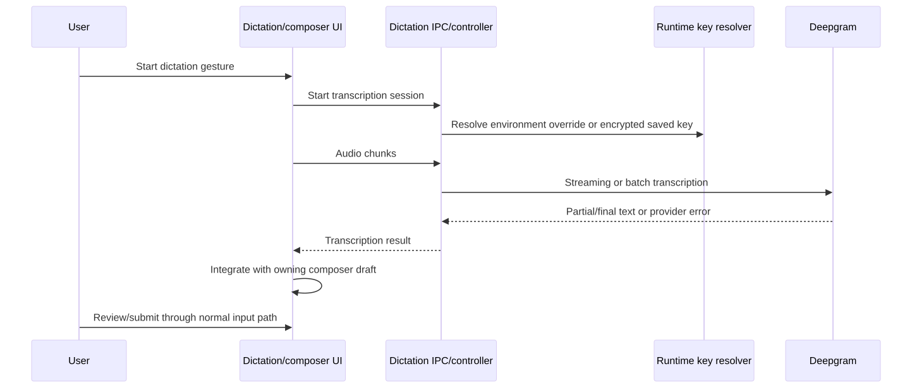](docs/architecture/diagrams/dictation.svg)

<details>
<summary>Mermaid source</summary>

```text
sequenceDiagram
    participant User
    participant Renderer as Dictation/composer UI
    participant Main as Dictation IPC/controller
    participant Key as Runtime key resolver
    participant STT as Deepgram
    User->>Renderer: Start dictation gesture
    Renderer->>Main: Start transcription session
    Main->>Key: Resolve environment override or encrypted saved key
    Renderer->>Main: Audio chunks
    Main->>STT: Streaming or batch transcription
    STT-->>Main: Partial/final text or provider error
    Main-->>Renderer: Transcription result
    Renderer->>Renderer: Integrate with owning composer draft
    User->>Renderer: Review/submit through normal input path
```

</details>

The composer path must retain the intended target across focus and mount changes. Global hotkeys route to focused/recently focused windows; renderer ownership coordinates the active recording/composer. Audio transcription is not automatically authorization to submit a prompt to a newly focused agent.

Ordinary accelerators use Electron `globalShortcut`, which provides activation rather than a physical key-up edge; that path uses toggle behavior. Fn/bare-modifier bindings require the native macOS event-tap helper and its Accessibility permission, supporting real hold/release edges. Reconfiguration drains an active recording edge before replacing the binding.

Desktop key resolution prefers `DEEPGRAM_API_KEY`, then the safeStorage-encrypted settings blob. Settings status returns configuration/source/hint, not the raw key. A corrupt encrypted blob is not treated as a reason to overwrite unrelated preferences.

Normal microphone audio stays off disk. `AGENT_CODE_DICTATION_DUMP=1` explicitly enables debug audio capture in the application temp directory. Text history and debug journals are separate persistence surfaces and can contain transcription content or provider error details. No-speech is a normal outcome, not a fabricated transcript.

Sources: [dictation IPC](src/main/ipc/dictation.ts), [controller](src/main/dictation/controller.ts), [key store](src/main/dictation/apiKeyStore.ts), [hotkey routing](src/main/dictation/hotkey.ts), [renderer dictation](src/renderer/src/features/voice-dictation), [speech package](https://github.com/Juliusolsson05/agent-voice-dictation/tree/3c6f962843532da2a7ddf2cc80f38cacd3196bb1).

#### 5.13.2 Prompt templates

Templates resolve named `{{variable}}` placeholders from explicit values or configured defaults and reject missing required values. Insertion has explicit replace/append behavior; it does not inherently execute the resulting prompt. Effective surface policy determines whether insertion targets a rendered draft or a supported terminal input path.

Template interpolation is distinct from vault reference resolution. The template placeholder grammar is intentionally narrow; `{{key:Provider/Key}}` belongs to the gated vault integration rather than an arbitrary expression evaluator. Sources: [template interpolation](src/renderer/src/features/prompt-templates/interpolate.ts), [template feature](src/renderer/src/features/prompt-templates).

#### 5.13.3 Key vault

The vault stores secret blobs encrypted with Electron safeStorage and a separate plaintext metadata index. Names, notes and masked hints are metadata; values are absent from ordinary snapshots. Very short secrets receive no suffix hint to avoid storing the entire value as a “mask.”

Encryption at rest and permission to reveal are separate. Reveal, copy and reference resolution pass through a once-per-run user-presence gate backed by the injected macOS authentication prompt. Unsupported authentication fails closed. Concurrent unlock requests share a prompt; locking increments a generation so a prompt that finishes afterward cannot re-unlock the vault.

<!-- architecture-diagram: vault-lifecycle -->

[](docs/architecture/diagrams/vault-lifecycle.svg)

<details>
<summary>Mermaid source</summary>

```text
stateDiagram-v2
    [*] --> Locked
    Locked --> UnlockPending: Reveal/copy/resolve requests authentication
    UnlockPending --> Unlocked: Authentication succeeds in same generation
    UnlockPending --> Locked: Cancel, failure or intervening lock
    Unlocked --> Unlocked: Gated secret operation
    Unlocked --> Locked: Explicit lock or new application run
```

</details>

CRUD operations are serialized. Secret/index write ordering avoids publishing references to nonexistent values and avoids treating a corrupt index as a new empty vault. Store IDs and file permissions constrain the on-disk layout.

Resolving a reference deliberately moves plaintext out of the vault into a caller's composer or clipboard. From that point, normal prompt/draft/transcript behavior can retain it. Vault encryption is not a promise that a submitted secret remains confined to the encrypted store.

Sources: [VaultService](src/main/keyVault/VaultService.ts), [vault store](src/main/keyVault/vaultStore.ts), [safeStorage codec](src/main/keyVault/safeStorageCodec.ts), [vault IPC](src/main/ipc/keyVault.ts).

## 6. Runtime view

These scenarios trace ownership changes and failure boundaries across components. Component-local workflow, control and remote protocols remain beside their service descriptions in section 5; this view covers the shared interactive lifecycle.

### 6.1 Startup and shutdown

Main is a composition root. Most services accept dependencies or small ports rather than looking up arbitrary global application objects. Some intentionally global facilities—window routing, diagnostic services and retention scheduling—remain shared within main.

Startup ordering prevents several observable races: environment variables must exist before modules read them, lineage must be restored before a window asks about workflow history, MCP launch configuration must be available before provider spawn, and window ownership must exist before the first session event.

<!-- architecture-diagram: startup -->

[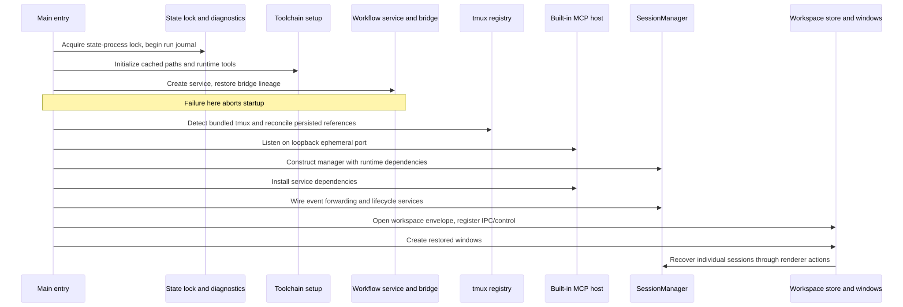](docs/architecture/diagrams/startup.svg)

<details>
<summary>Mermaid source</summary>

```text
sequenceDiagram
    participant Boot as Main entry
    participant State as State lock and diagnostics
    participant Setup as Toolchain setup
    participant WF as Workflow service and bridge
    participant Tmux as tmux registry
    participant MCP as Built-in MCP host
    participant Sessions as SessionManager
    participant Windows as Workspace store and windows
    Boot->>State: Acquire state-process lock, begin run journal
    Boot->>Setup: Initialize cached paths and runtime tools
    Boot->>WF: Create service, restore bridge lineage
    Note over Boot,WF: Failure here aborts startup
    Boot->>Tmux: Detect bundled tmux and reconcile persisted references
    Boot->>MCP: Listen on loopback ephemeral port
    Boot->>Sessions: Construct manager with runtime dependencies
    Boot->>MCP: Install service dependencies
    Boot->>Sessions: Wire event forwarding and lifecycle services
    Boot->>Windows: Open workspace envelope, register IPC/control
    Boot->>Windows: Create restored windows
    Windows->>Sessions: Recover individual sessions through renderer actions
```

</details>

The exact implementation interleaves diagnostic marks and setup work; the diagram shows dependency order. It does not imply all diagnostic objects are created at the point they are first used. See [main startup](src/main/index.ts).

Toolchain setup stores resolved executable paths and checks them again when necessary. A captured original `PATH` prevents repeated setup from continually prepending duplicate directories. Provider startup uses a validated absolute CLI path; a missing CLI is an explicit launch error rather than an accidental shell lookup. CLI updates coordinate with active sessions and workflow admission, especially Codex, so new work is not admitted into a binary replacement window. See [setup services](src/main/setup).

Shutdown has vetoes. An unsaved editor can refuse a window close. Workflow shutdown can fail if it cannot establish a safe terminal state. Session teardown waits for owned resources instead of assuming that requesting termination proves termination.

<!-- architecture-diagram: shutdown -->

[](docs/architecture/diagrams/shutdown.svg)

<details>
<summary>Mermaid source</summary>

```text
sequenceDiagram
    participant User
    participant App as Electron lifecycle
    participant WF as WorkflowService
    participant Window as Renderer/editor guard
    participant SM as Session shutdown gate
    participant Aux as Auxiliary services and journals
    User->>App: Quit
    App->>WF: Stop durable workflow execution
    alt Workflow stop cannot finish safely
        WF-->>App: Failure, retain application for retry
    else Workflow stop completes
        App->>Window: Close / beforeunload
        alt Unsaved changes veto close
            Window-->>App: Keep editing
        else Close is allowed
            App->>SM: will-quit: killAll and await teardown
            alt Owned process teardown fails
                SM-->>App: Block quit, report failure
            else Teardown completes
                App->>Aux: Flush queues, stop servers and helpers
                App->>Aux: Mark clean run and release state lock
                App-->>User: Application exits
            end
        end
    end
```

</details>

Some auxiliary shutdown hooks run earlier or concurrently with these gates. Diagnostic flushes are not all awaited with the same durability guarantee as workflow state and owned-process shutdown. “Clean exit” is a lifecycle result, not proof that every optional debug record reached disk.

### 6.2 Windows, workspace, and restoration

#### 6.2.1 Persistent envelope and window ownership

Main persists a versioned multi-window envelope. Version 2 contains `windows`, each with a window ID, bounds/display/fullscreen information, and a renderer-owned workspace value. A renderer still loads and saves its own wrapped workspace slice; it does not rewrite other windows' state.

[Workspace file decoding](src/main/storage/workspaceFile.ts) migrates the legacy single-workspace envelope. An unsupported future version or an invalid file can place the store in read-only mode rather than overwrite data with a fresh empty layout. Invalid individual window entries can be discarded during decoding; duplicate window IDs are not allowed to become competing owners.

[WorkspaceFileStore](src/main/storage/workspaceFileStore.ts) serializes reads and writes through one admission-ordered queue. Reads join the queue so they cannot observe an old value while an earlier save is waiting. Writes use unique temporary files and rename. A retired window ID cannot submit a late save that resurrects its removed slice. Main also observes persisted session membership to acknowledge replacement/handoff transactions; it otherwise leaves layout interpretation to the renderer.

Closing a window while the app continues can transfer its sessions to a surviving window. Ownership is moved before subsequent session events, the surviving renderer receives an adoption request, and the transfer is acknowledged or rolled back. This path is different from application quit, which preserves the saved multi-window arrangement instead of collapsing it into one surviving window. See [window registry](src/main/window/windowRegistry.ts) and [main window lifecycle](src/main/index.ts).

#### 6.2.2 Layout is a projection over sessions

<!-- architecture-diagram: workspace-model -->

[](docs/architecture/diagrams/workspace-model.svg)

<details>
<summary>Mermaid source</summary>

```text
classDiagram
    class WorkspaceState {
        tabs
        activeTabId
        sessions
        gridRelatedSelections
        dispatchMode
        detachedSessions
        pinnedSessionIds
    }
    class Tab {
        id
        title
        focusedSessionId
    }
    class TileLeaf {
        sessionId
    }
    class TileNode {
        <<union>>
    }
    class TileSplit {
        direction
        ratio
    }
    class SessionMeta {
        cwd
        kind
        providerRuntime
        linkedParentId
        orchestrationParentId
    }
    class DispatchLayout {
        lanes
        rows
        focus
        scope
    }
    WorkspaceState "1" *-- "many" Tab
    Tab --> TileNode : root
    TileNode <|-- TileLeaf : leaf variant
    TileNode <|-- TileSplit : split variant
    TileSplit "1" *-- "2" TileNode : children
    TileLeaf --> SessionMeta : sessionId
    WorkspaceState *-- DispatchLayout
    DispatchLayout --> SessionMeta : lane placement
```

</details>

`TileNode` is a TypeScript discriminated union, shown with variant relationships rather than runtime class inheritance. Each split has exactly two children, either of which can be a leaf or another split. A split ratio is normalized to the allowed range; a tab's focused session must be an actual leaf.

Grid placement, Dispatch Mode lanes, pinning, detached sessions, and buried sessions describe visibility and organization. They do not by themselves terminate a backend. Dispatch lanes are a flat ordered sequence with explicit row structure; row weights and scope are normalized separately. Empty lanes remain meaningful and are not automatically populated from the session pool.

Related-session selection can display a child in a physical grid leaf owned by another session. Linked terminal parentage is a one-level association with cascading close behavior. Orchestration parent/root/run metadata is a separate relationship and should not be reused as the linked-terminal tree.

#### 6.2.3 Recovery preserves the workspace shell

Restoration first publishes durable layout and session metadata using stable application IDs. Individual visible sessions then resolve their recovery outcomes. A failed recovery leaves its pane and error available; it does not erase the leaf because a process took too long. Hibernated sessions legitimately have metadata without a live backend.

<!-- architecture-diagram: workspace-recovery -->

[](docs/architecture/diagrams/workspace-recovery.svg)

<details>
<summary>Mermaid source</summary>

```text
stateDiagram-v2
    [*] --> SavedMetadata
    SavedMetadata --> VisibleShell: Publish restored layout
    VisibleShell --> Hibernated: Backend not requested
    VisibleShell --> Recovering: Request stable-ID recovery
    Recovering --> Live: Backend adopted or started
    Recovering --> FailedVisible: Recovery fails
    FailedVisible --> Recovering: Explicit retry
    Hibernated --> Recovering: Wake
    Live --> Hibernated: Hibernate
    Live --> FailedVisible: Backend failure
```

</details>

This is a conceptual restoration view; process, transcript and input readiness have separate actual fields. [Rehydration](src/renderer/src/workspace/hook/persistence/rehydrate.ts) and [recovery projection](src/renderer/src/workspace/hook/persistence/recoveryProjection.ts) own this separation. Terminal restart recovery has a known envelope mismatch described in [terminal recovery](#66-terminal-surfaces-and-tmux); do not infer a universal tmux recovery guarantee from the general workspace restoration model.

### 6.3 Session lifecycle

`SessionManager` is the main authority for interactive sessions. It manages live registry entries, spawning generations, recovery operations, prompt reservations, readiness revisions, last observations, PTY attachment state, and Codex replacement coordination. It is not the transcript parser or the renderer's workspace store.

<!-- architecture-diagram: session-adapters -->

[](docs/architecture/diagrams/session-adapters.svg)

<details>
<summary>Mermaid source</summary>

```text
classDiagram
    class SessionManager {
        spawn()
        recover()
        deliverPromptToAgent()
        killAll()
    }
    class AgentSession {
        <<interface>>
        start()
        stop()
        write()
        resize()
        resolveCondition()
    }
    class ClaudeSession
    class CodexSession
    class OpencodeSession
    class OpencodeTerminalSession
    class ProviderRegistry {
        createSession
        createTerminalSession
        listSessions
        resolveTranscriptPath
    }
    SessionManager --> ProviderRegistry : selects adapter
    SessionManager o-- AgentSession : owns resource lifetime
    AgentSession <|.. ClaudeSession
    AgentSession <|.. CodexSession
    AgentSession <|.. OpencodeSession
    AgentSession <|.. OpencodeTerminalSession
```

</details>

The interface has optional capabilities because a structured service session cannot honestly implement all PTY behaviors. The selected adapter, runtime kind, and feature policy determine what is available. A no-op `write` method on a structured OpenCode adapter is not a supported prompt path.

#### 6.3.1 Spawn and event races

A fresh spawn validates provider/runtime choice and mints an application ID before awaited preparation. An early callback lets the caller assign window ownership before a provider emits anything. The reserved spawn generation then fences asynchronous preparation and listener callbacks.

The manager checks the working directory before committing to process resources. It resolves the selected CLI, registers built-in MCP authority, performs a best-effort managed-skill audit, constructs the provider adapter, and starts it. Listener closures verify that they still own the registry entry. A late event from a replaced process must not update a new run that happens to share a stable session ID.

<!-- architecture-diagram: session-spawn -->

[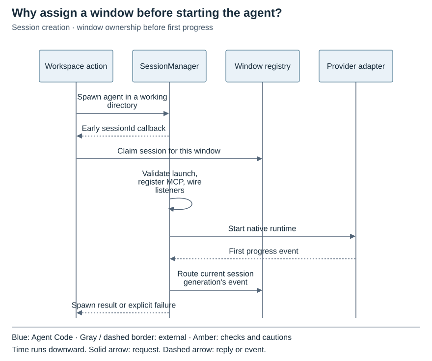](docs/architecture/diagrams/session-spawn.svg)

<details>
<summary>Mermaid source</summary>

```text
sequenceDiagram
    participant UI as Workspace action
    participant SM as SessionManager
    participant Owner as Window registry
    participant MCP as MCP host
    participant Adapter as Provider adapter
    UI->>SM: Spawn requested kind, runtime, cwd
    SM-->>UI: Early allocated sessionId callback
    UI->>Owner: Claim session for requesting window
    SM->>SM: Validate cwd, reserve generation, resolve executable
    SM->>MCP: Register session and enabled domains
    SM->>Adapter: Construct and wire fenced listeners
    SM->>Adapter: start()
    Adapter-->>SM: Process, transcript, readiness and semantic observations
    SM->>Owner: Route only current-entry observations
    SM-->>UI: Spawn result or explicit failure
```

</details>

#### 6.3.2 Recovery and replacement

Recovery can retain an application `sessionId` while replacing a missing backend. It must distinguish an already live backend, an in-flight recovery, a resumable native identity, and an unusable session. Recovery tokens and generation checks prevent an obsolete request from reclaiming a newer session.

Codex adds a native-rollout ownership transaction. Two active processes must not independently own the same native conversation file. Replacement coordinates predecessor and successor, retains compensation information, and waits for workspace persistence acknowledgement before committing the application handoff. Failure before commit may restore the predecessor; persisted redirection prevents later recovery from reviving the wrong side of a completed replacement.

These mechanics live in [SessionManager](src/main/sessionManager.ts), [Codex replacement ledger](src/main/sessions/codexReplacementLedger.ts), and [session contracts](src/shared/types/session.ts). They are lifecycle authority, not a UI optimization.

#### 6.3.3 Several kinds of readiness

The backend snapshot has lifecycle and input-readiness fields. Renderer runtime state additionally tracks process status, transcript status, stream phase and user-facing session status. Examples:

- A process can have started while replay is still arriving and input is not ready.
- A transcript can remain visible after process exit.
- A live process can be blocked by a permission or question condition.
- A turn can be complete while tool-result bookkeeping or a condition still affects the view.
- A restored pane can have no backend by design.

Do not derive all of these states from a single “busy” boolean. Each answers a different question and receives evidence from a different channel.

### 6.4 Prompt delivery and conditions

#### 6.4.1 A prompt is a transaction

There are three separate states: text in Agent Code's composer, text staged in a native provider's composer, and a prompt accepted for execution. The application cannot safely equate them. Retrying after an uncertain write can run the same instruction twice.

`SessionManager.deliverPromptToAgent` reserves delivery for one session. Competing structured deliveries and conflicting raw staged submissions are rejected while that reservation is active. The delivery closure checks the same live registry entry before delayed writes, so a readiness wait cannot accidentally send to a successor process.

The result reports success evidence or a failure stage, a retry-safety decision, and whether prompt/Enter bytes may have been written. A thrown write is conservatively treated as potentially effective. The result is not flattened into “send failed, try again.”

<!-- architecture-diagram: prompt-delivery -->

[](docs/architecture/diagrams/prompt-delivery.svg)

<details>
<summary>Mermaid source</summary>

```text
sequenceDiagram
    participant Composer as Composer or authorized caller
    participant Manager as SessionManager
    participant Delivery as Provider delivery implementation
    participant Native as Native runtime
    Composer->>Manager: deliverPromptToAgent(text, options)
    Manager->>Manager: Reserve current live session entry
    alt Another delivery owns the session
        Manager-->>Composer: Rejected, retry-safe before writes
    else Reservation granted
        Manager->>Delivery: Deliver with fenced write functions
        Delivery->>Native: Establish provider-specific readiness
        Delivery->>Native: Write or submit prompt
        Native-->>Delivery: Acceptance evidence or uncertainty
        Delivery-->>Manager: Result with disposition and write state
        Manager->>Manager: Release reservation
        Manager-->>Composer: Preserve evidence in result
    end
```

</details>

#### 6.4.2 Provider-specific acceptance

| Provider path | Positive evidence | Failure implications |
| --- | --- | --- |
| Claude rendered composer | Durable acceptance observation armed before writing, following verified composer absorption | Rollback can make some absorption failures retry-safe; uncertain execution is not retry-safe |
| Codex rendered composer | Successful delivery through the validated PTY input profile | Transport acceptance does not prove that a rollout already contains the user record |
| Structured OpenCode | Successful structured prompt transport | An HTTP failure after submission can be uncertain; it is not automatically safe to repeat |
| Native terminal input | Bytes forwarded to a terminal | Raw keyboard/paste transport is not the structured prompt transaction |

Claude arms its acceptance cursor before any prompt bytes. It checks readiness and native-composer occupancy, captures an absorption baseline, writes the prompt, observes absorption, then sends Enter separately. Combining paste and Enter in one write was unreliable for the supported Claude input behavior. Acceptance is tied to durable user/queue evidence after the armed cursor, not merely the screen becoming blank.

The implementation uses an absolute overall deadline so nested waits cannot each consume a full independent timeout. At this revision the Claude transaction has a 28-second overall budget, with readiness, absorption and acceptance sub-budgets clipped to remaining time. On absorption failure, bounded rollback is attempted while the reservation remains held. Only evidence that the staged input has been cleared can justify the corresponding retry-safe result.

Codex readiness and atomic paste/Enter behavior follow its attested profile. OpenCode uses its structured delivery capability. Callers must inspect the returned acceptance kind rather than silently upgrading transport delivery into durable acceptance.

Sources: [Claude delivery](src/providers/claude/runtime/promptDelivery.ts), [Codex delivery](src/providers/codex/runtime/promptDelivery.ts), [OpenCode delivery](src/providers/opencode/runtime/promptDelivery.ts), [manager admission](src/main/sessionManager.ts).

#### 6.4.3 Drafts, optimistic rows and queued input

The renderer retains local drafts and images independently from native input. Features such as rewind and template insertion can intentionally prefill a draft without executing it. Optimistic submitted rows provide immediate feedback but do not become native history. The rendering ledger reconciles them with durable evidence.

Claude's native queued messages are another plane of state. A queued prompt can be accepted into a provider queue without beginning the next visible assistant turn immediately. Queue rows, local optimistic submissions, and committed user entries require explicit ownership rules to avoid displaying the same prompt several times or hiding a prompt that has not yet committed.

Wake-before-delivery combines two operations: recovering a hibernated backend and then delivering to the resulting current session. Success at waking is not success at submitting. This distinction also applies to management MCP calls that can wake an agent to send it a prompt.

#### 6.4.4 Conditions are capabilities offered by the current session

Provider conditions include permission prompts, questions, errors, and other actionable native states. They are represented separately from assistant prose and input-readiness state. A reply must address an offered action in the current condition snapshot; it is not an unrestricted write API disguised as a permission reply.

Some conditions resolve through native PTY actions, others through structured provider methods. Main validates the action and session state. Renderer dismissal affects presentation, not necessarily the native provider's blocking state. Remote replies use the same current-condition constraint, including exact offered PTY action identity/data where applicable.

Sources: [condition contracts](src/shared/types/providerConditions.ts), [main condition control](src/main/sessions/conditionControl.ts), [workspace condition UI](src/renderer/src/workspace/conditions).

### 6.5 History and transcript transformations

#### 6.5.1 Native history loading

Claude and Codex history is read from provider-native files. Exact resolution matters: directory recency is not sufficient to select a conversation. A missing selected Claude transcript is an error, not a successful empty history.

The history loader reads backward from EOF in 256 KiB chunks to obtain a suffix without parsing the entire file. The initial count of durable entries can still require a broader newline scan; “tail loading” does not mean the first request is constant-time in all file sizes.

Older pages carry byte-offset and entry-marker evidence. A supplied offset must correspond to the expected marker; duplicate markers or a changed file can invalidate a naive cursor. The loader has a fallback search rather than endlessly returning the same page. Offsets remain associated with raw records across mapping.

Transcript inspection for MCP/control is a separate bounded projection service. It supports read/inspect/search with item and character limits instead of returning arbitrarily large raw files. OpenCode uses its native API/export boundary and is not made into an arbitrary local JSONL path by its URI.

Sources: [history loader](src/main/sessions/historyLoader.ts), [transcript reader](src/main/agentTranscripts/AgentTranscriptReader.ts), [provider transcript resolution](src/providers/registry.main.ts).

#### 6.5.2 A neutral conversation model

Provider switch, duplicate and rewind share a transcript engine. Each native provider has an adapter for reading and writing its format. The parser package decodes into a neutral `ConversationDocument`, applies operations and target projection, then writes a provider-native artifact.

<!-- architecture-diagram: transcript-projection -->

[](docs/architecture/diagrams/transcript-projection.svg)

<details>
<summary>Mermaid source</summary>

```text
flowchart TB
    Claude[Claude native transcript] --> Decode[Provider decoder]
    Codex[Codex rollout] --> Decode
    OpenCode[OpenCode native export] --> Decode
    Decode --> Document[ConversationDocument]
    Document --> Operations[Switch / duplicate / rewind / context planning]
    Operations --> Project[Target native projection]
    Project --> COut[Claude native artifact]
    Project --> XOut[Codex native artifact]
    Project --> OOut[OpenCode native import]
    Project --> Report[Loss, repair and validation report]
```

</details>

This avoids a separate converter for every ordered provider pair. It does not eliminate provider differences. Archive preservation can retain opaque provenance that a native resume target cannot safely execute. A successful archival round trip is weaker evidence than verified native resume compatibility.

Native projection is constrained by provider profiles and tested evidence. Unsupported or repaired content is reported. Codex encrypted compaction state cannot simply be transplanted as a portable summary. A Claude compaction boundary is not a summary until its durable summary carrier exists. Provider API failures are not rewritten as assistant speech to make a transcript appear complete.

Sources: [transcript engine](src/main/providerSwitch/transcriptEngine.ts), [parser package](https://github.com/Juliusolsson05/agent-transcript-parser/tree/9c99db00f9cf0097c87271d04fd3e3ebf9f1e894), [switch implementation](src/main/providerSwitch/switchProvider.ts).

#### 6.5.3 Provider switching

Switch planning reads and validates the source before writing a target. It resolves target model/context metadata, determines whether existing history fits, and produces a native resume projection. The default policy does not spend a source-provider turn and does not automatically compact after arrival.

Context estimation is not an exact tokenizer guarantee. The planner uses target metadata consistently for budgeting and native projection, including configured model/context information when available. If truncation is allowed, the reduction ladder favors a portable summary, removes unreadable compaction carriers, replaces oversized old tool output with explicit placeholders, shortens supported string fields while preserving structure, and finally drops whole oldest turns with reported loss. It refuses a projection when the retained history cannot meet the selected policy.

<!-- architecture-diagram: provider-switch -->

[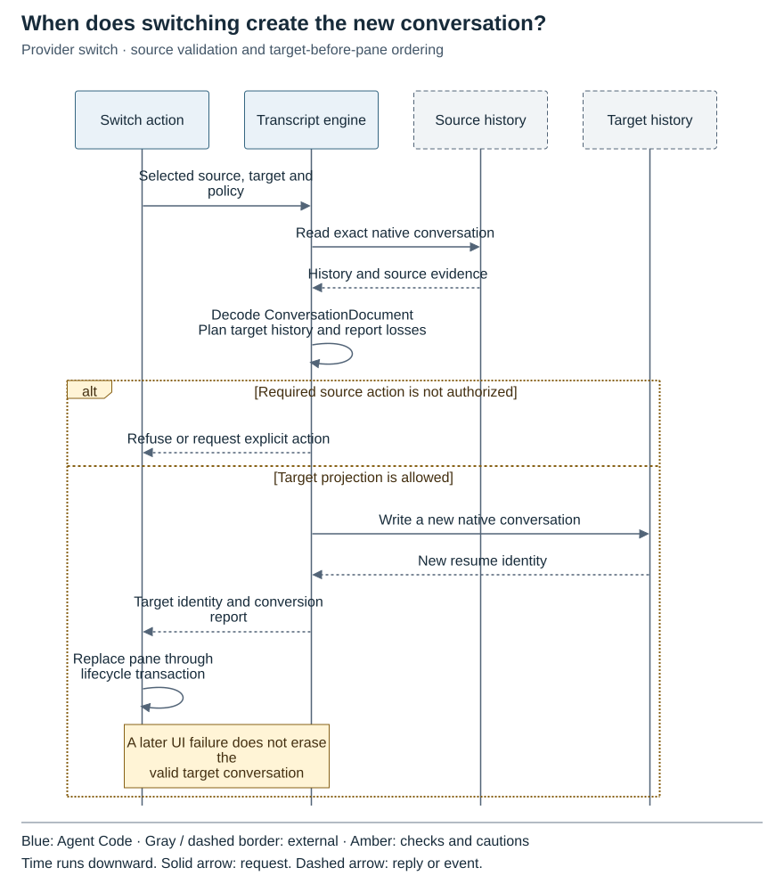](docs/architecture/diagrams/provider-switch.svg)

<details>
<summary>Mermaid source</summary>

```text
sequenceDiagram
    participant UI as Switch action
    participant Engine as Transcript engine
    participant Source as Source adapter
    participant Planner as Context planner
    participant Target as Target adapter
    participant Workspace
    UI->>Engine: Source identity, target provider and policy
    Engine->>Source: Read exact native conversation
    Source-->>Engine: Decoded conversation and provenance
    Engine->>Planner: Plan target history and report losses
    alt Source action required but not authorized
        Planner-->>UI: Explicit required action / refusal
    else Projection admitted
        Engine->>Target: Project and write new native identity
        Target-->>Engine: Native resume locator
        Engine-->>UI: Target artifact and report
        UI->>Workspace: Replace pane through lifecycle transaction
        Note over Target,Workspace: A later UI failure does not erase a valid target artifact
    end
```

</details>

Opt-in source compaction/handoff uses an actual source-provider turn and waits for durable evidence. It is not a screen-only operation. Optional Claude compaction after arrival is a separate step on the newly created session; its failure does not retroactively invalidate an already successful provider switch.

Source operations are serialized using native/application identity locks. An empty semantic source can return an explicit source-empty result so the renderer can create a fresh target session without pretending to transfer meaningful conversation history.

#### 6.5.4 Duplicate and rewind

Duplicate projects a new native identity. It does not give two active sessions permission to write the same native conversation. Rewind addresses a particular user prompt using stable source evidence, validates the source still matches, retains the conversation before that prompt, and returns the removed prompt/images as a draft. All required validation and projection precede the new artifact write.

This is a conversation-history operation, not an automatic rollback of project files or Git state. A native agent may already have changed files after the chosen prompt. Documentation and UI must not imply those effects are undone merely because the next conversation begins from earlier context.

Sources: [provider-switch module](src/main/providerSwitch), [parser operations](https://github.com/Juliusolsson05/agent-transcript-parser/tree/9c99db00f9cf0097c87271d04fd3e3ebf9f1e894/src), [workspace actions](src/renderer/src/workspace/hook/actions).

### 6.6 Terminal surfaces and tmux

Ordinary shell terminals and agent-native terminal views share xterm-based rendering but have different backend ownership. An ordinary terminal is a workspace session backed by a direct PTY or tmux. An agent terminal view attaches to the already managed provider PTY; changing the view must not spawn a second agent.

Raw byte dispatch is centralized so mounting another UI consumer does not create competing global IPC subscriptions. Agent PTY attachments have owner/size coordination and retained capped output for attachment continuity. The visible terminal owner controls size; a hidden duplicate view must not resize the native application to its own dimensions.

<!-- architecture-diagram: terminal-attachment -->

[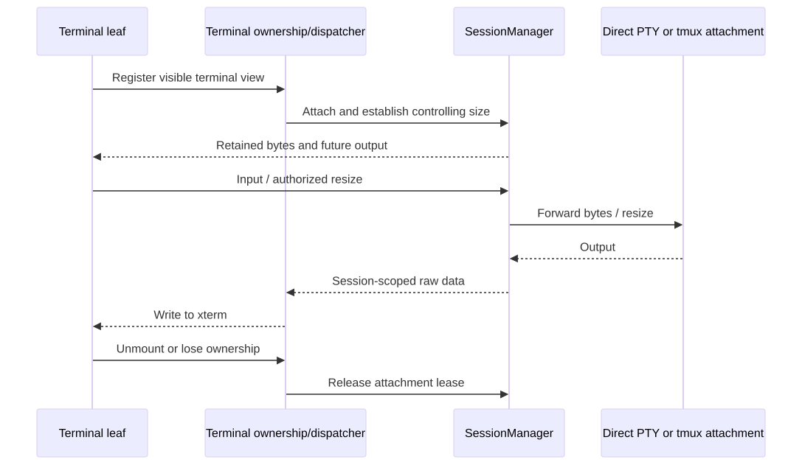](docs/architecture/diagrams/terminal-attachment.svg)

<details>
<summary>Mermaid source</summary>

```text
sequenceDiagram
    participant View as Terminal leaf
    participant Ownership as Terminal ownership/dispatcher
    participant SM as SessionManager
    participant PTY as Direct PTY or tmux attachment
    View->>Ownership: Register visible terminal view
    Ownership->>SM: Attach and establish controlling size
    SM-->>View: Retained bytes and future output
    View->>SM: Input / authorized resize
    SM->>PTY: Forward bytes / resize
    PTY-->>SM: Output
    SM-->>Ownership: Session-scoped raw data
    Ownership-->>View: Write to xterm
    View->>Ownership: Unmount or lose ownership
    Ownership->>SM: Release attachment lease
```

</details>

#### 6.6.1 Persistence scope

The application uses its bundled tmux through a dedicated registry. It does not opportunistically attach to a user's unrelated system tmux sessions. Managed names/prefixes constrain reconciliation and cleanup. If bundled tmux is unavailable, ordinary terminals fall back to direct PTY and lose that process-persistence capability.

Reconciliation compares persisted terminal references with managed live sessions: known/live sessions are recoverable, known/dead sessions are lost, and unreferenced managed sessions are treated as orphans and killed. This policy makes the correctness of the persisted-reference reader critical.

**Current integration discrepancy:** main startup reads `parsed.workspace.sessions` to obtain tmux references, but `WorkspaceFileStore` writes the version-2 `windows[].workspace` envelope. For a normal v2 file that legacy read yields no references. With managed tmux sessions present, reconciliation can classify them as orphans. The persistence intention and the current multi-window startup behavior therefore differ; this reference does not claim reliable tmux survival across that path.

The mismatch is directly visible in [startup reconciliation](src/main/index.ts), [workspace format](src/main/storage/workspaceFile.ts), and [tmux reconciliation](src/main/tmux/tmuxRecovery.ts), and tracked in [issue #898](https://github.com/Juliusolsson05/agent-code/issues/898). No runtime change is part of this documentation work.

#### 6.6.2 xterm lifecycle and patched dependency

WebGL renderer creation and disposal follow terminal visibility/lifetime so hidden panes do not indefinitely retain GPU contexts. Renderer fallback and context-loss behavior belong in the centralized xterm renderer helper.

At this revision, the pinned xterm core also requires a local patch to remove a resize-time queued-write flush that can replay/drop terminal writes. The patch is enforced both after installation and whenever the Electron Vite configuration loads. Version or bundle-shape mismatch aborts the build. Vite prebundling is disabled for xterm so a stale optimized copy cannot bypass the patched installed bundle during development.

Sources: [tmux registry](src/main/tmux/TmuxRegistry.ts), [terminal dispatcher](src/renderer/src/workspace/terminal/sessionDataDispatcher.ts), [WebGL lifecycle](src/renderer/src/workspace/terminal/xtermWebglRenderer.ts), [xterm patch](scripts/patch-xterm.mjs), [build configuration](electron.vite.config.ts).

## 7. Deployment view

### 7.1 Processes and deployment

The desktop uses one main process and one renderer per application window. Optional services create additional processes. They have different lifetimes and termination contracts.

| Process or resource | Owner | Lifetime |
| --- | --- | --- |
| Electron main | OS/application lifecycle | Application run |
| Window renderer and preload | `BrowserWindow` / window registry | Window or renderer generation |
| Claude/Codex interactive process | Provider session via `SessionManager` | One backend attempt |
| Structured OpenCode service | OpenCode headless runtime through adapter | Managed runtime/session lifetime |
| Native OpenCode terminal process | `OpencodeTerminalSession` | One PTY-backed attempt |
| Ordinary shell | Direct PTY or managed tmux session | Terminal session; tmux may outlive attachment |
| Claude mitmproxy process | Claude adapter/proxy resource owner | Optional per-session proxy lifetime |
| Codex Responses proxy | Codex runtime | Optional local server lifetime |
| Workflow worker | `WorkflowService` through Electron launcher | Workflow execution attempt |
| Workflow provider host and Codex descendants | Workflow provider launcher | One provider attempt with confirmed termination |
| Language server | `LspManager` | Shared workspace-root/server lease lifetime |
| Cloudflared | Tunnel transport | Remote tunnel enablement |
| Native dictation hotkey helper | Dictation hotkey service | Only while a binding requires it |
| `caffeinate` | `CaffeinateController` | Enabled keep-awake lifetime on macOS |

<!-- architecture-diagram: process-deployment -->

[](docs/architecture/diagrams/process-deployment.svg)

<details>
<summary>Mermaid source</summary>

```text
flowchart LR
    subgraph Host[User machine]
        subgraph Electron[Agent Code application]
            Main[Main process]
            R1[Window A renderer and preload]
            R2[Window B renderer and preload]
            Worker[Workflow utility process]
            Main <-->|Electron IPC| R1
            Main <-->|Electron IPC| R2
            Main <-->|worker protocol| Worker
        end
        Main --> PTYs[Native provider and shell PTYs]
        Main --> OpenCode[OpenCode HTTP service]
        Main --> LSP[Language server subprocesses]
        Main --> ProviderHost[Workflow provider host]
        ProviderHost --> Codex[Codex SDK CLI child]
        Main --> NativeTools[tmux / mitmproxy / cloudflared / helper]
        Main --> AppFiles[Application state and journals]
        PTYs --> ProviderFiles[Provider-owned conversation files]
    end
    Browser[Remote device browser] <-->|LAN or tunnel| Main
    PTYs --> Internet[Provider services]
    OpenCode --> Internet
    Codex --> Internet
```

</details>

This is a macOS-first delivery system. Packaging produces separate arm64 and x64 application artifacts with a macOS 12 minimum. OS-specific behavior includes Keychain access, Touch ID/user-presence authentication, the native hotkey helper, and `caffeinate`. A portable TypeScript module or Linux compatibility test is not evidence of a shipped Windows or Linux application.

Windows use `contextIsolation: true` and `nodeIntegration: false`, but explicitly set `sandbox: false`. The security boundary is therefore the selected preload API and main-process validation, not a claim that all Electron renderers run with Chromium sandboxing enabled. External navigation is intercepted and new-window requests are denied before approved destinations are opened externally. See [window construction](src/main/window/appWindow.ts) and [packaging](electron-builder.yml).

### 7.2 Toolchain and bundles

The repository declares Node `>=22.12.0`; `.nvmrc` and the main CI lane select Node 24. The application itself runs the Node/Chromium versions supplied by its packaged Electron, not whichever `node` happens to be on the user's shell path.

The current manifest uses Electron 43, React 18, Zustand 5, Monaco 0.52, Tailwind 4, Electron Vite 5/Vite 7, native `node-pty`, and a pinned xterm beta with the patch described earlier. MCP uses the TypeScript SDK; workflow Codex execution uses the pinned Codex SDK. Exact resolved dependency versions belong to `package-lock.json`, while package submodule revisions belong to Git's gitlinks.

<!-- architecture-diagram: build-pipeline -->

[](docs/architecture/diagrams/build-pipeline.svg)

<details>
<summary>Mermaid source</summary>

```text
flowchart TB
    Source[Application TypeScript and renderer assets] --> Check[Verify initialized submodules]
    Packages[Pinned package source] --> Check
    Check --> WFBuild[Build workflow package]
    WFBuild --> Browser[Build remote browser client]
    Browser --> Vite[Electron Vite build with xterm patch gate]
    Vite --> Main[Main plus workflow worker/provider-host entries]
    Vite --> Preload[Preload bundle]
    Vite --> Renderer[Renderer bundle]
    Main --> Resources[Copy runtime resources and build hotkey helper]
    Preload --> Package[Electron Builder packaging]
    Renderer --> Package
    Resources --> Package
    Native[Verified native artifacts for each architecture] --> Package
    Package --> Verify[Structural verification and smoke checks]
    Verify --> Release[Signed/notarized macOS DMG and ZIP]
```

</details>

The main build has separate entry files for workflow workers and provider hosts because process launchers need real modules on disk. Build provenance is injected once during bundling; failure to query Git produces an unknown value rather than breaking the product build.

Some dependencies remain external to avoid bundler interop problems. For example, `ws` is resolved in Node for speech streaming, and workflow parser/schema dependencies retain their normal runtime entry points. Browser sharing is controlled by explicit aliases rather than assuming every main dependency can be tree-shaken into safe renderer code.

Sources: [package manifest](package.json), [lockfile](package-lock.json), [Electron Vite configuration](electron.vite.config.ts), [remote build](src/remote-client/vite.config.ts).

### 7.3 Native artifacts and packaging

`third_party/mitmproxy`, `third_party/tmux` and `third_party/cloudflared` contain manifests, documentation and licenses. Fetch/verify scripts select architecture-specific artifacts and validate checksums against the pinned manifests. Cache/build directories hold downloaded or prepared binaries locally; binaries are not committed.

The runtime resolver is the Electron-aware owner of packaged resource locations and lazy extraction. Reusable packages receive a resolved executable path. Extraction is serialized per version, and a real execution probe distinguishes an executable mode bit from a kernel refusal such as a `noexec` mount. Individual callers define their fallback policy; tmux's application integration does not simply inherit every generic resolver fallback.

Electron Builder packages application output in ASAR while explicitly unpacking native Node modules and executable/runtime resources. `node-pty` is rebuilt for each target architecture. Unused per-platform Codex SDK binaries are excluded because setup resolves the application's one intended Codex executable. Source, tests, vendor references, maps and build-only material are excluded according to the packaging rules.

macOS output uses separate thin arm64/x64 DMG and ZIP artifacts. Hardened runtime, entitlements, native helper compilation, signing and notarization belong to the packaging/release path. License notices are copied outside ASAR so they remain accessible in an installed application.

Sources: [runtime manifests](third_party), [fetch/verify scripts](scripts/runtime-tools), [runtime resolver](src/main/setup/runtimeTools.ts), [builder configuration](electron-builder.yml), [packaging script](scripts/package-mac.mjs), [after-pack hook](scripts/after-pack.mjs).

### 7.4 Release and upstream maintenance

The macOS release workflow is manually dispatched and distinguishes building artifacts from publishing a GitHub Release. Publishing validates release identity against `package.json` and requires signing/notarization credentials. The release workflow and normal PR CI are separate lanes; a green unit suite does not prove a signed package can launch its native helpers.

Provider CLIs and pinned headless packages evolve independently from Electron. Upstream-watch/check scripts and package CI workflows help identify compatibility changes. Updating a provider, a headless parser, a transcript projection profile or xterm requires evidence at that boundary rather than only bumping a version string.

Sources: [release workflow](.github/workflows/release.yml), [upstream watch](.github/workflows/upstream-watch.yml), [upstream check script](scripts/check-upstream.mjs), [package verification](scripts/verify-packaged-mac.mjs).

## 8. Crosscutting concepts

Identity, event transport, rendering, persistence and trust apply across several components. Their source-of-truth and failure rules are collected here so a new feature can reuse the existing contract.

### 8.1 Identity and ownership

Several strings called “session IDs” coexist. Treating them as one identifier causes stale event routing, cross-conversation history, or unsafe process replacement.

| Identity | Meaning | Does not establish |
| --- | --- | --- |
| Application `sessionId` | Stable workspace/backend association for a pane's session | A particular OS process or native transcript |
| `sessionRunId` | A particular backend run/attempt | Durable workspace placement |
| Native provider session ID | Claude UUID, Codex conversation identity, or OpenCode `ses_...` | Which window currently owns the app session |
| Transcript locator | Exact JSONL/rollout path or OpenCode URI | An authorization to resume or mutate any similarly named file |
| Window ID | Application window ownership and persistence key | A permanent renderer instance |
| Control owner generation | Registration lifetime of a control owner | Continued validity after navigation/reload |
| Agent name ID | User-visible agent identity retained across selected replacements | Native provider identity; duplicates receive a new name identity |
| Workflow run / task / attempt IDs | Durable workflow execution and retry lineage | Interactive pane process identity |
| tmux session name | Managed shell host identity | A native agent conversation |
| MCP bearer token | Authority for one host registration | A portable durable workspace identifier |

<!-- architecture-diagram: identity-ownership -->

[](docs/architecture/diagrams/identity-ownership.svg)

<details>
<summary>Mermaid source</summary>

```text
classDiagram
    class WorkspaceState {
        tabs
        sessions
        detachedSessions
        buried
        pinnedSessionIds
    }
    class SessionMeta {
        sessionId
        kind
        providerRuntime
        agentNameId
        nativeProviderIdentity
    }
    class SessionManager {
        registry
        spawningGenerations
        recoveries
        promptReservations
    }
    class AgentSession {
        <<interface>>
        start()
        stop()
        write()
        resize()
    }
    class SessionBackendSnapshot {
        sessionId
        sessionRunId
        lifecycle
        inputReadiness
    }
    class WindowRegistry {
        sessionOwnership
        rendererWindows
    }
    WorkspaceState "1" *-- "many" SessionMeta : durable metadata
    SessionManager "1" *-- "many" AgentSession : live resources
    SessionManager --> SessionBackendSnapshot : projects
    SessionMeta ..> SessionBackendSnapshot : joins by sessionId
    WindowRegistry --> SessionMeta : routes session events
```

</details>

Field names such as `nativeProviderIdentity` in this diagram summarize provider-specific metadata; they are not a replacement schema. [Workspace types](src/renderer/src/workspace/types.ts) and [session contracts](src/shared/types/session.ts) define the actual fields.

Ownership has several independent dimensions:

- Main owns live process handles and admission to lifecycle operations.
- A window owns workspace placement and receives its session events.
- The provider owns execution and native history.
- The rendering ledger chooses which observation owns each visible content unit.
- A control registration generation owns the right to answer an invocation.
- A workflow store lease owns durable journal mutation.
- A managed-skill manifest owns only the exact files it can prove it wrote.

An ownership check is useful only at its own boundary. A session existing in renderer state does not prove its process is alive. An authenticated MCP caller does not own every project. A row with matching prose does not prove a matching tool-call identity.

### 8.2 Event transport and backpressure

#### 8.2.1 Observation channels

The manager emits several independent observation families:

| Channel | Meaning | Retention/transport character |
| --- | --- | --- |
| Started / exit | Backend lifecycle edges | Structural events |
| Input readiness | Current input capability with revision/reason | Latest state, fenced by session lifetime |
| Screen | Headless terminal snapshot | Replaceable current observation |
| Process state | Provider/process status | Replaceable current observation |
| JSONL entries and errors | Durable transcript observations | Ordered records, batched for IPC |
| Semantic events | Live turns, blocks, tool input/output and usage | Accumulative updates plus structural barriers |
| Conditions | Current provider conditions/actions | State separate from transcript |
| Native subagents | Derived child activity | Provider-specific producer, shared UI contract |
| Raw terminal bytes | Terminal display/input surface | Separate ordinary-terminal and agent-PTY channels |

[SessionForwarder](src/main/sessions/forwarder.ts) subscribes once in main and routes session events to the owning window. The current fallback for a session without recorded ownership is broadcast; correct early ownership assignment therefore matters. The fallback is not evidence that cross-window session routing is intrinsically isolated in every failure case.

#### 8.2.2 Coalesce values, preserve boundaries

Semantic transports publish running accumulators wherever possible. A newer `textSoFar` for the same block can replace an older value without losing text. Events with only fragments are concatenated. The coalescing key includes session, event type and relevant turn/block/tool identities, preventing sibling streams from overwriting each other.

Structural events cannot be treated as replaceable values. Completion, start, error and other barriers flush preceding buffered work. JSONL forwarding flushes preceding semantic observations before enqueuing the committed record. Session removal drains queues before ownership is released; delayed cleanup avoids misrouting the final exit.

<!-- architecture-diagram: observation-ordering -->

[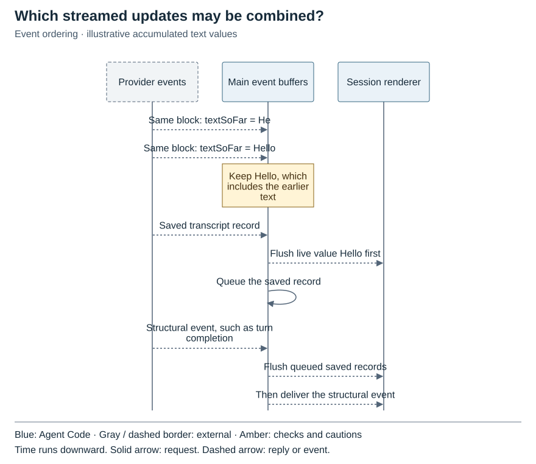](docs/architecture/diagrams/observation-ordering.svg)

<details>
<summary>Mermaid source</summary>

```text
sequenceDiagram
    participant Provider
    participant Manager
    participant Forwarder
    participant Queue as Coalescers
    participant Renderer
    Provider->>Manager: Semantic accumulator A
    Manager->>Forwarder: semantic-event
    Forwarder->>Queue: Retain latest value for identity
    Provider->>Manager: Semantic accumulator B, same identity
    Manager->>Forwarder: semantic-event
    Forwarder->>Queue: Replace A with B
    Provider->>Manager: Committed transcript entry
    Manager->>Forwarder: jsonl-entry
    Forwarder->>Queue: Flush preceding semantic values
    Queue-->>Renderer: Accumulator B
    Forwarder->>Queue: Enqueue ordered JSONL batch
    Provider->>Manager: Structural boundary
    Manager->>Forwarder: Boundary event
    Forwarder->>Queue: Flush pending observations
    Queue-->>Renderer: Ordered batch
    Forwarder-->>Renderer: Boundary event
```

</details>

The actual forwarder has separate JSONL, semantic, screen and process coalescers. They reduce main-to-renderer serialization and IPC work as well as React updates. Coalescing only after arrival would still make Chromium deserialize every intermediate event.

Sources: [semantic backpressure contract](src/shared/sessionFeed/semanticEventBackpressure.ts), [main coalescers](src/main/sessions), [forwarder](src/main/sessions/forwarder.ts).

#### 8.2.3 SessionFeed is deliberately narrower than preload

The shared `SessionFeed` contract supports subscriptions and a limited set of session interactions. Desktop implements it with IPC. The remote browser implements its corresponding behavior over WebSocket. This lets both clients reuse transcript folding and feed rendering without teaching the feed about Electron.

<!-- architecture-diagram: session-feed -->

[](docs/architecture/diagrams/session-feed.svg)

<details>
<summary>Mermaid source</summary>

```text
classDiagram
    class SessionFeed {
        <<interface>>
        observeLifecycle()
        observeTranscript()
        observeSemantic()
        observeConditions()
        sendInput()
        deliverPrompt()
        resolveCondition()
    }
    class IpcSessionFeed
    class RemoteFeed {
        <<conceptual browser adapter>>
    }
    class FakeSessionFeed
    class SessionFeedContext
    SessionFeed <|.. IpcSessionFeed
    SessionFeed <|.. RemoteFeed
    SessionFeed <|.. FakeSessionFeed
    SessionFeedContext --> SessionFeed
```

</details>

The observation method names in the diagram summarize event families. The exact interface is in [SessionFeed](src/shared/sessionFeed/SessionFeed.ts). Spawn, workspace mutation, files, settings, and workflow history are not all routed through this interface. [IpcSessionFeed](src/renderer/src/features/sessionFeed/IpcSessionFeed.ts) and the [remote client](src/remote-client/src) implement their allowed subsets explicitly.

### 8.3 Conversation rendering and ownership

#### 8.3.1 Why an ownership ledger exists

An assistant message can be observed live, retained as semantic history, committed into a provider transcript, and temporarily preserved as a ghost. A user's prompt can exist as a local optimistic row, a native queue entry and a committed message. Rendering each array independently duplicates content. Picking whichever array is newest can instead lose tool results or hide content after a stream ends.

The renderer converts these observations into candidates, decides ownership, orders selected content, and then resolves provider-specific paint behavior. The ledger records both selected and suppressed decisions with reasons/evidence. It is the active feed path; the old rendering feature flag is not a supported alternate implementation.

<!-- architecture-diagram: rendering-pipeline -->

[](docs/architecture/diagrams/rendering-pipeline.svg)

<details>
<summary>Mermaid source</summary>

```text
flowchart TB
    Committed[Committed entries] --> Collect[collectLedgerInput]
    Current[Current semantic turn] --> Collect
    History[Semantic history] --> Collect
    Ghosts[Semantic-derived ghosts] --> Collect
    Local[Optimistic submissions and queues] --> Collect
    Work[Work and condition state] --> Collect
    Collect --> Candidates[Typed candidates with identities]
    Candidates --> Ownership[Ownership ledger]
    Ownership --> Decisions[Selected and suppressed decisions]
    Decisions --> Order[Deterministic order]
    Order --> Bridge[Ledger-to-feed view bridge]
    Bridge --> Resolve[Provider operation decisions]
    Resolve --> Feed[Feed rows]
    Decisions --> Evidence[Debug and replay evidence]
```

</details>

#### 8.3.2 Candidate identities and evidence

The model distinguishes content owner from observation plane. Owners include committed, current/history semantic, ghost fallback, local submit, queue, work, condition, empty and unknown. Planes describe where the observation came from. Neither label alone establishes ordering or identity.

Candidates carry native message/item/turn identities where available, tool-use/call/result identities, content unit type, source timestamps and stable sequence evidence. Producer timestamps are preferable to local receipt timestamps when trustworthy. Array index is not a durable identity across history prepend, trimming or replay.

<!-- architecture-diagram: rendering-ownership-model -->

[](docs/architecture/diagrams/rendering-ownership-model.svg)

<details>
<summary>Mermaid source</summary>

```text
classDiagram
    class LedgerInput {
        committedCandidates
        semanticCandidates
        ghostCandidates
        localCandidates
    }
    class Candidate {
        owner
        plane
        contentType
        nativeIdentities
        timestampEvidence
        sequence
    }
    class OwnershipDecision {
        selected
        reason
        suppressingOwner
        evidence
    }
    class Ledger {
        rows
        decisions
        unknowns
    }
    class ProviderOperationDecision {
        render
        fallback
        absorb
    }
    LedgerInput *-- Candidate
    Candidate --> OwnershipDecision
    Ledger *-- OwnershipDecision
    Ledger --> ProviderOperationDecision : view bridge correlates tools
```

</details>

These are selected conceptual fields over the concrete types in [rendering model types](src/renderer/src/rendering/model/types.ts).

#### 8.3.3 Committed/live reconciliation

Committed evidence is admitted first. Matching committed ownership suppresses semantic or fallback candidates for the same content unit. Exact native identities carry more meaning than text similarity. Text matching is exact or normalized whole-text matching, not an arbitrary prefix/fuzzy test that could merge two similar responses.

Provider differences remain explicit. Claude can suppress a completed semantic-history turn through a durable message identity, while its current live turn still needs unit-level handling. Codex and OpenCode require finer unit ownership. Tool use, tool input and tool results cannot be collapsed simply because they occur in one assistant turn.

Some Claude historical tool observations are suppressed only with specific operation types and later committed evidence. This is a constrained reconciliation rule, not a general instruction to discard unresolved tools. Unknown shapes are retained as explicit unknown evidence rather than silently assumed to be ordinary text.

Sources: [candidate collection](src/renderer/src/rendering/adapter/collectLedgerInput.ts), [ledger](src/renderer/src/rendering/model/ledger.ts), [ownership rules](src/renderer/src/rendering/model/ownership.ts), [ordering](src/renderer/src/rendering/model/order.ts).

#### 8.3.4 Ghosts are fallback evidence

Current ghosts are derived from semantic blocks and encoded into transcript-compatible shapes. They are not terminal-screen OCR or scraped assistant prose. Tool-result outputs and unknown semantic blocks do not automatically become ghosts.

A ghost is eligible only if it remains unsuperseded, is sufficiently orphaned from its producing live state, has no semantic owner, passes committed-tail timing checks where a tail exists, and passes the sidecar-noise rule. The current orphan grace is 30 seconds. A missing committed tail relaxes the time comparison, not every other guard. Short assistant-only sidecar candidates are constrained to avoid resurrecting incidental text as the main answer.

When durable identities arrive, supersession uses native message/item/tool evidence. Ghost journals provide forensic continuity but are not the provider's conversation store. Older comments and design notes discuss a different ghost cutover; the current source is [ghost generation](src/renderer/src/session-runtime/ghosts.ts) and [eligibility predicate](src/renderer/src/rendering/model/ghostPredicate.ts).

#### 8.3.5 Provider operation rendering

Provider configuration maps raw committed records into shared entries and supplies semantic folding policy, conditions, and render decisions. Some mappers are stateful. In particular, a Codex live mapper's turn cursor belongs to one ingestion stream; history, preview and independent replay need fresh mapper instances.

Operation rendering has three explicit results: render a specialized operation, use a fallback, or absorb an entry into another operation with ownership evidence. Tool-use and tool-result correlation can prove that a ledger row produces no independent paint. The view bridge and mounted rows share the same operation resolver, avoiding one rule for “visible count” and another for actual rendering.

Shared operation protocols cover code edits, commands, discovery, Git/test output, media, structured output, MCP content, orchestration, AI workspace and workflow results. Provider adapters decide when native evidence conforms to those protocols. A tool name alone is insufficient to claim a specialized result shape.

Sources: [provider renderer implementations](src/providers), [shared render protocols](src/providers/shared/renderer/protocols), [ledger feed hook](src/renderer/src/features/feed/ledger/useLedgerFeedItems.ts), [Feed](src/renderer/src/features/feed/ui/Feed.tsx).

#### 8.3.6 Stream phase is not process lifecycle

<!-- architecture-diagram: stream-phase -->

[](docs/architecture/diagrams/stream-phase.svg)

<details>
<summary>Mermaid source</summary>

```text
stateDiagram-v2
    [*] --> Idle
    Idle --> Submitting: Local submission
    Submitting --> Requesting: Provider request begins
    Submitting --> Responding: Turn starts
    Requesting --> Responding: Turn starts or semantic response
    Responding --> AwaitingTools: Tool execution pending
    AwaitingTools --> Requesting: Tool result permits next request
    Responding --> Idle: Completion with no pending tools
    AwaitingTools --> Idle: Completion and pending tools resolved
```

</details>

This conceptual phase view explains the busy/work indicator. Actual folding also handles provider phase events and partial ordering. A completion event cannot force idle while tracked tools remain pending. See [stream phase machine](src/renderer/src/session-runtime/semantic/streamPhaseMachine.ts).

#### 8.3.7 Memory and DOM are bounded separately

The live entry window targets 2,000 entries or an estimated 32 MiB, then trims toward 1,500 entries / 24 MiB. These are soft targets: current content, pairing and identity invariants take precedence. Explicitly loaded older history receives a grace period, and total durable entry count is separate from in-memory count. Trimming also has to preserve enough identity state to prevent live replay from immediately reintroducing removed entries while still allowing explicit history pagination.

The feed eagerly mounts its last 30 rows. Earlier rows mount through `IntersectionObserver` with lookahead; distant historical rows can unmount again while preserving measured height. This limits Markdown parsing, code highlighting and retained DOM independently of transcript data. Bootstrap replay temporarily suspends lazy observation to avoid mounting a large history burst while scroll position is being restored.

Neither mechanism proves a hard total renderer heap limit. Provider caches, indices, semantic state, editors and debug capture have their own lifetimes. Sources: [live entry window](src/renderer/src/session-runtime/liveEntryWindow.ts), [lazy row mounting](src/renderer/src/features/feed/ui/rows/LazyEntry.tsx).

### 8.4 Persistence and recovery guarantees

#### 8.4.1 There is more than one storage root

`STATE_DIR` resolves to `~/.config/agent-code` in the implementation, including on macOS. It is not computed from `XDG_CONFIG_HOME`. Electron `userData` remains a separate root for workflows and historical journals, while Chromium storage holds selected UI preferences. Native providers retain their own conversation and authentication stores.

<!-- architecture-diagram: storage-roots -->

[](docs/architecture/diagrams/storage-roots.svg)

<details>
<summary>Mermaid source</summary>

```text
flowchart LR
    Main[Main services] --> State[HOME/.config/agent-code]
    State --> Workspace[workspace.json and main-owned settings]
    State --> Managed[Managed skill state and snapshots]
    State --> Secrets[Remote credentials and encrypted key blobs]
    State --> Debug[Incidents, recordings and debug artifacts]
    Main --> UserData[Electron userData]
    UserData --> Workflows[Workflow store and isolated Codex home]
    UserData --> Journals[Historical ghost/dictation/paste journals]
    Renderer[Window renderer] --> Browser[Chromium localStorage]
    Browser --> Preferences[Settings and editor path/geometry preferences]
    Native[Native provider runtimes] --> NativeHistory[Provider history and authentication stores]
    Editor[Editor and native tools] --> Projects[Actual project files]
```

</details>

| Artifact | Location / owner | Meaning and recovery behavior |
| --- | --- | --- |
| Workspace envelope | `STATE_DIR/workspace.json` | Versioned window geometry and renderer workspace slices; invalid/future format can disable saves |
| Process lock | `STATE_DIR/agent-code.process-lock.json` | Coordinates writers to shared app state; records owner identity, not a conversation lock |
| Toolchain setup | `STATE_DIR/setup.json` | Resolved tool configuration/cache; executable reality is revalidated |
| Managed skills | `STATE_DIR/conventions.json` | Desired state, revisions and materialization ownership journal |
| Imported skill bytes | `STATE_DIR/managed-skill-snapshots/` | Content-addressed package snapshots used for exact materialization |
| AI Workspace | `STATE_DIR/ai-workspaces.json` | File-reference collections, not file-content backups |
| Agent names | `STATE_DIR/agent-names.json` | Application-visible identity metadata |
| Worktree index | `STATE_DIR/worktree-activity-index.json` | Derived historical activity, with bounded in-memory caching |
| Desktop dictation key | `STATE_DIR/dictation/deepgram-api-key.bin` | safeStorage-encrypted provider key; environment can override |
| Dictation history | `STATE_DIR/dictation/history.json` | Text/history metadata separate from raw audio |
| Vault | `STATE_DIR/key-vault/index.json` and `keys/<id>.bin` | Plaintext metadata plus independently encrypted secret blobs |
| Remote state | `STATE_DIR/remote/secret` and device registry | Private signing secret and paired-device authority |
| External operator settings | `STATE_DIR/external-control.json` | Desired enablement, port and private bearer token |
| Control history | `STATE_DIR/control-history/` | Invocation receipts, results and task/history records |
| Workflow state | Electron `userData/workflows/` | Run source, manifests, events, results, approval state and isolated Codex home |
| Ghost journals | Normally Electron `userData/ghost-logs/` | Provisional rendering evidence; helper can fall back to `STATE_DIR` when userData is unavailable |
| Dictation/paste journals | Historical Electron userData debug roots | Interaction diagnostics, distinct from settings and provider history |
| Renderer settings | Chromium localStorage through Zustand persistence | Versioned/coerced settings subset |
| Global editor persistence | Chromium localStorage | Open paths and geometry, excluding unsaved file text |
| Native transcripts | Provider-owned locations | Authoritative native conversation history; OpenCode accessed through native interfaces |
| Project files | User-selected working directories/attached paths | Real source files edited by the editor and native agents |

The path catalog is anchored in [storage paths](src/main/storage/paths.ts), [main composition](src/main/index.ts), and the individual store implementations. A complete backup cannot be defined as copying `workspace.json` alone: it holds native identity hints, not all transcripts, workflow artifacts or project files.

#### 8.4.2 Atomic publication is not the same as fsync durability

The application uses several distinct write contracts. Their names and comments sometimes use “durable” broadly; the actual system calls determine the guarantee.

| Store/operation | Publication strategy | Guarantee that should be assumed |
| --- | --- | --- |
| Workspace file | Serialized read-modify-write, unique temp, rename | Readers see a complete published file; no explicit file/directory fsync in this store |
| Editor content | Same-path queue, version checks, synced temporary file, rename or no-clobber publication | Stronger content publication; external-writer and directory-sync limits described in the editor component view |
| Managed-skill operations | Write-ahead ownership state plus exact file/hash checks | Recovery must prove operation ownership before completing/undoing publication |
| Workflow events/results | Store-controlled journal/result ordering, fsync and single-writer lease | Published workflow state is tied to durable event/result evidence |
| Control invocation | Receipt before effect, result after effect | Missing post-effect result can remain uncertain instead of triggering blind replay |
| Vault/settings blobs | Private temporary file and rename | Atomic replacement and restricted access; not a blanket power-loss transaction across all files |
| Diagnostic journals | Bounded queued append/periodic flush | Best-effort evidence with completeness/loss metadata, not transaction authority |

Do not generalize one subsystem's write discipline to every JSON file. Likewise, several files written atomically one at a time do not form a single atomic cross-file transaction.

#### 8.4.3 Process lock and stale ownership

The process lock prevents two application main processes from independently mutating the same shared state tree. It combines an owner token, PID, launch identity and stale-lock handling. A PID that cannot be signaled due to permission is still considered potentially alive. PID reuse is checked with process identity evidence; liveness alone is insufficient after a crash/reboot.

The command-line check is a practical stale-owner discriminator, not a security credential. Release is token-scoped so an old process cannot casually remove a newer owner's lock. Source: [state process lock](src/main/storage/processLock.ts).

#### 8.4.4 Recovery boundaries

| Interruption | What can be recovered | What must not be assumed |
| --- | --- | --- |
| Renderer reload while main survives | Existing backend adoption, persisted layout and current main observations | A new process is required for every saved pane |
| Full application restart | Workspace metadata and native resume identities, durable workflow/control state | Identical OS process IDs or fully retained transient UI state |
| Interactive provider exit | Visible transcript and metadata, possible native resume | The next backend is automatically safe to write the same Codex rollout |
| Missing/corrupt native transcript | Explicit history/recovery failure | A successful empty conversation |
| Workflow interruption | Journal/attempt evidence and policy-controlled resume | Every incomplete task is safe to replay |
| Control owner timeout/reload | Recorded receipt, available result or explicit uncertainty | A timeout proves no mutation occurred |
| File changed by an external editor | Version conflict and retained local dirty buffer | The local buffer silently wins |
| Application crash with unsaved editor text | Reopen saved paths from disk | Unsaved buffer text was backed up |
| Remote socket overflow/disconnect | Reconnect snapshots and bounded history backfill | Every intermediate transient observation was retained |
| Diagnostic queue overflow | Counts/completeness evidence where implemented | Log absence proves event absence |

### 8.5 Diagnostics and resource limits

#### 8.5.1 Always-on incident evidence

`AppRunJournal` records a small application-run spine: identity/provenance, startup and lifecycle milestones, heartbeat, errors, termination evidence and links to larger artifacts. It is separate from optional detailed performance tracing. Electron crash reporting is configured for local capture with upload disabled; Node fatal reports and prior-run classification supply additional crash evidence.

The journal has bounded pending events and a per-run byte cap. Completeness metadata records dropped/retried/capped evidence rather than making a partial log look complete. Renderer heartbeats and early error/rejection hooks help distinguish a renderer stall from an ordinary quiet session.

<!-- architecture-diagram: diagnostics -->

[](docs/architecture/diagrams/diagnostics.svg)

<details>
<summary>Mermaid source</summary>

```text
flowchart LR
    Main[Main lifecycle and services] --> Incident[AppRunJournal]
    Renderer[Renderer errors and heartbeat] --> Incident
    Crash[Crash/fatal reports] --> Prior[Prior-run classification]
    Prior --> Incident
    Perf[Optional spans and samples] --> PerfFiles[Performance run JSONL]
    Pipeline[Session observations and render shapes] --> Recording[Optional session recordings]
    Heap[Heap pressure watchdog] --> Snapshot[Heap snapshot]
    Snapshot --> Incident
    Incident --> Bundle[Debug bundle and local investigation]
    PerfFiles --> Bundle
    Recording --> Replay[Deterministic rendering replay]
    Retention[Retention scheduler] --> Incident
    Retention --> Storage[Prune eligible debug artifacts]
```

</details>

Sources: [AppRunJournal](src/main/incident/AppRunJournal.ts), [incident subsystem](src/main/incident), [renderer entry](src/renderer/src/app/main.tsx).

#### 8.5.2 Performance tracing and heap watchdog

Detailed performance tracing is gated by `AGENT_CODE_PERF=1`. It records local spans/events and periodic resource samples through the application's performance service and OpenTelemetry integration. The presence of OpenTelemetry packages does not imply an always-on remote telemetry exporter.

The main heap watchdog compares used heap against the lower of 1.5 GiB and 70% of the actual V8 limit. It samples more frequently under pressure. A successful snapshot is single-shot per run; failed attempts are bounded and backed off to avoid an ENOSPC-triggered freeze loop.

Polling cannot catch every fast or lower-peak abort. The watchdog does not automatically restart the application, and a heap snapshot can itself pause the process and consume significant disk space. Fatal reports and prior-run classification address some cases where no pre-crash snapshot was possible.

Sources: [performance service](src/main/performance/PerformanceService.ts), [heap watchdog](src/main/performance/heapWatchdog.ts).

#### 8.5.3 Session recordings and rendering evidence

The session recorder captures rendering-pipeline observations into per-recording metadata/event files, with render-shape evidence in a sidecar. It supports deterministic reconstruction and ownership invariants without depending on screenshots alone.

Recorder availability is gated by the development-debug capability. `AGENT_CODE_SESSION_RECORD` controls automatic startup recording, not whether a manually triggered recorder can exist. The constructor path in main is authoritative; the older path comment describing both environment flags as mandatory is stale.

The recorder bounds its queue and bytes, schedules serialization in slices, and records completeness/tombstone state on truncation. Stop coordination waits for the relevant producer/renderer handshake within its policy so late observations are handled deliberately. Replay code must respect recording completeness rather than treating every capture as a full native transcript.

Sources: [SessionRecorderManager](src/main/recording/SessionRecorderManager.ts), [SessionRecorder](src/main/recording/SessionRecorder.ts), [render replay](src/renderer/src/rendering/replay), [render evidence](src/renderer/src/rendering/evidence).

#### 8.5.4 Important bounds at this revision

These values explain operational behavior; they are implementation constants, not tuning recommendations or universal hard memory guarantees.

| Component | Bound/default | What it limits |
| --- | --- | --- |
| App-run journal | 2,000 pending events; 50 MiB per-run journal | Queued/retained incident evidence |
| App-run heartbeat/flush | 5 s / 1 s | Observation and append cadence |
| Performance service | 2,000 pending records; 500 ms flush; 5 s samples | Optional instrumentation overhead |
| Session recorder | 2,000 queued events; 128 MiB event cap; 8 ms serialization slices | Recording memory/disk/main-thread work |
| Live transcript window | Trigger 2,000 entries / 32 MiB estimate; target 1,500 / 24 MiB | Soft retained-entry budget with correctness exemptions |
| Feed DOM | 30 eager tail rows; lazy historical mounting/unmounting | Expensive offscreen DOM and Markdown work |
| Worktree activity hot cache | 1,000 entries | Long-lived in-memory index subset |
| Git execution | Eight global processes | Concurrent read-only Git subprocesses |
| Remote outgoing backlog | 4 MiB | Slow-client socket buffering |
| Remote history count | At most 500 requested entries, plus byte limits | Per-request history transfer |
| Workflow renderer page | 32 events / 512 KiB projection | Per-window workflow transfer |
| External MCP body | 2 MiB | Request parsing and retention surface |
| Heap snapshot retries | Three attempts, 10-minute failure backoff | Repeated expensive failed capture |

Where a limit is a trigger followed by pruning, it can be exceeded transiently or for protected data. Where a transport disconnects on overflow, callers must recover explicitly. Calling both mechanisms “bounded” without their failure behavior would hide an important difference.

#### 8.5.5 Debug storage retention

Automatic debug retention defaults to 48 hours and a disk budget derived from 3% of filesystem capacity, clamped to 10–15 GiB before configured overrides. Pruning has a five-minute cooldown and a ten-minute recent-write grace. It considers TTL, per-bucket caps and overall budget.

Manual debug bundles are protected user captures, including recognized legacy manual bundles. Active session recordings are protected using the recorder's live ownership set, not only directory modification time. Some recent incident artifacts are also explicitly protected. These exemptions mean the nominal budget is not a promise that all debug storage can always be reduced below that number.

Provider-native histories, workflow authority and project files are not swept simply because debug storage exceeds budget. Sensitive content can exist in transcripts, proxy captures, debug bundles, operator history, dictation text and heap snapshots. A structural HTML “sanitizer” used for debug presentation removes UI noise; it is not a security sanitizer or general secret redactor.

Sources: [retention policy](src/main/storage/debugRetention.ts), [debug bundles](src/main/storage/debugBundle.ts), [debug HTML transform](src/renderer/src/lib/sanitizeHtml.ts).

### 8.6 Trust boundaries

The application runs native tools with the user's filesystem and provider privileges. Its safety model is a set of boundary-specific checks, not one global sandbox.

| Boundary | Mechanism in the application | Residual authority/limitation |
| --- | --- | --- |
| Renderer to main | Context-isolated typed preload, per-handler validation and ownership checks | Renderer has only exposed APIs, but Electron window sandbox is explicitly disabled |
| Window to another window's sessions | Main session ownership and renderer control generations | Unknown-ownership session forwarding currently has a broadcast fallback |
| Agent to built-in MCP | Fresh session bearer, selected domains, scoped service calls | Enabled tools can cause real app mutations within their contract |
| External client to app control | Separate enablement/token, strict loopback HTTP admission, capability visibility | Token holders can invoke the exposed control catalog |
| Remote device to sessions | Pairing, signed device token, revocation, restricted protocol | LAN traffic is unencrypted; prompts can cause native agent tool execution |
| Workflow source to host | Exact-source approval, restricted worker protocol, process lifetime and provider policy | VM isolation is not an OS security boundary; unknown inherited capabilities constrain replay |
| Editor to filesystem | Canonical-root/entry grants, regular-file checks, byte bounds, version-aware writes | Ordinary existing-file publication cannot atomically compare-and-swap against every external writer |
| Skill import to provider roots | Exact commit/bytes, path safety, ownership journal and conflict handling | Verified bytes can still contain instructions the provider will follow |
| Vault to composer/clipboard | OS-backed encryption plus user-presence gate and lock generation | Deliberately released plaintext follows normal clipboard/draft/transcript lifetimes |
| Native agent to project | Native provider permissions/sandbox settings | Dangerous mode can bypass native protections; app editor restrictions do not confine native tools |
| App diagnostics to disk | Local roots, bounded queues/retention, selected redaction and access modes | Logs and snapshots can contain private project/prompt content |

Credentials also have different owners. Native provider authentication stays in provider-specific stores or the explicitly prepared workflow home. The dictation settings key and vault secrets use safeStorage. Remote signing and external operator tokens use private local files. MCP session credentials use launch-scoped files/environment. “Credentials are secure” is too broad to explain any of those paths; the particular storage and exposure boundary must be named.

External links and window navigation are intercepted by the desktop window policy. Transcript content, tool results and debug HTML remain data to render/inspect, not instructions for the main process to execute. The actual privileged operation should always be reached through a validated command or service API.

Sources: [window policy](src/main/window/appWindow.ts), [preload API composition](src/preload/api/index.ts), [IPC composition](src/main/ipc/index.ts), and the service-specific sources linked above.

## 9. Architectural decisions

This catalog records decisions evident in the current implementation and its WHY comments. It is a map to existing rationale, not a set of newly approved ADRs or an invented history of alternatives.

| Decision | Rationale and tradeoff | Implementation evidence |
| --- | --- | --- |
| Preserve native interactive execution | Retains native provider tools/history and terminal access; requires provider-specific observation and input handling | [Provider adapters](src/providers) |
| Separate workspace identity from backend attempts | Preserves a pane through reload/recovery; requires generation fencing and explicit adoption | [SessionManager](src/main/sessionManager.ts), [recovery projection](src/renderer/src/workspace/hook/persistence/recoveryProjection.ts) |
| Serialize the multi-window workspace store | Prevents stale read-modify-write snapshots from overwriting sibling windows; centralizes write admission | [WorkspaceFileStore](src/main/storage/workspaceFileStore.ts) |
| Require Codex rollout ownership evidence | Avoids unrelated-history attachment and concurrent writers; ambiguity can delay or refuse adoption | [Codex headless](https://github.com/Juliusolsson05/codex-headless/tree/96c5c146a40649e62150c6db013085a5732eed35/src), [replacement ledger](src/main/sessions/codexReplacementLedger.ts) |
| Use an explicit rendering ownership ledger | Makes duplicate suppression and fallback explainable; adds candidate identity and reconciliation machinery | [Ledger](src/renderer/src/rendering/model/ledger.ts) |
| Keep acceptance evidence in prompt results | Prevents unsafe retries after uncertain writes; callers must handle more than success/failure | [Prompt delivery contracts](src/shared/types/providerConfig.ts) |
| Use a neutral transcript model | Shares conversion/rewind/duplicate operations; native projection still needs evidence and loss reports | [Transcript engine](src/main/providerSwitch/transcriptEngine.ts) |
| Keep MCP protocol instances request-scoped | Avoids shared stream lifetime blocking calls; durable services must be injected separately | [Built-in MCP host](src/mcp/runtime/BuiltInMcpHttpHost.ts) |
| Persist control receipt before dispatch | Supports idempotency and forensic reconstruction; post-dispatch uncertainty cannot become automatic retry | [Control executor](src/control-sdk/core/executor.ts) |
| Journal workflow results/events before publication | Enables resumable execution evidence; storage or termination uncertainty must stop safe forward progress | [Workflow store](https://github.com/Juliusolsson05/workflow-mcp/blob/b4b98f8d13f59bae0c999c927533f451b491496a/src/fileWorkflowStore.ts) |
| Require exact managed-file ownership | Avoids overwriting user modifications; updates need manifests, digests and recovery records | [Skill materializer](src/main/agentCodeConventions/installedSkillMaterializer.ts) |
| Retain native binaries outside ASAR | Executables and native modules require real filesystem paths; each target architecture needs verification | [Builder rules](electron-builder.yml) |

Future decisions that change these boundaries should record context, alternatives, consequence and source evidence at the implementation point. This catalog can link a dedicated ADR when one exists; it should not create a fictional ADR number or approval date.

## 10. Quality requirements

### 10.1 Observable architecture scenarios

These scenarios make the quality goals testable. They describe intended contracts supported by implementation/regression evidence, with known limits called out in section 11. They are not claims that every operating-system failure can be recovered or that the application has a formal latency SLA.

| Scenario / stimulus | Required response | Relevant evidence |
| --- | --- | --- |
| A renderer reloads while an agent is running | Adopt the existing backend under its stable session ID; do not spawn a duplicate provider or MCP registration | [Recovery tests](src/main/sessionManager.recover.test.ts) |
| Two windows save near the same time | Compose each save against the latest committed envelope and preserve the other window's slice | [Workspace store tests](src/main/storage/workspaceFileStore.test.ts) |
| A provider emits late events after replacement | Reject observations from the old registry generation | [SessionManager](src/main/sessionManager.ts), [replacement tests](src/main/sessionManager.codexReplacement.test.ts) |
| Prompt delivery fails after bytes may have reached the native composer | Report write evidence and retry disposition without automatically repeating the prompt | [Claude delivery tests](src/providers/claude/runtime/promptDelivery.test.ts) |
| Live assistant content later appears in durable history | Keep one justified owner for each content unit while preserving independent tool results | [Ownership-ledger tests](src/renderer/src/rendering/model/ledger.test.ts) |
| A client stops draining remote output | Bound buffering and disconnect with a recovery path instead of retaining unbounded frames | [Remote server integration tests](src/main/remote/RemoteServer.integration.test.ts) |
| A renderer control owner retires after dispatch | Return a conclusive result only when proven; otherwise retain outcome uncertainty | [Renderer bridge tests](src/main/control/rendererBridge.test.ts) |
| An external editor changes a file with local dirty edits | Preserve dirty text and report a version conflict instead of silently replacing it | [Editor I/O tests](src/main/editorFileIO.test.ts), [buffer tests](src/renderer/src/features/editor/lib/bufferOps.test.ts) |
| A skill target changes outside Agent Code | Refuse to overwrite/delete bytes not justified by the ownership record | [Managed skill system tests](src/main/agentCodeConventions/AgentCodeInstalledSkillsService.system.test.ts) |
| A vault unlock finishes after the user locks it | The older prompt must not restore access or release a secret | [Vault service tests](src/main/keyVault/VaultService.test.ts) |
| A diagnostic queue reaches capacity | Limit resource use and expose incompleteness rather than presenting a lossless record | [Journal completeness tests](src/main/incident/AppRunJournal.completeness.test.ts) |
| A packaged native executable cannot run | Fail or degrade through the feature's explicit policy with usable diagnostics | [Runtime resolver](src/main/setup/runtimeTools.ts), [packaged verifier](scripts/verify-packaged-mac.mjs) |

### 10.2 Verification strategy

| Lane | Purpose | Important distinction |
| --- | --- | --- |
| Contract checks | Enforce fixture/test classification and repository testing rules | Static discipline, not runtime coverage |
| Unit/core | Pure logic and bounded service behavior | No production provider credentials required |
| System | Main/process/transport/filesystem integration contracts | Serial execution where Electron/process tests require it |
| Renderer | React behavior in the configured DOM environment | Exercises view/state integration, not a packaged GPU/native environment |
| Rendering corpus/replay | Ownership, semantic folding, shape and regression evidence | Captured/reduced inputs need provenance and privacy review |
| Live | Explicit opt-in provider/native probes | Not part of every default test run |
| Package | Build output structure and packaged resource assumptions | Catches failures invisible to renderer/unit tests |
| Minimum Node fixture gate | Bounded compressed-fixture compatibility on Node 22.12 | A targeted compatibility check, not a full Linux desktop qualification |

Vitest projects and aliases mirror the runtime boundary intentionally. Root tests do not automatically sweep every private test suite inside a submodule. A package implementation change can require tests in its own repository plus application integration tests after updating the gitlink.

The main CI quality gate runs contract checks, retained fixture verification, type checking, live-probe type checking, core/system/renderer tests, coverage baseline and distributable-output verification. It runs on macOS with Node 24. A separate Ubuntu lane checks the minimum-Node fixture path. The aggregate `npm run check` also includes the keybinding check declared in package scripts.

Sources: [Vitest configuration](vitest.config.ts), [live configuration](vitest.live.config.ts), [CI workflow](.github/workflows/ci.yml), [test contract](scripts/check-test-contract.mjs), [build-output verification](scripts/verify-build-output.mjs).

## 11. Risks and technical debt

| Area | Current constraint | Consequence for changes |
| --- | --- | --- |
| tmux restart recovery | Startup reference extraction reads the legacy envelope | Fix v2 extraction before asserting multi-window terminal persistence; tracked in #898 |
| OpenCode | Structured and terminal runtimes have different observation/input contracts; saved-session listing is unavailable | Avoid one generic capability flag that promises all surfaces |
| Prompt acceptance | Claude durable evidence differs from Codex/OpenCode transport acceptance | Preserve acceptance kinds and retry dispositions end to end |
| Codex ownership | Native rollout attachment/replacement requires leases and compensation | Do not select by newest filename or blindly start a second writer |
| Renderer state | Live observations, durable workspace and native history have separate lifetimes | Do not persist a process handle or use layout deletion as error recovery |
| Workflow replay | Provider capability evidence can remain unknown | Read-only configuration is insufficient for unconditional replay |
| Remote | Restricted protocol with explicit overflow/reconnect behavior | New mutations need intentional authorization and recovery contracts |
| Editor | Unsaved file text is memory-only; ordinary replace has an external-writer race limit | Preserve dirty-close guards and explicit conflict semantics |
| Diagnostics | Protected/manual data and correctness exemptions can exceed nominal budgets | Treat caps according to actual drop/prune behavior |
| Platform | Release pipeline is macOS-specific | Cross-platform claims need native/package evidence |
| Source comments/docs | Some describe superseded cutovers or envelopes | Follow current call sites and types before copying a stated invariant |

## 12. Glossary

| Term | Meaning in this application |
| --- | --- |
| Application session | Stable Agent Code identity associated with workspace metadata and, when active, a managed backend |
| Session run | One backend execution attempt, distinguished from the stable application session |
| Native session identity | Provider-owned conversation identity used to locate/resume native history |
| Pane / tile | A visible workspace placement; it is not itself a provider process |
| Project tab | A workspace membership boundary that can differ from another tab using the same directory |
| Dispatch Mode | Workspace presentation using explicitly ordered agent lanes and independent scope/focus |
| Hibernated session | Retained session metadata whose backend is intentionally absent until wake |
| Buried session | Hidden retained session placement; a live backend can continue running |
| Detached session | Session associated with the workspace/project but not placed in the ordinary grid |
| Provider runtime flavor | The execution mechanism for a provider, such as structured OpenCode versus OpenCode terminal |
| PTY | Pseudoterminal connecting the application to a native interactive process |
| tmux attachment | A PTY connection to a separately managed persistent shell session |
| Headless adapter | Provider-specific observer/runtime library that exposes structured evidence outside the native terminal UI |
| Committed observation | A record observed in native durable conversation history |
| Semantic observation | Structured live turn/block/tool evidence from a provider transport |
| Screen observation | Terminal state used for readiness, menus and conditions; not generic trusted assistant prose |
| Ghost | Semantic-derived provisional rendering evidence eligible only under explicit fallback rules |
| Ownership ledger | Renderer model that chooses and explains which candidate owns each visible content unit |
| Condition | A current provider state/action such as a permission prompt or question |
| Input readiness | Versioned evidence that a specific backend can accept the intended input operation |
| Durable acceptance | Evidence that a prompt was accepted into the provider's durable user/queue history |
| Transport acceptance | Evidence of successful submission transport without equivalent durable-history proof |
| Built-in MCP scope | Session-bound authority limited by the host registration and enabled domains |
| External operator | Separately configured client of the application control catalog |
| Control owner generation | Lifetime of a registered main/window capability owner; stale generations cannot answer new invocations |
| Outcome unknown | An operation may have taken effect but lacks conclusive completion evidence |
| Workflow attempt | One tracked execution of a workflow provider task, with durable result/termination evidence |
| Native subagent | A child created by the provider's own tools, distinct from Agent Code orchestration |
| AI Workspace | Main-owned curated collection of references to real local files |
| Materialization | A provider-facing copy of managed skill bytes whose ownership is tracked by Agent Code |
| C4 container | A running application or data-store responsibility in the architecture model; not necessarily Docker |
| arc42 | The documentation structure used here to separate goals, structure, runtime, deployment, concepts, decisions and quality |

## Appendix A: Change map

| Intended change / symptom | Start reading here | Evidence to preserve |
| --- | --- | --- |
| Add a provider or runtime flavor | [provider registries](src/providers), [session types](src/shared/types/session.ts) | Exhaustive capability policy, setup requirements, factory/teardown, mapper and resume contracts |
| Pane vanishes or duplicates after reload | [rehydration](src/renderer/src/workspace/hook/persistence/rehydrate.ts), [manager recovery](src/main/sessionManager.ts) | Stable IDs, one backend claim, retained failed pane, workspace save acknowledgement |
| Wrong window receives events | [window registry](src/main/window/windowRegistry.ts), [forwarder](src/main/sessions/forwarder.ts) | Early ownership, transfer rollback, terminal-event routing and generation lifetime |
| Prompt disappears or executes twice | [delivery adapters](src/providers), [manager reservation](src/main/sessionManager.ts) | Write-state uncertainty, readiness evidence, acceptance cursor and retry safety |
| Duplicate/missing live assistant text | [rendering ledger](src/renderer/src/rendering/model/ledger.ts), [ownership](src/renderer/src/rendering/model/ownership.ts) | Native identity, independent tool/result ownership, selected/suppressed evidence |
| Feed degrades over a long run | [entry window](src/renderer/src/session-runtime/liveEntryWindow.ts), [lazy rows](src/renderer/src/features/feed/ui/rows/LazyEntry.tsx) | Pairing/identity invariants plus memory and DOM release |
| Native resume/switch rejects history | [transcript engine](src/main/providerSwitch/transcriptEngine.ts), [parser package](https://github.com/Juliusolsson05/agent-transcript-parser/tree/9c99db00f9cf0097c87271d04fd3e3ebf9f1e894) | Source validation, projection evidence, loss reporting and new target identity |
| Command works from one surface only | [command gateway](src/renderer/src/features/command-palette/executeCommand.ts) | Admission shared across invocation sources, picker visibility separated from execution |
| External operation times out | [control executor](src/control-sdk/core/executor.ts), [renderer bridge](src/main/control/rendererBridge.ts) | Durable receipt, owner generation and outcome uncertainty |
| Built-in MCP authority is stale | [MCP host](src/mcp/runtime/BuiltInMcpHttpHost.ts), [launch config](src/providers/shared/runtime/builtInMcpLaunch.ts) | Token revocation, enabled domains and private credential transport |
| Workflow fails/resumes unexpectedly | [service composition](src/main/workflows/createWorkflowService.ts), [workflow service](https://github.com/Juliusolsson05/workflow-mcp/blob/b4b98f8d13f59bae0c999c927533f451b491496a/src/workflowService.ts) | Source approval, journal order, attempt termination and replay evidence |
| Phone feed diverges from desktop | [remote source](src/main/remote/SessionFeedSource.ts), [remote client](src/remote-client/src) | Shared folds/ledger, mapper lifetime, snapshot/history/backpressure contract |
| Save overwrites external changes | [editor I/O](src/main/editorFileIO.ts), [buffer operations](src/renderer/src/features/editor/lib/bufferOps.ts) | Expected versions, create-only semantics and retained dirty text |
| Skill install overwrites user files | [ownership policies](src/main/agentCodeConventions), [materializer](src/main/agentCodeConventions/installedSkillMaterializer.ts) | Exact-byte ownership proof, write-ahead operation state and no-clobber publication |
| Packaged app fails while dev works | [builder rules](electron-builder.yml), [runtime resolver](src/main/setup/runtimeTools.ts), [package verifier](scripts/verify-packaged-mac.mjs) | Target architecture, ASAR unpacking, actual executable probes and copied resources |
| Crash has incomplete evidence | [run journal](src/main/incident/AppRunJournal.ts), [recorder](src/main/recording/SessionRecorder.ts), [retention](src/main/storage/debugRetention.ts) | Completeness counters, protected active artifacts and bounded diagnostic overhead |

## Appendix B: Maintaining this reference

Update this file when a boundary, ownership rule, durable format, execution path or supported provider capability changes. Routine symbol moves can update source links; tuning a constant can update its cited table. A behavioral change should update the corresponding prose and diagram together.

Keep local WHY comments at the decision point. This document provides the cross-subsystem map that those comments cannot provide individually; it should not replace a precise explanation of an inode race, generation fence or provider quirk next to the code that handles it.

When verifying a diagram, parse and render the entire Mermaid block, not just a hand-copied fragment. Sequence labels must avoid unescaped statement separators such as semicolons. Diagrams simplify relationships, so any combined state or conceptual field must remain labeled as such. The implementation sources and focused regression evidence remain the authority when a diagram and code disagree.

The Mermaid source inside each disclosure is the editable input. [The rendering script](scripts/render-architecture-diagrams.mjs) builds standalone SVGs into `docs/architecture/diagrams/`; generated files should not be edited by hand. It validates every source and checks for nonempty SVG output without HTML/script dependencies. `--check` renders again and fails if any committed preview differs.

Install the pinned documentation tools in a temporary directory, then generate and verify previews. This keeps browser-rendering dependencies out of the application dependency graph. The example uses the standard macOS Chrome location; supply the installed Chrome executable on another machine.

```sh
diagram_tools=$(mktemp -d)
npm install --prefix "$diagram_tools" --ignore-scripts --no-audit --no-fund mermaid@11.4.1 puppeteer-core@24.2.1
node scripts/render-architecture-diagrams.mjs --tooling-dir "$diagram_tools" --browser "/Applications/Google Chrome.app/Contents/MacOS/Google Chrome"
node scripts/render-architecture-diagrams.mjs --tooling-dir "$diagram_tools" --browser "/Applications/Google Chrome.app/Contents/MacOS/Google Chrome" --check
```

Review the opening map at normal reading size and inspect the detailed diagrams for clipped labels or confusing edges. Validate local source links and anchors after reorganizing sections. Package links intentionally point into their separate repositories at the inspected gitlink revisions, because GitHub cannot treat a nested submodule source path as a normal file in this repository.
