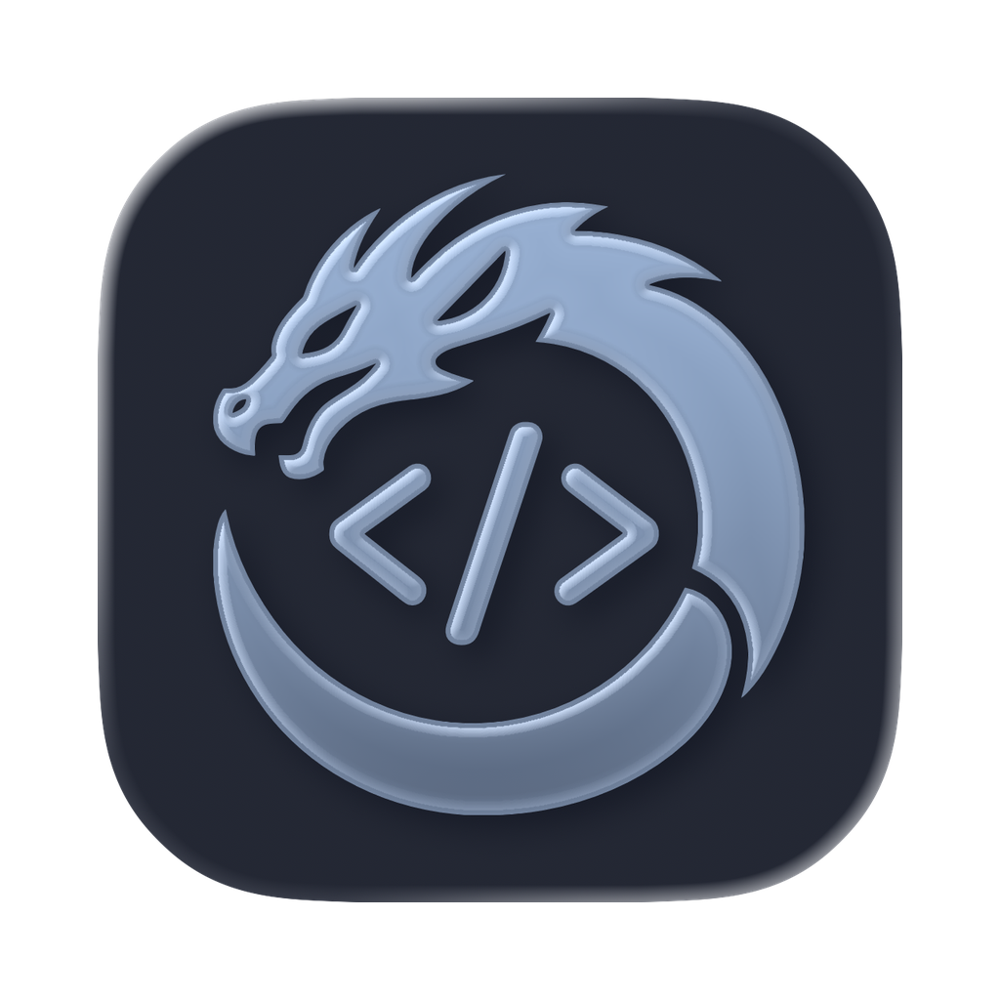
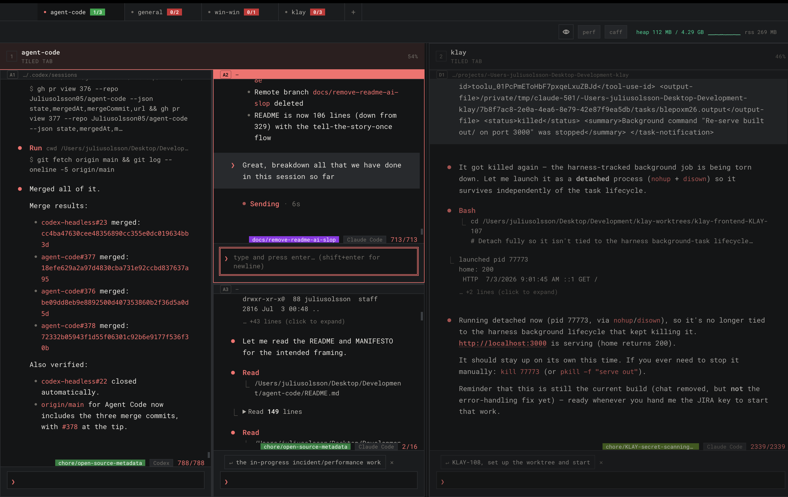
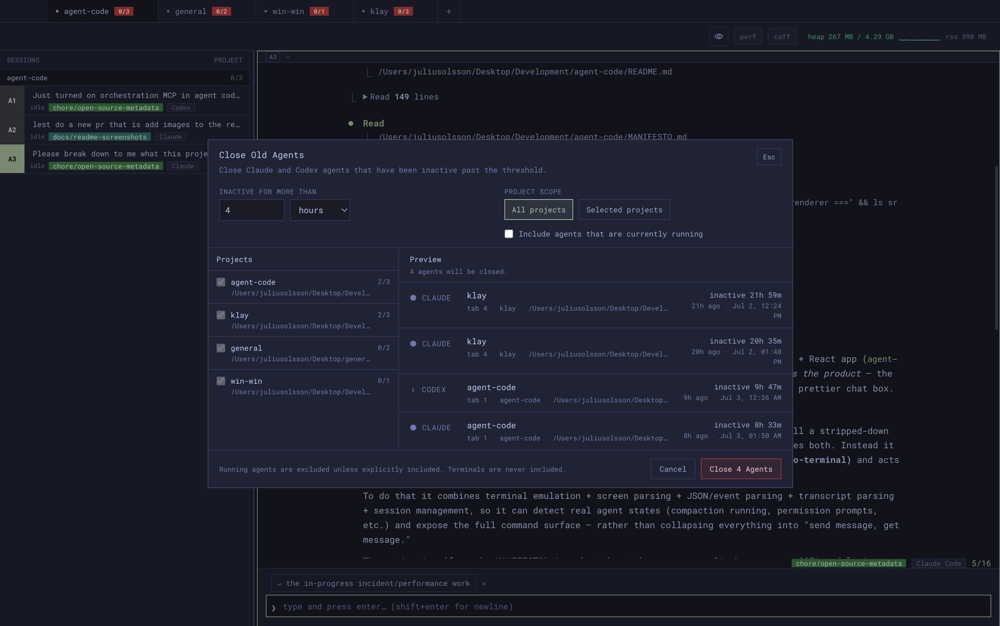
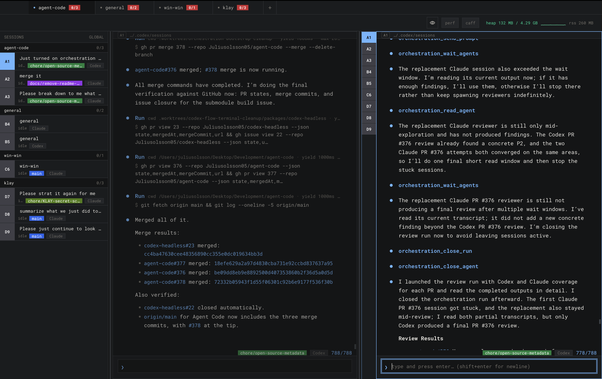
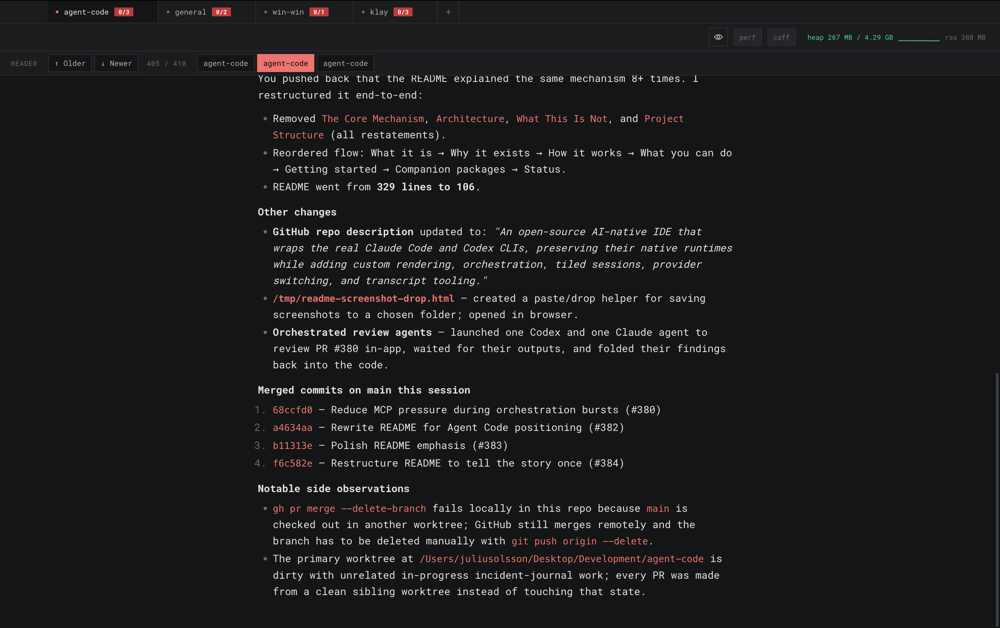

<p align="center">
  
</p>

<h1 align="center">Agent Code</h1>

<p align="center">
  Open-source Electron-based AI-native IDE built around the real Claude Code and Codex CLIs.
</p>

<p align="center">
  <a href="https://github.com/Juliusolsson05/agent-code/stargazers"></a>
  <a href="https://github.com/Juliusolsson05/agent-code/network/members"></a>
  <a href="https://github.com/Juliusolsson05/agent-code/issues"></a>
  <a href="LICENSE"></a>
  <a href="https://github.com/Juliusolsson05/agent-code/commits/main"></a>
  <a href="https://github.com/Juliusolsson05/agent-code"></a>
</p>

---

Agent Code is an open-source Electron IDE for driving the real Claude Code and
Codex CLIs from a workspace built for multi-agent development.

<p align="center">
  
</p>

## Why it exists

Claude Code and Codex are strong runtimes: real permission flows, tool loops,
compaction, resume behavior, and provider-specific decisions. Wrappers usually
throw that away — they call a thin API, reuse fragile token paths, or rebuild a
tiny chat surface. That may look clean, but it loses most of what makes the real
products useful.

At the same time, Anthropic is closing OAuth to non-official clients. OpenCode
and similar projects have already been blocked. The official Claude Code app
works, but it is not built for deep customization or serious parallelization —
running many agents means managing panes, prompts, transcripts, worktrees, and
provider limits manually in a terminal.

Agent Code takes a third route: keep the native runtimes, own the workspace
around them.

## How it works

Agent Code launches the user's already-installed `claude` and `codex` CLIs
through two standalone open-source packages:
[`claude-code-headless`](https://github.com/Juliusolsson05/claude-code-headless)
and [`codex-headless`](https://github.com/Juliusolsson05/codex-headless).

They wrap each CLI in a PTY and expose the runtime as an API — JSONL
transcripts, provider conditions, permission and trust prompts, semantic
streaming, and screen state for anything the CLI only shows in the terminal.
Agent Code consumes that API to rebuild the agent surface in React without
replacing the underlying agent loop. Same auth. Same tools. Same session
behavior.

Because Agent Code also owns transcript translation
([`agent-transcript-parser`](https://github.com/Juliusolsson05/agent-transcript-parser)),
a running session can move mid-task from Claude Code to Codex or back.

## What you can do with it

- **Tiled workspace** — many agent and terminal sessions in a real pane layout.
- **Fleet management** — manage detached agents outside the fixed grid. Bulk
  actions cover the multi-project cases: closing agents that have been inactive
  across every project, pinning them for quick access, or reattaching them to
  the grid.

  <p align="center">
    
  </p>

- **Provider switching** — move any session between Claude and Codex,
  individually or in bulk, without losing state.
- **Custom rendering** — React feed built from committed transcripts, semantic
  streams, tool calls, and provider conditions. The raw terminal stays available.
- **Persistent terminals** — tmux-backed shells that survive UI reloads.
- **Built-in MCP + agent control** — orchestration lets a parent create and
  coordinate real Agent Code children. The independently configurable Agent
  Management MCP can inventory every grid, Dispatch, and buried agent in the
  caller's project, expose transcript/activity evidence, read bounded outputs,
  and send follow-ups. Destructive close is restricted to an explicit current
  user request and refuses self-close or multi-session cascades.

  <p align="center">
    
  </p>

- **Prompt and transcript tools** — search, rewind, duplicate, resume-command
  copy, prompt templates. Reader Mode gives a paginated, distraction-free view
  of long sessions for reviewing what an agent actually did.

  <p align="center">
    
  </p>

- **Voice dictation** — via
  [`agent-voice-dictation`](https://github.com/Juliusolsson05/agent-voice-dictation).
- **Managed personal skills** — save shared conventions, author instruction-only
  custom skills, or review and install commit-pinned Agent Skills from public
  GitHub repositories. Agent Code deploys them to Claude Code, Codex, and
  OpenCode with collision-safe ownership and explicit deployment health.
- **Diagnostics** — durable local evidence for provider exits, transcript
  drift, rendering issues, and near-OOM events.

## Getting started

Requires Node 22.12+ (CI builds on 24 — see `.nvmrc`), plus `claude` and `codex`
on `PATH`. The headless runtimes live as git submodules, so clone with them
included:

```bash
git clone --recurse-submodules https://github.com/Juliusolsson05/agent-code.git
cd agent-code
npm install
npm run dev
```

If you already cloned without `--recurse-submodules`, initialize them once:

```bash
git submodule update --init --recursive
```

**Submodules are load-bearing:** the dev build compiles the five package
submodules (`claude-code-headless`, `codex-headless`, `opencode-headless`,
`agent-transcript-parser`, `agent-voice-dictation`) straight from their
`src/` via Vite aliases, so `npm run dev` will not start without them
checked out. All submodule repos are public; no special access is needed
(CI's `SUBMODULE_PAT`/`SUBMODULE_SSH_KEY` plumbing predates them being
public and is kept for private forks).

To build distributable macOS DMG and ZIP artifacts for Apple Silicon and Intel:

```bash
npm run dist:mac
```

`dist:mac` fetches and verifies the pinned runtime tools before building, then
checks out unsigned development artifacts when no Developer ID identity is
configured. Public releases use `.github/workflows/release.yml`, which requires
a Developer ID Application certificate and Apple notarization credentials and
verifies both thin app bundles before upload. For day-to-day development, use
`npm run dev`.

## Companion packages

- [`claude-code-headless`](https://github.com/Juliusolsson05/claude-code-headless)
  — headless Claude Code control layer
- [`codex-headless`](https://github.com/Juliusolsson05/codex-headless)
  — headless Codex control layer
- [`agent-transcript-parser`](https://github.com/Juliusolsson05/agent-transcript-parser)
  — Claude/Codex transcript conversion and rewind
- [`agent-voice-dictation`](https://github.com/Juliusolsson05/agent-voice-dictation)
  — dictation primitives for agent composer UIs

## Status

Active beta. The upstream CLIs move quickly; so does this project.

## License

[MIT](LICENSE)
