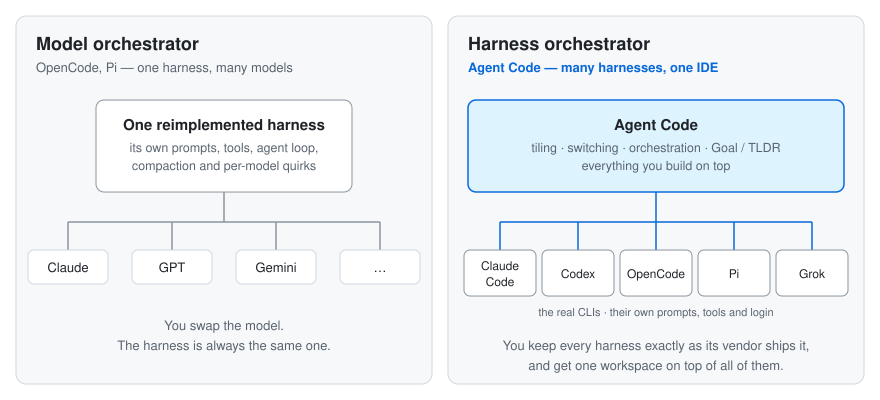

<p align="center">
  
</p>

<h1 align="center">Agent Code</h1>

<p align="center">
  An IDE for the coding agents you already use.
</p>

<p align="center">
  <a href="https://github.com/Juliusolsson05/agent-code/stargazers"></a>
  <a href="https://github.com/Juliusolsson05/agent-code/network/members"></a>
  <a href="https://github.com/Juliusolsson05/agent-code/issues"></a>
  <a href="LICENSE"></a>
  <a href="https://github.com/Juliusolsson05/agent-code/commits/main"></a>
  <a href="https://github.com/Juliusolsson05/agent-code"></a>
</p>

---

Agent Code is a **harness orchestrator, not a model orchestrator**. It runs the
real Claude Code, Codex, OpenCode, Pi and Grok CLIs side by side in one
open-source desktop IDE, and builds the workspace around them that none of
them ship on their own.

<p align="center">
  
</p>

## Harness orchestrator, not model orchestrator

<p align="center">
  
</p>

A harness is everything between you and the model: the system prompt, the tool
definitions, the agent loop, permissions, compaction, resume. It matters as much
as the model does.

OpenCode and Pi are model orchestrators. They are good harnesses in their own
right: each reimplements the prompting and the tool loop, then lets you point
that one harness at almost any model.

Agent Code orchestrates harnesses instead. Claude Code is Anthropic's harness,
tuned for Claude. Codex is OpenAI's, tuned for GPT. Agent Code runs the actual
binaries under your own login, and treats OpenCode and Pi as harnesses too. You
pick a harness per pane and mix them in one grid.

- **Nothing is reimplemented, so nothing is lost.** Permission prompts,
  compaction, slash commands, subagents and resume behave exactly as upstream
  ships them.
- **New CLI features work on day one.** It is their CLI, so an upstream release
  does not wait on us to reimplement anything.
- **Same login, same subscription.** The CLI signs in the way it always does.
- **Switch harness mid-task.** A running Codex session can move to Claude Code
  and back, because Agent Code translates the transcript between harnesses.

## Build on top of the harness

A harness is a terminal program, and its vendor decides what that terminal can
show. Agent Code is an Electron app that owns the surface around every harness,
so it can ship workflow and quality-of-life features no single CLI is going to
build, and they work the same whichever harness is running underneath.

### Example: Goal and TLDR

You have eight agents running. Which one is doing what, and how far along is it?

Goal and TLDR ship in the base install and are off by default. Turn them on and
each agent gets two MCP tools:

- `goal_set` — what this agent's work is for. Set once it understands the task,
  changed only when the direction changes.
- `tldr_update` — where the work is right now, in a sentence or two.

Agent Code renders the answers over your panes. Hold **Cmd+G** to see every
visible agent's goal and **Cmd+L** to see its latest status. **View TLDR
History** shows how both evolved over the session, and **View Goal History**
shows the goals alone.

When you accept an agent's work (its PR merged, or you said it is done), the
agent marks its goal **complete**, and the peek shows its one-line summary.
**Close Completed Agents…** then lists every finished agent across projects and
closes the ones you keep ticked. Running agents stay open, and a new goal
clears the completion.

The harness never knows it is being rendered. It calls a tool; Agent Code draws
the result. That is the general pattern: an MCP entry point the agent calls,
with custom rendering on the Agent Code side. Hooks at the first prompt and at
turn end remind Claude Code and Codex agents that forget to report.

## Everything else on top

- **Tiled workspace** — many agent and terminal sessions in a real pane layout.
- **Fleet management** — manage detached agents outside the grid: close agents
  that have been idle across every project, pin them, or reattach them.
  **Close Idle Orchestration Agents** sweeps up the finished workers an
  orchestration run leaves behind, after confirming the list.

  <p align="center">
    
  </p>

- **Orchestration** — a parent agent can create and coordinate real Agent Code
  child agents. The separately configurable Agent Management MCP can list every
  agent in the caller's project, read its transcript and output, and send
  follow-ups. Closing an agent requires an explicit request from the user and
  refuses self-close or multi-session cascades.

  <p align="center">
    
  </p>

- **Your MCP servers** — add any MCP server (stdio, HTTP or SSE) by pasting the
  config from its README, and choose per harness which ones new agents get.
  **Settings → MCP** shows Agent Code's own servers and yours in one grid.
  Tokens are stored encrypted and reach the server through environment
  variables, never a config file or the command line.
- **Custom rendering** — a React feed built from committed transcripts, live
  streams, tool calls and provider prompts. The raw terminal is always one
  toggle away.
- **Persistent terminals** — tmux-backed shells that survive UI reloads.
- **Prompt and transcript tools** — search, rewind, duplicate, copy the resume
  command, prompt templates. Reader Mode gives a paginated, distraction-free
  view of long sessions for reviewing what an agent actually did.

  <p align="center">
    
  </p>

- **Voice dictation** — via
  [`agent-voice-dictation`](https://github.com/Juliusolsson05/agent-voice-dictation).
- **Skills** — Settings → Skills lists every personal skill your agents can
  load, with a column per provider. Paste the `npx skills add owner/repo
  --skill name` line from a README or skills.sh, review the exact commit and
  its files, and Agent Code installs commit-pinned copies for the providers you
  choose. You can also write your own skills and see skills other tools
  installed. There is no limit on how many you keep. Agents can propose skills
  for your review. Ownership is collision-safe and deployment health is shown
  explicitly.
- **Diagnostics** — durable local evidence for provider exits, transcript
  drift, rendering issues and near-OOM events.

## How it works

Each harness runs as its real native program. Claude Code and Codex run in a PTY
through [`claude-code-headless`](https://github.com/Juliusolsson05/claude-code-headless)
and [`codex-headless`](https://github.com/Juliusolsson05/codex-headless); OpenCode,
Pi and Grok have their own headless packages. Those packages observe the
program from the outside — the terminal screen, the model stream, the transcript
files on disk and the process — and expose it as an API. Agent Code reconciles
those observations into one conversation and renders it in React, without
replacing the agent loop underneath.

[`agent-transcript-parser`](https://github.com/Juliusolsson05/agent-transcript-parser)
translates transcripts between harnesses, which is what makes switching,
duplicating and rewinding a session possible. See
[ARCHITECTURE.md](ARCHITECTURE.md) for the full picture.

## Getting started

Requires Node 22.12+ (CI builds on 24 — see `.nvmrc`), plus `claude` and `codex`
on `PATH`, and any other harness CLI you want to use. The headless runtimes live
as git submodules, so clone with them included:

```bash
git clone --recurse-submodules https://github.com/Juliusolsson05/agent-code.git
cd agent-code
npm install
npm run dev
```

If you already cloned without `--recurse-submodules`, initialize them once:

```bash
git submodule update --init --recursive
```

**Submodules are load-bearing:** the dev build compiles the package submodules
under `packages/` straight from their `src/` via Vite aliases, so `npm run dev`
will not start without them checked out at their pinned commits. All submodule
repos are public; no special access is needed (CI's
`SUBMODULE_PAT`/`SUBMODULE_SSH_KEY` plumbing predates them being public and is
kept for private forks).

To build distributable macOS DMG and ZIP artifacts for Apple Silicon and Intel:

```bash
npm run dist:mac
```

`dist:mac` fetches and verifies the pinned runtime tools before building, then
checks out unsigned development artifacts when no Developer ID identity is
configured. Public releases use `.github/workflows/release.yml`, which requires
a Developer ID Application certificate and Apple notarization credentials and
verifies both thin app bundles before upload. For day-to-day development, use
`npm run dev`.

## Companion packages

- [`claude-code-headless`](https://github.com/Juliusolsson05/claude-code-headless)
  — headless Claude Code control layer
- [`codex-headless`](https://github.com/Juliusolsson05/codex-headless)
  — headless Codex control layer
- [`opencode-headless`](https://github.com/Juliusolsson05/opencode-headless)
  and [`opencode-terminal-headless`](https://github.com/Juliusolsson05/opencode-terminal-headless)
  — structured and terminal OpenCode runtimes
- [`pi-terminal-headless`](https://github.com/Juliusolsson05/pi-terminal-headless)
  — headless Pi control layer
- [`grok-code-headless`](https://github.com/Juliusolsson05/grok-code-headless)
  — headless Grok control layer
- [`agent-transcript-parser`](https://github.com/Juliusolsson05/agent-transcript-parser)
  — transcript conversion and rewind across harnesses
- [`workflow-mcp`](https://github.com/Juliusolsson05/workflow-mcp)
  — durable multi-agent workflows over MCP
- [`agent-voice-dictation`](https://github.com/Juliusolsson05/agent-voice-dictation)
  — dictation primitives for agent composer UIs
- [`agent-code-extension-api`](https://github.com/Juliusolsson05/agent-code-extension-api)
  — the SDK for extensions that run inside Agent Code

## Status

Active beta. The upstream CLIs move quickly; so does this project.

## License

[MIT](LICENSE)
