# Agent Code: application architecture

This is a reference to the implemented system: how Agent Code starts, owns processes, moves observations into a conversation view, persists state, and exposes control to agents and other clients. It describes the application at source revision `6a19e4ee`, inspected on 2026-09-11. It is not a proposal for a future architecture or a promise that every provider supports the same behavior.

> Draft in progress: sections 1–14 are available for early review. The remaining sections and complete link/diagram validation are still being written.

The central architectural decision is to keep interactive agents inside their native provider runtimes. Agent Code owns the surrounding desktop workspace, process lifecycle, observation, input delivery, and presentation. Native providers own model execution, their authentication, tools, and native conversation history. The workflow subsystem is a separate execution path: it runs durable workflow jobs through the Codex SDK and isolated worker processes.

Source links below are relative to this file. They point to implementation owners, not necessarily to a public API. UML class diagrams show selected relationships, not every field. Sequence diagrams show important admission and failure boundaries. State diagrams marked *conceptual* combine several actual state fields for explanation. Component and deployment views use Mermaid flowcharts because Mermaid does not implement UML component or deployment notation. All diagrams are embedded; this reference needs no generated image files.

## Contents

1. [System boundary](#1-system-boundary)
2. [Repository and dependency structure](#2-repository-and-dependency-structure)
3. [Processes and deployment](#3-processes-and-deployment)
4. [Identity and ownership](#4-identity-and-ownership)
5. [Startup and shutdown](#5-startup-and-shutdown)
6. [Windows, workspace, and restoration](#6-windows-workspace-and-restoration)
7. [Session lifecycle](#7-session-lifecycle)
8. [Provider integrations](#8-provider-integrations)
9. [Prompt delivery and conditions](#9-prompt-delivery-and-conditions)
10. [Event transport and backpressure](#10-event-transport-and-backpressure)
11. [Renderer state and composition](#11-renderer-state-and-composition)
12. [Conversation rendering and ownership](#12-conversation-rendering-and-ownership)
13. [History and transcript transformations](#13-history-and-transcript-transformations)
14. [Terminal surfaces and tmux](#14-terminal-surfaces-and-tmux)
15. [Commands and the control SDK](#15-commands-and-the-control-sdk)
16. [Built-in MCP and agent relationships](#16-built-in-mcp-and-agent-relationships)
17. [Durable workflows](#17-durable-workflows)
18. [External operator control](#18-external-operator-control)
19. [Remote companion](#19-remote-companion)
20. [Files, editors, and language servers](#20-files-editors-and-language-servers)
21. [Git, work context, and native subagents](#21-git-work-context-and-native-subagents)
22. [Managed skills and conventions](#22-managed-skills-and-conventions)
23. [Dictation, templates, and secrets](#23-dictation-templates-and-secrets)
24. [Persistence and recovery guarantees](#24-persistence-and-recovery-guarantees)
25. [Diagnostics and resource limits](#25-diagnostics-and-resource-limits)
26. [Trust boundaries](#26-trust-boundaries)
27. [Build, packaging, and verification](#27-build-packaging-and-verification)
28. [Implementation constraints and maintenance map](#28-implementation-constraints-and-maintenance-map)

## 1. System boundary

Agent Code is an Electron desktop application with a React renderer. A window presents project tabs, agent and shell panes, conversation feeds, editors, and supporting panels. The main process owns privileged operations and resources shared across windows. A typed preload bridge exposes selected operations to each renderer.

An agent pane is not the agent process. Its layout metadata can exist while its backend is absent, failed, hibernated, or being recovered. A native provider conversation can also survive the application process. Much of the architecture exists to preserve those distinctions during reloads, provider switches, slow startup, and partial failures.

The system has several control surfaces with different authority:

| Surface | Caller | Principal responsibility |
| --- | --- | --- |
| Desktop UI | User in an application window | Workspace layout, sessions, editing, settings, diagnostics |
| Native provider CLI or service | Agent runtime | Model requests, native tool execution, provider authentication and history |
| Built-in MCP | A specifically registered managed agent session | Selected app services, scoped by session and enabled domains |
| Workflow API | Desktop or an enabled workflow MCP caller | Durable multi-step runs with source approval and tracked attempts |
| External operator MCP | Separately configured local MCP client | Catalog and invocation of externally visible application capabilities |
| Remote companion | Paired browser device | Agent observation, history, prompt input, interrupt, and supported conditions |

These are not interchangeable transports for the entire application API. For example, the remote protocol does not expose general workspace mutation or arbitrary shell creation; a prompt it delivers can still cause the native agent to execute tools under that agent's permissions.

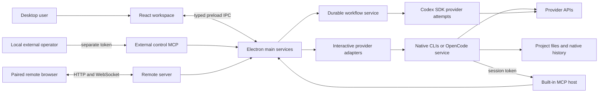

There is no application-hosted account service or central conversation database in this deployment. Optional Cloudflare tunneling, model providers, Deepgram, release downloads, and public GitHub skill acquisition are external services used for specific features. Their presence does not move local workspace ownership out of Electron main.

Implementation entry points: [main composition](src/main/index.ts), [renderer entry](src/renderer/src/app/main.tsx), [preload](src/preload/index.ts), [provider registry](src/providers/registry.main.ts).

## 2. Repository and dependency structure

The main architectural boundaries are directories with different runtime permissions and ownership, rather than independently deployed services.

| Location | Responsibility | Dependency constraint |
| --- | --- | --- |
| `src/main/` | Electron lifecycle, OS integration, processes, files, privileged services | Can use Node and Electron main APIs |
| `src/preload/` | Context-isolated bridge and typed domain APIs | Exposes deliberate methods, not unrestricted `ipcRenderer` |
| `src/renderer/src/` | React UI, workspace actions, runtime projections, rendering | Browser environment; privileged work goes through a bridge |
| `src/shared/` | Cross-process contracts, pure reducers and utilities | Keep transport-independent code usable by desktop and remote |
| `src/providers/` | Provider-specific registration, process adapters, capabilities, mapping and rendering | Main and renderer entry points are separated |
| `src/mcp/` | Built-in MCP HTTP host, tool registration and shared domain contracts | Authority is registered per managed session |
| `src/control-sdk/` | Capability schemas, invocation, ownership and operation history | Shared contract with host and operator entry points |
| `src/remote-client/` | Independently built browser companion | Reuses selected browser-safe renderer modules through explicit aliases |
| `packages/` | Pinned Git submodules used in the application | Changes to package implementation and application gitlinks are separate changes |
| `third_party/` | Manifests and legal notices for shipped native tools | Binaries come from verified build inputs, not Git |
| `vendor/` | Local upstream source references | Never imported, built, or shipped |
| `testing/`, tests beside source | Fixtures, harnesses and regression evidence | Production bundles exclude test assets |
| `scripts/`, `build/`, `.github/` | Build, native resource preparation, packaging, CI | Part of the delivery architecture, not renderer runtime |

The six application submodules at this revision are:

| Package | Pinned revision | Application use |
| --- | --- | --- |
| [claude-code-headless](packages/claude-code-headless) | `dd89f383` | Observe a Claude PTY, transcript and optional proxy stream |
| [codex-headless](packages/codex-headless) | `96c5c146` | Codex PTY observations, rollout ownership, native resume preparation and proxy support |
| [opencode-headless](packages/opencode-headless) | `4f2ef5de` | OpenCode HTTP/SSE session lifecycle and native export/import helpers |
| [agent-transcript-parser](packages/agent-transcript-parser) | `9c99db00` | Provider-neutral conversation model, decode, projection and native artifacts |
| [agent-voice-dictation](packages/agent-voice-dictation) | `3c6f9628` | Speech transport and composer integration primitives |
| [workflow-mcp](packages/workflow-mcp) | `b4b98f8d` | Durable workflow service, store, scheduler, worker protocol and providers |

Package capability is not the same as product capability. The speech package supports more than the application's configured Deepgram path. The workflow package also has standalone deployment facilities; Agent Code uses its embedded Electron integration, not a Docker service. OpenCode package support for a native operation does not imply a saved-session picker exists in the UI.

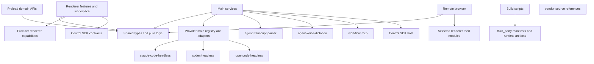

Build aliases resolve most local packages directly from source. Workflow integration has an explicit package build/type-resolution step. The presence of a convenient alias does not make Node-based headless code browser-safe. See [Electron Vite configuration](electron.vite.config.ts), [TypeScript configurations](tsconfig.json), [.gitmodules](.gitmodules), and [package scripts](package.json).

## 3. Processes and deployment

The desktop uses one main process and one renderer per application window. Optional services create additional processes. They have different lifetimes and termination contracts.

| Process or resource | Owner | Lifetime |
| --- | --- | --- |
| Electron main | OS/application lifecycle | Application run |
| Window renderer and preload | `BrowserWindow` / window registry | Window or renderer generation |
| Claude/Codex interactive process | Provider session via `SessionManager` | One backend attempt |
| Structured OpenCode service | OpenCode headless runtime through adapter | Managed runtime/session lifetime |
| Native OpenCode terminal process | `OpencodeTerminalSession` | One PTY-backed attempt |
| Ordinary shell | Direct PTY or managed tmux session | Terminal session; tmux may outlive attachment |
| Claude mitmproxy process | Claude adapter/proxy resource owner | Optional per-session proxy lifetime |
| Codex Responses proxy | Codex runtime | Optional local server lifetime |
| Workflow worker | `WorkflowService` through Electron launcher | Workflow execution attempt |
| Workflow provider host and Codex descendants | Workflow provider launcher | One provider attempt with confirmed termination |
| Language server | `LspManager` | Shared workspace-root/server lease lifetime |
| Cloudflared | Tunnel transport | Remote tunnel enablement |
| Native dictation hotkey helper | Dictation hotkey service | Only while a binding requires it |
| `caffeinate` | `CaffeinateController` | Enabled keep-awake lifetime on macOS |

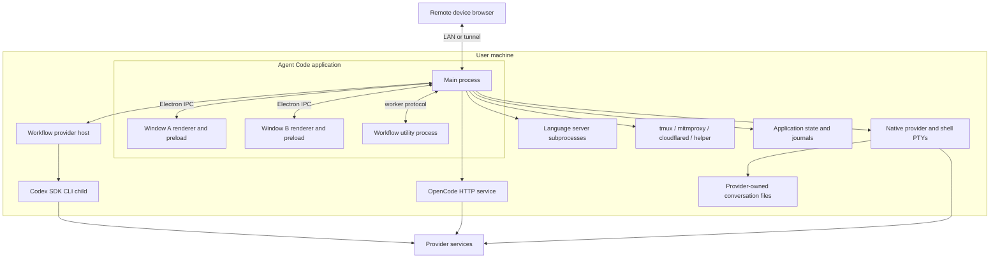

This is a macOS-first delivery system. Packaging produces separate arm64 and x64 application artifacts with a macOS 12 minimum. OS-specific behavior includes Keychain access, Touch ID/user-presence authentication, the native hotkey helper, and `caffeinate`. A portable TypeScript module or Linux compatibility test is not evidence of a shipped Windows or Linux application.

Windows use `contextIsolation: true` and `nodeIntegration: false`, but explicitly set `sandbox: false`. The security boundary is therefore the selected preload API and main-process validation, not a claim that all Electron renderers run with Chromium sandboxing enabled. External navigation is intercepted and new-window requests are denied before approved destinations are opened externally. See [window construction](src/main/window/appWindow.ts) and [packaging](electron-builder.yml).

## 4. Identity and ownership

Several strings called “session IDs” coexist. Treating them as one identifier causes stale event routing, cross-conversation history, or unsafe process replacement.

| Identity | Meaning | Does not establish |
| --- | --- | --- |
| Application `sessionId` | Stable workspace/backend association for a pane's session | A particular OS process or native transcript |
| `sessionRunId` | A particular backend run/attempt | Durable workspace placement |
| Native provider session ID | Claude UUID, Codex conversation identity, or OpenCode `ses_...` | Which window currently owns the app session |
| Transcript locator | Exact JSONL/rollout path or OpenCode URI | An authorization to resume or mutate any similarly named file |
| Window ID | Application window ownership and persistence key | A permanent renderer instance |
| Control owner generation | Registration lifetime of a control owner | Continued validity after navigation/reload |
| Agent name ID | User-visible agent identity retained across selected replacements | Native provider identity; duplicates receive a new name identity |
| Workflow run / task / attempt IDs | Durable workflow execution and retry lineage | Interactive pane process identity |
| tmux session name | Managed shell host identity | A native agent conversation |
| MCP bearer token | Authority for one host registration | A portable durable workspace identifier |

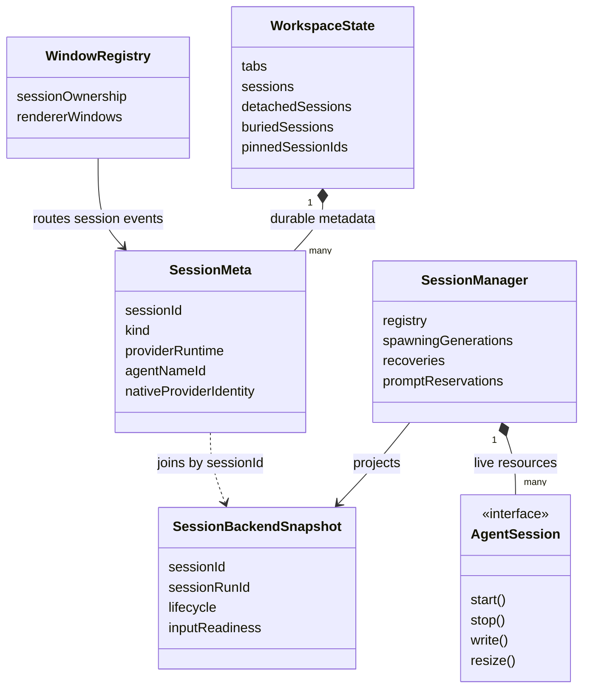

Field names such as `nativeProviderIdentity` in this diagram summarize provider-specific metadata; they are not a replacement schema. [Workspace types](src/renderer/src/workspace/types.ts) and [session contracts](src/shared/types/session.ts) define the actual fields.

Ownership has several independent dimensions:

- Main owns live process handles and admission to lifecycle operations.
- A window owns workspace placement and receives its session events.
- The provider owns execution and native history.
- The rendering ledger chooses which observation owns each visible content unit.
- A control registration generation owns the right to answer an invocation.
- A workflow store lease owns durable journal mutation.
- A managed-skill manifest owns only the exact files it can prove it wrote.

An ownership check is useful only at its own boundary. A session existing in renderer state does not prove its process is alive. An authenticated MCP caller does not own every project. A row with matching prose does not prove a matching tool-call identity.

## 5. Startup and shutdown

Main is a composition root. Most services accept dependencies or small ports rather than looking up arbitrary global application objects. Some intentionally global facilities—window routing, diagnostic services and retention scheduling—remain shared within main.

Startup ordering prevents several observable races: environment variables must exist before modules read them, lineage must be restored before a window asks about workflow history, MCP launch configuration must be available before provider spawn, and window ownership must exist before the first session event.

```mermaid
sequenceDiagram
    participant Boot as Main entry
    participant State as State lock and diagnostics
    participant Setup as Toolchain setup
    participant WF as Workflow service and bridge
    participant Tmux as tmux registry
    participant MCP as Built-in MCP host
    participant Sessions as SessionManager
    participant Windows as Workspace store and windows
    Boot->>State: Acquire state-process lock; begin run journal
    Boot->>Setup: Initialize cached paths and runtime tools
    Boot->>WF: Create service; restore bridge lineage
    Note over Boot,WF: Failure here aborts startup
    Boot->>Tmux: Detect bundled tmux and reconcile persisted references
    Boot->>MCP: Listen on loopback ephemeral port
    Boot->>Sessions: Construct manager with runtime dependencies
    Boot->>MCP: Install service dependencies
    Boot->>Sessions: Wire event forwarding and lifecycle services
    Boot->>Windows: Open workspace envelope; register IPC/control
    Boot->>Windows: Create restored windows
    Windows->>Sessions: Recover individual sessions through renderer actions
```

The exact implementation interleaves diagnostic marks and setup work; the diagram shows dependency order. It does not imply all diagnostic objects are created at the point they are first used. See [main startup](src/main/index.ts).

Toolchain setup stores resolved executable paths and checks them again when necessary. A captured original `PATH` prevents repeated setup from continually prepending duplicate directories. Provider startup uses a validated absolute CLI path; a missing CLI is an explicit launch error rather than an accidental shell lookup. CLI updates coordinate with active sessions and workflow admission, especially Codex, so new work is not admitted into a binary replacement window. See [setup services](src/main/setup).

Shutdown has vetoes. An unsaved editor can refuse a window close. Workflow shutdown can fail if it cannot establish a safe terminal state. Session teardown waits for owned resources instead of assuming that requesting termination proves termination.

```mermaid
sequenceDiagram
    participant User
    participant App as Electron lifecycle
    participant WF as WorkflowService
    participant Window as Renderer/editor guard
    participant SM as Session shutdown gate
    participant Aux as Auxiliary services and journals
    User->>App: Quit
    App->>WF: Stop durable workflow execution
    alt Workflow stop cannot finish safely
        WF-->>App: Failure; retain application for retry
    else Workflow stop completes
        App->>Window: Close / beforeunload
        alt Unsaved changes veto close
            Window-->>App: Keep editing
        else Close is allowed
            App->>SM: will-quit: killAll and await teardown
            alt Owned process teardown fails
                SM-->>App: Block quit; report failure
            else Teardown completes
                App->>Aux: Flush queues; stop servers and helpers
                App->>Aux: Mark clean run and release state lock
                App-->>User: Application exits
            end
        end
    end
```

Some auxiliary shutdown hooks run earlier or concurrently with these gates. Diagnostic flushes are not all awaited with the same durability guarantee as workflow state and owned-process shutdown. “Clean exit” is a lifecycle result, not proof that every optional debug record reached disk.

## 6. Windows, workspace, and restoration

### 6.1 Persistent envelope and window ownership

Main persists a versioned multi-window envelope. Version 2 contains `windows`, each with a window ID, bounds/display/fullscreen information, and a renderer-owned workspace value. A renderer still loads and saves its own wrapped workspace slice; it does not rewrite other windows' state.

[Workspace file decoding](src/main/storage/workspaceFile.ts) migrates the legacy single-workspace envelope. An unsupported future version or an invalid file can place the store in read-only mode rather than overwrite data with a fresh empty layout. Invalid individual window entries can be discarded during decoding; duplicate window IDs are not allowed to become competing owners.

[WorkspaceFileStore](src/main/storage/workspaceFileStore.ts) serializes reads and writes through one admission-ordered queue. Reads join the queue so they cannot observe an old value while an earlier save is waiting. Writes use unique temporary files and rename. A retired window ID cannot submit a late save that resurrects its removed slice. Main also observes persisted session membership to acknowledge replacement/handoff transactions; it otherwise leaves layout interpretation to the renderer.

Closing a window while the app continues can transfer its sessions to a surviving window. Ownership is moved before subsequent session events, the surviving renderer receives an adoption request, and the transfer is acknowledged or rolled back. This path is different from application quit, which preserves the saved multi-window arrangement instead of collapsing it into one surviving window. See [window registry](src/main/window/windowRegistry.ts) and [main window lifecycle](src/main/index.ts).

### 6.2 Layout is a projection over sessions

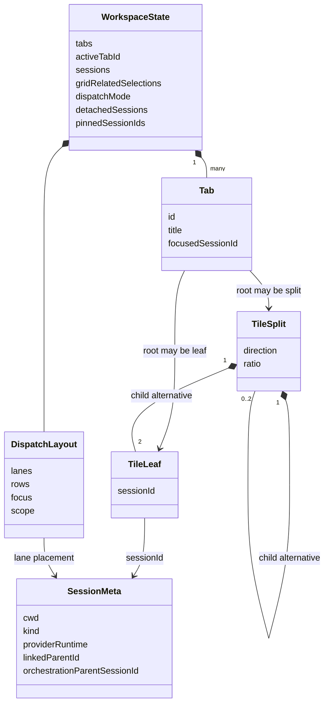

The diagram shows recursive alternatives, not a rule that every split contains both two leaves and two splits. The actual `TileNode` is a discriminated binary tree. A split ratio is normalized to the allowed range; a tab's focused session must be an actual leaf.

Grid placement, Dispatch Mode lanes, pinning, detached sessions, and buried sessions describe visibility and organization. They do not by themselves terminate a backend. Dispatch lanes are a flat ordered sequence with explicit row structure; row weights and scope are normalized separately. Empty lanes remain meaningful and are not automatically populated from the session pool.

Related-session selection can display a child in a physical grid leaf owned by another session. Linked terminal parentage is a one-level association with cascading close behavior. Orchestration parent/root/run metadata is a separate relationship and should not be reused as the linked-terminal tree.

### 6.3 Recovery preserves the workspace shell

Restoration first publishes durable layout and session metadata using stable application IDs. Individual visible sessions then resolve their recovery outcomes. A failed recovery leaves its pane and error available; it does not erase the leaf because a process took too long. Hibernated sessions legitimately have metadata without a live backend.

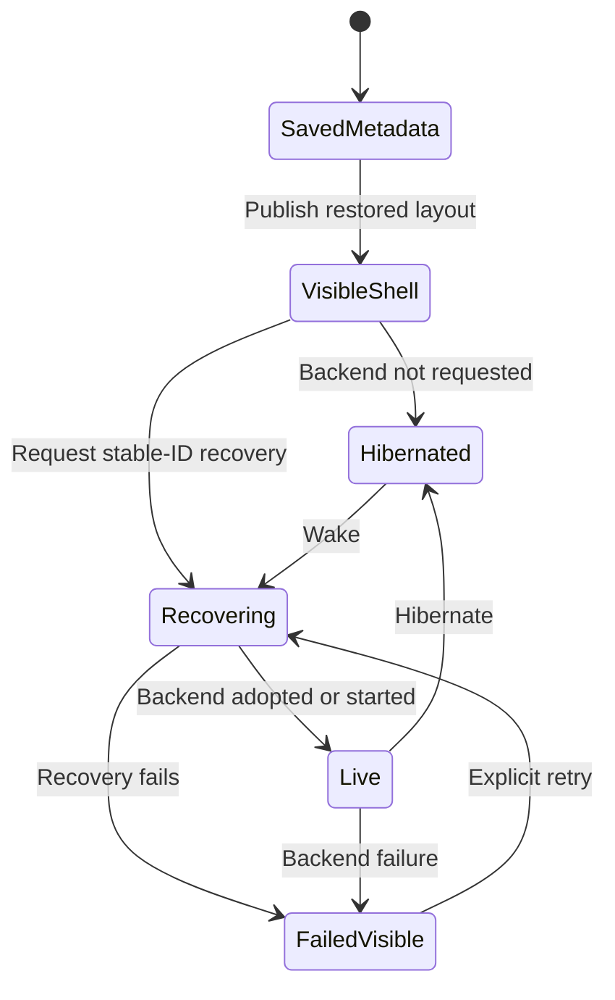

This is a conceptual restoration view; process, transcript and input readiness have separate actual fields. [Rehydration](src/renderer/src/workspace/hook/persistence/rehydrate.ts) and [recovery projection](src/renderer/src/workspace/hook/persistence/recoveryProjection.ts) own this separation. Terminal restart recovery has a known envelope mismatch described in [section 14](#14-terminal-surfaces-and-tmux); do not infer a universal tmux recovery guarantee from the general workspace restoration model.

## 7. Session lifecycle

`SessionManager` is the main authority for interactive sessions. It manages live registry entries, spawning generations, recovery operations, prompt reservations, readiness revisions, last observations, PTY attachment state, and Codex replacement coordination. It is not the transcript parser or the renderer's workspace store.

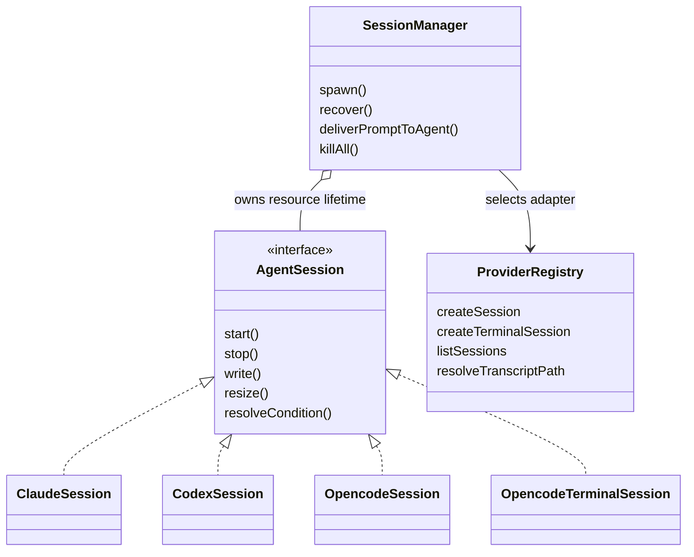

The interface has optional capabilities because a structured service session cannot honestly implement all PTY behaviors. The selected adapter, runtime kind, and feature policy determine what is available. A no-op `write` method on a structured OpenCode adapter is not a supported prompt path.

### 7.1 Spawn and event races

A fresh spawn validates provider/runtime choice and mints an application ID before awaited preparation. An early callback lets the caller assign window ownership before a provider emits anything. The reserved spawn generation then fences asynchronous preparation and listener callbacks.

The manager checks the working directory before committing to process resources. It resolves the selected CLI, registers built-in MCP authority, performs a best-effort managed-skill audit, constructs the provider adapter, and starts it. Listener closures verify that they still own the registry entry. A late event from a replaced process must not update a new run that happens to share a stable session ID.

```mermaid
sequenceDiagram
    participant UI as Workspace action
    participant SM as SessionManager
    participant Owner as Window registry
    participant MCP as MCP host
    participant Adapter as Provider adapter
    UI->>SM: Spawn requested kind, runtime, cwd
    SM-->>UI: Early allocated sessionId callback
    UI->>Owner: Claim session for requesting window
    SM->>SM: Validate cwd; reserve generation; resolve executable
    SM->>MCP: Register session and enabled domains
    SM->>Adapter: Construct and wire fenced listeners
    SM->>Adapter: start()
    Adapter-->>SM: Process, transcript, readiness and semantic observations
    SM->>Owner: Route only current-entry observations
    SM-->>UI: Spawn result or explicit failure
```

### 7.2 Recovery and replacement

Recovery can retain an application `sessionId` while replacing a missing backend. It must distinguish an already live backend, an in-flight recovery, a resumable native identity, and an unusable session. Recovery tokens and generation checks prevent an obsolete request from reclaiming a newer session.

Codex adds a native-rollout ownership transaction. Two active processes must not independently own the same native conversation file. Replacement coordinates predecessor and successor, retains compensation information, and waits for workspace persistence acknowledgement before committing the application handoff. Failure before commit may restore the predecessor; persisted redirection prevents later recovery from reviving the wrong side of a completed replacement.

These mechanics live in [SessionManager](src/main/sessionManager.ts), [Codex replacement ledger](src/main/sessions/codexReplacementLedger.ts), and [session contracts](src/shared/types/session.ts). They are lifecycle authority, not a UI optimization.

### 7.3 Several kinds of readiness

The backend snapshot has lifecycle and input-readiness fields. Renderer runtime state additionally tracks process status, transcript status, stream phase and user-facing session status. Examples:

- A process can have started while replay is still arriving and input is not ready.
- A transcript can remain visible after process exit.
- A live process can be blocked by a permission or question condition.
- A turn can be complete while tool-result bookkeeping or a condition still affects the view.
- A restored pane can have no backend by design.

Do not derive all of these states from a single “busy” boolean. Each answers a different question and receives evidence from a different channel.

## 8. Provider integrations

Provider selection is exhaustive at several boundaries: main factories and native operations, renderer mapping/rendering capabilities, and setup requirements. Adding a string to a UI picker is insufficient. The source owners are [main registry](src/providers/registry.main.ts), [setup registry](src/providers/registry.setup.ts), [renderer capability registry](src/providers/registry.renderer.capabilities.ts), and [feature capabilities](src/shared/featureCapabilities.ts).

| Property | Claude | Codex | OpenCode structured | OpenCode terminal |
| --- | --- | --- | --- | --- |
| Native execution | CLI in PTY | CLI in PTY | Managed HTTP/SSE service | CLI in PTY |
| Structured observations | JSONL plus optional proxy and headless status | Rollout plus optional Responses proxy and headless status | HTTP replay and SSE | No structured live feed from this adapter |
| Native identity | UUID selected before launch/resume | Exact rollout/conversation identity | `ses_...` | Pre-created `ses_...` |
| Prompt path | Readiness, absorption and durable acceptance transaction | Attested PTY delivery profile | HTTP prompt capability | Terminal input |
| App saved-session listing | Supported | Supported | Not implemented | Not a separate listing capability |
| History storage boundary | Provider JSONL files | Provider rollout files | Supported native API/export/import | Known native identity for supported operations |
| Native terminal view | Available | Available | Not a PTY | Required |

### 8.1 Claude

The application owns the PTY; `claude-code-headless` observes that PTY, mirrors terminal state, tails the exact native JSONL, and optionally consumes a proxy adapter. A fresh native UUID is allocated before launch using `--session-id`; resume uses the selected native identity. The adapter configures launch environment and built-in MCP connections.

Screen observations are useful for readiness, menus, status and conditions. They are not trusted assistant prose for the semantic rendering fold. Committed JSONL remains useful without the optional proxy. The proxy supplies live semantic observations when enabled.

The Claude proxy uses a managed mitmproxy process and launch-scoped certificate/proxy environment. Its resource ownership and process tagging matter at teardown: a failed session cannot leave an unowned interception process behind. Proxy event artifacts live under the application's diagnostic tree, not in the native conversation store.

Replay settling is part of readiness. The headless adapter waits for a quiet period in committed replay before input can be treated as safely ready. A visible prompt alone is insufficient when a resumed session is still reconstructing state.

Sources: [Claude runtime](src/providers/claude/runtime), [Claude headless package](packages/claude-code-headless/src).

### 8.2 Codex

Codex also runs in a PTY observed by a headless adapter. Its durable semantic evidence comes from native rollout records, with an optional local Responses proxy providing additional streaming observations. The proxy changes the upstream base URL for the launched process; it is a different mechanism from Claude's TLS-interception path.

Fresh-session rollout discovery has to solve attribution. Several Codex processes can start under the same working directory, and files can appear after the process emits output. Choosing the newest file is not an ownership rule. The package uses coordinated participants, prompt evidence, exact native identities where known, and exclusive path leases. Ambiguity is retained rather than resolved by attaching an unrelated conversation.

Resume preparation returns a controlled ownership resource before the PTY starts. Uncertain teardown can leave a tombstoned lease instead of making a potentially active rollout available to another writer. These constraints also explain the application's Codex replacement ledger.

Prompt input is tied to a validated native input profile. The implementation has a version-specific Codex profile; it does not assume that every installed CLI accepts the same byte sequence with the same semantics. The application also ensures Codex project trust before launch. Dangerous mode passes the native bypass flag, including the native sandbox bypass; Agent Code's own editor path checks do not sandbox the agent process.

Sources: [Codex runtime](src/providers/codex/runtime), [Codex headless package](packages/codex-headless/src).

### 8.3 OpenCode

The normal OpenCode adapter is structured. `opencode-headless` starts or attaches to the native service, loads history through supported endpoints, and consumes SSE through a dispatcher with part accumulation and turn tracking. The application installs listeners before startup/replay to avoid losing the initial state.

The adapter translates observations into shared session events and maintains actionable condition state. Prompt delivery calls a structured method. PTY `write` and `resize` are not its execution channel. A source string such as `opencode://session/<id>` identifies a native conversation; it is not a readable local JSONL path.

OpenCode terminal runtime is a separate application adapter. It creates a native empty session through a supported import path, then launches the CLI against that identity. A first-output delay establishes a limited terminal readiness signal. It does not prove durable prompt acceptance and does not produce the structured feed available from the HTTP adapter.

Saved-session listing remains unavailable in the application registry. Known native IDs can still participate in supported resume and transcript transformation operations. Native export/import is the persistence boundary; the application does not inspect OpenCode's SQLite database directly.

Sources: [OpenCode runtime adapters](src/providers/opencode/runtime), [OpenCode headless package](packages/opencode-headless/src).

## 9. Prompt delivery and conditions

### 9.1 A prompt is a transaction

There are three separate states: text in Agent Code's composer, text staged in a native provider's composer, and a prompt accepted for execution. The application cannot safely equate them. Retrying after an uncertain write can run the same instruction twice.

`SessionManager.deliverPromptToAgent` reserves delivery for one session. Competing structured deliveries and conflicting raw staged submissions are rejected while that reservation is active. The delivery closure checks the same live registry entry before delayed writes, so a readiness wait cannot accidentally send to a successor process.

The result reports success evidence or a failure stage, a retry-safety decision, and whether prompt/Enter bytes may have been written. A thrown write is conservatively treated as potentially effective. The result is not flattened into “send failed, try again.”

```mermaid
sequenceDiagram
    participant Composer as Composer or authorized caller
    participant Manager as SessionManager
    participant Delivery as Provider delivery implementation
    participant Native as Native runtime
    Composer->>Manager: deliverPromptToAgent(text, options)
    Manager->>Manager: Reserve current live session entry
    alt Another delivery owns the session
        Manager-->>Composer: Rejected; retry-safe before writes
    else Reservation granted
        Manager->>Delivery: Deliver with fenced write functions
        Delivery->>Native: Establish provider-specific readiness
        Delivery->>Native: Write or submit prompt
        Native-->>Delivery: Acceptance evidence or uncertainty
        Delivery-->>Manager: Result with disposition and write state
        Manager->>Manager: Release reservation
        Manager-->>Composer: Preserve evidence in result
    end
```

### 9.2 Provider-specific acceptance

| Provider path | Positive evidence | Failure implications |
| --- | --- | --- |
| Claude rendered composer | Durable acceptance observation armed before writing, following verified composer absorption | Rollback can make some absorption failures retry-safe; uncertain execution is not retry-safe |
| Codex rendered composer | Successful delivery through the validated PTY input profile | Transport acceptance does not prove that a rollout already contains the user record |
| Structured OpenCode | Successful structured prompt transport | An HTTP failure after submission can be uncertain; it is not automatically safe to repeat |
| Native terminal input | Bytes forwarded to a terminal | Raw keyboard/paste transport is not the structured prompt transaction |

Claude arms its acceptance cursor before any prompt bytes. It checks readiness and native-composer occupancy, captures an absorption baseline, writes the prompt, observes absorption, then sends Enter separately. Combining paste and Enter in one write was unreliable for the supported Claude input behavior. Acceptance is tied to durable user/queue evidence after the armed cursor, not merely the screen becoming blank.

The implementation uses an absolute overall deadline so nested waits cannot each consume a full independent timeout. At this revision the Claude transaction has a 28-second overall budget, with readiness, absorption and acceptance sub-budgets clipped to remaining time. On absorption failure, bounded rollback is attempted while the reservation remains held. Only evidence that the staged input has been cleared can justify the corresponding retry-safe result.

Codex readiness and atomic paste/Enter behavior follow its attested profile. OpenCode uses its structured delivery capability. Callers must inspect the returned acceptance kind rather than silently upgrading transport delivery into durable acceptance.

Sources: [Claude delivery](src/providers/claude/runtime/promptDelivery.ts), [Codex delivery](src/providers/codex/runtime/promptDelivery.ts), [OpenCode delivery](src/providers/opencode/runtime/promptDelivery.ts), [manager admission](src/main/sessionManager.ts).

### 9.3 Drafts, optimistic rows and queued input

The renderer retains local drafts and images independently from native input. Features such as rewind and template insertion can intentionally prefill a draft without executing it. Optimistic submitted rows provide immediate feedback but do not become native history. The rendering ledger reconciles them with durable evidence.

Claude's native queued messages are another plane of state. A queued prompt can be accepted into a provider queue without beginning the next visible assistant turn immediately. Queue rows, local optimistic submissions, and committed user entries require explicit ownership rules to avoid displaying the same prompt several times or hiding a prompt that has not yet committed.

Wake-before-delivery combines two operations: recovering a hibernated backend and then delivering to the resulting current session. Success at waking is not success at submitting. This distinction also applies to management MCP calls that can wake an agent to send it a prompt.

### 9.4 Conditions are capabilities offered by the current session

Provider conditions include permission prompts, questions, errors, and other actionable native states. They are represented separately from assistant prose and input-readiness state. A reply must address an offered action in the current condition snapshot; it is not an unrestricted write API disguised as a permission reply.

Some conditions resolve through native PTY actions, others through structured provider methods. Main validates the action and session state. Renderer dismissal affects presentation, not necessarily the native provider's blocking state. Remote replies use the same current-condition constraint, including exact offered PTY action identity/data where applicable.

Sources: [condition contracts](src/shared/types/providerConditions.ts), [main condition control](src/main/sessions/conditionControl.ts), [workspace condition UI](src/renderer/src/workspace/conditions).

## 10. Event transport and backpressure

### 10.1 Observation channels

The manager emits several independent observation families:

| Channel | Meaning | Retention/transport character |
| --- | --- | --- |
| Started / exit | Backend lifecycle edges | Structural events |
| Input readiness | Current input capability with revision/reason | Latest state, fenced by session lifetime |
| Screen | Headless terminal snapshot | Replaceable current observation |
| Process state | Provider/process status | Replaceable current observation |
| JSONL entries and errors | Durable transcript observations | Ordered records, batched for IPC |
| Semantic events | Live turns, blocks, tool input/output and usage | Accumulative updates plus structural barriers |
| Conditions | Current provider conditions/actions | State separate from transcript |
| Native subagents | Derived child activity | Provider-specific producer, shared UI contract |
| Raw terminal bytes | Terminal display/input surface | Separate ordinary-terminal and agent-PTY channels |

[SessionForwarder](src/main/sessions/forwarder.ts) subscribes once in main and routes session events to the owning window. The current fallback for a session without recorded ownership is broadcast; correct early ownership assignment therefore matters. The fallback is not evidence that cross-window session routing is intrinsically isolated in every failure case.

### 10.2 Coalesce values, preserve boundaries

Semantic transports publish running accumulators wherever possible. A newer `textSoFar` for the same block can replace an older value without losing text. Events with only fragments are concatenated. The coalescing key includes session, event type and relevant turn/block/tool identities, preventing sibling streams from overwriting each other.

Structural events cannot be treated as replaceable values. Completion, start, error and other barriers flush preceding buffered work. JSONL forwarding flushes preceding semantic observations before enqueuing the committed record. Session removal drains queues before ownership is released; delayed cleanup avoids misrouting the final exit.

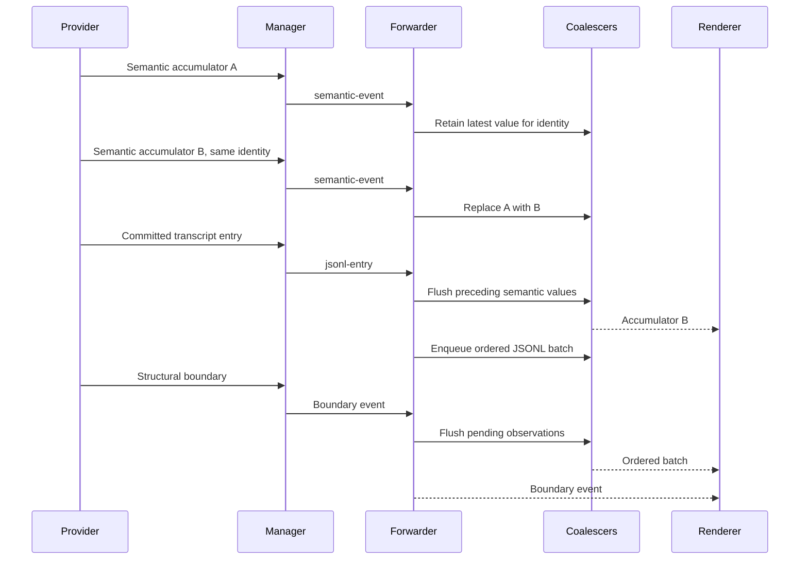

The actual forwarder has separate JSONL, semantic, screen and process coalescers. They reduce main-to-renderer serialization and IPC work as well as React updates. Coalescing only after arrival would still make Chromium deserialize every intermediate event.

Sources: [semantic backpressure contract](src/shared/sessionFeed/semanticEventBackpressure.ts), [main coalescers](src/main/sessions), [forwarder](src/main/sessions/forwarder.ts).

### 10.3 SessionFeed is deliberately narrower than preload

The shared `SessionFeed` contract supports subscriptions and a limited set of session interactions. Desktop implements it with IPC. The remote browser implements its corresponding behavior over WebSocket. This lets both clients reuse transcript folding and feed rendering without teaching the feed about Electron.

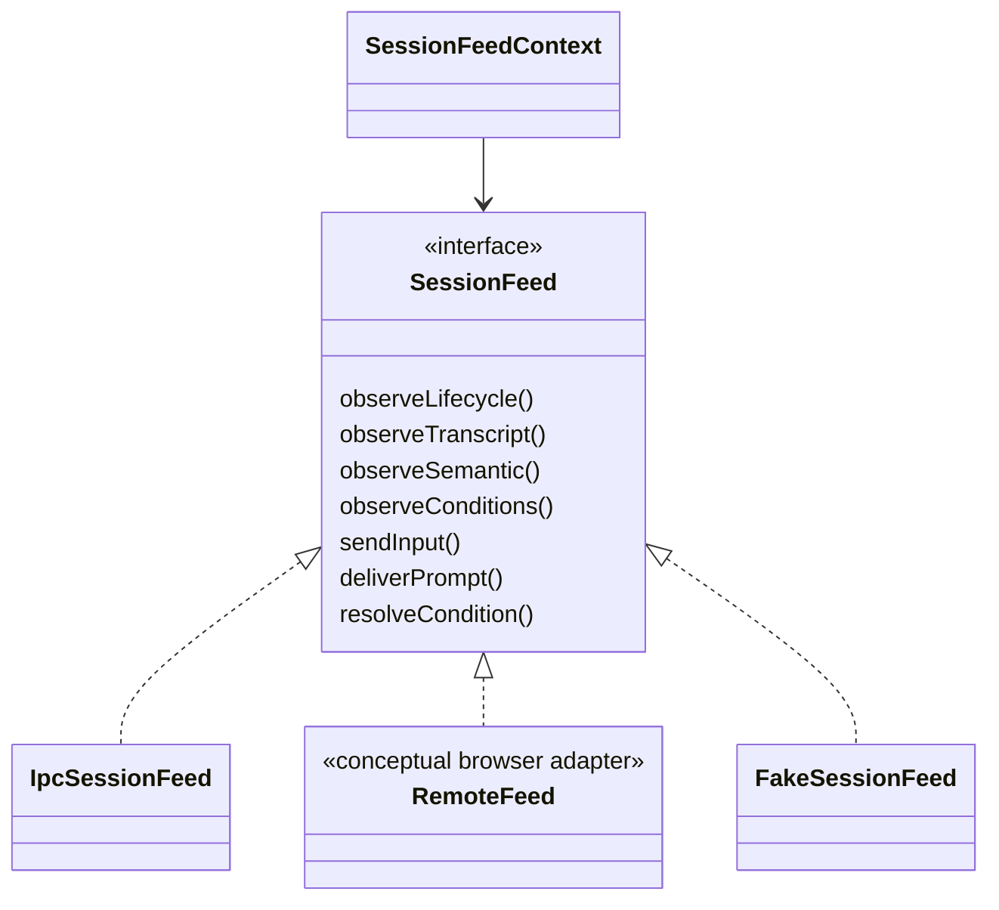

The observation method names in the diagram summarize event families. The exact interface is in [SessionFeed](src/shared/sessionFeed/SessionFeed.ts). Spawn, workspace mutation, files, settings, and workflow history are not all routed through this interface. [IpcSessionFeed](src/renderer/src/features/sessionFeed/IpcSessionFeed.ts) and the [remote client](src/remote-client/src) implement their allowed subsets explicitly.

## 11. Renderer state and composition

### 11.1 Application composition

The renderer entry installs error reporting and heartbeat/freeze evidence early, then mounts React with a workflow client provider, session feed provider, toast infrastructure and error boundaries. `App` coordinates workspace and global feature hooks, setup/restore banners, tabs, panels and registered surfaces. Feature implementations remain in their own directories.

The Zustand application store contains settings, UI-shell state and workspace state. Its persistence middleware retains the settings subset, not the entire live runtime. Settings are coerced on merge even when the persisted schema version matches, because invalid values can enter through more than a formal version migration.

Workspace persistence uses main-process file IPC. Session runtime contains hot observations, drafts, semantic state, tool indices, readiness, history-window bookkeeping and rendering inputs. Keeping these lifetimes separate prevents a streamed token from rewriting the full workspace or making every pane rerender.

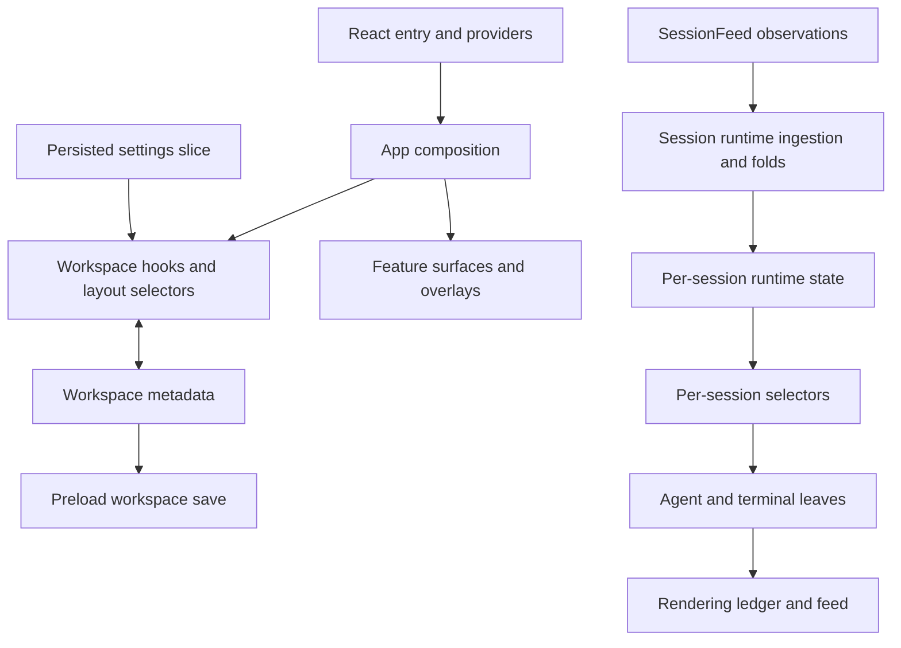

The workspace root subscribes to layout-relevant state and uses current refs/imperative subscriptions where hot session changes would otherwise invalidate the whole tree. Individual leaves select their own session runtime. Stable references are a correctness tool for memoization as well as a performance convention: reducers and rendering adapters deliberately return unchanged references for no-op updates.

Sources: [App](src/renderer/src/app/App.tsx), [store](src/renderer/src/app-state/store.ts), [workspace hook](src/renderer/src/workspace/hook/index.ts), [runtime state](src/renderer/src/session-runtime/state.ts).

### 11.2 Agent, terminal and hybrid surfaces

A provider runtime and a display mode are different choices. Claude and Codex can expose their real PTY while still being managed sessions. Structured OpenCode has no such PTY and is normalized to the rendered agent surface. OpenCode terminal runtime is forced to the terminal surface.

For supported PTY agents, hard Terminal mode honors the user's terminal preference even if a feature would prefer the rendered feed. Hybrid mode can temporarily select the rendered surface when a draft, image, suggestion, visible condition, queue, or explicit rendered-view lease requires it. A hidden non-empty draft is unacceptable because the user could no longer inspect what a feature inserted.

Rendered-view leases are counted per feature. Releasing one feature's lease must not remove another feature's reason to keep the feed mounted. Native terminal ownership separately selects which mounted view controls the PTY attachment and size.

Sources: [display-mode policy](src/renderer/src/workspace/agentDisplayMode.ts), [terminal ownership](src/renderer/src/workspace/terminal/AgentTerminalOwnership.tsx).

## 12. Conversation rendering and ownership

### 12.1 Why an ownership ledger exists

An assistant message can be observed live, retained as semantic history, committed into a provider transcript, and temporarily preserved as a ghost. A user's prompt can exist as a local optimistic row, a native queue entry and a committed message. Rendering each array independently duplicates content. Picking whichever array is newest can instead lose tool results or hide content after a stream ends.

The renderer converts these observations into candidates, decides ownership, orders selected content, and then resolves provider-specific paint behavior. The ledger records both selected and suppressed decisions with reasons/evidence. It is the active feed path; the old rendering feature flag is not a supported alternate implementation.

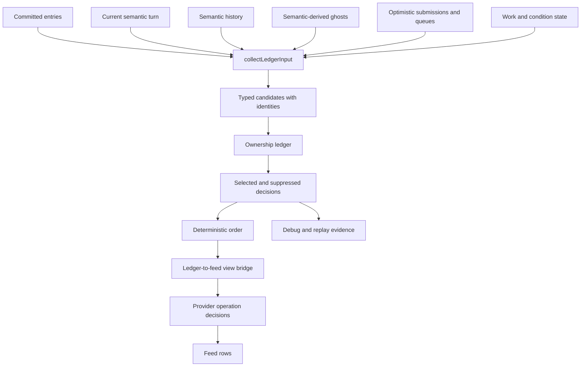

### 12.2 Candidate identities and evidence

The model distinguishes content owner from observation plane. Owners include committed, current/history semantic, ghost fallback, local submit, queue, work, condition, empty and unknown. Planes describe where the observation came from. Neither label alone establishes ordering or identity.

Candidates carry native message/item/turn identities where available, tool-use/call/result identities, content unit type, source timestamps and stable sequence evidence. Producer timestamps are preferable to local receipt timestamps when trustworthy. Array index is not a durable identity across history prepend, trimming or replay.

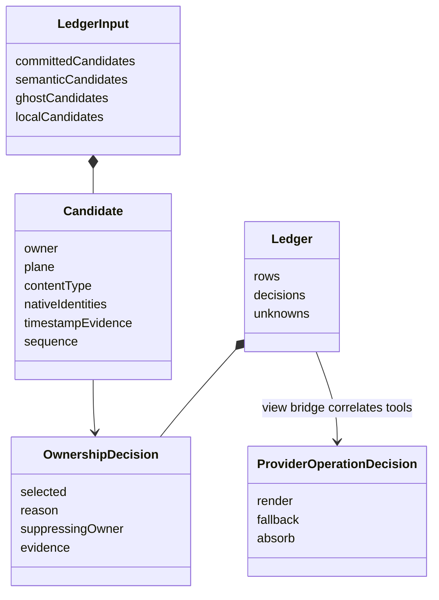

These are selected conceptual fields over the concrete types in [rendering model types](src/renderer/src/rendering/model/types.ts).

### 12.3 Committed/live reconciliation

Committed evidence is admitted first. Matching committed ownership suppresses semantic or fallback candidates for the same content unit. Exact native identities carry more meaning than text similarity. Text matching is exact or normalized whole-text matching, not an arbitrary prefix/fuzzy test that could merge two similar responses.

Provider differences remain explicit. Claude can suppress a completed semantic-history turn through a durable message identity, while its current live turn still needs unit-level handling. Codex and OpenCode require finer unit ownership. Tool use, tool input and tool results cannot be collapsed simply because they occur in one assistant turn.

Some Claude historical tool observations are suppressed only with specific operation types and later committed evidence. This is a constrained reconciliation rule, not a general instruction to discard unresolved tools. Unknown shapes are retained as explicit unknown evidence rather than silently assumed to be ordinary text.

Sources: [candidate collection](src/renderer/src/rendering/adapter/collectLedgerInput.ts), [ledger](src/renderer/src/rendering/model/ledger.ts), [ownership rules](src/renderer/src/rendering/model/ownership.ts), [ordering](src/renderer/src/rendering/model/order.ts).

### 12.4 Ghosts are fallback evidence

Current ghosts are derived from semantic blocks and encoded into transcript-compatible shapes. They are not terminal-screen OCR or scraped assistant prose. Tool-result outputs and unknown semantic blocks do not automatically become ghosts.

A ghost is eligible only if it remains unsuperseded, is sufficiently orphaned from its producing live state, has no semantic owner, passes committed-tail timing checks where a tail exists, and passes the sidecar-noise rule. The current orphan grace is 30 seconds. A missing committed tail relaxes the time comparison, not every other guard. Short assistant-only sidecar candidates are constrained to avoid resurrecting incidental text as the main answer.

When durable identities arrive, supersession uses native message/item/tool evidence. Ghost journals provide forensic continuity but are not the provider's conversation store. Older comments and design notes discuss a different ghost cutover; the current source is [ghost generation](src/renderer/src/session-runtime/ghosts.ts) and [eligibility predicate](src/renderer/src/rendering/model/ghostPredicate.ts).

### 12.5 Provider operation rendering

Provider configuration maps raw committed records into shared entries and supplies semantic folding policy, conditions, and render decisions. Some mappers are stateful. In particular, a Codex live mapper's turn cursor belongs to one ingestion stream; history, preview and independent replay need fresh mapper instances.

Operation rendering has three explicit results: render a specialized operation, use a fallback, or absorb an entry into another operation with ownership evidence. Tool-use and tool-result correlation can prove that a ledger row produces no independent paint. The view bridge and mounted rows share the same operation resolver, avoiding one rule for “visible count” and another for actual rendering.

Shared operation protocols cover code edits, commands, discovery, Git/test output, media, structured output, MCP content, orchestration, AI workspace and workflow results. Provider adapters decide when native evidence conforms to those protocols. A tool name alone is insufficient to claim a specialized result shape.

Sources: [provider renderer implementations](src/providers), [shared render protocols](src/providers/shared/renderer/protocols), [ledger feed hook](src/renderer/src/features/feed/ledger/useLedgerFeedItems.ts), [Feed](src/renderer/src/features/feed/ui/Feed.tsx).

### 12.6 Stream phase is not process lifecycle

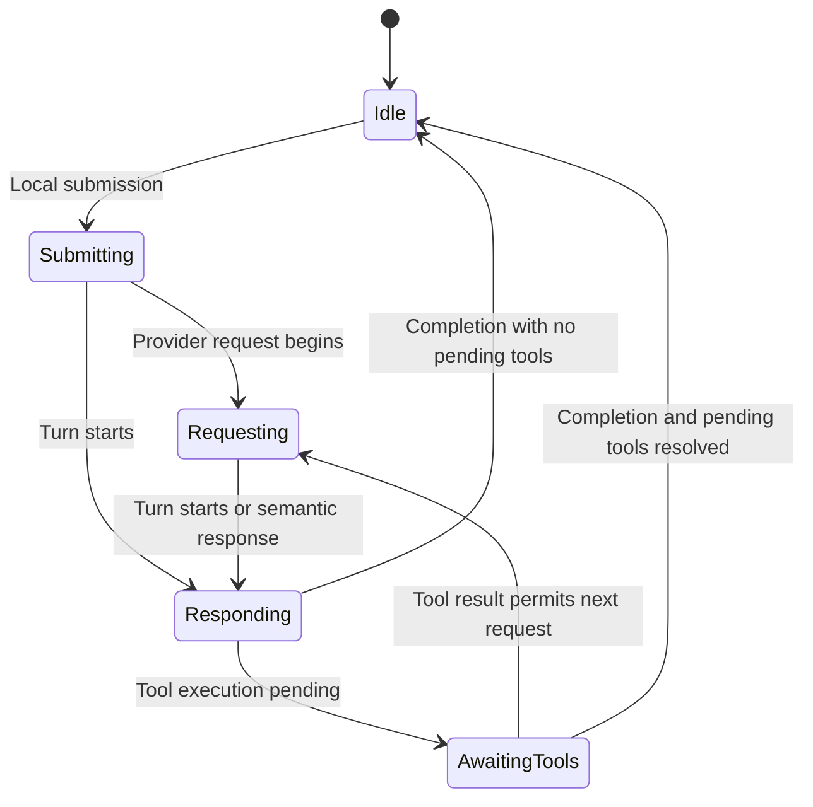

This conceptual phase view explains the busy/work indicator. Actual folding also handles provider phase events and partial ordering. A completion event cannot force idle while tracked tools remain pending. See [stream phase machine](src/renderer/src/session-runtime/semantic/streamPhaseMachine.ts).

### 12.7 Memory and DOM are bounded separately

The live entry window targets 2,000 entries or an estimated 32 MiB, then trims toward 1,500 entries / 24 MiB. These are soft targets: current content, pairing and identity invariants take precedence. Explicitly loaded older history receives a grace period, and total durable entry count is separate from in-memory count. Trimming also has to preserve enough identity state to prevent live replay from immediately reintroducing removed entries while still allowing explicit history pagination.

The feed eagerly mounts its last 30 rows. Earlier rows mount through `IntersectionObserver` with lookahead; distant historical rows can unmount again while preserving measured height. This limits Markdown parsing, code highlighting and retained DOM independently of transcript data. Bootstrap replay temporarily suspends lazy observation to avoid mounting a large history burst while scroll position is being restored.

Neither mechanism proves a hard total renderer heap limit. Provider caches, indices, semantic state, editors and debug capture have their own lifetimes. Sources: [live entry window](src/renderer/src/session-runtime/liveEntryWindow.ts), [lazy row mounting](src/renderer/src/features/feed/ui/rows/LazyEntry.tsx).

## 13. History and transcript transformations

### 13.1 Native history loading

Claude and Codex history is read from provider-native files. Exact resolution matters: directory recency is not sufficient to select a conversation. A missing selected Claude transcript is an error, not a successful empty history.

The history loader reads backward from EOF in 256 KiB chunks to obtain a suffix without parsing the entire file. The initial count of durable entries can still require a broader newline scan; “tail loading” does not mean the first request is constant-time in all file sizes.

Older pages carry byte-offset and entry-marker evidence. A supplied offset must correspond to the expected marker; duplicate markers or a changed file can invalidate a naive cursor. The loader has a fallback search rather than endlessly returning the same page. Offsets remain associated with raw records across mapping.

Transcript inspection for MCP/control is a separate bounded projection service. It supports read/inspect/search with item and character limits instead of returning arbitrarily large raw files. OpenCode uses its native API/export boundary and is not made into an arbitrary local JSONL path by its URI.

Sources: [history loader](src/main/sessions/historyLoader.ts), [transcript reader](src/main/agentTranscripts/AgentTranscriptReader.ts), [provider transcript resolution](src/providers/registry.main.ts).

### 13.2 A neutral conversation model

Provider switch, duplicate and rewind share a transcript engine. Each native provider has an adapter for reading and writing its format. The parser package decodes into a neutral `ConversationDocument`, applies operations and target projection, then writes a provider-native artifact.

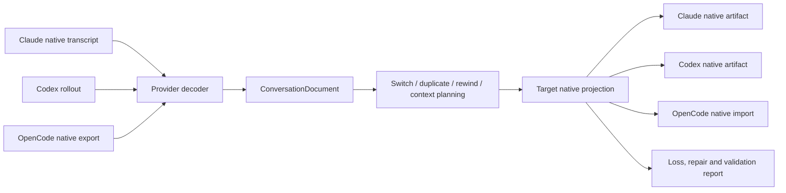

This avoids a separate converter for every ordered provider pair. It does not eliminate provider differences. Archive preservation can retain opaque provenance that a native resume target cannot safely execute. A successful archival round trip is weaker evidence than verified native resume compatibility.

Native projection is constrained by provider profiles and tested evidence. Unsupported or repaired content is reported. Codex encrypted compaction state cannot simply be transplanted as a portable summary. A Claude compaction boundary is not a summary until its durable summary carrier exists. Provider API failures are not rewritten as assistant speech to make a transcript appear complete.

Sources: [transcript engine](src/main/providerSwitch/transcriptEngine.ts), [parser package](packages/agent-transcript-parser), [switch implementation](src/main/providerSwitch/switchProvider.ts).

### 13.3 Provider switching

Switch planning reads and validates the source before writing a target. It resolves target model/context metadata, determines whether existing history fits, and produces a native resume projection. The default policy does not spend a source-provider turn and does not automatically compact after arrival.

Context estimation is not an exact tokenizer guarantee. The planner uses target metadata consistently for budgeting and native projection, including configured model/context information when available. If truncation is allowed, the reduction ladder favors a portable summary, removes unreadable compaction carriers, replaces oversized old tool output with explicit placeholders, shortens supported string fields while preserving structure, and finally drops whole oldest turns with reported loss. It refuses a projection when the retained history cannot meet the selected policy.

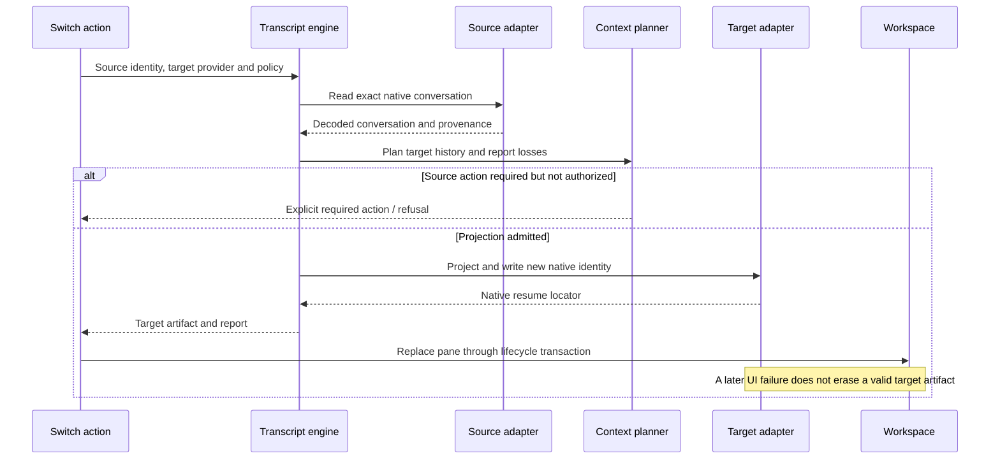

Opt-in source compaction/handoff uses an actual source-provider turn and waits for durable evidence. It is not a screen-only operation. Optional Claude compaction after arrival is a separate step on the newly created session; its failure does not retroactively invalidate an already successful provider switch.

Source operations are serialized using native/application identity locks. An empty semantic source can return an explicit source-empty result so the renderer can create a fresh target session without pretending to transfer meaningful conversation history.

### 13.4 Duplicate and rewind

Duplicate projects a new native identity. It does not give two active sessions permission to write the same native conversation. Rewind addresses a particular user prompt using stable source evidence, validates the source still matches, retains the conversation before that prompt, and returns the removed prompt/images as a draft. All required validation and projection precede the new artifact write.

This is a conversation-history operation, not an automatic rollback of project files or Git state. A native agent may already have changed files after the chosen prompt. Documentation and UI must not imply those effects are undone merely because the next conversation begins from earlier context.

Sources: [provider-switch module](src/main/providerSwitch), [parser operations](packages/agent-transcript-parser/src), [workspace actions](src/renderer/src/workspace/hook/actions).

## 14. Terminal surfaces and tmux

Ordinary shell terminals and agent-native terminal views share xterm-based rendering but have different backend ownership. An ordinary terminal is a workspace session backed by a direct PTY or tmux. An agent terminal view attaches to the already managed provider PTY; changing the view must not spawn a second agent.

Raw byte dispatch is centralized so mounting another UI consumer does not create competing global IPC subscriptions. Agent PTY attachments have owner/size coordination and retained capped output for attachment continuity. The visible terminal owner controls size; a hidden duplicate view must not resize the native application to its own dimensions.

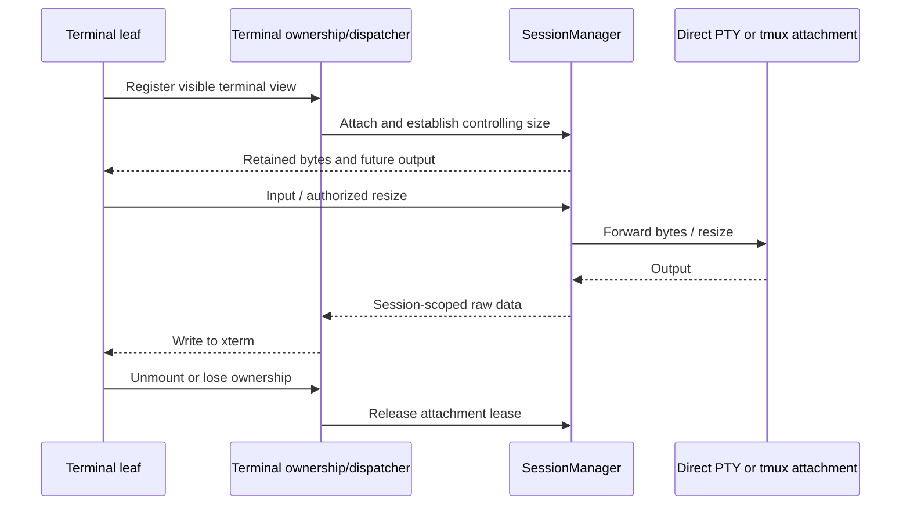

### 14.1 Persistence scope

The application uses its bundled tmux through a dedicated registry. It does not opportunistically attach to a user's unrelated system tmux sessions. Managed names/prefixes constrain reconciliation and cleanup. If bundled tmux is unavailable, ordinary terminals fall back to direct PTY and lose that process-persistence capability.

Reconciliation compares persisted terminal references with managed live sessions: known/live sessions are recoverable, known/dead sessions are lost, and unreferenced managed sessions are treated as orphans and killed. This policy makes the correctness of the persisted-reference reader critical.

**Current integration discrepancy:** main startup reads `parsed.workspace.sessions` to obtain tmux references, but `WorkspaceFileStore` writes the version-2 `windows[].workspace` envelope. For a normal v2 file that legacy read yields no references. With managed tmux sessions present, reconciliation can classify them as orphans. The persistence intention and the current multi-window startup behavior therefore differ; this reference does not claim reliable tmux survival across that path.

The mismatch is directly visible in [startup reconciliation](src/main/index.ts), [workspace format](src/main/storage/workspaceFile.ts), and [tmux reconciliation](src/main/tmux/tmuxRecovery.ts). No runtime change is part of this documentation work.

### 14.2 xterm lifecycle and patched dependency

WebGL renderer creation and disposal follow terminal visibility/lifetime so hidden panes do not indefinitely retain GPU contexts. Renderer fallback and context-loss behavior belong in the centralized xterm renderer helper.

At this revision, the pinned xterm core also requires a local patch to remove a resize-time queued-write flush that can replay/drop terminal writes. The patch is enforced both after installation and whenever the Electron Vite configuration loads. Version or bundle-shape mismatch aborts the build. Vite prebundling is disabled for xterm so a stale optimized copy cannot bypass the patched installed bundle during development.

Sources: [tmux registry](src/main/tmux/TmuxRegistry.ts), [terminal dispatcher](src/renderer/src/workspace/terminal/sessionDataDispatcher.ts), [WebGL lifecycle](src/renderer/src/workspace/terminal/xtermWebglRenderer.ts), [xterm patch](scripts/patch-xterm.mjs), [build configuration](electron.vite.config.ts).
