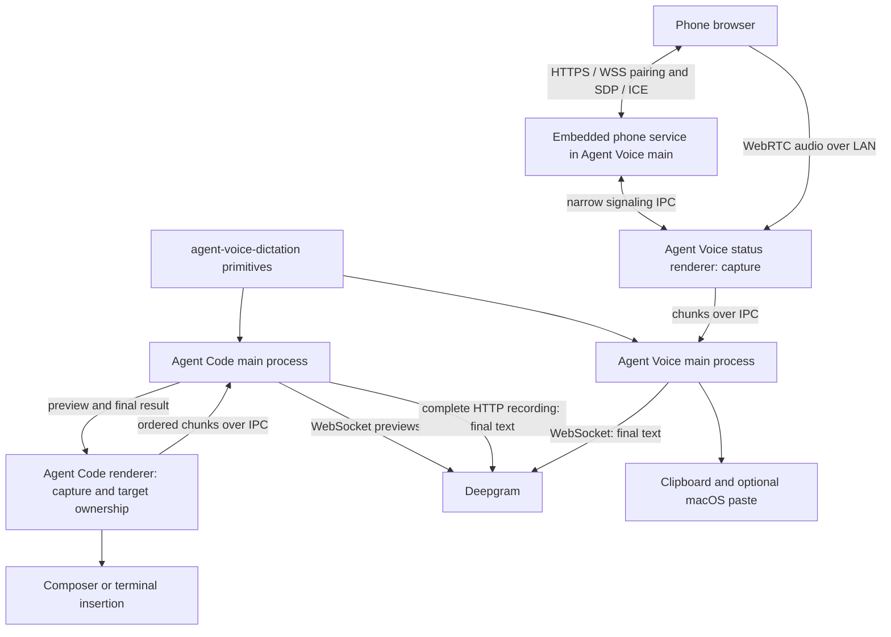

# Agent Voice implementation debrief

Investigation date: 2026-09-05. This is a revision-specific implementation review, not a deployment certification.

## TL;DR

- Agent Voice is implemented as a reusable TypeScript package **and** a standalone Electron app in `agent-voice-dictation`. Agent Code consumes a pinned Git submodule through a local package dependency. The standalone app has newer microphone, phone, and focus-routing work that the host's submodule does not contain; the reusable `src/` library is identical between those revisions.
- Deepgram is the only enabled product provider. The library contains five batch clients, Deepgram streaming, browser recording/metering, optional OpenRouter cleanup, and composer helpers. Client existence does not establish live provider compatibility.
- Agent Code records locally, streams for previews, then uploads the complete recording for the authoritative transcript. It inserts into the selected composer or terminal without submitting. Standalone Agent Voice instead finalizes from streaming and copies/optionally pastes into the foreground application.
- The related service located here is an **embedded LAN phone-microphone HTTPS/WebSocket signaling service**, not an independently deployed transcription backend. Phone audio travels over WebRTC to the desktop renderer, which uses the ordinary dictation path.
- Merged voice revision `68353a8` has passing package, Electron, and native CI. However, phone signaling tests missed a real decoded-audio failure. Issue #48 records a working local repair and user retest; that repair is in an unmerged worktree, not the reviewed main revision. Several insertion, lifecycle, persistence, and UI limitations remain open.

## 1. Discovery, scope, and evidence rules

Discovery started with Agent Code's [README][ac-readme], [AGENTS.md][ac-agents], [package manifest][ac-package], [submodule map][ac-submodules], and documentation index, following the local `agent-code-conventions` skill. The README names the voice repository; `.gitmodules` supplies its actual location. This is a `file:` dependency, not an npm workspace inferred from a directory name. The voice repository's README, instruction files, manifests, exports, build aliases, Git worktrees, and remote history then led to the app and service.

| Component | Actual local location | Reviewed revision / state |
| --- | --- | --- |
| Agent Code host | `/Users/juliusolsson/Desktop/Development/agent-code` | `5d6418459d8eb6aa99819eaec70e1f0610c898a7`; existing modified `package-lock.json` |
| Host's pinned voice package | `/Users/juliusolsson/Desktop/Development/agent-code/packages/agent-voice-dictation` | Detached, clean `3c6f962843532da2a7ddf2cc80f38cacd3196bb1`; matches host's Git tree pin |
| Independent voice checkout | `/Users/juliusolsson/Desktop/Development/agent-voice-dictation` | Main `68353a85c9e14fa8f017691b1f53962089effb02`; existing modified `apps/flow-electron/package-lock.json` |
| Standalone desktop app | Above checkout, `apps/flow-electron` | Included in voice main; separate private package with `file:../..` dependency |
| Embedded phone service | Above app, `src/main/phone/{server,certificates,pages}.ts` | Merged through PR #44; renderer receiver at `src/renderer/phone/receiver.ts` |
| Unmerged phone-audio repair | `/Users/juliusolsson/Desktop/Development/agent-voice-dictation-chrome-phone-audio` | Branch `fix/chrome-phone-audio`, plan commit `46008dc`, implementation changes in working tree |

A direct `git diff 3c6f962… 68353a8… -- src` was empty. Thus the newer standalone features do not imply a different provider library inside Agent Code. Updating a submodule also would not automatically embed the standalone Electron app or phone server in Agent Code. Host/package alignment is separately tracked in [Agent Code #786](https://github.com/Juliusolsson05/agent-code/issues/786).

No separate cloud dictation microservice or container deployment was found in the traced package, app, repository references, or inspected repository inventory. The embedded phone service is the service reviewed here. Agent Code also has its own mobile `/dictate` endpoint, covered below; it is a different architecture. This finding does not rule out a separately named service outside the discovered references.

Evidence labels used throughout:

- **Inspected:** source, configuration, diffs, and history read during this investigation. This establishes implemented control flow, not successful hardware execution.
- **CI observed:** existing GitHub Actions job results and logs retrieved during this investigation, tied to a specific revision.
- **Reported:** assertions in issue/PR/plan records, including previous manual tests. These were not reproduced here.
- **Unverified:** behavior for which those sources do not establish end-to-end success.

No tests, builds, dependency installations, live provider calls, microphone capture, OS paste, signing, or deployments were run. No private key files, real user histories, or audio recordings were opened. Application files and pre-existing changes were left untouched; this document is the only requested write. Existing issues were read rather than changed or duplicated, consistent with the explicitly read-only scope.

## 2. Architecture and public contracts

### Reusable package

The [manifest][v-package] declares version `0.1.0`, ESM, Node `>=20.19.0`, built `dist` output, and `ws` as its runtime dependency. [Root exports][v-index] expose the following families:

| API family | Implemented contract and boundary |
| --- | --- |
| Recording | `createBrowserRecorder` provides start/stop/cancel and stream/MIME access. Stop returns a Blob, MIME, duration, and timestamped chunks. It buffers chunks; it does not expose the hosts' incremental IPC streaming lifecycle. |
| Metering | `createAudioLevelMeter` samples Web Audio RMS/peak with timestamps; defaults include FFT size 1024 and 60 ms sampling. |
| Batch STT | `SpeechProvider.transcribe(TranscribeOptions)` and provider-specific factories/functions accept `Blob`, `ArrayBuffer`, or `Uint8Array`, optional MIME/filename, key, language, signal, diagnostic callback, and loose provider options. |
| Normalized results | `SpeechTranscript` contains provider/text and optional language, duration in milliseconds, word timings, utterances, and raw upstream payload. Normalization preserves provider-specific escape hatches rather than promising identical semantics. |
| Streaming | `createDeepgramStreamingProvider` manages session IDs with `start`, `pushChunk`, `stop`, and `cancel`, plus transcript/trace callbacks and stop statistics. It is a Node WebSocket implementation. |
| Cleanup/pipeline | `polishTranscriptWithOpenRouter` accepts transcript and optional recent context. `dictate` performs batch STT, optional cleanup, and returns transcript, polished result, selected text, and timing. |
| Composer/environment | STT wrap/strip helpers; a small dotenv parser/merge utility. The parser is not a shell evaluator and does not implement full dotenv expansion or multiline syntax. |

Sources: [recording][v-recorder], [speech types and clients][v-speech], [streaming implementation][v-stream], [OpenRouter][v-openrouter], [pipeline][v-pipeline], [composer][v-composer], [environment][v-env].

The published export map contains only `.`, `./composer`, and `./env`. The root transitively imports Node facilities and `ws`; it is not a generally browser-safe entry point. The pure composer/env exports deliberately avoid that coupling. Agent Code imports `agent-voice-dictation/speech` through [its source aliases][ac-vite] and TypeScript paths. That subpath is **not** a declared public package export for an ordinary installed consumer. Both products implement their own recording orchestration instead of using the library recorder as their complete recording engine.

The library recorder is a thin primitive, not the hardened host lifecycle: it has no generation guard for cancellation while `getUserMedia` is pending, or failure cleanup around constructing/starting MediaRecorder after tracks are acquired. Those are inspected edge cases, not reproduced failures in this review. Host cleanup guarantees must not be attributed automatically to the exported recorder.

### Provider implementation versus product support

| Provider | Inspected batch implementation | Product / verification boundary |
| --- | --- | --- |
| Deepgram | POST `/v1/listen`; default `nova-3`, smart formatting, optional language/diarization. Streaming uses `/v2/listen`, default `flux-general-en`. | Only selectable provider in the support registry and Agent Code. Deterministic tests verify request/lifecycle behavior, not current live accuracy. |
| AssemblyAI | Upload, create transcript with `speech_models` defaulting to `universal-3-pro`, then poll; optional speaker labels and language handling. | Batch implementation exists; disabled in streaming-only app UX. Request-shape tests use stubbed fetch. Comments describe prior live validation, not a fresh run. |
| OpenAI | Multipart `/audio/transcriptions`; defaults `gpt-4o-mini-transcribe` and `verbose_json`. | Disabled/unverified. Current vendor acceptance of that model/format combination was not established here. |
| Gladia | Upload, start pre-recorded transcription, poll and normalize. | Disabled/unverified. |
| ElevenLabs | Multipart speech-to-text, default `scribe_v1`, word timing normalization. | Disabled/unverified. |

The [support registry][v-support] is intentionally stricter than the exported client list. AssemblyAI/Gladia polling defaults are 1.5 seconds with a 120-second polling budget; this is not a universal whole-request deadline. There is no common retry/backoff policy across clients. Model names and API options above are inspected defaults, not independently checked vendor documentation.

### Streaming design and its limits

[Deepgram streaming][v-stream] queues bytes until the socket opens and sends only the model in its default v2 URL. MIME is diagnostic metadata, not converted into explicit encoding/sample-rate parameters. It accumulates final turns and combines the final text with an interim tail using equality/containment checks, preventing common duplication and truncation cases. `EndOfTurn` counts as final; it can finalize an already-stopping session promptly.

Stop sends `CloseStream` only after actual audio was sent, avoiding an empty-stream protocol error. A connecting session waits for open before stopping. The default stop grace is zero; a 1.5-second watchdog requests socket close once open. This is **not a hard end-to-end timeout**: connecting can remain pending, queued bytes are unbounded, and cancellation removes session state without settling an already-awaited completion promise. Failed sessions are retained for subsequent stop/cancel handling. These are concrete lifecycle constraints tracked in [voice #35](https://github.com/Juliusolsson05/agent-voice-dictation/issues/35).

OpenRouter cleanup defaults to `deepseek/deepseek-v4-flash`, temperature zero, and a prompt to remove verbal noise while preserving intent/identifiers. Context supports preceding/selected text, project hints, and up to eight recent messages. The library pipeline propagates a thrown cleanup error; an empty cleanup response can fall back to raw text. Standalone has a separate intended error fallback, but its cleanup is currently hard-disabled. Agent Code does not wire contextual cleanup into its active dictation path.

## 3. Standalone Agent Voice lifecycle

### Process and UI ownership

The app has a normal Hub for settings/history and a persistent transparent Status window for recording. Main owns provider sessions, secrets, clipboard/paste, stores, native helper, and phone service. The Status renderer owns browser media APIs. [Preload][v-preload] exposes a typed `FlowApi` through narrow IPC; windows use context isolation and disable Node integration, although sandboxing is explicitly disabled. The [IPC implementation][v-ipc] covers settings/secrets, hotkey configuration/capture/status, batch and stream dictation, recents, window control, and phone service/signaling/manual dictation.

The Status window is a nonactivating panel with topmost/full-screen-space handling, position clamping, and generation-aware delayed hiding. Reasserting its panel behavior addresses Electron/macOS focus and Spaces behavior. Its renderer remains alive and unthrottled while hidden so a paired phone can keep supplying audio. These choices make window lifetime part of the audio architecture, not merely decoration. [Window code][v-windows]

### Capture → stream → insertion

1. A keyboard/mouse edge, or phone settings control, starts the Status lifecycle. A synchronous lifecycle ref and capture generation protect asynchronous transitions: idle → starting → recording → stopping → transcribing, with error/reset paths.
2. Settings are loaded per capture. The renderer obtains the selected local device or a clone of the paired phone track, creates a meter, and chooses a supported MediaRecorder MIME (`audio/webm;codecs=opus`, WebM, then MP4). Recorder slices are requested every 80 ms.
3. Main starts the selected streaming provider. Chunks are buffered while the session ID is pending and then forwarded over IPC. The renderer tracks conversion/send promises and waits for them before finalization. Unlike Agent Code's explicitly serialized chain, this implementation uses independent asynchronous chunk conversion and a queue snapshot; its ordering protection should not be assumed identical to the host's regression-tested path.
4. Very short holds/recordings are discarded using 180 ms guards. Stop requests remaining data, delays recorder stop by 35 ms, waits for recorder completion and pending sends, and releases media tracks before waiting on the provider. Unmount/cancel paths release owned resources; generation checks discard stale asynchronous results.
5. Standalone uses the streaming transcript as final. The provider adapter does not wire live transcript previews into this UI, and this path has no full-recording HTTP fallback. The separately exposed batch `dictation:run` is not the Status app's normal path.
6. On success, main formats raw/cleaned text, writes clipboard first, optionally synthesizes macOS Cmd+V, then appends a recent record. Writing clipboard first preserves a manual recovery route. Empty speech is an ordinary outcome. Errors are displayed before a delayed idle reset.

Sources: [Status lifecycle][v-status], [main orchestration][v-controller], [provider adapters][v-providers], [microphone selection][v-microphone].

`DEEPSEEK_POLISH_TEMPORARILY_DISABLED = true` bypasses cleanup regardless of the visible toggle. `handsFreeMode` controls pill controls; it does not implement a separate fully hands-free triggering mode. Recents retain raw and optional polished text, not audio, capped at 200 rows. Hub statistics derive from retained rows rather than independent lifetime totals; duration/WPM repair heuristics reject implausible values. [Controller][v-controller], [settings][v-settings], [recents][v-recents]

### Native triggers and Agent Code coexistence

The macOS helper uses a CGEventTap, requiring Accessibility permission. It supports the shared physical-key vocabulary, modifier-only/Fn bindings, and optional middle/extra mouse buttons. Keyboard and mouse maintain an active-owner set: repeats do not restart recording, overlapping triggers produce one recording, and the last release stops it. Shortcut-capture UI temporarily suppresses normal trigger handling. The helper service has buffered line parsing, child-generation ownership, readiness/error status, a five-second readiness budget, and retry/last-press diagnostics. [Native sources and contracts][v-native], [helper lifecycle][v-helper], [hotkey service][v-hotkey]

The modular [integration registry][v-integrations] recognizes packaged Agent Code (`com.agentcode.app`, with name matching), not generic `com.github.Electron` development identity. Swift reads the focused Accessibility element with short timeouts and checks editable roles, enabled state, and settable value. Standalone yields only for a matching focused editable field; merely hovering Agent Code or focusing noneditable chrome does not suppress it. With integration targets enabled, unknown focus permits global capture but prevents automatic paste. Disabling every integration target bypasses that paste focus probe. A second focus check before paste reduces interference with Agent Code.

This is policy-based coexistence, not an Agent Code RPC integration. It still does not retain a universal original destination across transcription latency. Actual focus-role exposure and physical hotkey behavior on the final installed pair remain live verification requirements. [Focus policy][v-focus], [PR #46](https://github.com/Juliusolsson05/agent-voice-dictation/pull/46), [issue #28](https://github.com/Juliusolsson05/agent-voice-dictation/issues/28)

## 4. The embedded phone-microphone service

### Service contract and audio path

[PhoneMicServer][v-phone-server] is opt-in and runs inside Electron main. It binds HTTP setup (preferred port 43123), HTTPS microphone page/WSS signaling (43124), and falls back to available ports on collision. It advertises a selected LAN IPv4 address while listening on `0.0.0.0`. HTTP serves setup and `ca.cer`; HTTPS serves `/` and `/phone.js`; WSS `/signal` carries pairing and SDP/ICE, not transcription requests.

Each installation gets a local CA. Server start generates a leaf certificate with the current address and localhost SANs; inspected lifetimes are ten years for the CA and thirty days for the leaf. Certificate creation uses system OpenSSL, restricted directories, and private-key file modes. The phone must manually install and fully trust the CA; the UI exposes a fingerprint. HTTP bootstrap therefore assumes the user's trusted LAN. The implementation does not bypass browser TLS validation or automatically install trust. [Certificates][v-phone-certs], [setup and phone page][v-phone-pages]

Pairing uses a random 32-byte token per service lifetime. The QR URL carries it in a fragment; the phone page clears that fragment from history and sends it as the first pairing message. The server uses constant-time token comparison, validates allowed hosts/origins, limits unauthenticated sockets, enforces a five-second authentication window, admits one authenticated phone, and bounds message sizes/rates. SDP must contain audio without video; candidate/message sizes are checked. Heartbeats and disconnect handling release peers, and server restart rotates authorization. Status-renderer identity is checked at the signaling IPC boundary. These are inspected controls; tests do not individually exercise every configured limit.

The phone's user gesture requests microphone access with audio processing constraints. A direct WebRTC peer uses `iceServers: []`: no STUN/TURN or cloud audio relay. Main relays signaling between the phone and Status renderer. The hidden renderer owns the receiving peer and persistent track; each dictation receives cloned tracks so stopping one recording does not destroy pairing. Pairing itself does not send audio to Deepgram. Network reachability, browser permission, a trusted secure origin, and a foreground/unlocked phone are operational requirements. The page disconnects when hidden and requests wake lock where available. [Phone page][v-phone-pages], [receiver][v-phone-receiver], [shared contract][v-phone-contract], [phone settings][v-phone-ui]

### Merged readiness is weaker than working audio

At `68353a8`, receiver readiness means a connected peer with a live, unmuted track. It does not prove decoded samples or a useful MediaRecorder output. [Issue #48](https://github.com/Juliusolsson05/agent-voice-dictation/issues/48) reports several real 1.0–6.7-second recordings that connected successfully but sent zero chunks to Deepgram. A generated-tone reproduction received RTP packets with zero decoded samples.

The **inspected local, unmerged** repair adds an active muted audio playback element attached for the receiving peer's lifetime, disposing it on reset. It also adds packet/decoded-sample diagnostics and a real Electron regression script that connects generated audio through the production receiver, records consecutive captures, decodes them, and checks nontrivial bytes and RMS. This specifically tests the missing media-consumption boundary rather than another mocked signaling round trip.

The local plan and issue report that this restored decoded audio and that a subsequent real capture sent 39 chunks / 74,167 bytes, returned a transcript, and pasted successfully with user confirmation. **Those are reported previous results, not this investigation's test results.** The patch/script are working-tree changes on `fix/chrome-phone-audio`; no merged implementation or corresponding completed PR was found. Installed `/Applications/Agent Voice.app` bytes were not inspected, so source main, local repair, and any locally installed build must not be conflated.

Local evidence: [repair receiver](/Users/juliusolsson/Desktop/Development/agent-voice-dictation-chrome-phone-audio/apps/flow-electron/src/renderer/phone/receiver.ts), [real-audio regression script](/Users/juliusolsson/Desktop/Development/agent-voice-dictation-chrome-phone-audio/apps/flow-electron/scripts/test-phone-audio.mjs), [working implementation plan](/Users/juliusolsson/Desktop/Development/agent-voice-dictation-chrome-phone-audio/IMPLEMENTATION_PLAN.md). These links describe mutable local work, unlike the revision-pinned source references elsewhere.

## 5. Agent Code integration

### Host API and capture ownership

[Host preload][ac-preload] exposes key status/set, hotkey configure/down/up subscriptions, stream start/chunk/stop/cancel and preview events, plus history list/delete/clear/reset. [Shared types][ac-types] use structured success/no-speech/error outcomes. Main resolves credentials and keeps provider work out of the renderer. [Controller][ac-controller], [IPC][ac-ipc]

The feature defaults off, provider Deepgram, keyboard `Cmd+Shift+D`, and mouse trigger disabled. The ordinary Electron global shortcut toggles because it lacks key-up events. Native bare-modifier/Fn bindings support real hold-to-talk with Accessibility permission. The in-app mouse trigger has its own pointer arbitration and does not require an OS-wide mouse tap. Comments still mentioning a default Fn binding are historical; the [settings defaults][ac-settings] are authoritative.

The renderer registry selects the focused, otherwise most-recently-focused eligible target and retains that target across a capture. Visibility and interaction-owner gating prevent hidden panes/new conflicting interactions from claiming it. Composer and terminal surfaces use the common hook. This ownership is separate from standalone's keyboard/mouse owner-set policy. Main dispatches hotkey edges to the currently focused window, while preview callbacks are routed to the originating window; cross-window focus changes between press and release therefore deserve explicit end-to-end coverage. [Registry][ac-registry], [mouse trigger][ac-mouse], [host IPC][ac-ipc]

### Capture → preview → batch finalization → insertion

1. [The composer hook][ac-capture] saves the initial target/draft and acquires audio. It prefers the built-in Mac microphone by device label, otherwise system default; it does not use standalone's device picker or LAN phone receiver. A one-time prewarm obtains/stops tracks when enabled to improve permission/device enumeration behavior.
2. MediaRecorder slices every 120 ms. Initial chunks wait for the main session. A serialized promise chain preserves conversion order, and queue draining finishes before publishing the ID to the direct-send path. Exactly zero-length chunks are skipped; even a one-byte initial container chunk is preserved.
3. Main buffers the entire audio and pushes best-effort chunks to Deepgram streaming for cumulative live previews. The UI displays draft/overlay previews. Early release and minimum-duration gates suppress accidental taps; main rejects empty or under-300-ms recordings.
4. On release, the hook drains recorder output and pending sends. Main ends streaming but does **not** use its returned text as authoritative. It concatenates the complete recording and calls HTTP Deepgram batch transcription (`nova-3` default). This avoids premature turn-end/truncated-stream text becoming the committed draft, at the cost of another upload, latency, and potential duplicate provider billing.
5. Very short malformed-audio requests have a narrow no-speech downgrade: qualifying 4xx errors with at most three chunks and under one second, excluding authentication/authorization/rate limiting. Other failures surface. There is no inspected fallback that commits the streaming preview after a failed authoritative batch request.
6. Success returns raw text and formatted insertion text. Composer insertion appends to the saved draft with paragraph separation; terminal insertion uses bracketed paste without Enter. The STT wrapper warns downstream agents about transcription errors. Dictation does not auto-submit. Empty/error/cancel paths restore the saved base instead of retaining speculative previews.

The wrapper is `<stt note="Speech-to-text; may contain transcription mistakes.">…</stt>`. It is applied at insertion, not stored around history text. It is text framing, not an escaping/security boundary. [Composer helpers][v-composer], [host capture][ac-capture], [IPC finalization][ac-ipc]

Cancellation has an inspected gap: the host's `stream-cancel`/cleanup removes its own active session but does not call the library provider's `cancel`. That can leave underlying provider work alive. Saving the initial draft also means edits made concurrently during capture need deliberate behavioral testing. These observations should not be mistaken for new reproduced incidents. Broader reliability remains tracked in [Agent Code #243](https://github.com/Juliusolsson05/agent-code/issues/243).

### History, diagnostics, and credentials

Agent Code's [history store][ac-history] is more robust than standalone recents. It keeps up to 200 raw-text entries plus independent lifetime totals, with a separate WPM numerator for measurable-duration records. Deleting entries/clearing the list preserves totals; reset clears both. Mutations serialize through a queue and write via temporary file plus atomic rename. File/directory modes are `0600`/`0700`. Missing files mean empty history; corrupt JSON is quarantined, and unsupported versions/read failures are not silently overwritten. Atomic rename is not an fsync durability guarantee. Append is fire-and-forget relative to successful insertion; shutdown flushing is best effort.

The [history UI][ac-history-ui] supports expansion, copying raw text, deletion, list clearing, and statistics reset. It does **not** implement direct paste/reinsert. It loads on mount/retry and consumes mutation-returned snapshots; there is no new-dictation push subscription refreshing an already-mounted panel.

Paths use `STATE_DIR = ~/.config/<APP_SLUG>`: `dictation/history.json` and `dictation/deepgram-api-key.bin`. [Key storage][ac-keys] prefers `DEEPGRAM_API_KEY` over an Electron `safeStorage` encrypted file, writes atomically with restricted modes, and exposes only status/source/last-four hint to the renderer. The UI clears newly entered plaintext after storage.

[Dictation diagnostics][ac-journal] are always-on local per-session JSONL under Electron `userData/dictation-debug`, with restricted permissions, batched writes, and fourteen-day startup pruning. They contain transcript text and device labels, plus chunk metadata/hashes rather than ordinary audio payloads. `AGENT_CODE_DICTATION_DUMP=1` explicitly enables audio dumps to app temporary storage. Accordingly, “no transcript logging” and “audio is never written under any configuration” would both be incorrect.

### Separate Agent Code mobile `/dictate` path

The [remote mobile client][ac-mobile] captures a complete browser recording and posts it with device Bearer authentication to `/dictate`. [RemoteServer][ac-remote-server] caps uploads at 8 MiB and distinguishes unauthorized, oversized, unavailable-STT, upstream failure, and success responses. It sends the recording to the host's batch controller; returned wrapped text is appended to the mobile draft.

This endpoint sends audio over HTTP(S), not WebRTC, and uses `DEEPGRAM_API_KEY` from the environment through [RemoteController][ac-remote-controller]. It does not reuse the desktop's settings-stored key or append through the desktop dictation history path. Browser capture requires a secure context, so ordinary remote LAN HTTP is insufficient; an HTTPS origin/tunnel can satisfy that requirement. This is an existing Agent Code remote-companion feature, not the newer standalone phone service.

## 6. Configuration and delivery

| Area | Standalone Agent Voice | Agent Code |
| --- | --- | --- |
| Key precedence | Encrypted stored provider key, then process/local `.env` fallback; app/package env file order is explicit. | Process `DEEPGRAM_API_KEY`, then encrypted desktop key; remote `/dictate` uses environment only. |
| Preference defaults | Option+Space, optional mouse, system microphone, English/Deepgram, auto-paste and sounds on, STT wrapper and cleanup off. | Disabled feature; Cmd+Shift+D toggle; mouse off; Deepgram; insertion wrapper in active path. |
| Nonsecret storage | `userData/settings.json`, `recents.json`; direct JSON writes. | Renderer preferences plus main-owned history under `~/.config/<APP_SLUG>`. |
| Secret storage | `userData/secrets.json` contains safeStorage-encrypted values. Renderer reads availability, not decrypted keys. | Encrypted binary key with atomic replacement and masked status. |
| Phone operation | Explicit start/stop; local OpenSSL, trusted CA on phone, LAN reachability, foreground phone. | Separate remote-server lifecycle; no standalone phone-service embedding. |

Standalone's env fallback can work even when a persisted-secret badge says “Not set”; that badge is not an end-to-end credential test. Its selected provider/language are coerced back to supported values. Cleanup UI remains misleading while the hard disable exists. Sources: [settings][v-settings], [env resolution][v-envkeys], [secret store][v-secrets], [host keys][ac-keys].

Recognized standalone variables are `DEEPGRAM_API_KEY`, `ASSEMBLYAI_API_KEY` / `ASSEMBLY_AI_API_KEY`, `OPENAI_API_KEY`, `GLADIA_API_KEY`, `ELEVENLABS_API_KEY` / `ELEVEN_LABS_API_KEY`, and `OPENROUTER_API_KEY` / `OPEN_ROUTER_API_KEY`. Fallback files are resolved from the compiled app location, app `.env` before package `.env`, with the first file's value winning. Each variable name checks process then file before trying its alternate spelling. Supplying a key does not override the provider support gate or cleanup disable.

The standalone app uses React 18, Electron `^39.8.10`, electron-vite 5 and Vite 6. Its predev/prebuild/prestart scripts build the parent package; root and app have separate lockfiles/install steps. [App manifest][v-app-package], [Vite configuration][v-vite]

The [local macOS packaging script][v-package-macos] accepts an Electron runtime, a new output `.app`, and optional signing identity. It copies built app/library output and `ws`, compiles the native helper, sets bundle IDs and microphone/local-network/AppleEvents usage descriptions, signs helper and bundle, then verifies the signature. It refuses an existing destination. This is a local packaging path, not a notarized public desktop release pipeline; no auto-updater or independently deployed service artifact was found. A usable build also depends on the supplied runtime architecture and system build tools.

Voice [CI][v-ci] verifies package, app, and native components. The [tag-triggered package release workflow][v-release] delegates to an immutable Agent Code shared-workflow revision. It checks tag/package version agreement, runs the deterministic package gate, packs the library, and attaches the tarball to a GitHub Release. It deliberately does **not** run `npm publish`. It does not ship the Electron app or certify phone/hotkey hardware. [Pinned shared release implementation][ac-shared-release]

Agent Code source aliases bypass a separately published library build; `ws` is kept external to avoid the prior bundled `bufferUtil.mask` failure. Its [native helper build][ac-helper-build] produces arm64/x86_64 macOS binaries and packages them under `out/main/runtime/hotkey-helper` with asar unpacking. Packaged apps use the bundled executable; development can compile Swift locally. The [host helper][ac-helper] is a separate implementation and still treats a two-second readiness timeout as success, unlike standalone's newer explicit readiness failure handling. Standalone helper fixes should not be assumed inherited by Agent Code.

## 7. What is verified, and what is not

### Existing CI logs observed during this review

| Evidence | Result actually observed | Practical limit |
| --- | --- | --- |
| Voice main `68353a8`, [run 33953827924](https://github.com/Juliusolsson05/agent-voice-dictation/actions/runs/33953827924) | All eight jobs successful. Package matrix Node 20.19.0 and 24: 7 files / 35 tests each; package smoke checks six required built entry files. | Same suite repeated across runtimes; not 70 independent contracts or live STT proof. |
| Same run, test tiers | Core 6 files / 29 tests; system 1 file / 6 tests. | These partition/repeat the package suite; do not add them to 35. |
| Same run, Electron | 14 files / 74 tests; TypeScript check and main/preload/renderer build successful. | Electron and media/native interfaces are largely mocked. Some tests overlap root selection; counts are not a unique cross-project total. |
| Same run, macOS native | Binding contracts and focused-text routing contracts passed; actual helper compiled. | Policy simulations/compilation, not physical OS key events, permissions, or actual paste. |
| Same run, coverage | Statements 50.7%, branches 38.75%, functions 50%, lines 52.89%. Thresholds 36/30/32/38. | Coverage includes library `src/**` and app shared code, not the complete app/phone runtime. It is not holistic service coverage. |
| Agent Code PR #618, [run 30366398487](https://github.com/Juliusolsson05/agent-code/actions/runs/30366398487) | Historical quality gate: 251 files / 1,711 tests; history store 12 tests and composer-hook byte regressions 4 tests visible in logs. | July 28 PR revision, not a fresh run at current host `5d64184`. |

### What the inspected tests protect

- Deepgram system tests include transcript-selection cases and localhost fake-WebSocket lifecycle tests. The fixture's transcript messages are synthetic; arbitrary sent bytes are not decoded by a speech service. [Streaming tests][v-stream-tests]
- AssemblyAI tests assert request shape with stub fetch. Live-provider tests are separately opt-in via `STT_LIVE_TEST=1` and explicit provider credentials; optional `STT_TEST_AUDIO_FILE` overrides the fixture. They assert nonempty output, not transcript accuracy. Normal CI does not establish all-provider compatibility. [Provider tests][v-live-tests]
- Phone server tests exercise real local TLS/WSS setup, auth/origin checks, exclusivity, and token lifecycle. Receiver/status tests exercise fake peer/track/recorder lifecycle. Neither established that Electron decoded remote audio, as #48 demonstrates. [Server tests][v-phone-tests], [receiver tests][v-receiver-tests], [Status tests][v-status-tests]
- Microphone tests cover selection/fallback and cleanup; shortcut/native tests cover binding normalization, repeat/overlap/release ownership, capture suppression, helper process races, and focus routing. They do not prove a particular iPhone appears as a macOS Continuity microphone. [Microphone tests][v-mic-tests], [native tests][v-native]
- Agent Code's four hook regressions protect one-byte initial data, zero-byte exclusion, asynchronous conversion order, and queued-to-direct handover. Twelve history tests cover retention versus lifetime totals, serialized persistence/flush, corrupt/read-error handling, and stored metadata constraints. [Hook tests][ac-capture-tests], [history tests][ac-history-tests]

### Historical manual evidence, not rerun here

[PR #38](https://github.com/Juliusolsson05/agent-voice-dictation/pull/38) reports microphone/UI work but also a native app-registration/LaunchServices failure. [PR #41](https://github.com/Juliusolsson05/agent-voice-dictation/pull/41) reports packaging/launch with Accessibility problems despite displayed permission; physical triggers and automatic iPhone discovery were not fully verified. [PR #44](https://github.com/Juliusolsson05/agent-voice-dictation/pull/44) records browser/setup/QR checks, but not a complete real-iPhone validation at that stage. [PR #46](https://github.com/Juliusolsson05/agent-voice-dictation/pull/46) records Apple Development signing/local installation, not notarization or a fully completed final installed-app interaction test. Later [issue #48](https://github.com/Juliusolsson05/agent-voice-dictation/issues/48) records actual successful phone dictation after the local repair.

Consequently, the supported conclusion is that deterministic contracts/builds passed and a repaired phone path has reported live success. It is not established that the merged standalone revision works end to end across microphones, phone browsers, focus transitions, and installed permissions, or that all provider/model options currently work.

## 8. Remaining limitations and unfinished work

Issue states below are the states inspected on the investigation date. Priority is an engineering assessment, not a modified project triage.

| Area | Inspected gap / remaining work | Existing reference |
| --- | --- | --- |
| Phone audio | Merge/review the decoded-audio sink repair and preserve the real Electron audio regression; mocked readiness was insufficient. | [Voice #48](https://github.com/Juliusolsson05/agent-voice-dictation/issues/48), open, local implementation only |
| Streaming lifetime | Bound connect/finalization, queue growth, and completion on cancel. Host cancellation also fails to cancel underlying provider state. | [Voice #35](https://github.com/Juliusolsson05/agent-voice-dictation/issues/35), [Agent Code #243](https://github.com/Juliusolsson05/agent-code/issues/243), open |
| Insertion target | Standalone can paste into a changed foreground target after network latency. Focus policy reduces Agent Code interference but does not implement general destination ownership. | [Voice #28](https://github.com/Juliusolsson05/agent-voice-dictation/issues/28), open |
| Paste outcome | `osascript` errors are swallowed; returned `pasted` can be true on macOS after a failed paste attempt. Clipboard success is not insertion success. | [Voice #29](https://github.com/Juliusolsson05/agent-voice-dictation/issues/29), open |
| Storage durability | Standalone settings/recents use unsynchronized direct writes and can update cache before a failed write. Agent Code history has stronger serialization/atomic replacement. | [Voice #32](https://github.com/Juliusolsson05/agent-voice-dictation/issues/32), open |
| Cleanup | Toggle/model configuration exists, but hard disable means no cleanup occurs in standalone. Agent Code exposes no active contextual cleanup path. | [Voice #31](https://github.com/Juliusolsson05/agent-voice-dictation/issues/31), open |
| Hub lifecycle | Closing Hub can leave only hidden Status; activation checks total window count, so Hub reopening can fail. | [Voice #30](https://github.com/Juliusolsson05/agent-voice-dictation/issues/30), open |
| History freshness | Standalone Hub lacks change notification; Agent Code history likewise has no new-record push while mounted. Standalone statistics cover retained rows. | [Voice #34](https://github.com/Juliusolsson05/agent-voice-dictation/issues/34), open; host observation from UI |
| Transcript logging | Standalone logs raw/final text; Agent Code intentionally persists transcript journals and history. Retention/privacy behavior must be described accurately. | [Voice #27](https://github.com/Juliusolsson05/agent-voice-dictation/issues/27), open; [host journal][ac-journal] |
| Context/keyterms | Package options/context types exist, but Agent Code does not feed project keyterms/recent conversation into active STT/cleanup. | [Agent Code #240](https://github.com/Juliusolsson05/agent-code/issues/240), open |
| Provider scope | Four batch clients are not enabled product alternatives; English-only standalone settings and lack of a general fallback remain deliberate limits. | [Support registry][v-support] |
| Packaging/portability | No demonstrated notarized public Agent Voice release; native global hold/paste are macOS-specific. Agent Code packaging fixes do not prove all target platforms. | [Agent Code #495](https://github.com/Juliusolsson05/agent-code/issues/495), open broader work |
| Dependency maintenance | Historical audit findings remain tracked; no fresh audit was run, so old vulnerability counts are not current findings. | [Voice #36](https://github.com/Juliusolsson05/agent-voice-dictation/issues/36), open; [PR #47](https://github.com/Juliusolsson05/agent-voice-dictation/pull/47), pending |

An apparent preload payload mismatch in [voice #26](https://github.com/Juliusolsson05/agent-voice-dictation/issues/26) was closed as a false positive: the recorded clarification and inspected preload both show matching object payloads. It should not be carried forward as an outstanding bug.

## 9. Implementation history and decisions that matter

| Sequence | Implemented change / rationale | Evidence |
| --- | --- | --- |
| Initial voice cleanup | No-speech became a normal outcome; short captures and empty CloseStream were guarded; provider gating and browser-safe helper entry points made supported behavior explicit. | [Voice PR #1](https://github.com/Juliusolsson05/agent-voice-dictation/pull/1) |
| Streaming/panel follow-ups | Fix turn-end truncation, full-screen panel behavior, and transcript selection. | [PR #2](https://github.com/Juliusolsson05/agent-voice-dictation/pull/2), [#3](https://github.com/Juliusolsson05/agent-voice-dictation/pull/3), [#4](https://github.com/Juliusolsson05/agent-voice-dictation/pull/4) |
| Agent Code Apr–May integration | Composer-local capture/native Fn, ordered chunk transport, then whole-audio batch finalization; built-in microphone preference and per-session diagnostics followed. Live preview was restored without making it authoritative. | Host commits [f8f3a9cc](https://github.com/Juliusolsson05/agent-code/commit/f8f3a9cc), [2872abce](https://github.com/Juliusolsson05/agent-code/commit/2872abce), [ad07104d](https://github.com/Juliusolsson05/agent-code/commit/ad07104d), [16d03af0](https://github.com/Juliusolsson05/agent-code/commit/16d03af0), [af404315](https://github.com/Juliusolsson05/agent-code/commit/af404315), [202c2d9c](https://github.com/Juliusolsson05/agent-code/commit/202c2d9c) |
| Host terminal/package work | Extend insertion to terminal overlay; precompile helper so end-user Macs need not have Swift tooling; make key/hotkey failures visible. | Host [27f16c8f](https://github.com/Juliusolsson05/agent-code/commit/27f16c8f), [c8ddc01d](https://github.com/Juliusolsson05/agent-code/commit/c8ddc01d), [8626ac7d](https://github.com/Juliusolsson05/agent-code/commit/8626ac7d), [034fbd6a](https://github.com/Juliusolsson05/agent-code/commit/034fbd6a) |
| Voice July contracts | Modular integration yielding, separate live-provider suite, meaningful coverage floors, and shared CI/release contracts. | [PR #8](https://github.com/Juliusolsson05/agent-voice-dictation/pull/8), [#9](https://github.com/Juliusolsson05/agent-voice-dictation/pull/9), [#10](https://github.com/Juliusolsson05/agent-voice-dictation/pull/10) |
| Host July 28 | Optional mouse capture; retained raw history with independent lifetime totals; preserve one-byte container initialization and chunk order. | [Agent Code PR #616](https://github.com/Juliusolsson05/agent-code/pull/616), [#618](https://github.com/Juliusolsson05/agent-code/pull/618) |
| Voice dependency baseline | electron-vite/Vite peer alignment and dependency updates form the older `3c6f962` package pin. | [PR #18](https://github.com/Juliusolsson05/agent-voice-dictation/pull/18), [#19](https://github.com/Juliusolsson05/agent-voice-dictation/pull/19), [#20](https://github.com/Juliusolsson05/agent-voice-dictation/pull/20), [#21](https://github.com/Juliusolsson05/agent-voice-dictation/pull/21) |
| Host August multiwindow | Preview callbacks follow originating window; hotkey dispatch follows focus. | [f7b4408a](https://github.com/Juliusolsson05/agent-code/commit/f7b4408a) |
| Voice September 5 UTC merges | Microphone selection/resource cleanup; dual trigger ownership/helper readiness; LAN phone service; editable-focus yielding and packaged helper. | [PR #38](https://github.com/Juliusolsson05/agent-voice-dictation/pull/38) `c773c95`, [#41](https://github.com/Juliusolsson05/agent-voice-dictation/pull/41) `7422396`, [#44](https://github.com/Juliusolsson05/agent-voice-dictation/pull/44) `fa95099`, [#46](https://github.com/Juliusolsson05/agent-voice-dictation/pull/46) `68353a8` |
| After merged phone work | Real audio exposed a missing playback sink; local repair and generated-audio regression are still outside merged main. | [Issue #48](https://github.com/Juliusolsson05/agent-voice-dictation/issues/48), local worktree above |

Several historical narratives lag implementation. Agent Code PR #618 still says “plan only” despite merged implementation commits and successful CI. Its planned paste action is not present in the current history UI. Voice PR #41 retains earlier authorization-stage wording despite its merged state. The host controller's opening “Phase 1 / no IPC yet” comment is also obsolete. Conversely, unchecked manual-test items must not be upgraded to verified merely because a PR merged. This debrief uses code and concrete run evidence to resolve those discrepancies.

## 10. Inspection coverage and boundaries

The review covered the complete reusable library's implementation families: exports/types, recorder and meter, all five batch clients and provider READMEs, normalization/errors/HTTP support, Deepgram streaming, OpenRouter prompts/client, pipeline, composer, and env helpers. It also covered package scripts/configuration and deterministic/live test definitions.

For standalone it covered main startup and IPC; preload/shared contracts; every provider adapter; settings/secrets/env/recents/controller services; integration/focus routing; native Swift binding/focus logic and helper management; both windows and renderer lifecycle; microphone/shortcut settings; phone certificates/pages/server/receiver; relevant UI and styles; all discovered test modules; macOS packaging; CI/release workflows; and the four feature plans. Newer local phone-audio changes were inspected separately, not treated as committed source.

Host review followed the complete dictation controller/IPC/preload path, main credentials/history/native helper, renderer capture/target registry/mouse routing and relevant UI, insertion call sites, settings and build aliases, diagnostics, remote mobile transcription, and focused regression tests. Broader Agent Code systems were read only where they intersected dictation. Lockfile state/manifests were checked for dependency and dirty-worktree context, not used as a substitute for a vulnerability audit. Generated bundles, installed application bytes, binary audio fixture contents, actual secrets, and historical runtime recordings were outside scope.

All code links below resolve to the recorded host or voice revision. Issue/PR/run pages are historical evidence; local repair links are explicitly mutable. The document is a snapshot for implementation handoff, not a replacement for inline WHY comments or maintained issue records.

[ac-readme]: https://github.com/Juliusolsson05/agent-code/blob/5d6418459d8eb6aa99819eaec70e1f0610c898a7/README.md
[ac-agents]: https://github.com/Juliusolsson05/agent-code/blob/5d6418459d8eb6aa99819eaec70e1f0610c898a7/AGENTS.md
[ac-package]: https://github.com/Juliusolsson05/agent-code/blob/5d6418459d8eb6aa99819eaec70e1f0610c898a7/package.json
[ac-submodules]: https://github.com/Juliusolsson05/agent-code/blob/5d6418459d8eb6aa99819eaec70e1f0610c898a7/.gitmodules
[ac-vite]: https://github.com/Juliusolsson05/agent-code/blob/5d6418459d8eb6aa99819eaec70e1f0610c898a7/electron.vite.config.ts
[ac-preload]: https://github.com/Juliusolsson05/agent-code/blob/5d6418459d8eb6aa99819eaec70e1f0610c898a7/src/preload/api/dictation.ts
[ac-types]: https://github.com/Juliusolsson05/agent-code/blob/5d6418459d8eb6aa99819eaec70e1f0610c898a7/src/shared/types/dictation.ts
[ac-controller]: https://github.com/Juliusolsson05/agent-code/blob/5d6418459d8eb6aa99819eaec70e1f0610c898a7/src/main/dictation/controller.ts
[ac-ipc]: https://github.com/Juliusolsson05/agent-code/blob/5d6418459d8eb6aa99819eaec70e1f0610c898a7/src/main/ipc/dictation.ts
[ac-settings]: https://github.com/Juliusolsson05/agent-code/blob/5d6418459d8eb6aa99819eaec70e1f0610c898a7/src/renderer/src/app-state/settings/types.ts
[ac-registry]: https://github.com/Juliusolsson05/agent-code/blob/5d6418459d8eb6aa99819eaec70e1f0610c898a7/src/renderer/src/workspace/tile-tree/TileLeaf/dictationHotkeyRegistry.ts
[ac-mouse]: https://github.com/Juliusolsson05/agent-code/blob/5d6418459d8eb6aa99819eaec70e1f0610c898a7/src/renderer/src/features/voice-dictation/useDictationMouseTrigger.ts
[ac-capture]: https://github.com/Juliusolsson05/agent-code/blob/5d6418459d8eb6aa99819eaec70e1f0610c898a7/src/renderer/src/workspace/tile-tree/TileLeaf/useComposerDictation.ts
[ac-history]: https://github.com/Juliusolsson05/agent-code/blob/5d6418459d8eb6aa99819eaec70e1f0610c898a7/src/main/dictation/historyStore.ts
[ac-history-ui]: https://github.com/Juliusolsson05/agent-code/blob/5d6418459d8eb6aa99819eaec70e1f0610c898a7/src/renderer/src/features/voice-dictation/DictationHistoryRow.tsx
[ac-keys]: https://github.com/Juliusolsson05/agent-code/blob/5d6418459d8eb6aa99819eaec70e1f0610c898a7/src/main/dictation/apiKeyStore.ts
[ac-journal]: https://github.com/Juliusolsson05/agent-code/blob/5d6418459d8eb6aa99819eaec70e1f0610c898a7/src/main/dictationJournal.ts
[ac-mobile]: https://github.com/Juliusolsson05/agent-code/blob/5d6418459d8eb6aa99819eaec70e1f0610c898a7/src/remote-client/src/dictation/mobileDictation.ts
[ac-remote-server]: https://github.com/Juliusolsson05/agent-code/blob/5d6418459d8eb6aa99819eaec70e1f0610c898a7/src/main/remote/RemoteServer.ts
[ac-remote-controller]: https://github.com/Juliusolsson05/agent-code/blob/5d6418459d8eb6aa99819eaec70e1f0610c898a7/src/main/remote/RemoteController.ts
[ac-helper-build]: https://github.com/Juliusolsson05/agent-code/blob/5d6418459d8eb6aa99819eaec70e1f0610c898a7/scripts/build-hotkey-helper.mjs
[ac-helper]: https://github.com/Juliusolsson05/agent-code/blob/5d6418459d8eb6aa99819eaec70e1f0610c898a7/src/main/dictation/macHotkeyHelper.ts
[ac-capture-tests]: https://github.com/Juliusolsson05/agent-code/blob/5d6418459d8eb6aa99819eaec70e1f0610c898a7/src/renderer/src/workspace/tile-tree/TileLeaf/useComposerDictation.renderer.test.tsx
[ac-history-tests]: https://github.com/Juliusolsson05/agent-code/blob/5d6418459d8eb6aa99819eaec70e1f0610c898a7/src/main/dictation/historyStore.test.ts
[ac-shared-release]: https://github.com/Juliusolsson05/agent-code/blob/04071925e234eb9ec76f0b9c3a4daec58710e551/.github/workflows/reusable-package-release.yml
[v-package]: https://github.com/Juliusolsson05/agent-voice-dictation/blob/68353a85c9e14fa8f017691b1f53962089effb02/package.json
[v-index]: https://github.com/Juliusolsson05/agent-voice-dictation/blob/68353a85c9e14fa8f017691b1f53962089effb02/src/index.ts
[v-recorder]: https://github.com/Juliusolsson05/agent-voice-dictation/tree/68353a85c9e14fa8f017691b1f53962089effb02/src/recorder
[v-speech]: https://github.com/Juliusolsson05/agent-voice-dictation/tree/68353a85c9e14fa8f017691b1f53962089effb02/src/speech
[v-stream]: https://github.com/Juliusolsson05/agent-voice-dictation/blob/68353a85c9e14fa8f017691b1f53962089effb02/src/speech/deepgram/streaming.ts
[v-openrouter]: https://github.com/Juliusolsson05/agent-voice-dictation/tree/68353a85c9e14fa8f017691b1f53962089effb02/src/openrouter
[v-pipeline]: https://github.com/Juliusolsson05/agent-voice-dictation/tree/68353a85c9e14fa8f017691b1f53962089effb02/src/pipeline
[v-composer]: https://github.com/Juliusolsson05/agent-voice-dictation/blob/68353a85c9e14fa8f017691b1f53962089effb02/src/composer/sttTag.ts
[v-env]: https://github.com/Juliusolsson05/agent-voice-dictation/blob/68353a85c9e14fa8f017691b1f53962089effb02/src/env/dotenv.ts
[v-support]: https://github.com/Juliusolsson05/agent-voice-dictation/blob/68353a85c9e14fa8f017691b1f53962089effb02/src/speech/support.ts
[v-preload]: https://github.com/Juliusolsson05/agent-voice-dictation/blob/68353a85c9e14fa8f017691b1f53962089effb02/apps/flow-electron/src/preload/index.ts
[v-ipc]: https://github.com/Juliusolsson05/agent-voice-dictation/blob/68353a85c9e14fa8f017691b1f53962089effb02/apps/flow-electron/src/main/ipc/index.ts
[v-windows]: https://github.com/Juliusolsson05/agent-voice-dictation/tree/68353a85c9e14fa8f017691b1f53962089effb02/apps/flow-electron/src/main/windows
[v-status]: https://github.com/Juliusolsson05/agent-voice-dictation/blob/68353a85c9e14fa8f017691b1f53962089effb02/apps/flow-electron/src/renderer/status/App.tsx
[v-controller]: https://github.com/Juliusolsson05/agent-voice-dictation/blob/68353a85c9e14fa8f017691b1f53962089effb02/apps/flow-electron/src/main/services/dictationController.ts
[v-providers]: https://github.com/Juliusolsson05/agent-voice-dictation/tree/68353a85c9e14fa8f017691b1f53962089effb02/apps/flow-electron/src/main/providers
[v-microphone]: https://github.com/Juliusolsson05/agent-voice-dictation/blob/68353a85c9e14fa8f017691b1f53962089effb02/apps/flow-electron/src/shared/microphone.ts
[v-settings]: https://github.com/Juliusolsson05/agent-voice-dictation/blob/68353a85c9e14fa8f017691b1f53962089effb02/apps/flow-electron/src/main/services/settingsStore.ts
[v-recents]: https://github.com/Juliusolsson05/agent-voice-dictation/blob/68353a85c9e14fa8f017691b1f53962089effb02/apps/flow-electron/src/main/services/recentsStore.ts
[v-native]: https://github.com/Juliusolsson05/agent-voice-dictation/tree/68353a85c9e14fa8f017691b1f53962089effb02/apps/flow-electron/native/macos-hotkey-helper
[v-helper]: https://github.com/Juliusolsson05/agent-voice-dictation/blob/68353a85c9e14fa8f017691b1f53962089effb02/apps/flow-electron/src/main/services/macHotkeyHelper.ts
[v-hotkey]: https://github.com/Juliusolsson05/agent-voice-dictation/blob/68353a85c9e14fa8f017691b1f53962089effb02/apps/flow-electron/src/main/services/hotkey.ts
[v-integrations]: https://github.com/Juliusolsson05/agent-voice-dictation/tree/68353a85c9e14fa8f017691b1f53962089effb02/apps/flow-electron/src/main/integrations
[v-focus]: https://github.com/Juliusolsson05/agent-voice-dictation/blob/68353a85c9e14fa8f017691b1f53962089effb02/apps/flow-electron/src/main/services/focusRouting.ts
[v-phone-server]: https://github.com/Juliusolsson05/agent-voice-dictation/blob/68353a85c9e14fa8f017691b1f53962089effb02/apps/flow-electron/src/main/phone/server.ts
[v-phone-certs]: https://github.com/Juliusolsson05/agent-voice-dictation/blob/68353a85c9e14fa8f017691b1f53962089effb02/apps/flow-electron/src/main/phone/certificates.ts
[v-phone-pages]: https://github.com/Juliusolsson05/agent-voice-dictation/blob/68353a85c9e14fa8f017691b1f53962089effb02/apps/flow-electron/src/main/phone/pages.ts
[v-phone-receiver]: https://github.com/Juliusolsson05/agent-voice-dictation/blob/68353a85c9e14fa8f017691b1f53962089effb02/apps/flow-electron/src/renderer/phone/receiver.ts
[v-phone-contract]: https://github.com/Juliusolsson05/agent-voice-dictation/blob/68353a85c9e14fa8f017691b1f53962089effb02/apps/flow-electron/src/shared/phoneMic.ts
[v-phone-ui]: https://github.com/Juliusolsson05/agent-voice-dictation/blob/68353a85c9e14fa8f017691b1f53962089effb02/apps/flow-electron/src/renderer/hub/PhoneMicrophoneSettings.tsx
[v-envkeys]: https://github.com/Juliusolsson05/agent-voice-dictation/blob/68353a85c9e14fa8f017691b1f53962089effb02/apps/flow-electron/src/main/services/envKeys.ts
[v-secrets]: https://github.com/Juliusolsson05/agent-voice-dictation/blob/68353a85c9e14fa8f017691b1f53962089effb02/apps/flow-electron/src/main/secrets/safeStorageStore.ts
[v-app-package]: https://github.com/Juliusolsson05/agent-voice-dictation/blob/68353a85c9e14fa8f017691b1f53962089effb02/apps/flow-electron/package.json
[v-vite]: https://github.com/Juliusolsson05/agent-voice-dictation/blob/68353a85c9e14fa8f017691b1f53962089effb02/apps/flow-electron/electron.vite.config.ts
[v-package-macos]: https://github.com/Juliusolsson05/agent-voice-dictation/blob/68353a85c9e14fa8f017691b1f53962089effb02/apps/flow-electron/scripts/package-macos.mjs
[v-ci]: https://github.com/Juliusolsson05/agent-voice-dictation/blob/68353a85c9e14fa8f017691b1f53962089effb02/.github/workflows/ci.yml
[v-release]: https://github.com/Juliusolsson05/agent-voice-dictation/blob/68353a85c9e14fa8f017691b1f53962089effb02/.github/workflows/release.yml
[v-stream-tests]: https://github.com/Juliusolsson05/agent-voice-dictation/blob/68353a85c9e14fa8f017691b1f53962089effb02/src/speech/deepgram/streaming.system.test.ts
[v-live-tests]: https://github.com/Juliusolsson05/agent-voice-dictation/blob/68353a85c9e14fa8f017691b1f53962089effb02/src/speech/live-providers.live.test.ts
[v-phone-tests]: https://github.com/Juliusolsson05/agent-voice-dictation/blob/68353a85c9e14fa8f017691b1f53962089effb02/apps/flow-electron/src/main/phone/server.test.ts
[v-receiver-tests]: https://github.com/Juliusolsson05/agent-voice-dictation/blob/68353a85c9e14fa8f017691b1f53962089effb02/apps/flow-electron/src/renderer/phone/receiver.test.ts
[v-status-tests]: https://github.com/Juliusolsson05/agent-voice-dictation/blob/68353a85c9e14fa8f017691b1f53962089effb02/apps/flow-electron/src/renderer/status/App.test.ts
[v-mic-tests]: https://github.com/Juliusolsson05/agent-voice-dictation/blob/68353a85c9e14fa8f017691b1f53962089effb02/apps/flow-electron/src/shared/microphone.test.ts
