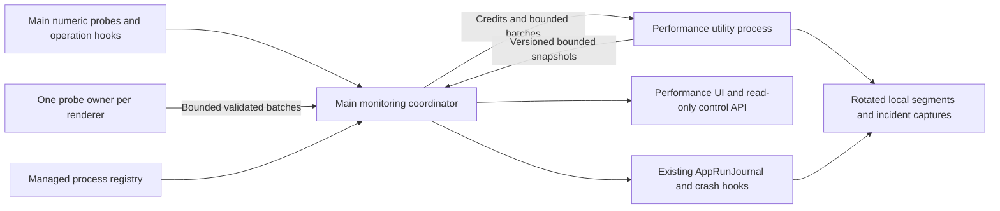

# Always-on performance monitoring

Issue: [#944](https://github.com/Juliusolsson05/agent-code/issues/944)

Status: implementation active. Contracts/harness (#949), shared collector (#953),
and product monitor/process attribution (#955) are merged. Per user direction,
operations/incidents, durable history/local reports, advanced profiles and
qualification ship together in the final implementation PR for #956.
Audited base: `115e26fc9c67316a3b0b1b4318f47f7a2bea3606` (2026-09-12).
Branch: `feat/performance-monitoring`.

## Product contract

Every installation should retain enough lightweight evidence to answer: **is the
app responsive, what was happening when it slowed down, and what can I inspect
next?** Opening the monitor must not be necessary to collect the evidence.

Settings → Performance and a normal **Performance Monitor** command open the
same view. A user can inspect the whole application, each window, and all managed
agents, including detached agents and sessions in other project tabs. Detailed
profiling is an explicit, time-limited action. Monitoring never changes agent
state, kills processes, or submits prompts as a side effect of an incident.

The user chose local collection with explicit local-file export, no report
sharing in the initial product, and equal priority for live responsiveness and
agent performance. No automatic upload or remote ingestion path is implemented.
The user authorized building the full plan on 2026-09-12.

### The experience to build

1. **Overview:** responsiveness now, CPU and memory trends, recent slowdowns,
   highest resource consumers, and monitoring coverage. Each value has units,
   scope, observation time, and a drill-down. No unexplained aggregate score.
2. **Timeline:** synchronized tracks for the main process, windows, agents,
   important operations, and incidents. Selecting a slowdown shows its before,
   during, and after evidence. Gaps and sleep intervals remain visible.
3. **Processes and agents:** sortable resource table, filters by provider/project/
   window, shared helper attribution, detached agents, and process lifetime.
   Selecting a row links to its existing agent surface without starting it.
4. **Operations:** distributions and slow examples for startup, session launch,
   prompt delivery, first provider output, transcript loading/folding, terminal
   work, worktree refresh, persistence, orchestration, and dictation startup.
5. **Recordings:** local incident captures, bounded performance reports, and
   explicit advanced traces, with size, time range, completeness, and export.

Example explanation (illustrative, not a measured result): “This window had no
heartbeat for 2.4 seconds. Main remained responsive. Transcript folding overlapped
the pause for 1.9 seconds. Likely renderer-side work; exact blocking function is
unknown.” Evidence and confidence are expandable. If no cause is measured, say
so and offer a short profile capture. Busy agent CPU alone is not a problem.

## What already exists and how it changes

All paths are relative to the repository root. These are source observations,
not new runtime measurements; historical numbers in linked issues are not a
baseline for the current build.

| Current source | Verified behavior | Planned treatment |
| --- | --- | --- |
| `src/main/performance/PerformanceService.ts` | Environment-gated OTel, 500 ms flushing, 5 s memory/event-loop probe, 2,000-record pending cap | Keep a compatibility facade; route baseline counters/operation summaries to shared collection; leave detailed tracing separate |
| `src/renderer/src/performance/client.ts` | Separate OTel/IPC queue and long-task/memory probes | One renderer instrumentation owner; bounded summaries in baseline, detailed spans only during profiling |
| `src/main/incident/AppRunJournal.ts` | Always-on run identity, lifecycle events, 5 s heartbeat, previous-run evidence; 50 MiB run ceiling | Preserve run/crash semantics; feed it shared observations and link incident IDs; migrate routine writes carefully |
| `src/main/incident/installWindowIncidentHooks.ts` | Always-on window liveness and incident detection; native diagnostic capture opt-in | Share heartbeat/loop observations; retain foreground/background and sleep safeguards |
| `src/renderer/src/performance/freezeHeartbeat.ts` | 1 s liveness, long-task aggregation, periodic whole-document counts | Reuse liveness; remove duplicate observers; replace whole-document walks with owned counters or explicit detail capture |
| `src/main/ipc/performance.ts` | A separate event-loop histogram reset by UI reads; direct manual heap snapshot handler | Cached reads with collector-owned windows; isolate explicit snapshot policy |
| `src/main/performance/ProcessTelemetry.ts` | `pidtree`/`pidusage` per requested session, on every panel poll | One scheduled, bounded process sampler; shared topology cache; all-session coverage |
| `features/performance/ui/PerformancePanel.tsx` | Visible-pane table, 2 s polls, opt-in gate | Replace with the unified application monitor |
| `features/system-perf/useSystemPerfPoller.ts` | 1 s per-mounted-header polling, 600 in-renderer samples | Read shared snapshots/history; opening another window must not add a collector |
| `features/workspace/commands/layoutCommands.ts` | `toggle-performance-panel` is a debug-only command | Preserve command identity as an alias, promote ordinary discoverability, expose the new surface |
| `src/main/performance/heapWatchdog.ts` | Automatic synchronous heap snapshot on pressure | Baseline pressure event and bounded context only; snapshot becomes an explicit advanced action |
| `src/main/storage/debugRetention.ts` | Existing diagnostic buckets and a much larger shared disk policy | Add a small hard monitoring quota enforced during writes, including active runs |
| `src/shared/performance/serialization.ts` | Top-level sensitive-key filtering, nested values pass through | Baseline uses a strict numeric/enum schema; legacy arbitrary payloads never become baseline data implicitly |

Important related work: [#767](https://github.com/Juliusolsson05/agent-code/issues/767)
documents diagnostic overhead. Its comments already mark the disabled renderer
memory sampler gate fixed; do not redo that work. General optimization #103,
memory investigations #327/#365, and crash evidence #370 remain separate outcomes.
The local `perf/heap-watchdog-deferred-snapshot` branch currently contains a plan
commit only, not an implemented fix. Recheck active work before touching that file.
The June incident-journal plan is partly implemented; do not create another
independent journal just because that old document lists future phases.

## Architecture and ownership

**Main coordinator** owns process identity, sampling schedules, renderer lifetime,
and the latest small live snapshot. Exactly one instance starts with the app,
independently of windows and Settings. Electron-only reads remain in main; those
APIs cannot simply be moved into a utility process. One owner reads/reset each
event-loop histogram and Electron CPU interval. Other consumers read snapshots.

**Renderer probe owner** starts once per renderer generation, before workspace
hydration. It owns the heartbeat, feature-detected browser observations, and
small operation aggregates. It must return a disposer for reload/HMR/tests and
never retain DOM nodes, React trees, transcript entries, or closures over sessions.
Metrics do not enter the main Zustand workspace store or its persisted settings.

**Performance utility process** handles aggregation, process-tree inspection,
serialization, segment storage, history queries, and export. Reuse the launch/
packaging pattern in `ElectronWorkflowWorkerLauncher.ts`, with a distinct worker
entry and identity; do not run inside the workflow evaluator. The process carries
no provider credentials and has no networking role. Electron supports a named
utility process that appears in process metrics, letting the monitor account for
its own worker. [Electron utilityProcess](https://www.electronjs.org/docs/latest/api/utility-process)

**Existing incident journal** remains the run/crash source of truth. Its fatal
escape path stays tiny and independent of worker availability. Routine monitoring
storage uses the new worker; moving existing journal routine writes must preserve
sequence, shutdown ordering, previous-run classification, and source completeness.
Do not promise that an in-process callback can report while its process is frozen
or after abrupt power loss. Preserve the last durable sample and report the gap.

**UI** subscribes to cached snapshots and queries bounded history pages. Polling
or subscriptions never initiate OS process scans or reset sample windows. Cache
query results by run/range/filter/resolution with explicit size and lifetime
bounds. Closed or hidden monitor surfaces have no chart animation or history work.

**Configuration migration** separates `baselineEnabled`, supported capabilities,
collector health, and the current capture session. The existing
`PerformanceConfig.enabled` currently gates expensive legacy paths as well as
the product widgets. Do not set that boolean to true globally to enable the new
UI. Keep its legacy detailed-tracing meaning until every consumer is classified;
migrate product reads to baseline capabilities explicitly. `AGENT_CODE_PERF`
continues to request legacy/developer detail, never to determine whether ordinary
users can open the monitor. Adapt only reviewed, allowlisted operation names into
baseline aggregates. Switching capture modes must install/dispose observers once,
without restarting the baseline or duplicating instrumentation.

## Collection policy and measurement semantics

These cadences are starting values for the benchmark phase, not proven budgets.

| Signal | Baseline cadence / source | Meaning and limitations |
| --- | --- | --- |
| Main responsiveness | Single 20 ms event-loop histogram; emit 1 s windows | Show p95/p99/max, window duration, sample count, and resolution; do not describe raw timer delay as pure excess lag |
| Renderer liveness | Existing 1 s heartbeat, recursive scheduling | Distinguish visible, hidden, suspended, unresponsive, and no sample yet |
| Long tasks / input delay | Observer aggregates, send with heartbeat | Feature-detect; retain counts/histograms, no targets or entered keys; thresholded observations are not a full input-latency distribution |
| Main heap / RSS / external | 5 s, reuse across incident and UI consumers | Keep heap limit scoped to its V8 isolate; RSS/external/heap overlap and must not be added |
| Electron processes | One `app.getAppMetrics()` call every 5 s | CPU is an interval average; first observation is warming up; preserve metric source and process creation time |
| Managed agent process trees | Topology every 15 s, refresh hints on lifecycle changes; usage every 5 s when bounded | Sample once per unique PID; bounded concurrency/output/deadlines; show attribution gaps |
| App operation timings | Cheap monotonic start/end and per-operation aggregates | Separate queue wait, own processing, IPC round trip, and provider wait |
| Retained data / queue sizes | Incremental counters at ownership boundaries; aggregate every 5–30 s | No periodic transcript stringify or whole-store walk to estimate byte size |
| Monitoring health | Each collection/flush window | Own CPU, callback duration, queued bytes, drops, slow disk, storage failures, and restarts |
| Fine frame timing / stacks | Explicit 30 s profile, hard 60 s maximum | No continuous requestAnimationFrame loop or always-on stack sampling |

Node event-loop utilization is not CPU usage. Durations use monotonic clocks.
Store per-process time origin plus monotonic sample range, wall time, and main
receipt time; never subtract unrelated `performance.now()` clocks. Cross-process
operation IDs establish order; a handshake estimates alignment error for the
timeline. Wall-clock changes start a new alignment segment. Sleep/resume creates
a gap and warm-up window, not a several-hour freeze. A heartbeat arriving late
may reflect main/IPC delay rather than renderer work; retain both local and receipt
timing. [Node performance APIs](https://nodejs.org/api/perf_hooks.html),
[MDN timeOrigin](https://developer.mozilla.org/en-US/docs/Web/API/Performance/timeOrigin)

Electron process identity is `(pid, creationTime)`, plus the app run and a local
generation. CPU windows belong to the collector; additional diagnostic reads can
otherwise change the interval. Use cumulative CPU deltas when available, with a
documented fallback. Normalize to a displayed convention such as 100% = one core
only after verifying adapters against a controlled workload; never mix provider
and Electron percentages without that check. Convert Electron memory KB to bytes
once at ingestion. Sum unique processes only, label summed RSS as an estimate
that includes shared pages, and do not present it as unique physical memory.
[ProcessMetric](https://www.electronjs.org/docs/latest/api/structures/process-metric),
[CPUUsage](https://www.electronjs.org/docs/latest/api/structures/cpu-usage),
[MemoryInfo](https://www.electronjs.org/docs/latest/api/structures/memory-info)

Managed process attribution starts from `SessionManager.getProcessTelemetryTargets`
and explicit ownership records for proxy, tmux, workflow, and other helpers. A
shared tmux server or proxy is not charged in full to each agent. Unknown or
exited PIDs produce unavailable/stale values, never a false zero. Root PID lineage
alone is insufficient for daemonized/shared helpers. No process signalling is
part of monitoring. Provider “busy” state comes from provider lifecycle evidence,
not the current `lastActivityAt < 30s` heuristic.

Browser Long Tasks identify long main-thread work, not arbitrary function stacks.
Event Timing is thresholded and may be unavailable; continuous native/PTY input
is not covered by a browser observer. Use explicit application-operation hooks
for those paths and keep measurement coverage visible.
[Long Tasks](https://developer.mozilla.org/en-US/docs/Web/API/PerformanceLongTaskTiming),
[Event Timing](https://developer.mozilla.org/en-US/docs/Web/API/PerformanceEventTiming)

## Data contracts and bounded work

Add versioned contracts under `src/shared/performance/`; keep Electron, React,
and filesystem dependencies out of the shared schema. Prefer discriminated event
types with registered fields over an arbitrary `data: Record<string, unknown>`.

Core envelopes: `appRunId`, schema/build version, source process/generation,
source sequence, sample interval, source/receipt timing, and optional existing
session/operation/incident correlation IDs. Metric values carry a unit, sample
count, and quality (`ok`, `warming-up`, `stale`, `unsupported`, `partial`). Histograms
use fixed buckets and counts. Percentiles are derived from merged counts, never
by averaging percentiles. Mark right-censored operation timeouts explicitly.

Initial hard limits to encode as shared policy and verify:

- Main and each renderer ingress queue: 512 KiB or 2,000 records, whichever comes
  first; global coordinator ingress allowance 2 MiB. Bound attributes and string
  sizes before cloning, with at most 32 numeric/enum fields per record.
- Transport: 64 KiB per batch, at most one unacknowledged batch per producer and
  a global in-flight credit cap. Transfer compact buffers where useful; a worker
  does not make producer allocation/structured-clone costs free.
- Worker hot store: 16 MiB payload budget; global source/process/series caps;
  2,048 tracked process identities and 256 operation names initially. Return
  omitted counts if limits are exceeded; aggregate overflow into explicit groups.
- UI query response: 256 KiB, at most 1,000 points per series and bounded series/
  rows per page. Batch refresh at most once per second when visible.
- Scheduling: recursive asynchronous ticks with deadlines and one scan in flight.
  Coalesce pending samples; never enqueue a second full scan behind a slow one.
- On pressure: drop verbose traces first, then redundant detail, retaining a
  reserved heartbeat/incident lane. Report monotonic dropped-record and byte
  counters without generating a recursive error storm. No unbounded retry queues.

Main derives the sender window/process identity from registered webContents;
renderer input cannot choose another source or forge run ownership. Validate
shape, finite numbers, counts, field names, and byte budgets at ingress. Bound
history range and pagination at the service, not only in the UI. Do not accept a
caller-provided filesystem path for reads/deletes/reveal; resolve owned artifact
IDs through the manifest and reject traversal/symlink escape.

Baseline fields exclude prompt/response/terminal text, code, file paths, URLs,
headers, environment variables, command arguments, DOM, audio, and raw error
stacks/messages. Use enumerated failure codes and ephemeral local IDs. Resolve
human agent/project labels from live app state only when displaying local rows;
export replaces IDs consistently per report. Deep traces and heap snapshots are
separately labelled potentially sensitive artifacts and are never attached by
default. This is application health telemetry, separate from product analytics #210.

## Slowdown detection and explanations

Begin with deterministic rules whose evidence is inspectable. Each rule has a
version, scope, required sample coverage, persistence window, hysteresis, cooldown,
and recovery condition. Store detected severity separately from confidence in
the suggested cause. Suggested starting triggers require calibration:

- Main delay over 100 ms in 3 of 5 one-second windows, or a single stall over 1 s.
- A foreground heartbeat absent over 4 s, using existing visibility/sleep checks.
- Main heap above 70% of the runtime limit for 3 samples; sustained growth is a
  separate observation, not a proven leak or a predicted crash deadline.
- An instrumented operation exceeds its specific threshold or reliable local
  baseline. Do not give provider thinking, network latency, and UI folding the
  same timeout. With too few samples, show insufficient history.
- Telemetry backlog/drops/disk failures produce monitoring-health incidents,
  distinguishable from application slowdowns.

Capture up to 60 s before and 15 s after from the existing bounded rings; incident
capture does not enable CPU profiling automatically. Coalesce overlapping events
per scope and keep one capture in flight. If a process dies before the post-window,
save the pre-window with an incomplete reason. Pre-trigger samples can explain
correlated activity, but cannot reconstruct stacks that were never sampled.

Prioritize instrumentation at real boundaries: session request → queued → spawn →
ready; prompt submit → accepted → first provider output → first rendered output;
IPC round trip versus handler work; transcript read/parse/fold/commit; terminal
write backlog; persistence serialize/write/rename; worktree scan/cache/write;
orchestration queue/dispatch/response; dictation permission/capture/provider start.
Propagate existing lifecycle IDs where present and carry new operation IDs only
through owned app boundaries. No token/proxy body capture is needed.

The explanation engine ranks evidence and presents alternatives with uncertainty.
High agent CPU with healthy input latency says “agents are busy; UI responsive.”
Missing provider output with healthy app metrics says “waiting on provider; cause
unconfirmed,” not “network outage.” Recommended next actions are inspect/jump/
export/profile; destructive remediation remains outside this feature.

## History, crash evidence, and reports

Use one schema-versioned monitoring directory beneath the existing performance
storage root, keyed by canonical `appRunId`, with rotated append segments, compact
time-range indexes, and an atomically replaced manifest. JSONL is suitable for
bounded event segments; fixed histogram/metric rollups keep queries small. A
database is not required for the initial bounded local store. Do not load an
entire run to render a chart or build an export.

Proposed retention: 1 s app/window summaries for 15 minutes, 10 s rollups for
24 hours, and 1 minute rollups for 7 days. Keep per-process detail shorter (15
minutes in its native 5 s cadence), plus bounded incident windows. Retain at most
50 incident captures. All automatic monitoring data, including active runs and
incidents, shares a **128 MiB hard disk ceiling**; the byte ceiling wins over time
and count promises. Enforce before append/rotation and at startup, not only in
periodic global pruning. Report shortened coverage when budget is exhausted.

Reserve up to 8 MiB within that ceiling for incident manifests/context; use a
minimum useful context and cap each capture at 1 MiB. Pins consume the same quota
and cannot make pruning impossible. Automatic compaction/index temporary files
count toward the quota. Truncated final segments are recoverable; reader errors,
unsupported versions, and dropped ranges are explicit. Existing crash reports,
heap dumps, and legacy diagnostics remain separate retention buckets and must
not be silently represented as covered by the new 128 MiB limit.

An explicit performance report includes selected interval, build/platform,
bounded metric rollups, operation histograms, incidents/explanations, and coverage
metadata. Its preview lists included data classes and estimated size. Write it
incrementally off main to a selected destination; no upload occurs. Integrate a
reference/optional performance section into existing debug bundles while keeping
the minimal performance report available without a transcript-heavy debug bundle.

Worker crash, write failure, or full disk leaves the latest live snapshot usable
and history marked degraded. Restart the worker with bounded backoff and a restart
budget; identify the new generation, invalidate its in-flight work, and record a
coverage gap. Do not replay unbounded history. On app quit, flush only within a
fixed deadline; the existing clean-shutdown/crash classifier must not depend on
the performance worker succeeding. The next launch uses manifests and the existing
previous-run evidence; an unclean stop is not automatically labelled OOM.

## Advanced profiling

“Record a performance trace” starts a visible 30 s session with stop/cancel,
monotonic expiry, explicit owner, and an app-wide capture lock. Start/stop are
idempotent; a second window sees the existing capture. Define a bounded trace
buffer and a 64 MiB artifact cap, with incomplete/truncated outcomes. Limit
categories to those validated in packaged Electron; no wildcard tracing by
default. Node main CPU and Chromium renderer traces are distinct capture sources.
Browser/Node capabilities and DevTools conflicts must be shown honestly.
[Electron contentTracing](https://www.electronjs.org/docs/latest/api/content-tracing)

Heap snapshots stay a separate advanced action. Node documents blocking and
substantial temporary memory requirements, so neither “run it when idle” nor
“ask a worker” makes snapshotting the main isolate non-blocking. Do not trigger
snapshots automatically under memory pressure. Explain the pause and potentially
sensitive contents, check disk/memory headroom, and keep outcomes in the incident
timeline. [Node V8 snapshots](https://nodejs.org/docs/latest-v22.x/api/v8.html#v8writeheapsnapshotfilenameoptions)

## Settings, commands, and accessibility

Add a `performance` settings category with monitor launch, baseline status,
retention summary, local storage usage, report export, clear-history action, and
advanced recording controls. The baseline is enabled for all users in the
completed rollout; developer verbose flags never control product availability.
An emergency support override can disable the new collector for fault isolation
and must display the override state. It does not implicitly disable existing
crash evidence. Decide later whether a normal user pause control is desirable;
it is not needed to make the baseline available by default.

The normal command opens the monitor idempotently; preserve old
`toggle-performance-panel` compatibility. Add **Save Performance Report** and
**Record Performance Trace** through the existing command/surface registries.
Start with searchable commands instead of inventing a conflicting default
shortcut. Settings and header launch the same surface. Replace the two existing
performance UI owners; an optional compact header status uses the same snapshot.

The monitor can remain open while the workload continues, using an app overlay/
resizable panel with existing focus ownership. Escape/focus restoration and
keyboard navigation follow shared components. Charts have labelled axes, visible
units, keyboard interval selection, and a tabular equivalent; severity is never
color alone. Reduced motion stops decorative animation. Freeze the viewed range
while inspecting it, and show a “Resume live” action. Virtualize long process/
incident tables and keep chart geometry bounded. Distinguish collecting, no
incidents, no data, stale, unsupported, export failure, and collector-degraded.

Read-only structured health/incident queries can later use the existing control
SDK/MCP executor. They should return the same bounded evidence as the UI, not
spawn a hidden profiler or expose arbitrary filesystem access. No new broad
agent-management authority is needed.

## Overhead budgets and proof

These are **provisional acceptance targets**, not claims about current code or
guarantees of a particular device. Phase 1 validates them against supported Macs
and records an explicit decision if an architecture change is necessary.

| Dimension | Initial target |
| --- | --- |
| Closed monitor, idle app | Incremental CPU under 0.5% of one core, averaged over 10 minutes after warm-up |
| 32 streaming agents, closed monitor | Incremental total CPU under 2% of one core; no unbounded growth |
| Main/renderer recording hook | p99 below 100 µs; no filesystem calls, transcript serialization, or stack capture |
| Main/renderer collector callback | p99 below 2 ms; no new 50 ms long tasks attributable to monitoring |
| Added main + renderer retained memory | At most 8 MiB at the reference workload |
| Utility process total RSS | Target at most 80 MiB including Electron/Node runtime, buffers, aggregation, and recent history; revised from the provisional 64 MiB after packaged smoke measured a stable ~68 MiB cold runtime floor |
| Automatic disk retention | 128 MiB hard cap, including active files and temporary compaction files |
| Dashboard impact | p95 app interaction latency delta below 5 ms in paired runs; charts at most 1 Hz |
| Startup | Collector starts asynchronously; target under 25 ms added p95 time-to-interactive |
| Failure | Unavailable monitoring never blocks app launch, prompt delivery, dictation, or shutdown |

Measure monitoring on/off with identical packaged builds, synthetic fixed-input
workloads, warm-ups, repeated paired runs, and machine/build metadata. Separate
dashboard-open overhead from collection overhead. Include collector CPU and memory
in the delta. Avoid optimizing to a dev build or claiming sub-noise improvements.
Record distributions and uncertainty, not a single wall-clock result. Observe
thermal/battery/display conditions because this user runs a closed MacBook with
an external display. Monitoring must never acquire a wake lock or prevent sleep.

The monitor exposes its own durations/queues/drops and can reduce optional detail
when over budget. Independent external measurements validate that self-reporting;
the monitor alone cannot prove it has zero observer effect. Deterministic CI
checks enforce queue/disk/series bounds. Timing gates need a controlled runner,
not brittle thresholds on arbitrary shared CI hardware.

## Implementation sequence and review gates

The table records the original review decomposition. After the first three
pieces merged, the user explicitly asked to avoid a long chain of small PRs, so
stages 4–6 are consolidated into one comprehensive PR for #956 with one combined
verification and two-agent review gate. Do not close #944 before that PR lands.
Track existing #767 items rather than filing duplicate bugs.

| PR | Deliverable and primary files | Exit evidence |
| --- | --- | --- |
| 1. Contracts and baseline harness | `shared/performance` typed policy/schema/aggregation; `testing/performance` and a packaged replay runner; fixture scenarios | Unit/contract tests; current on/off baseline; CPU/memory/unit/clock capability matrix; no production-default change |
| 2. Shared baseline collector | Main coordinator, worker entry, bounded transport; integrate journal/freeze/main probes and retire duplicate sampling; gate automatic heap capture | Lifecycle and failure tests; packaged worker smoke; measured closed-monitor overhead; no loss of existing crash evidence |
| 3. Product monitor | Shared renderer store, new monitor UI, settings category, ordinary commands, all-session process sampler and topology attribution | All-user baseline enabled once budgets pass; UI/IPC tests; 0/1/32/100-agent and multi-window cases; visual QA |
| 4. Operations and incidents | Real boundary timings, correlation, rule engine, before/after incident timeline, explainable findings | Injected slow operations classify correctly; sleep/hidden/provider-wait do not create false attribution; evidence links work |
| 5. Durable history and reports | Rotated bounded store, queries, migrations, report preview/export, debug-bundle linkage | Crash/restart, ENOSPC, slow disk, corrupted tail, retention, privacy sentinel, bounded export tests |
| 6. Advanced profiles and rollout qualification | Capture ownership/timeouts, CPU/Chromium traces, explicit snapshot flow, legacy tracing compatibility | Packaged Mac capability checks, capture abort/window close/shutdown tests, 8 h soak and 24 h growth run, rollout report |

Dependencies: 1 → 2 → 3 → 4; storage internals for 5 can follow 2 but should ship
with 4's stable incident schema; 6 follows the baseline and capture contracts.
Until 5 lands, describe history as current-run only. Until 6 lands, hide unfinished
profiling actions instead of presenting placeholders as a working feature.

Apply the user's review template: **two independent Agent Code orchestration MCP
reviewers per PR**, one covering lifecycle/data correctness and one covering
performance/UI/privacy/packaging. Resolve valid findings, document dispositions,
and repeat affected verification/review when the head changes. Reviewers must see
the actual final diff and benchmark evidence. Follow session merge authorization;
an approved plan is not itself proof of a passing implementation or rollout.

## Verification matrix

- Deterministic: byte/count caps, histograms and merged quantiles, unit conversion,
  event ordering, operation expiry, stale samples, coverage, rule hysteresis,
  actor/source validation, worker generations, and privacy allowlists.
- Fault injection: block main and renderer separately; delay IPC; fail process
  enumeration; recycle PIDs; kill/restart collector; slow/full/read-only disk;
  truncated segments; clock jump; sleep/wake; repeated identical incidents.
- UI: empty workspace; detached sessions; two monitors/windows; hidden/minimized
  view; stale metrics; unsupported field; keyboard-only and reduced motion;
  clear history while export is active; close/reopen without resetting collection.
- Workload: idle; one active agent; 32 concurrent output streams; 100 managed
  agents; large transcript replay; worktree refresh; editor/terminal scrolling;
  dictation capture; provider switch; repeated window/session lifecycles.
- Packaging: actual Electron version from the installed artifact, supported Node
  APIs at the project's floor, arm64 and x64 Mac builds, signed utility helper
  launch, and clean shutdown. Other platforms expose honest capability gaps.
- Safety of testing: use synthetic public fixtures and isolated test profiles.
  Do not freeze the user's daily app, harvest personal transcripts, enable proxy
  mirroring, or dump a real heap to validate this plan.

## Decisions and implementation readiness

The initial product decisions are settled: collection is always on, there is no
ordinary pause control, reports are explicit local files with no sharing path,
and live application responsiveness and agent performance have equal weight.
A future upload feature would require a separate product/privacy decision.
Qualification must keep utility-process fixed cost and batched process sampling
visible on Apple Silicon and Intel Macs. If the worker misses budget, revise the
architecture explicitly; do not conceal its RSS or quietly broaden the budgets.
Verify tracing categories, artifact caps, main profiling capabilities and
DevTools interaction on packaged Electron; avoid experimental heap profiling.

Definition of complete: baseline works for every ordinary installation, the
Settings/command UI explains both healthy and degraded states, recent incidents
survive restart within a hard budget, reports are content-minimized and usable,
advanced profiling is bounded, existing crash evidence remains intact, and the
overhead/soak/review evidence meets the agreed gates. A CPU chart alone does not
complete #944.

Current qualification is recorded in
`2026-09-12-performance-monitoring-qualification.md`. The latest synthetic
100,000-operation producer benchmark on arm64/Node 25.5.0 measured p99 1.458 µs
for validation, bounded queue admission and histogram update (62.456 ms process
CPU). This remains a microbenchmark, not a packaged-app overhead measurement.
No user recordings or credentials are read.
